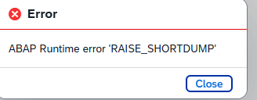
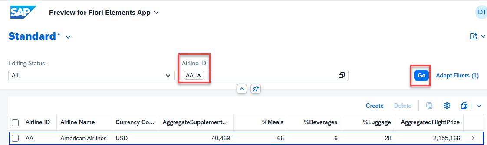
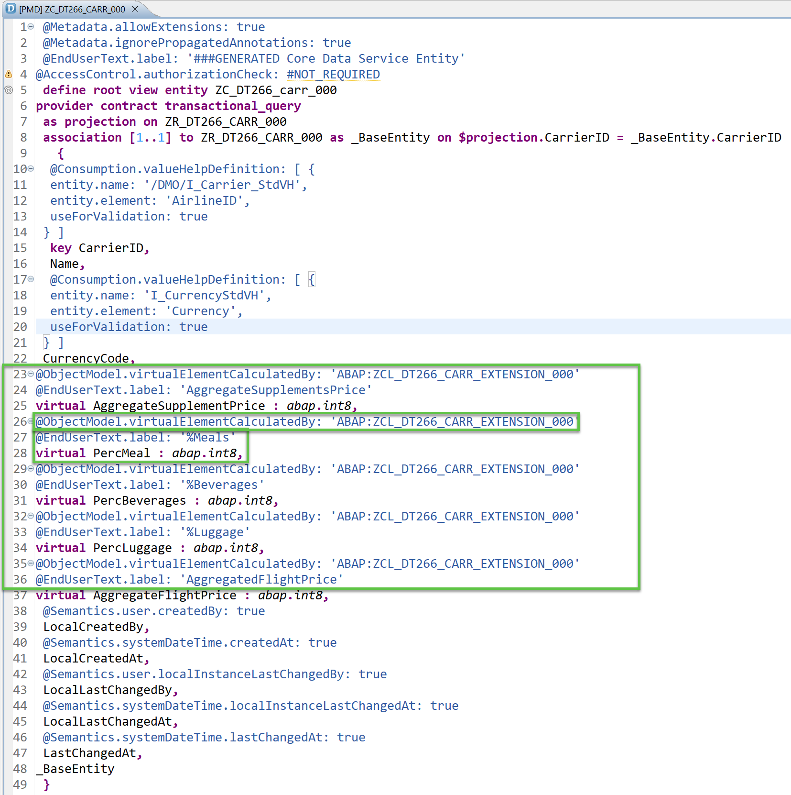
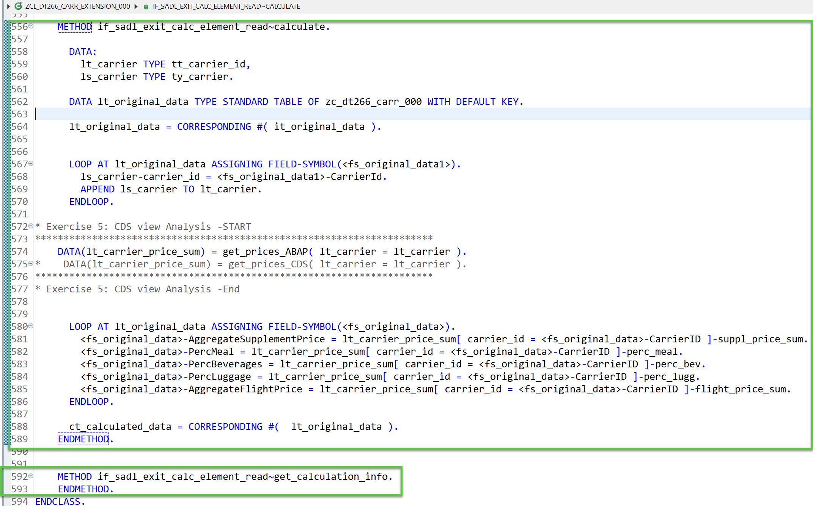
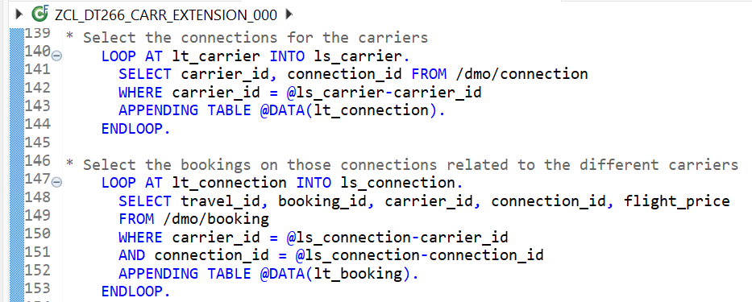
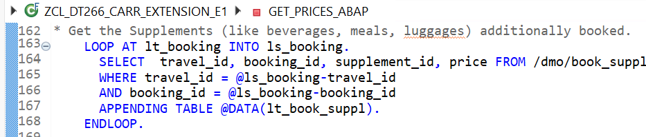
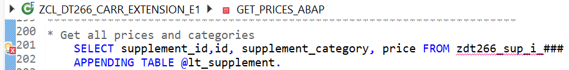
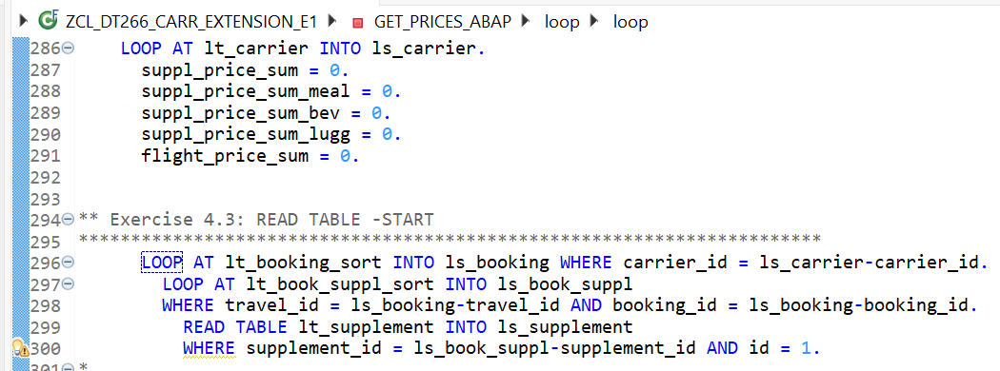
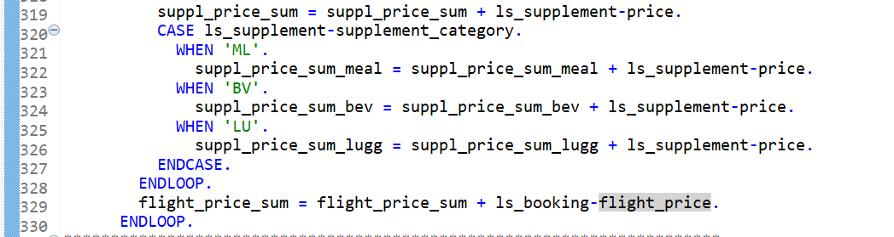
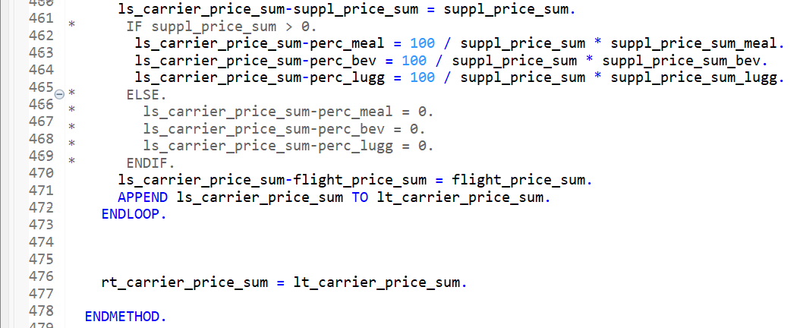

# Teched2025_DT266 - Troubleshoot and Optimize ABAP Cloud Extensions in Cloud ERP

## Description

This repository contains the material originally created for the SAP TechEd 2025 session [DT266 | Troubleshoot and optimize extensions for ABAP Cloud in cloud ERP](https://www.sap.com/events/teched/berlin/flow/sap/te25/catalog-inperson/page/catalog/session/1749650347432001y6fi).

- [Overview](#overview)
- [Presentation](#presentation)
- [Requirements for attending this workshop](#requirements-for-attending-this-workshop)
- [Overview of the Model and ABAP Code](#overview-of-the-model-and-abap-code)
- [Exercises](#-exercises)
- [How to obtain support](#how-to-obtain-support) 

<!--- [Presentation & Replay](#presentation--replay)-->

## Overview
[^Top of page](#)

Ensuring optimal performance and stability of your ABAP Cloud-based extensions is crucial to long-term success. 
Learn techniques and best practices for troubleshooting and optimizing custom code in the Cloud ERP. 
Use powerful tools like the ABAP Cross Trace to get deep insights into execution flows and resource consumption.
This session introduces attendees how to analyze custom extensions in SAP Fiori Apps within ABAP Cloud using tools like ABAP Debugger, Feed Reader,  ABAP Cross Trace, ABAP Trace, SQL Trace, Memory Analyzer, Table Comparison Tool.

> [!NOTE]    
> **DISCLAIMER**:   
> Please note that information about SAP‘s strategy and possible future developments is subject to change and may be changed by SAP at any time for any reason without prior notice. Check out the [SAP Road Map Explorer](https://roadmaps.sap.com/board?range=CURRENT-LAST&PRODUCT=73555000100800001164#Q4%202024)↗ and the [ABAP Cloud Roadmap](https://help.sap.com/docs/abap-cross-product/roadmap-info/abap-cloud-roadmap-information)↗ for more details. 

## Presentation
[^Top of page](#)

<!--* Watch the live jump-start session on 📅 Wednesday, Nov 5 | 🕐 3:30 PM - 5:30 PM CET.  
  [DT266 | Troubleshoot and optimize extensions for ABAP Cloud in cloud ERP](https://www.sap.com/events/teched/berlin/flow/sap/te25/catalog-inperson/page/catalog/session/1749650347432001y6fi)   -->   
  
- Access the presentation: 📄[DT266@SAPTechEd2025.pdf (extended version)](/exercises/images/DT266@SAPTechEd2025.pdf)↗

## Requirements for attending this workshop
[^Top of page](#)

> Participants should have an interest in exploring topics through guided exercises and should have the following knowledge: 
> - Basic of [ABAP knowledge](https://pages.community.sap.com/topics/abap/abap-for-newbies)↗
> - Basic knowledge of [ABAP Development Tools for Eclipse (ADT)](https://help.sap.com/docs/ABAP_DEVELOPMENT_TOOLS_FOR_ECLIPSE?locale=en-US&state=PRODUCTION&version=dev)↗
> - Basic knowledge of [ABAP Core Data Services (CDS)](https://community.sap.com/t5/technology-blog-posts-by-sap/getting-started-with-abap-core-data-services-cds/ba-p/13284593)↗
> - Basic understanding of [ABAP RESTful Application Programming Model (RAP)](https://community.sap.com/t5/technology-blog-posts-by-sap/getting-started-with-the-abap-restful-application-programming-model-rap/ba-p/13420829)↗
>
> To complete the practical exercises in this workshop, you need the latest version of the ABAP Development Tools for Eclipse (ADT) on your laptop or PC 
<!-- and the access to a suitable ABAP system - i.e. SAP BTP ABAP Environment, SAP S/4HANA Cloud Public Edition, or at least release 2022 of SAP S/4HANA Cloud Private Edition and SAP S/4HANA. 
> The [ABAP Flight Reference Scenario](https://github.com/SAP-samples/abap-platform-refscen-flight)↗ must be imported into the relevant system - e.g. SAP BTP ABAP Environment Trial.-->
> - The [latest Eclipse platform and the latest ABAP Development Tools (ADT) plugin](https://developers.sap.com/tutorials/abap-install-adt.html)↗ must be installed 
> - The [web browser settings in your ADT installation](https://github.com/SAP-samples/abap-platform-rap-workshops/blob/main/requirements_rap_workshops.md#4-adapt-the-web-browser-settings-in-your-adt-installation)↗ must be adjusted. 
> And in addition you need the latest version of the MS Visual Studio Code on your laptop or PC with the SQL analyzer tool for SAP HANA 
> - [MS Visual Studio Code](https://code.visualstudio.com/)
> - [SQL analyzer tool for SAP HANA](https://help.sap.com/docs/sql-analyzer/sap-hana-sql-analyzer/install-in-visual-studio-code)

 

## Overview of the Model and ABAP Code
[^Top of page](#)

> The scenario of these exercises is based on a RAP application using the [``ABAP Flight Reference Scenario``](https://github.com/SAP-samples/abap-platform-refscen-flight).  For an overview of the available database tables, see [``ABAP Flight Reference Scenario Database Tables``](https://help.sap.com/docs/abap-cloud/abap-rap/abap-flight-reference-scenario). 

In our example we want to provide a list of Airline IDs = Carrier_Id(s) for which we get in the result list additional column fields calculated by customer extension:
- the total of all corresponding flight prices 
- the total price of all corresponding supplements (like meal, beverage, luggage) 
- the percentages %Meals, %Beverages, %Luggage with which those supplement categories contribute to the total price of the supplements

> [!Caution]
> **Runtime error for specific Airlines:**    
> If you click on **`Go`** without specification of any Airline or e.g. choose Airline ID = 'AC' you get a runtime error:  
> <kbd></kbd>  
> **Currently it is only working without error for some specific airlines e.g. Airline ID = 'AA'.**
> This error is analyzed and fixed in [Exercise 1](../ex01/README.md).
---

<kbd></kbd>

The calculation is performed in the ABAP class _`ZCL_DT266_CARR_EXTENSION_000`_ where we call in exercise 1 to 4 the method _`GET_PRICES_ABAP`_ and for exercise 5 the method _`GET_PRICES_CDS`_.

   🟠 _**REMARK:**_ The following overviews are only optional information. This is **not required** to execute the exercises. 
   <!--
   We recommend to skip reading this additional information and directly continue with [Exercise 1](../ex01/README.md).
   -->

More details on the involved underlying Data Model:

   
        
Click here for an Overview of the tables involved
  

 

We use in the Exercises the following tables:

| Table | Content | Number of Entries | Key Fields | Other Fields used in Model / Where used | 
|---|---|---|---|---|
|/DMO/CARRIER| Different Carriers, e.g. AA, AC,... | 17 Airline IDs = Carrier IDs | CLIENT, CARRIER_ID | | 
|  `ZDT266_CARR_000` | _Copy of /DMO/CARRIER_ |17 Airline IDs = Carrier IDs | CLIENT, CARRIER_ID | | 
|/DMO/CONNECTION| Connections of the Carriers | 20 rows: Combinations of Carrier & Connection | CLIENT, CARRIER_ID, CONNECTION_ID | |
|/DMO/BOOKING | Booking IDs and travel IDs for each combination of carrer and connection | 9161 rows | CLIENT, TRAVEL_ID, BOOKING_ID | CARRIER_ID, CONNECTION_ID, FLIGHT_PRICE |
|/DMO/BOOK_SUPPL | Supplements like meal, beverage, luggage | 16211 entries | CLIENT, TRAVEL_ID, BOOKING_ID, BOOKING_SUPPLEMENT_ID | SUPPLEMENT_ID|
| `ZDT266_BO_SU_000` | _Copy of 10.000 times /DMO/BOOK_SUPPL_ | 162,110,000 entries | CLIENT, TRAVEL_ID, BOOKING_ID, BOOKING_SUPPLEMENT_ID, **ID** (_10,000 different values_) | _used for CDS performance_|
| /DMO/SUPPLEMENT | Different kind of Supplements and their categories and prices | 48 entries | CLIENT, SUPPLEMENT_ID | SUPPLEMENT_CATEGORY, PRICE|
| `ZDT266_SUP_I_000` | _Copy of 500 times /DMO/SUPPLEMENT_ |24,000 entries |  CLIENT, SUPPLEMENT_ID, **ID** (_500 different values_) | _used for ABAP performance_ |
| `ZDT266_SUP_L_000` | _Copy of 200,000 times /DMO/SUPPLEMENT_ | 9,600,000 entries |  CLIENT, SUPPLEMENT_ID, **ID** (_200,000 different values_) | _used for CDS performance_ |

   

   
        
Click here for an Overview of the ABAP Code
  

 In a similar way to [``Create Database Table and Generate UI Service``](https://developers.sap.com/tutorials/abap-environment-rap100-generate-ui-service.html) 
 we have created a copy of /DMO/CARRIER with the name `ZDT266_CARR_000` and generated a UI service.

 Following [``Using Virtual Elements in CDS Projection Views``](https://help.sap.com/docs/ABAP_PLATFORM_NEW/fc4c71aa50014fd1b43721701471913d/319380e0cef94051ae9aa292ffadb59a.html?version=201909.latest&q=ObjectModel.filter.transformedBy) we created ``Virtual Elements`` declared in the CDS projection view ``ZC_DT266_CARR_000`` created in the previous step:
 
 

 They shall be calulated in the custom extension class _`ZCL_DT266_CARR_EXTENSION_000`_.
 
 In this class _`ZCL_DT266_CARR_EXTENSION_000`_ two interface methods have to be created (refer to [``Implementing the Calculation of Virtual Elements``](https://help.sap.com/docs/ABAP_PLATFORM_NEW/fc4c71aa50014fd1b43721701471913d/c65942c284dd490a9c3791630d4d4e41.html?version=201909.latest&q=ObjectModel.filter.transformedBy)):

 - IF_SADL_EXIT_CALC_ELEMENT_READ~GET_CALCULATION_INFO
 - IF_SADL_EXIT_CALC_ELEMENT_READ~CALCULATE
 

 The method ``Calculate`` calls then two alternative methods where we do the calculations:
 - ``GET_PRICES_ABAP`` where the calculations are performed in ABAP code (used in Exercises 1 to 4)
 - ``GET_PRICES_CDS`` where the calculations are performed in CDS views (used in Exercise 5)

 The method ``GET_PRICES_ABAP`` first determines for given ``AIRLINE = CARRIER_ID`` the corresponding connections (from table /DMO/CONNECTION) and for the connections the corresponding bookings (from table /DMO/BOOKING):  
 

 And then the supplements for the bookings:  
 

 and their prices and categories:  
 

 Then we just loop over the selected data to calculate the totals and percentages:  
 
 
 

   

## 🛠 Exercises
[^Top of page](#)

| Exercise Blocks  | -- |
| ------------- |  -- |
| **Getting Started** | -- |
| [Getting Started](exercises/ex0/README.md) | -- |
| **Exercise Block for Functional Analysis** | -- |
| [Exercise 1: Analyze Errors with the Feed Reader](exercises/ex01/README.md) | -- |
| [Exercise 2: Usage of the Memory Inspector](exercises/ex02/README.md) | -- |
| [Exercise 3: Usage of the ABAP Cross Trace](exercises/ex03/README.md) | -- |
| **Exercise Block for Performance Analysis** | -- |
| [Exercise 4: Performance Analysis and Improvement using ABAP Trace and Table Comparison Tool](exercises/ex04/README.md) <ul><li> [Exercise 4.1 - Creation and Analysis of an ABAP Trace](exercises/ex04/README.md#exercise-41-creation-and-analysis-of-an-abap-trace) </li> <li> [Exercise 4.2 - Use Table Buffering to Improve the Performance](exercises/ex04/README.md#exercise-42-use-table-buffering-to-improve-the-performance) </li> <li> [Exercise 4.3 - Use Secondary Index & Key to Improve the Performance](exercises/ex04/README.md#exercise-43-use-secondary-index--key-to-improve-the-performance) </li> </ul> | -- |
| **Optional Exercises for Performance Analysis** | -- |
| [Exercise 4: Performance Analysis and Improvement using ABAP Trace and Table Comparison Tool](exercises/ex04/README.md) <ul><li> [Exercise 4.4 - Usage of the Table Comparison Tool](exercises/ex04/README.md#exercise-44-usage-of-the-table-comparison-tool) </li> <li> [Exercise 4.5 - Performance of Nested LOOPs](exercises/ex04/README.md#exercise-45-performance-of-nested-loops)</li> </ul> | -- |
| [Exercise 5: SQL Trace Analysis in SAP HANA SQL Analyzer](exercises/ex05/README.md) | -- |

<!-- 
- [4.3 - Use BINARY SEARCH for READ TABLE Performance](#exercise-43-use-binary-search-for-read-table-performance)

-->

 
  
In the [_Getting Started_](exercises/ex0/README.md)  section we outline how to logon to the system and to access your package for these exercises.  We shortly introduce the Fiori App to use in the exercises.  

In [_Exercise 1_](exercises/ex01/README.md) a runtime error occurs for specific input data. With the tool `Feed Reader` and the `ABAP Debugger` we examine the root cause. Here a specific case is not handled correctly in a single line of ABAP code. 

In [_Exercise 2_](exercises/ex02/README.md) after a change in the ABAP code an Out-Of-Memory error is thrown. This runtime error is usually  not related to the call of a single line of code. We analyze with the `Memory Inspector` the memory consumption and increase.

In [_Exercise 3_](exercises/ex03/README.md) you will then use the `ABAP Cross trace` for tracing and analysing ABAP Cloud applications across different runtime components. The tool is useful to track down errors or unexpected behavior even without runtime errors. 

The focus of [_Exercise 4_](exercises/ex04/README.md) is on performance analysis using the ``ABAP Trace``. There we learn different techniques to improve the runtime in ABAP code. In addition with help of the ``Table Comparison Tool`` we analye a functional error introduced with one of our optimizations. 

In [_Exercise 5_](exercises/ex05/README.md) we perform a code push down to the HANA Database using CDS views. Here we learn to create an `SQL trace` and analyze the `execution plan` in the `HANA SQL Analyzer in  Visual Studio Code`.

So let us start and have a look at the _Getting Started_ section: [Getting Started - Mandatory, please check](exercises/ex0/).

## Contributing
[^Top of page](#)

Please read the [CONTRIBUTING.md](./CONTRIBUTING.md) to understand the contribution guidelines.

## Code of Conduct
[^Top of page](#)

Please read the [SAP Open Source Code of Conduct](https://github.com/SAP-samples/.github/blob/main/CODE_OF_CONDUCT.md).

## How to obtain support 
[^Top of page](#)

Support for the content in this repository is available during the actual time of the online session for which this content has been designed. Otherwise, you may request support via the [Issues](../../issues) tab.

## License
[^Top of page](#)

Copyright (c) 2026 SAP SE or an SAP affiliate company. All rights reserved. This project is licensed under the Apache Software License, version 2.0 except as noted otherwise in the [LICENSE](LICENSES/Apache-2.0.txt) file.

<!--
## Known Issues
<!-- You may simply state "No known issues. -->
<!--
No known issues.
-->

