[Home - DT266](/README.md#exercises)

# Getting started and Overview of the Model and ABAP Code

### Introduction
Here we provide some information on how to conduct the exercises.  And we provide an introduction to the model and ABAP code used.
In this section we outline how to logon to the system and to access your package for these exercises.  We shortly introduce the Fiori App to use in the exercises.  

- [0.1 - About the Session](#getting-started-01-about-the-session)
- [0.2 - Overview of the Model and ABAP Code](#getting-started-02-overview-of-the-model-and-abap-code)

### Summary:  
- [Summary & First Exercise](#summary--first-exercise)  

## Getting Started 0.1: About the Session 
[^Top of page](#)

### Logon Information
<table>
    <tr>
    <td>System</td>
    <td>APB (<i> System URL provided in the session </i> )</td>
  </tr>
  <tr>
    <td>User</td>
     <td>DT266-###@education.cloud.sap</td>
  </tr>
      <tr>
    <td>Password</td>
    <td><i>Password provided in the session</i></td>
  </tr>
  <tr>
    <td>Exercise Package</td>
    <td>ZDT266_###  <i>Don't forget to replace all occurences of the placeholder ### with your assigned location and group number in the exercise steps below.</i></td>
  </tr>
</table>

> [!IMPORTANT]
> **Check the suffix `###` of your demo user (e.g. DT266-###@education.cloud.sap).**
> Only perform changes in your package `ZDT266_###`. 

> [!NOTE]    
> The screenshots in this document have been taken using the suffix or assigned suffix  **`000`** and the system **`APB`**.  
> We **do not recommend** using assigned suffix **`000`**.
> 
> Please note that ADT dialogs and views as well as SAP Fiori UIs may change in upcoming releases.

 -----
### Logon and Connect 
1. Start ABAP Development Tools
2. Create a new Cloud Project via `Create an ABAP cloud project`

   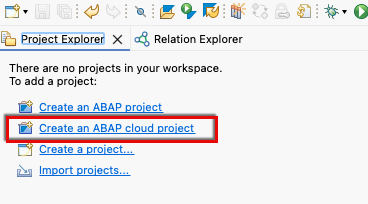

3. Enter the URL of system APB  and click next (<i> System URL provided in the session </i> )
   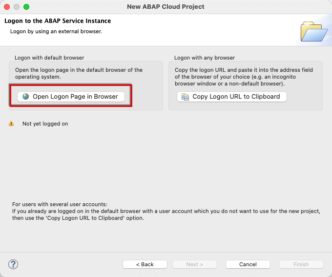

4. Logon with your provided user ( ### group number )
- User: DT266-###@education.cloud.sap
- Password: Password provided in the session.

  <kbd>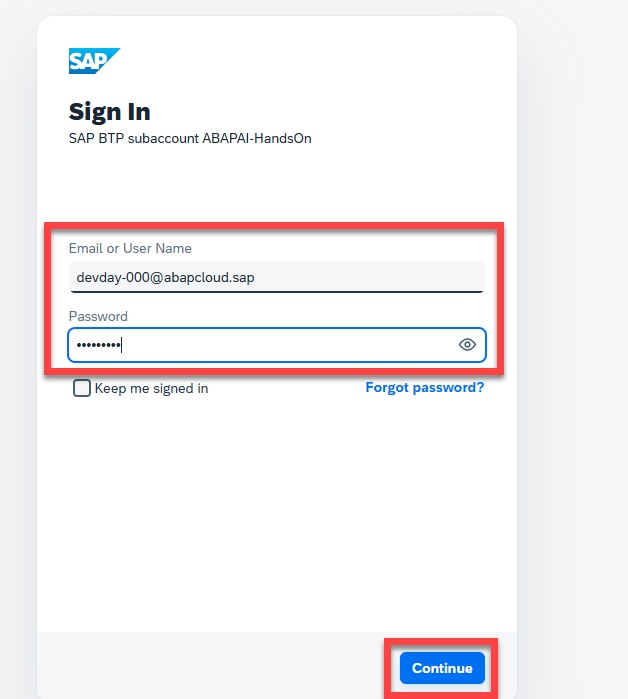</kbd>

5. Finish the New Project Creation Wizard

   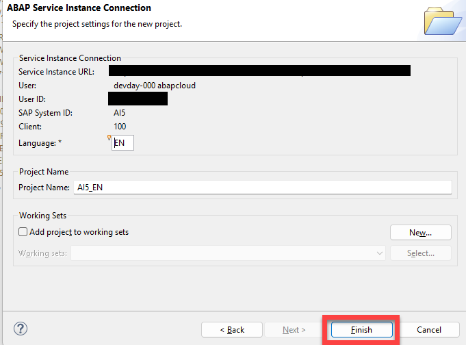   

7. Add your exercise package to `Favorite Packages`

   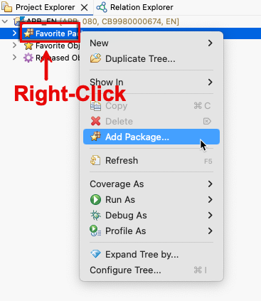   

8. Make sure to add the package matched to your group number ### and add it

   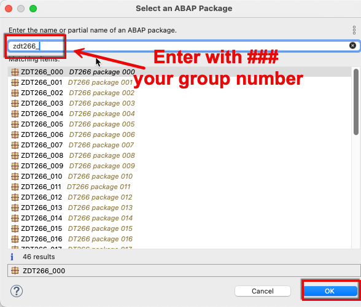

9. Expand your favorite packages to access your package

   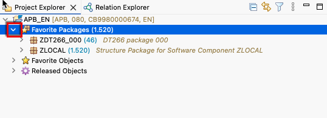   

 -----
### About the ABAP Material
All the ABAP code and database tables to change are in:
- one exercise package with your suffix `ZDT266_###` 
- in this package we have an extended RAP Model with several runtime and application errors and performance issues to analyze and to implement solutions. 
- changes to ABAP code are only necessary in the classes 
   - `ZCL_DT266_CARR_EXTENSION_###`, 
   - `ZBP_R_DT266_CARR_###`, 
   - `ZBP_R_DT266_CARR_###_E`.    
   
   In addition changes for the table `ZDT266_SUP_I_###` in your package have to be executed.

> [!IMPORTANT]
> **Check the suffix `###` of your demo user (e.g. DT266-###@education.cloud.sap).**
> Only perform changes in your package `ZDT266_###`. 

## Getting Started 0.2: Overview of the Model and ABAP Code
[^Top of page](#)

> Todays scenario is based on a RAP application using the [``ABAP Flight Reference Scenario``](https://github.com/SAP-samples/abap-platform-refscen-flight).   <!-- For an overview of the available database tables, see ABAP Flight Reference Scenario. They are available in the package /DMO/FLIGHT_LEGACY. This package also includes a data generator with which you can fill the database tables. -->

In our example we want to provide a list of Airline IDs = Carrier_Id(s) for which we get in the result list additional column fields calculated by customer extension:
- the total of all corresponding flight prices 
- the total price of all corresponding supplements (like meal, beverage, luggage) 
- the percentages %Meals, %Beverages, %Luggage with which those supplement categories contribute to the total price of the supplements

> [!Caution]
> **Runtime error for specific Airlines:**    
> If you click on **`Go`** without specification of any Airline or e.g. choose Airline ID = 'AC' you get a runtime error:  
> <kbd></kbd>  
> **Currently it is only working without error for some specific airlines e.g. Airline ID = 'AA'.**
> This error is analyzed and fixed in [Exercise 1](../ex01/README.md).
---

<kbd>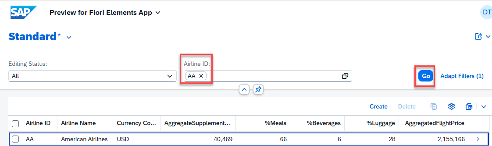</kbd>

The calculation is performed in the ABAP class _`ZCL_DT266_CARR_EXTENSION_###`_ where we call in exercise 1 to 4 the method _`GET_PRICES_ABAP`_ and for exercise 5 the method _`GET_PRICES_CDS`_.

<!--

   🟠 _**REMARK:**_ The following overviews are only optional information. This is **not required** to execute the exercises. We recommend to skip reading this additional information and directly continue with [Exercise 1](../ex01/README.md).

More details on the involved underlying Data Model:

   
        
Click here for an Overview of the tables involved
  

 

We use in the Exercises the following tables:

| Table | Content | Number of Entries | Key Fields | Other Fields used in Model / Where used | 
|---|---|---|---|---|
|/DMO/CARRIER| Different Carriers, e.g. AA, AC,... | 17 Airline IDs = Carrier IDs | CLIENT, CARRIER_ID | | 
|  `ZDT266_CARR_000` | _Copy of /DMO/CARRIER_ |17 Airline IDs = Carrier IDs | CLIENT, CARRIER_ID | | 
|/DMO/CONNECTION| Connections of the Carriers | 20 rows: Combinations of Carrier & Connection | CLIENT, CARRIER_ID, CONNECTION_ID | |
|/DMO/BOOKING | Booking IDs and travel IDs for each combination of carrer and connection | 9161 rows | CLIENT, TRAVEL_ID, BOOKING_ID | CARRIER_ID, CONNECTION_ID, FLIGHT_PRICE |
|/DMO/BOOK_SUPPL | Supplements like meal, beverage, luggage | 16211 entries | CLIENT, TRAVEL_ID, BOOKING_ID, BOOKING_SUPPLEMENT_ID | SUPPLEMENT_ID|
| `ZDT266_BO_SU_000` | _Copy of 10.000 times /DMO/BOOK_SUPPL_ | 162,100,000 entries | CLIENT, TRAVEL_ID, BOOKING_ID, BOOKING_SUPPLEMENT_ID, **ID** (_10,000 different values_) | _used for CDS performance_|
| /DMO/SUPPLEMENT | Different kind of Supplements and their categories and prices | 48 entries | CLIENT, SUPPLEMENT_ID | SUPPLEMENT_CATEGORY, PRICE|
| `ZDT266_SUP_I_###` | _Copy of 500 times /DMO/SUPPLEMENT_ |24,000 entries |  CLIENT, SUPPLEMENT_ID, **ID** (_500 different values_) | _used for ABAP performance_ |
| `ZDT266_SUP_L_000` | _Copy of 200,000 times /DMO/SUPPLEMENT_ | 9,600,000 entries |  CLIENT, SUPPLEMENT_ID, **ID** (_200,000 different values_) | _used for CDS performance_ |

   

   
        
Click here for an Overview of the ABAP Code
  

 In a similar way to [``Create Database Table and Generate UI Service``](https://developers.sap.com/tutorials/abap-environment-rap100-generate-ui-service.html) 
 we have created a copy of /DMO/CARRIER with the name `ZDT266_CARR_000` and generated a UI service.

 Following [``Using Virtual Elements in CDS Projection Views``](https://help.sap.com/docs/ABAP_PLATFORM_NEW/fc4c71aa50014fd1b43721701471913d/319380e0cef94051ae9aa292ffadb59a.html?version=201909.latest&q=ObjectModel.filter.transformedBy) we created ``Virtual Elements`` declared in the CDS projection view ``ZC_DT266_CARR_###`` created in the previous step:
 
 

 They shall be calulated in the custom extension class _`ZCL_DT266_CARR_EXTENSION_###`_.
 
 In this class _`ZCL_DT266_CARR_EXTENSION_###`_ two interface methods have to be created (refer to [``Implementing the Calculation of Virtual Elements``](https://help.sap.com/docs/ABAP_PLATFORM_NEW/fc4c71aa50014fd1b43721701471913d/c65942c284dd490a9c3791630d4d4e41.html?version=201909.latest&q=ObjectModel.filter.transformedBy)):

 - IF_SADL_EXIT_CALC_ELEMENT_READ~GET_CALCULATION_INFO
 - IF_SADL_EXIT_CALC_ELEMENT_READ~CALCULATE
 

 The method ``Calculate`` calls then two alternative methods where we do the calculations:
 - ``GET_PRICES_ABAP`` where the calculations are performed in ABAP code (used in Exercises 1 to 4)
 - ``GET_PRICES_CDS`` where the calculations are performed in CDS views (used in Exercise 5)

 The method ``GET_PRICES_ABAP`` first determines for given ``AIRLINE = CARRIER_ID`` the corresponding connections (from table /DMO/CONNECTION) and for the connections the corresponding bookings (from table /DMO/BOOKING):  
 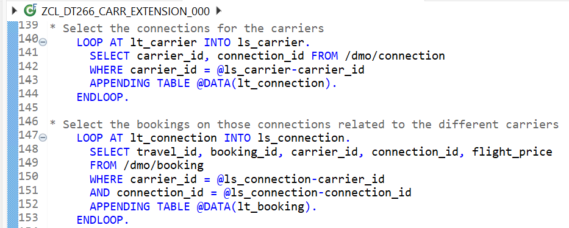

 And then the supplements for the bookings:  
 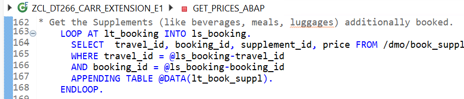

 and their prices and categories:  
 

 Then we just loop over the selected data to calculate the totals and percentages:  
 
 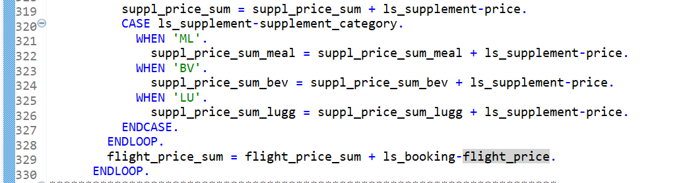
 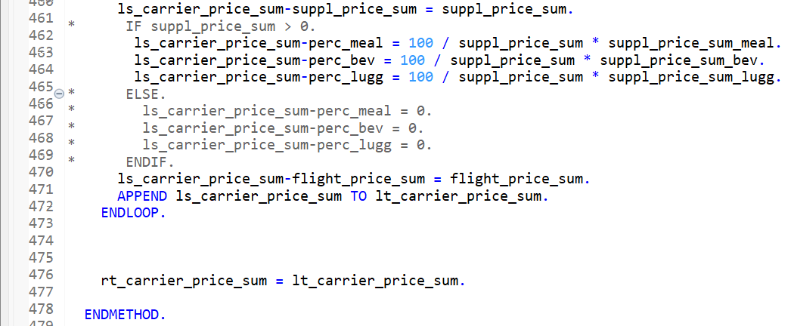

   

-->
 
## Summary & First Exercise

Now that you have made yourself familiar on how to logon and access your package you can continue to - [Exercise 1](../ex01/README.md)

