[Home - DT266](/README.md#exercises)

# Getting started and Overview of the Model and ABAP Code

### Introduction
In this section we provide information on how to conduct the exercises and provide an introduction to the model and ABAP code used.
We outline how to logon to the system and how to access your package for these exercises.  We briefly introduce the Fiori App to use in the exercises.  


- [0.1 - About the Session](#getting-started-01-about-the-session)
<!--
- [0.1 - Getting the scenario into your ABAP system ](#getting-started-01-getting-the-scenario-into-your-ABAP-system)

- [0.2 - Overview of the Model and ABAP Code](#getting-started-02-overview-of-the-model-and-abap-code)
-->


### Summary:  
- [Summary & First Exercise](#summary--first-exercise)  


## Getting Started 0.1: About the Session 
[^Top of page](#)

### Logon Information
<table>
    <tr>
    <td>System</td>
    <td><i>System Id  provided in the session</i></td>
  </tr>
  <tr>
    <td>User</td>
     <td><i>User provided in the session</i></td>
  </tr>
      <tr>
    <td>Password</td>
    <td><i>Password provided in the session</i></td>
  </tr>
  <tr>
    <td>Exercise Package</td>
    <td>ZDT266_### <br><i>Don't forget to replace all occurences of the placeholder ### with your assigned location and group number in the exercise steps below.</i></td>
  </tr>
</table>

> [!IMPORTANT]
> **Check the suffix `###` of your demo user (e.g. devday-###@abapcloud.sap).**
> Only perform changes in your package `ZDT266_###`. 

> [!NOTE]    
> The screenshots in this document have been taken using the suffix or assigned suffix  **`000`** and the system **`APB`**.  
> We **do not recommend** using assigned suffix **`000`**.
> 
> Please note that ADT dialogs and views as well as SAP Fiori UIs may change in upcoming releases.


 -----
### Logon and Connect 

<details>
     <summary>🟡Click to expand</summary>
1. Start ABAP Development Tools
2. Create a new Cloud Project via `Create an ABAP cloud project`

   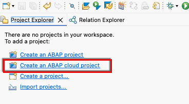

3. Enter the URL of system APB  and click next (<i> System URL provided in the session </i> )
   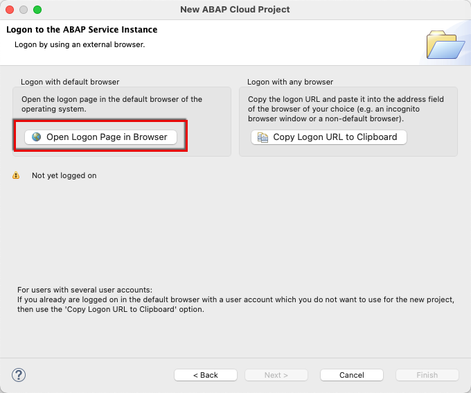


4. Logon with your provided user ( ### group number )
- User: devday-###@abapcloud.sap
- Password: Password provided in the session.

  <kbd>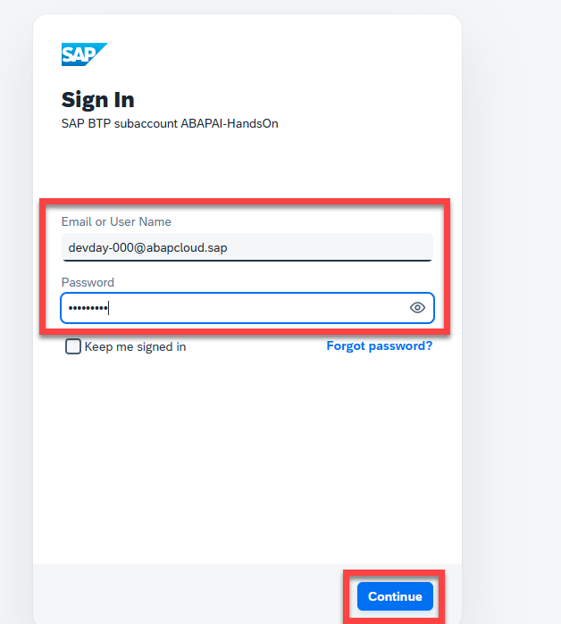</kbd>


5. Finish the New Project Creation Wizard

   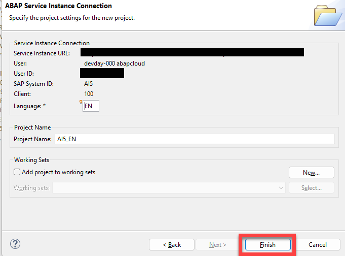   

</details>

<!--
### Generate your own exercise package `ZDT266_###` (not needed for SAP lead events) 

1. Right click on the folder `Favorite objects` and choose `Add Object`. 

   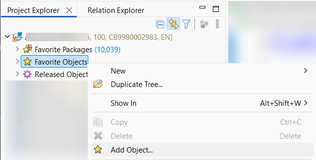

2. Choose `zdmo_gen_dt266_single` and choose **OK**.  

   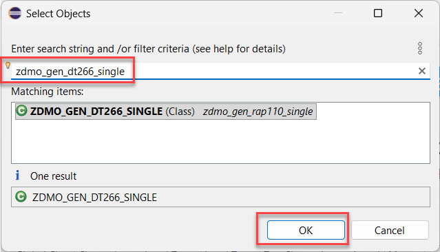

3. Right click on `zdmo_gen_dt266_single` and select **Run as** > **Application Console (ABAP)** or simply press **F9** having the class selected.

   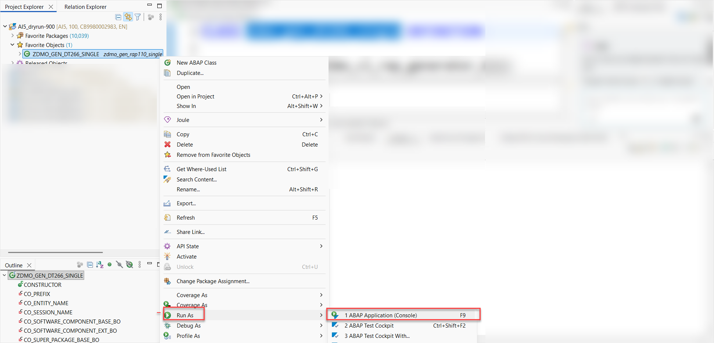

4. Wait for the generation process to end

-->

### Add the exercise package `ZDT266_###` to your favorite packages 

<details>
     <summary>🟡Click to expand</summary>

1. Add your exercise package to `Favorite Packages`

   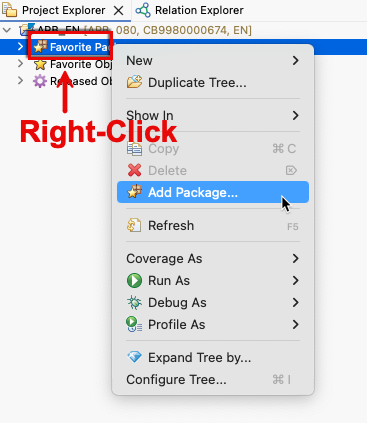   

2. Make sure to add the package matched to your group number ### and add it

   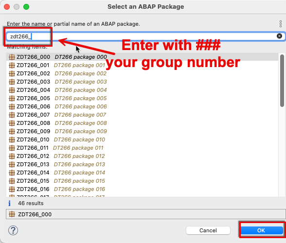


3. Expand your favorite packages to access your package

   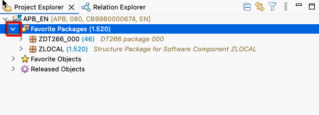   


</details>

### ⚠️ Adapt the source code in class **`ZCL_DT266_CARR_EXTENSION_###`**

<details>
     <summary>🟡Click to expand</summary>

1. **Perform the following coding change:**
   > [!IMPORTANT]    
   > **Prerequisite for this exercise is that you implement the code snippet in class `ZCL_DT266_CARR_EXTENSION_###`**.
   > **A code snippet is provided below to speed up the process:** 
   > - Delete the complete current source code in the class **`ZCL_DT266_CARR_EXTENSION_###`**, 
   > - insert the code snippet provided below (🟡📄), 
   > - and replace all occurrences of the placeholder **`###`** with your personal suffix using the ADT function _**Replace All**_ (_**Ctrl+F**_).
     


   > - 💡 Make use of the _Copy Raw Content_ () function to copy the provided code snippet.
   > - 💡 Replace all occurrences of the placeholder **`###`** with your personal suffix using the ADT function _**Replace All**_ (_**Ctrl+F**_).

```<ABAP>
CLASS zcl_dt266_carr_extension_### DEFINITION
      PUBLIC
      FINAL
      CREATE PUBLIC .

  PUBLIC SECTION.
    TYPES: BEGIN OF ty_id,
             id TYPE int4,
           END OF ty_id.
    TYPES: BEGIN OF ty_carrier,
             carrier_id TYPE /dmo/carrier_id,
           END OF ty_carrier.
    TYPES: BEGIN OF ty_connection,
             carrier_id    TYPE /dmo/carrier_id,
             connection_id TYPE /dmo/connection_id,
           END OF ty_connection.
    TYPES: BEGIN OF ty_booking,
             travel_id     TYPE /dmo/travel_id,
             booking_id    TYPE /dmo/booking_id,
             carrier_id    TYPE /dmo/carrier_id,
             connection_id TYPE /dmo/connection_id,
             flight_price  TYPE /dmo/flight_price,
           END OF ty_booking.
    TYPES: BEGIN OF ty_book_suppl,
             travel_id     TYPE /dmo/travel_id,
             booking_id    TYPE /dmo/booking_id,
             "Exercise 4.4: Correction for FOR ALL ENTRIES SELECT -START
**********************************************************************
*             booking_supplement_id TYPE /dmo/booking_supplement_id,
             "Exercise 4.4: Correction for FOR ALL ENTRIES SELECT -END
**********************************************************************
             supplement_id TYPE /dmo/supplement_id,
             price         TYPE /dmo/supplement_price,
           END OF ty_book_suppl.
    TYPES: BEGIN OF ty_supplement,
             supplement_id       TYPE /dmo/supplement_id,
             id                  TYPE int4,
             supplement_category TYPE /dmo/supplement_category,
             price               TYPE /dmo/supplement_price,
           END OF ty_supplement.
    TYPES: BEGIN OF ty_cds_result_suppl,
             carrier_id           TYPE /dmo/carrier_id,
             suppl_price_sum      TYPE /dmo/supplement_price,
             suppl_price_sum_bev  TYPE /dmo/supplement_price,
             suppl_price_sum_meal TYPE /dmo/supplement_price,
             suppl_price_sum_lugg TYPE /dmo/supplement_price,
           END OF ty_cds_result_suppl.
    TYPES: BEGIN OF ty_cds_result_flight,
             carrier_id       TYPE /dmo/carrier_id,
             flight_price_sum TYPE /dmo/supplement_price,
           END OF ty_cds_result_flight.
    TYPES: BEGIN OF ty_carrier_price_sum,
             carrier_id       TYPE /dmo/carrier_id,
             suppl_price_sum  TYPE /dmo/supplement_price,
             perc_meal        TYPE int4,
             perc_bev         TYPE int4,
             perc_lugg        TYPE int4,
             flight_price_sum TYPE /dmo/supplement_price,
           END OF ty_carrier_price_sum.
    TYPES: tt_carrier_price_sum TYPE STANDARD TABLE OF ty_carrier_price_sum WITH DEFAULT KEY.
    TYPES: tt_carrier_id TYPE STANDARD TABLE OF ty_carrier WITH DEFAULT KEY.
    TYPES: tt_id TYPE STANDARD TABLE OF ty_id WITH DEFAULT KEY.
    TYPES: tt_supplement TYPE STANDARD TABLE OF ty_supplement WITH DEFAULT KEY.

    INTERFACES:
      if_oo_adt_classrun,
      if_sadl_exit_calc_element_read.
  PROTECTED SECTION.
  PRIVATE SECTION.
    METHODS get_prices_ABAP IMPORTING  lt_carrier                  TYPE tt_carrier_id
                            RETURNING
                                       VALUE(rt_carrier_price_sum) TYPE tt_carrier_price_sum
                            EXCEPTIONS zero_devide.
    METHODS get_supplements_ABAP IMPORTING supplement_category TYPE  /dmo/supplement_category
                                 CHANGING
                                           lt_supplement       TYPE tt_supplement
                                           lt_id               TYPE tt_id.
    METHODS get_prices_CDS IMPORTING lt_carrier                  TYPE tt_carrier_id
                           RETURNING
                                     VALUE(rt_carrier_price_sum) TYPE tt_carrier_price_sum.
ENDCLASS.


CLASS zcl_dt266_carr_extension_### IMPLEMENTATION.


  METHOD if_oo_adt_classrun~main.

    "    out->write( |[DT266] Run finished for ZCL_DT266_LOOP1_{ group_id }. | ).
  ENDMETHOD.


  METHOD get_supplements_ABAP.
    SELECT supplement_id,id, supplement_category, price FROM zdt266_sup_i_###
        FOR ALL ENTRIES IN @lt_id
        WHERE supplement_category = @supplement_category AND id = @lt_id-id
  APPENDING TABLE @lt_supplement.
  ENDMETHOD.


  METHOD get_prices_ABAP.

    DATA:
      group_id              TYPE string VALUE '###',
      id                    TYPE int4,
      ls_id                 TYPE ty_id,
      lt_id                 TYPE STANDARD TABLE OF ty_id,
      ls_carrier            TYPE ty_carrier,
      ls_connection         TYPE ty_connection,
      ls_booking            TYPE ty_booking,
      ls_book_suppl         TYPE ty_book_suppl,
      ls_supplement         TYPE ty_supplement,
      ls_supplement2        TYPE ty_supplement,
      ls_carrier_price_sum  TYPE ty_carrier_price_sum,
      suppl_price_sum       TYPE /dmo/supplement_price,
      suppl_price_sum_meal  TYPE /dmo/supplement_price,
      suppl_price_sum_bev   TYPE /dmo/supplement_price,
      suppl_price_sum_lugg  TYPE /dmo/supplement_price,
      flight_price_sum      TYPE /dmo/supplement_price,
      l_tabix_1             TYPE sy-tabix,
      l_tabix_2             TYPE sy-tabix,
      lt_booking_sort       TYPE SORTED TABLE OF ty_booking WITH NON-UNIQUE KEY primary_key  COMPONENTS carrier_id,
      lt_book_suppl_sort    TYPE SORTED TABLE OF ty_book_suppl WITH NON-UNIQUE KEY primary_key  COMPONENTS travel_id booking_id, supplement_id,booking_supplement_id,
      lt_supplement_sort    TYPE SORTED TABLE OF ty_supplement WITH NON-UNIQUE KEY primary_key COMPONENTS supplement_id id,
      lt_supplement_sort2   TYPE SORTED TABLE OF ty_supplement WITH NON-UNIQUE KEY primary_key COMPONENTS supplement_category
                              WITH NON-UNIQUE SORTED KEY key_id_cat COMPONENTS supplement_id id,
      lt_supplement         TYPE STANDARD TABLE OF ty_supplement
                              WITH NON-UNIQUE SORTED KEY key_id_cat COMPONENTS supplement_id id,
      lt_supplement2        TYPE STANDARD TABLE OF ty_supplement,
      lt_supplement3        TYPE STANDARD TABLE OF ty_supplement,
      lt_carrier_price_sum  TYPE STANDARD TABLE OF ty_carrier_price_sum,
      table_supplement      TYPE tabname,
      oref                  TYPE REF TO cx_root,
      text                  TYPE string.

    table_supplement = |zdt266_sup_i_{ group_id }|.

    " Select the connections for the carriers
    LOOP AT lt_carrier INTO ls_carrier.
      SELECT carrier_id, connection_id FROM /dmo/connection
      WHERE carrier_id = @ls_carrier-carrier_id
      APPENDING TABLE @DATA(lt_connection).
    ENDLOOP.

    " Select the bookings on those connections related to the different carriers
    LOOP AT lt_connection INTO ls_connection.
      SELECT travel_id, booking_id, carrier_id, connection_id, flight_price
      FROM /dmo/booking
      WHERE carrier_id = @ls_connection-carrier_id
      AND connection_id = @ls_connection-connection_id
      APPENDING TABLE @DATA(lt_booking).
    ENDLOOP.

    " Sorted tables
    lt_booking_sort = lt_booking.


    " Exercise 4.4: Compare with FAE -START
*********************************************************************
    " Get the Supplements (like beverages, meals, luggages) additionally booked.
    LOOP AT lt_booking INTO ls_booking.
      SELECT  travel_id, booking_id, supplement_id, price FROM /dmo/book_suppl
      WHERE travel_id = @ls_booking-travel_id
      AND booking_id = @ls_booking-booking_id
      APPENDING TABLE @DATA(lt_book_suppl).
    ENDLOOP.

*    SELECT  travel_id, booking_id, supplement_id, price FROM /dmo/book_suppl
*    FOR ALL ENTRIES IN @lt_booking
*    WHERE travel_id = @lt_booking-travel_id
*    AND booking_id = @lt_booking-booking_id
*    APPENDING TABLE @DATA(lt_book_suppl).
**********************************************************************
    " Exercise 4.4: Compare with FAE -END

    " Exercise 4.4: Table Comparison Tool -START
**********************************************************************
*    LOOP AT lt_booking INTO ls_booking.
*      SELECT  * FROM /dmo/book_suppl
*      WHERE travel_id = @ls_booking-travel_id
*      AND booking_id = @ls_booking-booking_id
*      APPENDING TABLE @DATA(lt_book_suppl3).
*    ENDLOOP.
*    SORT lt_book_suppl BY travel_id booking_id supplement_id price.
*    SORT lt_book_suppl2 BY travel_id booking_id supplement_id price.
*    SORT lt_book_suppl3 BY travel_id booking_id supplement_id price.
**********************************************************************
    " Exercise 4.4: Table Comparison Tool --END

    " Sorted tables
    lt_book_suppl_sort = lt_book_suppl.


    IF lt_book_suppl IS NOT INITIAL.
      " Exercise 2.1: Memory Analysis -START
**********************************************************************
      " Get all prices and categories
      SELECT supplement_id,id, supplement_category, price FROM zdt266_sup_i_###
      APPENDING TABLE @lt_supplement.

      SORT lt_supplement BY supplement_id id.
      DELETE ADJACENT DUPLICATES FROM lt_supplement COMPARING supplement_id id.


      " Get the prices and categories only for the booked supplements
*    LOOP AT lt_book_suppl INTO ls_book_suppl.
*      SELECT supplement_id,id, supplement_category, price FROM zdt266_sup_i_###
*      WHERE supplement_id = @ls_book_suppl-supplement_id
*      AND id = 1
*      APPENDING TABLE @lt_supplement.
*    ENDLOOP.

      " Get the prices for specific categories
*    id = 1.
*    WHILE id < 499.
*      ls_id-id = id.
*      APPEND ls_id TO LT_id.
*      CALL METHOD get_supplements_ABAP
*        EXPORTING
*          supplement_category = 'LU'
*        CHANGING
*          lt_id               = lt_id
*          lt_supplement       = lt_supplement2.
*      id = id + 1.
*      APPEND LINES OF lt_supplement2 TO lt_supplement.
**      CLEAR lt_id.
**      CLEAR lt_supplement2.
*    ENDWHILE.
*
*
*    id = 1.
*    WHILE id < 499.
*      ls_id-id = id.
*      APPEND ls_id TO LT_id.
*      CALL METHOD get_supplements_ABAP
*        EXPORTING
*          supplement_category = 'BV'
*            CHANGING
*          lt_id               = lt_id
*          lt_supplement       = lt_supplement2.
*      id = id + 1.
*      APPEND LINES OF lt_supplement2 TO lt_supplement.
**      CLEAR lt_id.
**      CLEAR lt_supplement2.
*    ENDWHILE.
*
*
*    id = 1.
*    WHILE id < 499.
*      ls_id-id = id.
*      APPEND ls_id TO LT_id.
*      CALL METHOD get_supplements_ABAP
*        EXPORTING
*          supplement_category = 'ML'
*        CHANGING
*          lt_id               = lt_id
*          lt_supplement       = lt_supplement2.
*      id = id + 1.
*      APPEND LINES OF lt_supplement2 TO lt_supplement.
**      CLEAR lt_id.
**      CLEAR lt_supplement2.
*    ENDWHILE.


      " Sorted tables
*    lt_supplement_sort = lt_supplement.
**********************************************************************
      " Exercise 2.1: Memory Analysis -End
    ENDIF.


    " Sorting tables for using BINARY SEARCH before the first LOOP starts.
    SORT lt_supplement BY supplement_id id.
*    SORT lt_book_suppl BY travel_id booking_id supplement_id.
*    SORT lt_booking BY carrier_id.

    LOOP AT lt_carrier INTO ls_carrier.
      suppl_price_sum = 0.
      suppl_price_sum_meal = 0.
      suppl_price_sum_bev = 0.
      suppl_price_sum_lugg = 0.
      flight_price_sum = 0.


      "*" Exercise 4.3: READ TABLE -START
**********************************************************************
      LOOP AT lt_booking_sort INTO ls_booking WHERE carrier_id = ls_carrier-carrier_id.
        LOOP AT lt_book_suppl_sort INTO ls_book_suppl
        WHERE travel_id = ls_booking-travel_id AND booking_id = ls_booking-booking_id.
          READ TABLE lt_supplement INTO ls_supplement
          WHERE supplement_id = ls_book_suppl-supplement_id AND id = 1.
*          WITH KEY key_id_cat COMPONENTS supplement_id = ls_book_suppl-supplement_id  id = 1.
*
          "// Option 1: Consider to sort the table lt_supplement before the LOOP AT by the key fields for which we access the table and use BINARY SEARCH:
*            READ TABLE lt_supplement INTO ls_supplement
*            WITH KEY  supplement_id = ls_book_suppl-supplement_id  id = 1 BINARY SEARCH.
*
          "// Option 2: READ TABLE is fast when we have an as SORTED defined table where the primary key fits to the key of the WHERE Clause
          "//           lt_supplement_sort TYPE SORTED TABLE OF ty_supplement WITH NON-UNIQUE KEY primary_key COMPONENTS supplement_id id,
*         READ TABLE lt_supplement_sort INTO ls_supplement
*            WHERE supplement_id = ls_book_suppl-supplement_id AND id = 1.
**
          "// Option 3: In case the table is already defined as sorted table which does not fit to the key access we have here (supplement_id & id)
          "//           one can add ad in the definition a further SORTED KEY which fits:
          "//          lt_supplement_sort2   TYPE SORTED TABLE OF ty_supplement WITH NON-UNIQUE KEY primary_key COMPONENTS supplement_category
          "//      WITH NON-UNIQUE SORTED KEY key_id_cat COMPONENTS supplement_id id,
*            READ TABLE lt_supplement_sort2 INTO ls_supplement
*                 WITH KEY key_id_cat COMPONENTS supplement_id = ls_book_suppl-supplement_id  id = 1.

          suppl_price_sum = suppl_price_sum + ls_supplement-price.
          CASE ls_supplement-supplement_category.
            WHEN 'ML'.
              suppl_price_sum_meal = suppl_price_sum_meal + ls_supplement-price.
            WHEN 'BV'.
              suppl_price_sum_bev = suppl_price_sum_bev + ls_supplement-price.
            WHEN 'LU'.
              suppl_price_sum_lugg = suppl_price_sum_lugg + ls_supplement-price.
          ENDCASE.
        ENDLOOP.
        flight_price_sum = flight_price_sum + ls_booking-flight_price.
      ENDLOOP.
**********************************************************************
      " Exercise 4.3: READ TABLE -End


      " Exercise 4.5: Nested Loops -START
**********************************************************************
*      suppl_price_sum = 0.
*      suppl_price_sum_meal = 0.
*      suppl_price_sum_bev = 0.
*      suppl_price_sum_lugg = 0.
*      flight_price_sum = 0.
*      LOOP AT lt_booking INTO ls_booking WHERE carrier_id = ls_carrier-carrier_id.
*        LOOP AT lt_book_suppl INTO ls_book_suppl
*        WHERE travel_id = ls_booking-travel_id AND booking_id = ls_booking-booking_id.
*          LOOP AT lt_supplement INTO ls_supplement
*            WHERE supplement_id = ls_book_suppl-supplement_id AND id = 1.
*            suppl_price_sum = suppl_price_sum + ls_supplement-price.
*            CASE ls_supplement-supplement_category.
*              WHEN 'ML'.
*                suppl_price_sum_meal = suppl_price_sum_meal + ls_supplement-price.
*              WHEN 'BV'.
*                suppl_price_sum_bev = suppl_price_sum_bev + ls_supplement-price.
*              WHEN 'LU'.
*                suppl_price_sum_lugg = suppl_price_sum_lugg + ls_supplement-price.
*            ENDCASE.
*            EXIT.
*          ENDLOOP.
*        ENDLOOP.
*        flight_price_sum = flight_price_sum + ls_booking-flight_price.
*      ENDLOOP.
*
*
*      suppl_price_sum = 0.
*      suppl_price_sum_meal = 0.
*      suppl_price_sum_bev = 0.
*      suppl_price_sum_lugg = 0.
*      flight_price_sum = 0.
*      LOOP AT lt_booking_sort INTO ls_booking WHERE carrier_id = ls_carrier-carrier_id.
*        LOOP AT lt_book_suppl_sort INTO ls_book_suppl
*        WHERE travel_id = ls_booking-travel_id AND booking_id = ls_booking-booking_id.
*            LOOP AT lt_supplement_sort INTO ls_supplement
*            WHERE supplement_id = ls_book_suppl-supplement_id and id = 1.
*            suppl_price_sum = suppl_price_sum + ls_supplement-price.
*            CASE ls_supplement-supplement_category.
*              WHEN 'ML'.
*                suppl_price_sum_meal = suppl_price_sum_meal + ls_supplement-price.
*              WHEN 'BV'.
*                suppl_price_sum_bev = suppl_price_sum_bev + ls_supplement-price.
*              WHEN 'LU'.
*                suppl_price_sum_lugg = suppl_price_sum_lugg + ls_supplement-price.
*            ENDCASE.
*            EXIT.
*            ENDLOOP.
*        ENDLOOP.
*        flight_price_sum = flight_price_sum + ls_booking-flight_price.
*      ENDLOOP.
*
*      suppl_price_sum = 0.
*      suppl_price_sum_meal = 0.
*      suppl_price_sum_bev = 0.
*      suppl_price_sum_lugg = 0.
*      flight_price_sum = 0.
*      LOOP AT lt_booking_sort INTO ls_booking WHERE carrier_id = ls_carrier-carrier_id.
*        LOOP AT lt_book_suppl_sort INTO ls_book_suppl
*        WHERE travel_id = ls_booking-travel_id AND booking_id = ls_booking-booking_id.
*            LOOP AT lt_supplement INTO ls_supplement
*            USING KEY key_id_cat WHERE supplement_id = ls_book_suppl-supplement_id and id = 1.
*            suppl_price_sum = suppl_price_sum + ls_supplement-price.
*            CASE ls_supplement-supplement_category.
*              WHEN 'ML'.
*                suppl_price_sum_meal = suppl_price_sum_meal + ls_supplement-price.
*              WHEN 'BV'.
*                suppl_price_sum_bev = suppl_price_sum_bev + ls_supplement-price.
*              WHEN 'LU'.
*                suppl_price_sum_lugg = suppl_price_sum_lugg + ls_supplement-price.
*            ENDCASE.
*            EXIT.
*            ENDLOOP.
*        ENDLOOP.
*        flight_price_sum = flight_price_sum + ls_booking-flight_price.
*      ENDLOOP.
*
*
*      suppl_price_sum = 0.
*      suppl_price_sum_meal = 0.
*      suppl_price_sum_bev = 0.
*      suppl_price_sum_lugg = 0.
*      flight_price_sum = 0.
*      LOOP AT lt_booking_sort INTO ls_booking WHERE carrier_id = ls_carrier-carrier_id.
*        READ TABLE lt_book_suppl_sort TRANSPORTING NO FIELDS
*        WITH KEY travel_id = ls_booking-travel_id  booking_id = ls_booking-booking_id.
*        l_tabix_1 = sy-tabix.
*        LOOP AT lt_book_suppl_sort INTO ls_book_suppl FROM l_tabix_1.
*          IF ls_book_suppl-travel_id = ls_booking-travel_id AND ls_book_suppl-booking_id = ls_booking-booking_id.
*            READ TABLE lt_supplement TRANSPORTING NO FIELDS
*            WITH KEY key_id_cat components supplement_id = ls_book_suppl-supplement_id  id = 1.
*            l_tabix_2 = sy-tabix.
*            LOOP AT lt_supplement INTO ls_supplement USING KEY key_id_cat FROM l_tabix_2.
*              IF ls_supplement-supplement_id = ls_book_suppl-supplement_id AND ls_supplement-id = 1.
*                suppl_price_sum = suppl_price_sum + ls_supplement-price.
*                CASE ls_supplement-supplement_category.
*                  WHEN 'ML'.
*                    suppl_price_sum_meal = suppl_price_sum_meal + ls_supplement-price.
*                  WHEN 'BV'.
*                    suppl_price_sum_bev = suppl_price_sum_bev + ls_supplement-price.
*                  WHEN 'LU'.
*                    suppl_price_sum_lugg = suppl_price_sum_lugg + ls_supplement-price.
*                ENDCASE.
*                EXIT.
*              ELSE.
*                EXIT.
*              ENDIF.
*            ENDLOOP.
*          ELSE.
*            EXIT.
*          ENDIF.
*        ENDLOOP.
*        flight_price_sum = flight_price_sum + ls_booking-flight_price.
*      ENDLOOP.
*
*
*
**********************************************************************
      " Exercise 4.5: Nested Loops -End

      ls_carrier_price_sum-carrier_id = ls_carrier-carrier_id.
      ls_carrier_price_sum-suppl_price_sum = suppl_price_sum.
*      IF suppl_price_sum > 0.
      ls_carrier_price_sum-perc_meal = 100 / suppl_price_sum * suppl_price_sum_meal.
      ls_carrier_price_sum-perc_bev = 100 / suppl_price_sum * suppl_price_sum_bev.
      ls_carrier_price_sum-perc_lugg = 100 / suppl_price_sum * suppl_price_sum_lugg.
*      ELSE.
*        ls_carrier_price_sum-perc_meal = 0.
*        ls_carrier_price_sum-perc_bev = 0.
*        ls_carrier_price_sum-perc_lugg = 0.
*      ENDIF.
      ls_carrier_price_sum-flight_price_sum = flight_price_sum.
      APPEND ls_carrier_price_sum TO lt_carrier_price_sum.
    ENDLOOP.


    rt_carrier_price_sum = lt_carrier_price_sum.

  ENDMETHOD.


  METHOD get_prices_CDS.

    DATA:
      ls_carrier           TYPE ty_carrier,
      ls_cds_result_suppl  TYPE ty_cds_result_suppl,
      ls_cds_result_flight TYPE ty_cds_result_flight,
      ls_carrier_price_sum TYPE ty_carrier_price_sum,
      suppl_price_sum      TYPE /dmo/supplement_price,
      suppl_price_sum_meal TYPE /dmo/supplement_price,
      suppl_price_sum_bev  TYPE /dmo/supplement_price,
      suppl_price_sum_lugg TYPE /dmo/supplement_price,
      flight_price_sum     TYPE /dmo/supplement_price,
      group_id             TYPE string VALUE '###',
      lt_carrier_price_sum TYPE STANDARD TABLE OF ty_carrier_price_sum.

    SELECT
      carrierid,
      suppl_price_sum,
      suppl_price_sum_bev,
      suppl_price_sum_meal,
      suppl_price_sum_lugg
    FROM
      z_i_price_###
    FOR ALL ENTRIES IN @lt_carrier WHERE carrierid = @lt_carrier-carrier_id AND id = 2
    %_HINTS HDB 'NO_USE_HEX_PLAN'
    INTO TABLE @DATA(lt_cds_result_suppl).

    SELECT
      carrierid,
      flight_price_sum
    FROM
      z_i_price_flight
      FOR ALL ENTRIES IN @lt_carrier WHERE carrierid = @lt_carrier-carrier_id
    INTO TABLE @DATA(lt_cds_result_flight).

    SORT lt_cds_result_suppl BY carrierid.
    SORT LT_CDS_result_FLIGHT BY carrierid.

    LOOP AT lt_carrier INTO ls_carrier.
      ls_carrier_price_sum-carrier_id = ls_carrier-carrier_id.
      ls_carrier_price_sum-flight_price_sum = 0.
      ls_carrier_price_sum-suppl_price_sum = 0.
      ls_carrier_price_sum-perc_bev = 0.
      ls_carrier_price_sum-perc_meal = 0.
      ls_carrier_price_sum-perc_lugg = 0.

      READ TABLE lt_CDS_RESULT_SUPPL INTO ls_cds_result_suppl
      WITH KEY carrierid = ls_carrier-carrier_id BINARY SEARCH.
      IF sy-subrc = 0.
        ls_carrier_price_sum-suppl_price_sum = ls_cds_result_suppl-suppl_price_sum.
        IF ls_cds_result_suppl-suppl_price_sum > 0.
          ls_carrier_price_sum-perc_meal = 100 / ls_cds_result_suppl-suppl_price_sum * ls_cds_result_suppl-suppl_price_sum_meal.
          ls_carrier_price_sum-perc_bev = 100 / ls_cds_result_suppl-suppl_price_sum * ls_cds_result_suppl-suppl_price_sum_bev.
          ls_carrier_price_sum-perc_lugg = 100 / ls_cds_result_suppl-suppl_price_sum * ls_cds_result_suppl-suppl_price_sum_lugg.
        ELSE.
          ls_carrier_price_sum-perc_meal = 0.
          ls_carrier_price_sum-perc_bev = 0.
          ls_carrier_price_sum-perc_lugg = 0.
        ENDIF.
      ENDIF.
      READ TABLE lt_CDS_RESULT_FLIGHT INTO ls_cds_result_flight
      WITH KEY carrierid = ls_carrier-carrier_id BINARY SEARCH.
      IF sy-subrc = 0.
        ls_carrier_price_sum-flight_price_sum = ls_cds_result_flight-flight_price_sum.
      ENDIF.
      APPEND ls_carrier_price_sum TO lt_carrier_price_sum.
    ENDLOOP.


    rt_carrier_price_sum = lt_carrier_price_sum.

  ENDMETHOD.


  METHOD if_sadl_exit_calc_element_read~calculate.

    DATA:
      lt_carrier TYPE tt_carrier_id,
      ls_carrier TYPE ty_carrier.

    DATA lt_original_data TYPE STANDARD TABLE OF zc_dt266_carr_### WITH DEFAULT KEY.

    lt_original_data = CORRESPONDING #( it_original_data ).


    LOOP AT lt_original_data ASSIGNING FIELD-SYMBOL(<fs_original_data1>).
      ls_carrier-carrier_id = <fs_original_data1>-CarrierId.
      APPEND ls_carrier TO lt_carrier.
    ENDLOOP.

    "* Exercise 5: CDS view Analysis -START
**********************************************************************
    DATA(lt_carrier_price_sum) = get_prices_ABAP( lt_carrier = lt_carrier ).
*    DATA(lt_carrier_price_sum) = get_prices_CDS( lt_carrier = lt_carrier ).
**********************************************************************
    "* Exercise 5: CDS view Analysis -End


    LOOP AT lt_original_data ASSIGNING FIELD-SYMBOL(<fs_original_data>).
      <fs_original_data>-AggregateSupplementPrice = lt_carrier_price_sum[ carrier_id = <fs_original_data>-CarrierID ]-suppl_price_sum.
      <fs_original_data>-PercMeal = lt_carrier_price_sum[ carrier_id = <fs_original_data>-CarrierID ]-perc_meal.
      <fs_original_data>-PercBeverages = lt_carrier_price_sum[ carrier_id = <fs_original_data>-CarrierID ]-perc_bev.
      <fs_original_data>-PercLuggage = lt_carrier_price_sum[ carrier_id = <fs_original_data>-CarrierID ]-perc_lugg.
      <fs_original_data>-AggregateFlightPrice = lt_carrier_price_sum[ carrier_id = <fs_original_data>-CarrierID ]-flight_price_sum.
    ENDLOOP.

    ct_calculated_data = CORRESPONDING #(  lt_original_data ).
  ENDMETHOD.


  METHOD if_sadl_exit_calc_element_read~get_calculation_info.
  ENDMETHOD.
ENDCLASS.

```


  
 

   > [!IMPORTANT]    
   > Activate the ABAP Code by pressing **`Ctrl+F3`** or by clicking on the match icon .


</details>
 -----

<!--
## Getting Started 0.1: Getting the scenario into your ABAP system 


### Download the ABAP Flight Reference Scenario into the system
The session material is based on the ABAP Flight Reference Scenario. Therefore downloading and installing it in the system is a mandatory prerequisite. To do so, proceed as follows:

- Create a new ABAP Cloud Project in ADT (see [Creating an ABAP Cloud Project](https://help.sap.com/docs/abap-cloud/abap-development-tools-user-guide/creating-abap-cloud-project?version=sap_btp) )
- Go to the repository of the ABAP Flight Scenario: https://github.com/SAP-samples/abap-platform-refscen-flight/tree/ABAP-platform-cloud
- Download and activate it to your system if not already installed as described in the following readme: https://github.com/SAP-samples/abap-platform-refscen-flight/blob/ABAP-platform-cloud/README.md
- Run the data generator of the package according to the readme: 
  - Expand the package structure in the Project Explorer `/DMO/FLIGHT_LEGACY` > `Source Code Library` > `Classes`.
  - Select the data generator class **`/DMO/CL_FLIGHT_DATA_GENERATOR`** and press **`F9`** (`Run as Console Application`).


### Download the Session materials into the system
After installing the Flight Reference Scenario as described above, you can install the session material code (The sessions code is located in this [github](/src)): 

#### Link and clone
- create an ABAP package in your system called `ZDT266_000` (see [Creating ABAP packages](https://help.sap.com/docs/abap-cloud/abap-development-tools-user-guide/creating-abap-packages) )
- link the package like the flight reference scenario with this repository
- pull the content from github

#### Activate
A mass-activation of the sources is currently not possible. The activation has to be executed in the following steps:

- Click Mass Activate and select all Tables, DDLs Sources and Data Model related artifacts, let the activation run
- Click Mass Activate and select all Behavior related sources, like BDEFs and Behavior Pool classes
- Click Mass Activate and activate the rest of the artifacts


#### Run the Data Generators

Afterwards run two of the Data Generators:

1. Fill the database table **`ZDT266_CARR_000`** by the class **`ZCL_DT266_GEN_CARR_000`**:
  
   Navigate in your package `ZDT266_000` to `ZDT266_000` > `Source Code Library` > `Classes`. <br> 
     
   Run the class **`ZCL_DT266_GEN_CARR_000`** once by pressing **`F9`**.
   

2. Fill the database table **`ZDT266_SUP_I_000`** by the class **`ZCL_DT266_GEN_SUP_I_000`**:
  
   Navigate in your package `ZDT266_000` to `ZDT266_000` > `Source Code Library` > `Classes`. <br> 
     
   Run the class **`ZCL_DT266_GEN_SUP_I_000`** once by pressing **`F9`**.
   
-->   

### Get an overview 
All the ABAP code and database tables to change are in:
- one exercise package with your suffix `ZDT266_###` 
- in this package we have an extended RAP Model with several runtime and application errors and performance issues to analyze and to implement solutions. 
- changes to ABAP code are only necessary in the classes 
   - `ZCL_DT266_CARR_EXTENSION_###`, 
   - `ZBP_R_DT266_CARR_###`, 
   - `ZBP_R_DT266_CARR_###_E`. <br>  
   
   In addition changes for the table `ZDT266_SUP_I_###` in your package have to be executed.


> [!IMPORTANT]
> **Check the suffix `###` of your demo user (e.g. devday-###@abapcloud.sap).**
> Only perform changes in your package `ZDT266_###`. 


<!--
> 🟠 _**REMARK:**_ Prerequisite is that you have implemented and activated the [``ABAP Flight Reference Scenario``](https://github.com/SAP-samples/abap-platform-refscen-flight) and filled the demo database tables with sample business data: 
1. Expand the package structure in the Project Explorer `/DMO/FLIGHT_LEGACY` > `Source Code Library` > `Classes`.
2. Select the data generator class `/DMO/CL_FLIGHT_DATA_GENERATOR` and press `F9` (Run as Console Application). 

   When this is finished you can create in a similar way to [``Create Database Table and Generate UI Service``](https://developers.sap.com/tutorials/abap-environment-rap100-generate-ui-service.html) a copy of /DMO/CARRIER with the name `ZDT266_CARR_000` and generated a UI service:

 <details>
  <summary>🔵 Click to expand for required Creation of UI Service</summary>

  1. Create  the database table **`ZDT266_CARR_000`**: <br>
      Navigate in your package **`ZDT266_###`** to `Favorite Packages` >  `ZLOCAL` > `ZDT266` > `ZDT266_###` > `Dictionary` > `Database Tables` and right-click on `Database Tables` and select **`New Database Table`** <br>
      <kbd>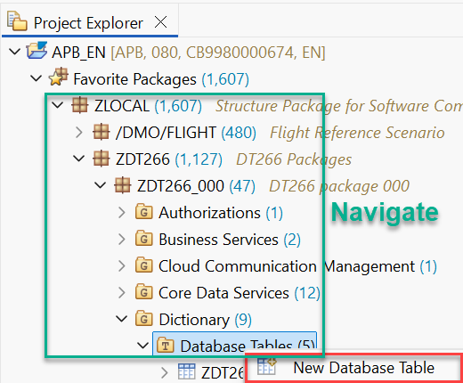</kbd> <br>
      Or right-click on your ABAP package **`ZDT266_###`** and select `New` > `Other ABAP Repository Object` from the context menu. 
      <kbd>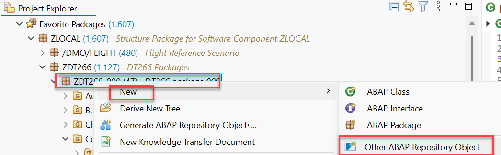</kbd> <br>
      Search for `database table`, select it, and click `Next >`. <br>
     <kbd>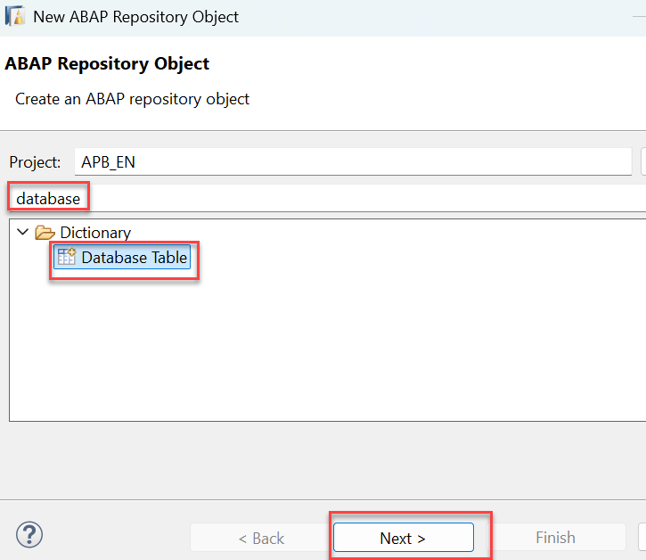</kbd> <br>      
      Maintain the required information (### is your group ID) and click `Next >`. <br>
      <br/><kbd>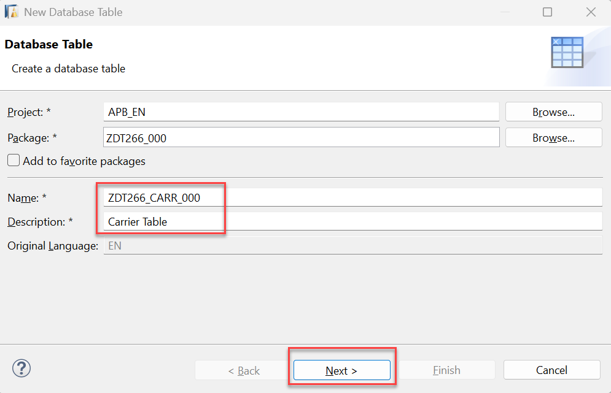</kbd> <br>
      <br>Enter the following values
      
      - Name: **`ZDT266_CARR_000`** 
      - Description: **`Carrier Table`**
  
  
      
      Then delete the complete template in new table **`ZDT266_CARR_000`**, insert the code snippet provided below (🟡📄).
  
  
      <details>
       <summary>🟡📄Click to expand and replace the source code!</summary>
  
       > - 💡 Make use of the _Copy Raw Content_ () function to copy the provided code snippet.
  
  
  

         @EndUserText.label : 'Carrier in Fligth Model'
         @AbapCatalog.enhancement.category : #NOT_EXTENSIBLE
         @AbapCatalog.tableCategory : #TRANSPARENT
         @AbapCatalog.deliveryClass : #A
         @AbapCatalog.dataMaintenance : #RESTRICTED
         define table zdt266_carr_000 {

         key client            : abap.clnt not null;
         key carrier_id        : /dmo/carrier_id not null;
         name                  : /dmo/carrier_name;
         currency_code         : /dmo/currency_code;
         local_created_by      : abp_creation_user;
         local_created_at      : abp_creation_tstmpl;
         local_last_changed_by : abp_locinst_lastchange_user;
         local_last_changed_at : abp_locinst_lastchange_tstmpl;
         last_changed_at       : abp_lastchange_tstmpl;

         }
  

  
  
      </details>
  
      Activate the table by pressing **`Ctrl+F3`** or by clicking on the match icon 
  
  
   2. Fill the database table **`ZDT266_CARR_000`** by the class **`zcl_dt266_gen_carr_000`**:
  
      Navigate in your package **`ZDT266_000`** to `Favorite Packages` >  `ZLOCAL` > `ZDT266` > `ZDT266_###` > `Source Code Library` > `Classes` and right-click on `Classes` and select **`New ABAP Class`**: <br>
      <kbd>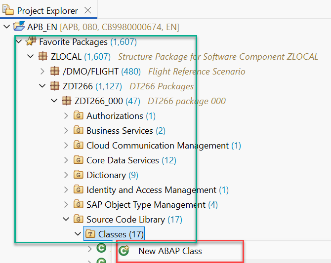</kbd>
      Or right-click on your ABAP package **`ZDT266_###`** and select `New` > `ABAP Class` from the context menu. 
      <br/><kbd>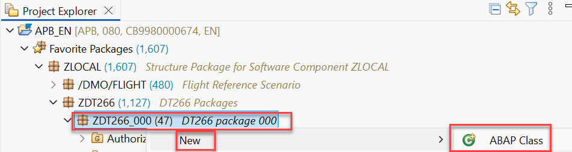</kbd> <br>
      
      And in the pop-up: <br/><kbd>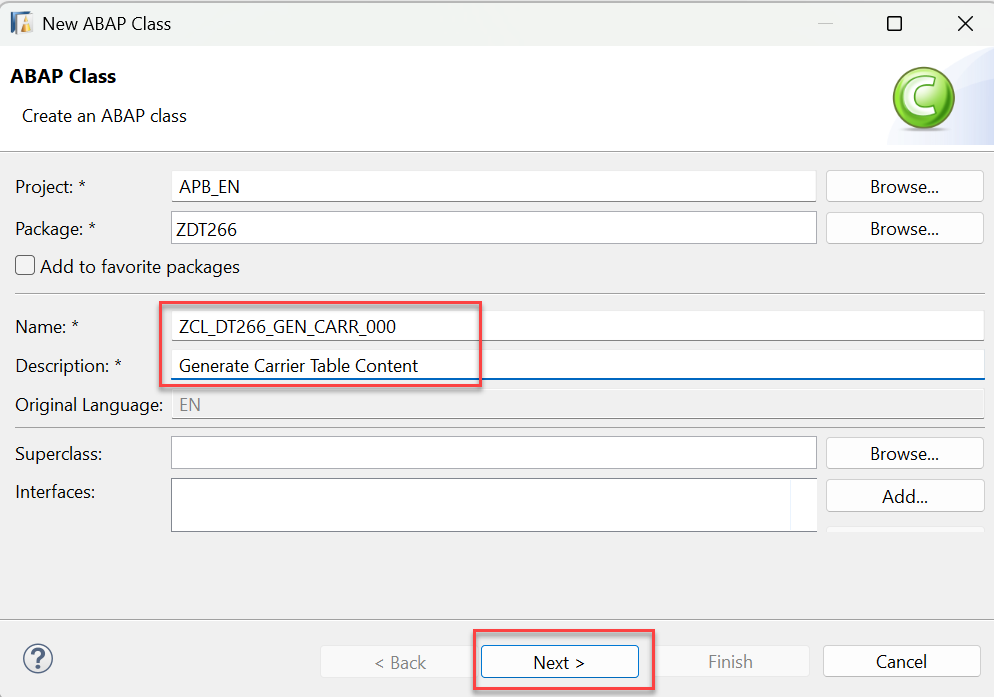</kbd> <br>

      <br>Enter the following values
      
      - Name: **`ZCL_DT266_GEN_CARR_000`** 
      - Description: **`Generate Carrier Table Content`**
  
      Delete the complete template in new class **`ZCL_DT266_GEN_CARR_000`**, insert the code snippet provided below (🟡📄).
      and replace all the source code there with:
  
      <details>
       <summary>🟡📄Click to expand and replace the source code!</summary>
  
        > - 💡 Make use of the _Copy Raw Content_ () function to copy the provided code snippet.
  

   
           CLASS zcl_dt266_gen_carr_000 DEFINITION
           PUBLIC
            FINAL
            CREATE PUBLIC .

           PUBLIC SECTION.

             INTERFACES if_oo_adt_classrun.
            PROTECTED SECTION.
            PRIVATE SECTION.
            ENDCLASS.


            CLASS ZCL_DT266_GEN_CARR_000 IMPLEMENTATION.


            METHOD if_oo_adt_classrun~main.
               DATA:
                  group_id   TYPE string VALUE '000',
                  table_name TYPE tabname,
                  i          TYPE i.


               i = 0.
               DO 1 TIMES.
               group_id = i.

               table_name = |zdt266_carr_00{ group_id }|.


                  DELETE FROM (table_name).

                  "insert travel demo data
                  INSERT (table_name)  FROM (
                     SELECT
                        FROM /dmo/carrier AS carr
                        FIELDS
                        carr~carrier_id AS carrier_id,
                        carr~name AS name,
                        carr~currency_code AS currency_code,
                        carr~local_created_by  AS local_created_by,
                        carr~local_created_at        AS local_created_at,
                        carr~local_last_changed_by    AS local_last_changed_by,
                        carr~local_last_changed_at    AS local_last_changed_at,
                        carr~last_changed_at   AS last_changed_at
                  ).
                  COMMIT WORK.
                  out->write( |[DT266] Demo data generated for table ZDT266_CARR_00{ group_id }. | ).

                  i = i + 1.
               ENDDO.
            ENDMETHOD.
            ENDCLASS.


  
      </details>
  
      💡 Activate the class by pressing **`Ctrl+F3`** or by clicking on the match icon 
      <br>
      Run the class once by pressing **`F9`** or click on 
        <kbd>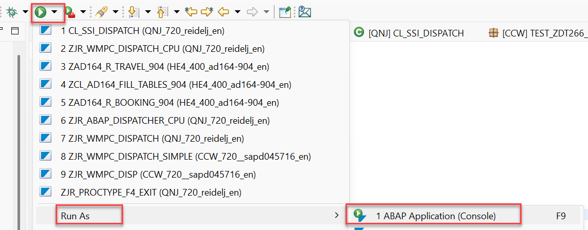</kbd>

  3. **Generate the transactional UI Service**:
      - Right-click your database table **`ZDT266_CARR_000`** and select **`Generate ABAP Repository Objects`** from the context menu. <br>
        <kbd></kbd>
      - Maintain the required information (### is your group ID) and click Next >:
         - Description: Travel App ###
         - Generator: ABAP RESTful Application Programming Model: UI Service


</details>   

-->


 
## Summary & First Exercise

Now that you have made yourself familiar on how to logon and access your package you can continue to - [Exercise 1](../ex01/README.md)


