[Home - DT266](/README.md#exercises)

# Exercise 1: Analyze Errors with the Feed Reader

## Introduction

In the previous Getting Started Section you've made yourself familiar with the data model and the ABAP code (see [Getting Started](../ex0/README.md)). 

In this exercise we focus on error analysis of runtime errors due to an exception thrown during the processing for specific input data.  Here a specific case is not handled correctly in a single line of ABAP code. You learn to use the `FEED_READER` for error analysis. We will do a further deep dive in the error analyis using the `ABAP Debugger`. 
Finally we solve the issue by a small change of ABAP code.

> [!NOTE]
> For this use **`ZDT266_###`** , where **`###`** is your suffix.  

### Exercises

- [1.1 - Runtime Error Analysis with the Feed Reader](#exercise-11-runtime-error-analysis-with-the-feed-reader)

### Summary:  
- [Summary & Next Exercise](#summary--next-exercise)  

### Exercises

## Exercise 1.1: Runtime Error Analysis with the Feed Reader
[^Top of page](#)

---

> **In this exercise we have 3 steps:** 
> 1. Perform the step for two different Airline IDs ('AA' and 'AC'), where we get a runtime error for one of them.
> 2. Call the Feed Reader and analyze the error.
> 3. Correct the error.

> [!NOTE]
> **Runtime error for selecting all and for selecting some specific Airlines:**    
> If you click on **`Go`** without specification of any Airline or e.g. choose Airline ID = 'AC' you get a runtime error. 
> This error is analyzed and fixed in this exercise.

 

  
🔵 Click to expand!

   1. Call and execute the Fiori App:

      | Call of the Fiori App | Details |
      |---|---|
      | 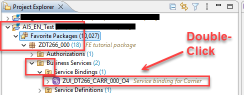| Navigate to `APB_EN` > `Favorite Packages` > `ZLOCAL` > `ZDT266` > `ZDT266_`**`###`**   (**`###`** should be replaced by your suffix)   > `Business Services` > **`Service Bindings`**.     Double-click on **`ZUI_DT266_CARR_###_O4`**.  |
      | 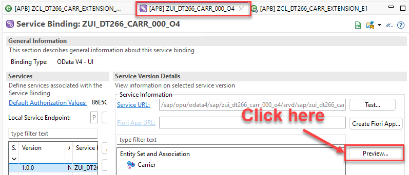 | In the new screen click on **`Preview...`**|

      - Run the Fiori App first for **Airline ID = 'AA'** by entering the ID and clicking on **`Go`** where you get a reponse:

        <table>
            <tr>
                <td>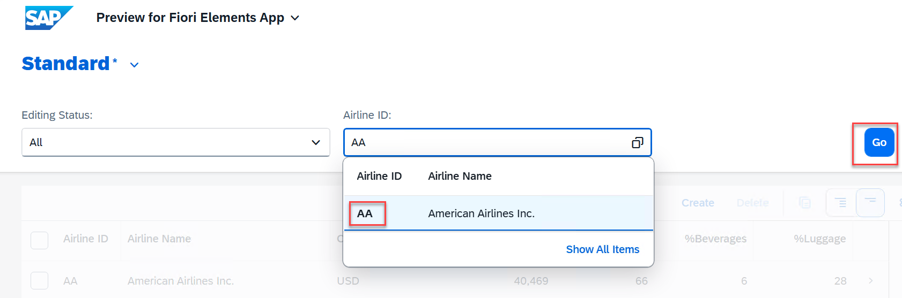</td>
                <td>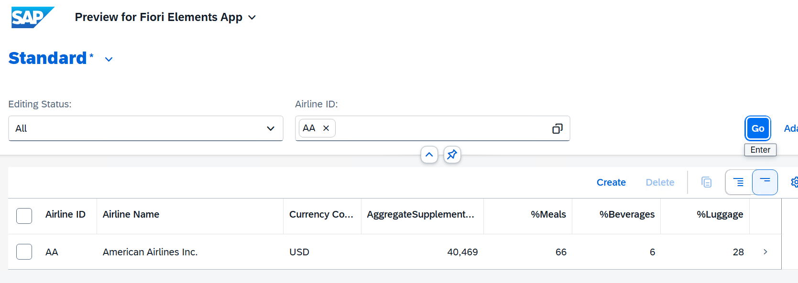</td>
            </tr>
        </table>
      
      - Run the Fiori App now for  **Airline ID = 'AC'**. This time we run into an **ABAP Runtime error**:

        <table>
            <tr>
                <td>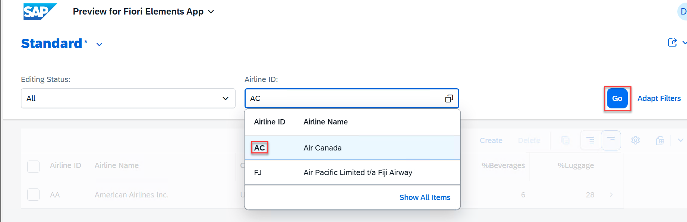</td>
                <td>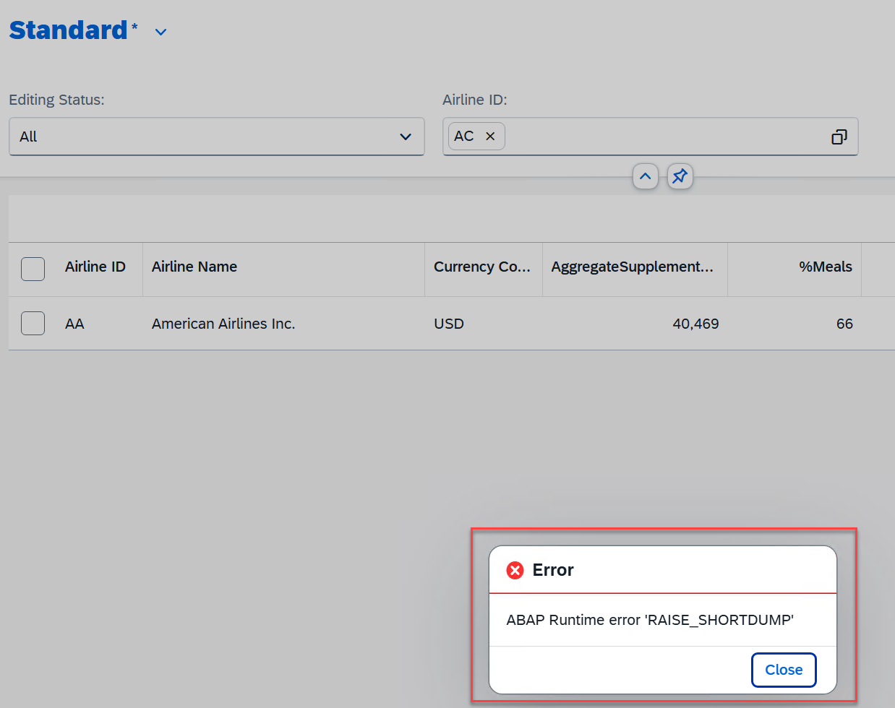</td>
            </tr>
        </table>
 
      -----

   2. Open the **`Feed Reader`** in the ABAP Development Tools (ADT).  
      
      - By clicking on the search button in the upper right corner (or by pressing **`CTRL+3`** in ADT) open the Quick Access and search for `Feed Reader`:

        <table>
            <tr>
                <td>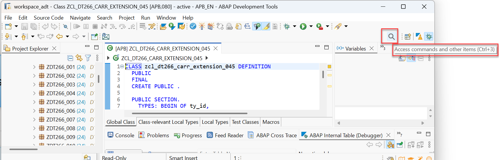</td>
                <td>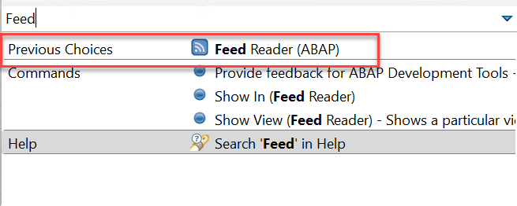</td>
            </tr>
        </table>

        ---

        🟠 _**REMARK:**_ For a **list of shortcuts** (like **`CTRL+3`**) refer to [``Keyboard Shortcuts for ABAP Development``](https://help.sap.com/docs/ABAP_PLATFORM_NEW/c238d694b825421f940829321ffa326a/4ec299d16e391014adc9fffe4e204223.html) and [``Useful Keyboard Shortcuts for ABAP in Eclipse``](https://community.sap.com/t5/application-development-and-automation-blog-posts/useful-keyboard-shortcuts-for-abap-in-eclipse/ba-p/13072397).
      
        ---
        
      - In the new tab `Feed Reader` expand the results for your project. The errors are displayed in the section **`Runtime Errors caused by me`**:

        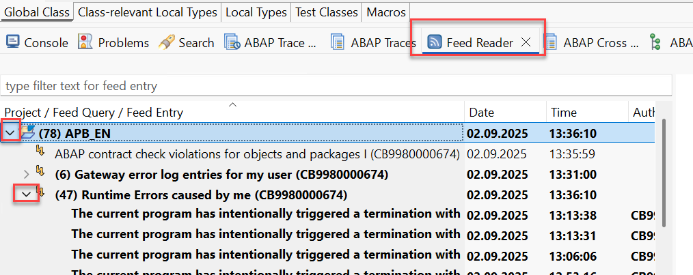

        - As there is no automatic refresh mark the row **`Runtime Errors caused by me`** and perform a refresh, either via right click or by pressing of **`F5`**:
      
           

      - Click on your new error in the list. The corresponding dump with the details of the runtime error is then shown on the right side:

        <kbd>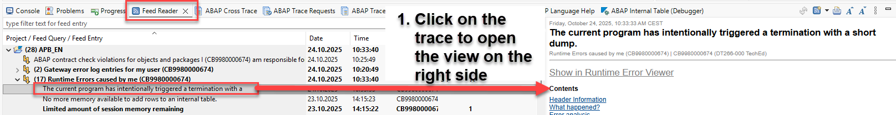</kbd> 

      - By click on the right side on **`Show in Runtime Error Viewer`** a separate view opens on the top of the ADT in Eclipse:

        <kbd>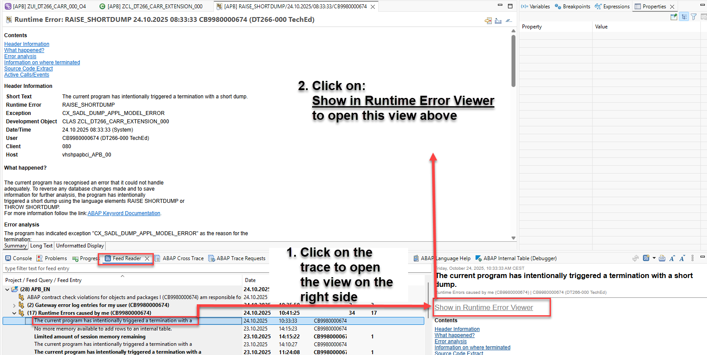</kbd>

      -----
   3. Analyze the error with the Feed Reader:
   
      - Click on  **`Error Analysis`**. There the root cause is shown as **Devision by zero**:

        <table>
            <tr>
                <td>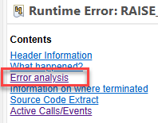</td>
                <td>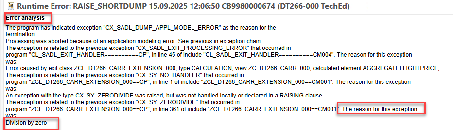</td>
            </tr>
        </table>

        🟠 _**REMARK:**_ It is important to read the whole error analysis as when the error is captured by a framework first the framework output is shown and (_as here_) at the end finally the error in our custom extension class is provided.

      - Click on **`Active Call/Events`** to get to the call stack in which the dump was written:

        <table>
            <tr>
                <td></td>
                <td>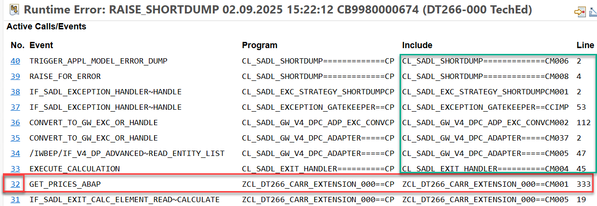</td>
            </tr>
        </table>  

        The call stack in the figure above shows 
        - that the dump is finally written by the **`SADL framework`** in class `CL_SADL_SHORTDUMP` and 
        - that this dump creation is triggered by an exception in the method `GET_PRICES_ABAP` of class `ZCL_DT266_CARR_EXTENSION_###`.  
        
        🟠 _**REMARK:**_ It is usually important to focus on the first coding from an API or application code and not to focus on the framework exception handling (_here:_ the SADL framework in class `CL_SADL_...`)
      

      - Click on the **`32`** (_hightlighted in blue in the left column **`No.`**_):

        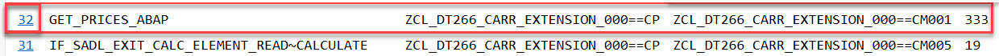 
      
        to navigate to the source code where the exception was raised (sometimes one has to click two times):

        <kbd>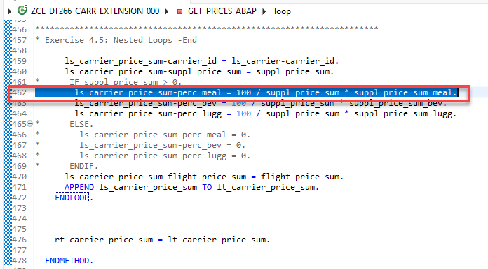 </kbd>
      -----

   4. Anaylze the Error in the **`Debugger`**: 
      - Set a breakpoint where the exception was raised:

        <kbd>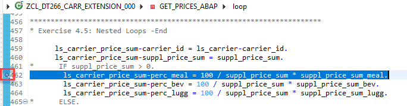</kbd> 

      - Run again the step for **Airline ID = 'AC'**:
      
        - Due to the breakpoint the processing stops there and the debugger opens, 

        - Confirm the perspective switch by pressing Switch in the appearing dialog if needed,
          <kbd></kbd> 
      
        - Hover the mouse over **`suppl_price_sum`**, then its value is shown. It is zero, so the Divsor is zero:
      
            <kbd>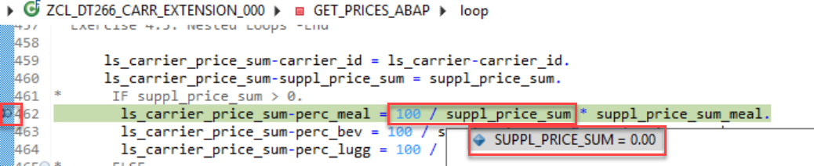</kbd>    

        - Hovering the mouse over **`lt_connection`** in line 143 shows that the list of connections for this Airline ID has **0 rows**. 

          <kbd>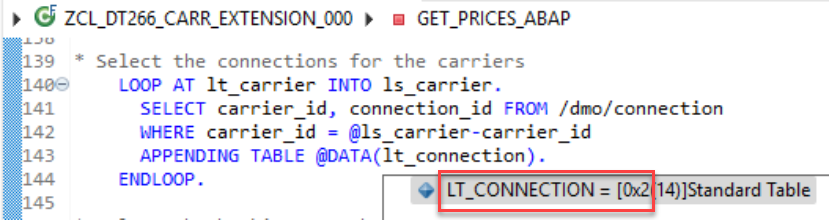</kbd> 
      
      > **Finding:** For this Airline ID (Carrier_ID) = 'AC' there are no connections
      and accordingly no bookings and no supplements.

      -----

   5. Press `F8` to resume the call in ADT and correct the ABAP Code:

      Switch back to the `ABAP perspective` via the Quick Access ().   

      Correct the ABAP code to handle the case that we have no supplements for some Airline ID (Carrier ID) and accordingly no total price for the supplements. 
      
      In this case we want to set the percentages ``perc_*`` for all the categories ``meal, bev, lugg`` to zero. 
      
      For this change remove the comments by marking the lines with **`*`** in about line 459 to 469 and press **`Ctrl+>`**:
      
       <table>
       <tr>
           <td>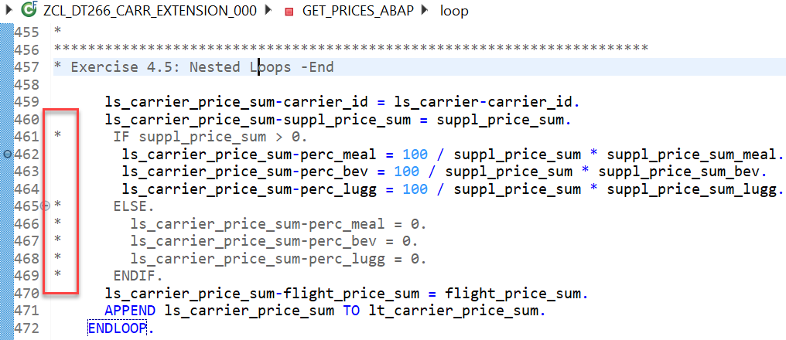</td>
           <td>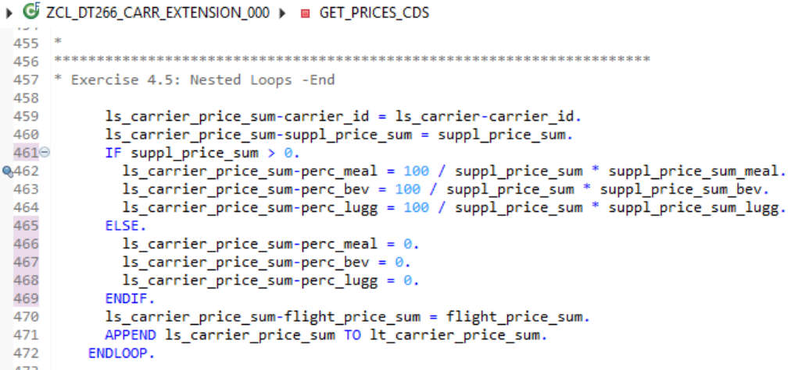</td>
       </tr>
      </table>  

      so we have the following coding:

      <kbd></kbd> 

      -----
   6. Activate the ABAP Code by pressing **`Ctrl+F3`** or by clicking on the match icon .

      And delete the breakpoint from the source code.

      -----

   7. Now you can repeat the call of the Fiori App for **Airline ID = 'AC'** and should get a result where all is empty:

      <table>
       <tr>
           <td></td>
           <td>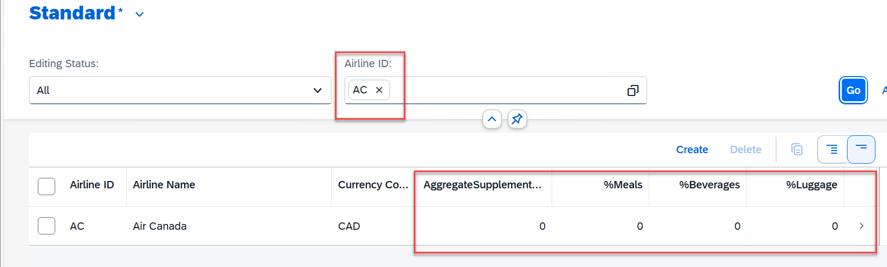</td>
       </tr>
      </table>

 ## Summary & Next Exercise
 [^Top of page](#)
 
 Now that you've...
 
 - used the _FEED READER_ for error analysis,

 - used the Debugger and Breakpoints to analyze the content of the session variables.

 Congratulations! 🎉
 
 In this hands-on exercise group, you have hopefully have some more insights into error analysis capabilities such as analyzing Runtime Error dumps!
 
 Thank you for stopping by!
 
 You can now ...
 - continue with the next exercise ► **[Exercise 2: Memory Inspector](../ex02/README.md)**   
 - or return to ► **[Home - DT266](/README.md#exercises)**.
 
 ## License
 
 Copyright (c) 2024 SAP SE or an SAP affiliate company. All rights reserved. This project is licensed under the Apache Software License, version 2.0 except as noted otherwise in the [LICENSE](LICENSES/Apache-2.0.txt) file.
