[Home - DT266](/README.md#exercises)

# Exercise 1: Analyze Errors with the Feed Reader

## Introduction

In the previous sections you've made yourself familiar with the data model and the ABAP code (see [Getting Started](../ex0/README.md)). 

In this exercise we focus on error analysis of runtime errors due to an exception thrown during the processing for specific input data.  Here a specific case is not handled correctly in a single line of ABAP code. You learn to use the `FEED_READER` for error analysis. We will do a further deep dive in the error analyis using the `ABAP Debugger`. 
Finally we solve the issue by a small change of ABAP code.

> [!NOTE]
> For this use **`ZDT266_###`** , where **`###`** is your suffix.  

> [!IMPORTANT]    
> Prerequisite for this exercise is that you implement **the code snippet** in class **`ZCL_DT266_CARR_EXTENSION_###`** as outlined in point 9 of [Getting Started](../ex0/README.md).
>  
> **If you have not already implemented the code snippet in point 9 of [Getting Started](../ex0/README.md) please implement the code snippet which is provided below:** 
> - Delete the complete current source code in the class **`ZCL_DT266_CARR_EXTENSION_###`**, 
> - insert the code snippet provided below (🟡📄), 
> - and replace all occurrences of the placeholder **`###`** with your personal suffix using the ADT function _**Replace All**_ (_**Ctrl+F**_).
     
   

     
🟡📄Click to expand and replace the source code!

   > - 💡 Make use of the _Copy Raw Content_ () function to copy the provided code snippet.
   > - 💡 Replace all occurrences of the placeholder **`###`** with your personal suffix using the ADT function _**Replace All**_ (_**Ctrl+F**_).

      CLASS zcl_dt266_carr_extension_### DEFINITION
      PUBLIC
      FINAL
      CREATE PUBLIC .

      PUBLIC SECTION.
        TYPES: BEGIN OF ty_id,
                id TYPE int4,
              END OF ty_id.
        TYPES: BEGIN OF ty_carrier,
                carrier_id TYPE /dmo/carrier_id,
              END OF ty_carrier.
        TYPES: BEGIN OF ty_connection,
                carrier_id    TYPE /dmo/carrier_id,
                connection_id TYPE /dmo/connection_id,
              END OF ty_connection.
        TYPES: BEGIN OF ty_booking,
                travel_id     TYPE /dmo/travel_id,
                booking_id    TYPE /dmo/booking_id,
                carrier_id    TYPE /dmo/carrier_id,
                connection_id TYPE /dmo/connection_id,
                flight_price  TYPE /dmo/flight_price,
              END OF ty_booking.
        TYPES: BEGIN OF ty_book_suppl,
                travel_id             TYPE /dmo/travel_id,
                booking_id            TYPE /dmo/booking_id,
    "Exercise 4.4: Correction for FOR ALL ENTRIES SELECT -START
    **********************************************************************
    *             booking_supplement_id TYPE /dmo/booking_supplement_id,
    "Exercise 4.4: Correction for FOR ALL ENTRIES SELECT -END
    **********************************************************************            
                supplement_id         TYPE /dmo/supplement_id,
                price                 TYPE /dmo/supplement_price,
              END OF ty_book_suppl.
        TYPES: BEGIN OF ty_supplement,
                supplement_id       TYPE /dmo/supplement_id,
                id                  TYPE int4,
                supplement_category TYPE /dmo/supplement_category,
                price               TYPE /dmo/supplement_price,
              END OF ty_supplement.
        TYPES: BEGIN OF ty_cds_result_suppl,
                carrier_id           TYPE /dmo/carrier_id,
                suppl_price_sum      TYPE /dmo/supplement_price,
                suppl_price_sum_bev  TYPE /dmo/supplement_price,
                suppl_price_sum_meal TYPE /dmo/supplement_price,
                suppl_price_sum_lugg TYPE /dmo/supplement_price,
              END OF ty_cds_result_suppl.
        TYPES: BEGIN OF ty_cds_result_flight,
                carrier_id       TYPE /dmo/carrier_id,
                flight_price_sum TYPE /dmo/supplement_price,
              END OF ty_cds_result_flight.
        TYPES: BEGIN OF ty_carrier_price_sum,
                carrier_id       TYPE /dmo/carrier_id,
                suppl_price_sum  TYPE /dmo/supplement_price,
                perc_meal        TYPE int4,
                perc_bev         TYPE int4,
                perc_lugg        TYPE int4,
                flight_price_sum TYPE /dmo/supplement_price,
              END OF ty_carrier_price_sum.
        TYPES: tt_carrier_price_sum TYPE STANDARD TABLE OF ty_carrier_price_sum WITH DEFAULT KEY.
        TYPES: tt_carrier_id TYPE STANDARD TABLE OF ty_carrier WITH DEFAULT KEY.
        TYPES: tt_id TYPE STANDARD TABLE OF ty_id WITH DEFAULT KEY.
        TYPES: tt_supplement TYPE STANDARD TABLE OF ty_supplement WITH DEFAULT KEY.

        INTERFACES:
          if_oo_adt_classrun,
          if_sadl_exit_calc_element_read.
      PROTECTED SECTION.
      PRIVATE SECTION.
        METHODS get_prices_ABAP IMPORTING  lt_carrier                  TYPE tt_carrier_id
                                RETURNING
                                          VALUE(rt_carrier_price_sum) TYPE tt_carrier_price_sum
                                EXCEPTIONS zero_devide.
        METHODS get_supplements_ABAP IMPORTING supplement_category TYPE  /dmo/supplement_category
                                    CHANGING
                                              lt_supplement       TYPE tt_supplement
                                              lt_id               TYPE tt_id.
        METHODS get_prices_CDS IMPORTING lt_carrier                  TYPE tt_carrier_id
                              RETURNING
                                        VALUE(rt_carrier_price_sum) TYPE tt_carrier_price_sum.
    ENDCLASS.

    CLASS ZCL_DT266_CARR_EXTENSION_### IMPLEMENTATION.

      METHOD if_oo_adt_classrun~main.

    *    out->write( |[DT266] Run finished for ZCL_DT266_LOOP1_{ group_id }. | ).
      ENDMETHOD.

      METHOD get_supplements_ABAP.
        SELECT supplement_id,id, supplement_category, price FROM zdt266_sup_i_###
            FOR ALL ENTRIES IN @lt_id
            WHERE supplement_category = @supplement_category AND id = @lt_id-id
      APPENDING TABLE @lt_supplement.
      ENDMETHOD.

      METHOD get_prices_ABAP.

        DATA:
          group_id              TYPE string VALUE '###',
          id                    TYPE int4,
          ls_id                 TYPE ty_id,
          lt_id                 TYPE STANDARD TABLE OF ty_id,
          ls_carrier            TYPE ty_carrier,
          ls_connection         TYPE ty_connection,
          ls_booking            TYPE ty_booking,
          ls_book_suppl         TYPE ty_book_suppl,
          ls_supplement         TYPE ty_supplement,
          ls_supplement2        TYPE ty_supplement,
          ls_carrier_price_sum  TYPE ty_carrier_price_sum,
          suppl_price_sum       TYPE /dmo/supplement_price,
          suppl_price_sum_meal  TYPE /dmo/supplement_price,
          suppl_price_sum_bev   TYPE /dmo/supplement_price,
          suppl_price_sum_lugg  TYPE /dmo/supplement_price,
          flight_price_sum      TYPE /dmo/supplement_price,
          l_tabix_1             TYPE sy-tabix,
          l_tabix_2             TYPE sy-tabix,
          lt_booking_sort       TYPE SORTED TABLE OF ty_booking WITH NON-UNIQUE KEY primary_key  COMPONENTS carrier_id,
          lt_book_suppl_sort    TYPE SORTED TABLE OF ty_book_suppl WITH NON-UNIQUE KEY primary_key  COMPONENTS travel_id booking_id, supplement_id,booking_supplement_id,
          lt_supplement_sort    TYPE SORTED TABLE OF ty_supplement WITH NON-UNIQUE KEY primary_key COMPONENTS supplement_id id,
          lt_supplement_sort2   TYPE SORTED TABLE OF ty_supplement WITH NON-UNIQUE KEY primary_key COMPONENTS supplement_category
          WITH NON-UNIQUE SORTED KEY key_id_cat COMPONENTS supplement_id id,
          lt_supplement         TYPE STANDARD TABLE OF ty_supplement
          WITH NON-UNIQUE SORTED KEY key_id_cat COMPONENTS supplement_id id,
          lt_supplement2        TYPE STANDARD TABLE OF ty_supplement,
          lt_supplement3        TYPE STANDARD TABLE OF ty_supplement,
          lt_carrier_price_sum  TYPE STANDARD TABLE OF ty_carrier_price_sum,
          table_supplement      TYPE tabname,
          oref                  TYPE REF TO cx_root,
          text                  TYPE string.

        table_supplement = |zdt266_sup_i_{ group_id }|.

    " Select the connections for the carriers
        LOOP AT lt_carrier INTO ls_carrier.
          SELECT carrier_id, connection_id FROM /dmo/connection
          WHERE carrier_id = @ls_carrier-carrier_id
          APPENDING TABLE @DATA(lt_connection).
        ENDLOOP.

    " Select the bookings on those connections related to the different carriers
        LOOP AT lt_connection INTO ls_connection.
          SELECT travel_id, booking_id, carrier_id, connection_id, flight_price
          FROM /dmo/booking
          WHERE carrier_id = @ls_connection-carrier_id
          AND connection_id = @ls_connection-connection_id
          APPENDING TABLE @DATA(lt_booking).
        ENDLOOP.

    " Sorted tables
        lt_booking_sort = lt_booking.

    " Exercise 4.4: Compare with FAE -START
    **********************************************************************
    " Get the Supplements (like beverages, meals, luggages) additionally booked.
        LOOP AT lt_booking INTO ls_booking.
          SELECT  travel_id, booking_id, supplement_id, price FROM /dmo/book_suppl
          WHERE travel_id = @ls_booking-travel_id
          AND booking_id = @ls_booking-booking_id
          APPENDING TABLE @DATA(lt_book_suppl).
        ENDLOOP.

    *    SELECT  travel_id, booking_id, supplement_id, price FROM /dmo/book_suppl
    *    FOR ALL ENTRIES IN @lt_booking
    *    WHERE travel_id = @lt_booking-travel_id
    *    AND booking_id = @lt_booking-booking_id
    *    APPENDING TABLE @DATA(lt_book_suppl).
    **********************************************************************
    " Exercise 4.4: Compare with FAE -END

    " Exercise 4.4: Table Comparison Tool -START
    **********************************************************************
    *    LOOP AT lt_booking INTO ls_booking.
    *      SELECT  * FROM /dmo/book_suppl
    *      WHERE travel_id = @ls_booking-travel_id
    *      AND booking_id = @ls_booking-booking_id
    *      APPENDING TABLE @DATA(lt_book_suppl3).
    *    ENDLOOP.
    *    SORT lt_book_suppl BY travel_id booking_id supplement_id price.
    *    SORT lt_book_suppl2 BY travel_id booking_id supplement_id price.
    *    SORT lt_book_suppl3 BY travel_id booking_id supplement_id price.
    **********************************************************************
    " Exercise 4.4: Table Comparison Tool --END

    " Sorted tables
        lt_book_suppl_sort = lt_book_suppl.

    " Exercise 2.1: Memory Analysis -START
    **********************************************************************
    " Get all prices and categories
        SELECT supplement_id,id, supplement_category, price FROM zdt266_sup_i_###
        APPENDING TABLE @lt_supplement.
    
        SORT lt_supplement BY supplement_id id.
        DELETE ADJACENT DUPLICATES FROM lt_supplement COMPARING supplement_id id.

    " Get the prices and categories only for the booked supplements
    *    LOOP AT lt_book_suppl INTO ls_book_suppl.
    *      SELECT supplement_id,id, supplement_category, price FROM zdt266_sup_i_###
    *      WHERE supplement_id = @ls_book_suppl-supplement_id
    *      AND id = 1
    *      APPENDING TABLE @lt_supplement.
    *    ENDLOOP.

    " Get the prices for specific categories
    *    id = 1.
    *    WHILE id < 499.
    *      ls_id-id = id.
    *      APPEND ls_id TO LT_id.
    *      CALL METHOD get_supplements_ABAP
    *        EXPORTING
    *          supplement_category = 'LU'
    *        CHANGING
    *          lt_id               = lt_id
    *          lt_supplement       = lt_supplement2.
    *      id = id + 1.
    *      APPEND LINES OF lt_supplement2 TO lt_supplement.
    **      CLEAR lt_id.
    **      CLEAR lt_supplement2.
    *    ENDWHILE.
    *
    *
    *    id = 1.
    *    WHILE id < 499.
    *      ls_id-id = id.
    *      APPEND ls_id TO LT_id.
    *      CALL METHOD get_supplements_ABAP
    *        EXPORTING
    *          supplement_category = 'BV'
    *        CHANGING
    *          lt_id               = lt_id
    *          lt_supplement       = lt_supplement2.
    *      id = id + 1.
    *      APPEND LINES OF lt_supplement2 TO lt_supplement.
    **      CLEAR lt_id.
    **      CLEAR lt_supplement2.
    *    ENDWHILE.
    *
    *
    *    id = 1.
    *    WHILE id < 499.
    *      ls_id-id = id.
    *      APPEND ls_id TO LT_id.
    *      CALL METHOD get_supplements_ABAP
    *        EXPORTING
    *          supplement_category = 'ML'
    *        CHANGING
    *          lt_id               = lt_id
    *          lt_supplement       = lt_supplement2.
    *      id = id + 1.
    *      APPEND LINES OF lt_supplement2 TO lt_supplement.
    **      CLEAR lt_id.
    **      CLEAR lt_supplement2.
    *    ENDWHILE.

    " Sorted tables
    *    lt_supplement_sort = lt_supplement.
    **********************************************************************
    " Exercise 2.1: Memory Analysis -End

    " Sorting tables for using BINARY SEARCH before the first LOOP starts.
        SORT lt_supplement BY supplement_id id.
    *    SORT lt_book_suppl BY travel_id booking_id supplement_id.
    *    SORT lt_booking BY carrier_id.

        LOOP AT lt_carrier INTO ls_carrier.
          suppl_price_sum = 0.
          suppl_price_sum_meal = 0.
          suppl_price_sum_bev = 0.
          suppl_price_sum_lugg = 0.
          flight_price_sum = 0.

    "*" Exercise 4.3: READ TABLE -START
    **********************************************************************
          LOOP AT lt_booking_sort INTO ls_booking WHERE carrier_id = ls_carrier-carrier_id.
            LOOP AT lt_book_suppl_sort INTO ls_book_suppl
            WHERE travel_id = ls_booking-travel_id AND booking_id = ls_booking-booking_id.
              READ TABLE lt_supplement INTO ls_supplement
              WHERE supplement_id = ls_book_suppl-supplement_id AND id = 1.
    *          WITH KEY key_id_cat COMPONENTS supplement_id = ls_book_suppl-supplement_id  id = 1.
    *
    "// Option 1: Consider to sort the table lt_supplement before the LOOP AT by the key fields for which we access the table and use BINARY SEARCH:
    *            READ TABLE lt_supplement INTO ls_supplement
    *            WITH KEY  supplement_id = ls_book_suppl-supplement_id  id = 1 BINARY SEARCH.
    *
    "// Option 2: READ TABLE is fast when we have an as SORTED defined table where the primary key fits to the key of the WHERE Clause
    "//           lt_supplement_sort TYPE SORTED TABLE OF ty_supplement WITH NON-UNIQUE KEY primary_key COMPONENTS supplement_id id,
    *         READ TABLE lt_supplement_sort INTO ls_supplement
    *            WHERE supplement_id = ls_book_suppl-supplement_id AND id = 1.
    **
    "// Option 3: In case the table is already defined as sorted table which does not fit to the key access we have here (supplement_id & id)
    "//           one can add ad in the definition a further SORTED KEY which fits:
    "//          lt_supplement_sort2   TYPE SORTED TABLE OF ty_supplement WITH NON-UNIQUE KEY primary_key COMPONENTS supplement_category
    "//      WITH NON-UNIQUE SORTED KEY key_id_cat COMPONENTS supplement_id id,
    *            READ TABLE lt_supplement_sort2 INTO ls_supplement
    *                 WITH KEY key_id_cat COMPONENTS supplement_id = ls_book_suppl-supplement_id  id = 1.

              suppl_price_sum = suppl_price_sum + ls_supplement-price.
              CASE ls_supplement-supplement_category.
                WHEN 'ML'.
                  suppl_price_sum_meal = suppl_price_sum_meal + ls_supplement-price.
                WHEN 'BV'.
                  suppl_price_sum_bev = suppl_price_sum_bev + ls_supplement-price.
                WHEN 'LU'.
                  suppl_price_sum_lugg = suppl_price_sum_lugg + ls_supplement-price.
              ENDCASE.
            ENDLOOP.
            flight_price_sum = flight_price_sum + ls_booking-flight_price.
          ENDLOOP.
    **********************************************************************
    " Exercise 4.3: READ TABLE -End

    " Exercise 4.5: Nested Loops -START
    **********************************************************************
    *      suppl_price_sum = 0.
    *      suppl_price_sum_meal = 0.
    *      suppl_price_sum_bev = 0.
    *      suppl_price_sum_lugg = 0.
    *      flight_price_sum = 0.
    *      LOOP AT lt_booking INTO ls_booking WHERE carrier_id = ls_carrier-carrier_id.
    *        LOOP AT lt_book_suppl INTO ls_book_suppl
    *        WHERE travel_id = ls_booking-travel_id AND booking_id = ls_booking-booking_id.
    *          LOOP AT lt_supplement INTO ls_supplement
    *            WHERE supplement_id = ls_book_suppl-supplement_id AND id = 1.
    *            suppl_price_sum = suppl_price_sum + ls_supplement-price.
    *            CASE ls_supplement-supplement_category.
    *              WHEN 'ML'.
    *                suppl_price_sum_meal = suppl_price_sum_meal + ls_supplement-price.
    *              WHEN 'BV'.
    *                suppl_price_sum_bev = suppl_price_sum_bev + ls_supplement-price.
    *              WHEN 'LU'.
    *                suppl_price_sum_lugg = suppl_price_sum_lugg + ls_supplement-price.
    *            ENDCASE.
    *            EXIT.
    *          ENDLOOP.
    *        ENDLOOP.
    *        flight_price_sum = flight_price_sum + ls_booking-flight_price.
    *      ENDLOOP.
    *
    *
    *      suppl_price_sum = 0.
    *      suppl_price_sum_meal = 0.
    *      suppl_price_sum_bev = 0.
    *      suppl_price_sum_lugg = 0.
    *      flight_price_sum = 0.
    *      LOOP AT lt_booking_sort INTO ls_booking WHERE carrier_id = ls_carrier-carrier_id.
    *        LOOP AT lt_book_suppl_sort INTO ls_book_suppl
    *        WHERE travel_id = ls_booking-travel_id AND booking_id = ls_booking-booking_id.
    *            LOOP AT lt_supplement_sort INTO ls_supplement
    *            WHERE supplement_id = ls_book_suppl-supplement_id and id = 1.
    *            suppl_price_sum = suppl_price_sum + ls_supplement-price.
    *            CASE ls_supplement-supplement_category.
    *              WHEN 'ML'.
    *                suppl_price_sum_meal = suppl_price_sum_meal + ls_supplement-price.
    *              WHEN 'BV'.
    *                suppl_price_sum_bev = suppl_price_sum_bev + ls_supplement-price.
    *              WHEN 'LU'.
    *                suppl_price_sum_lugg = suppl_price_sum_lugg + ls_supplement-price.
    *            ENDCASE.
    *            EXIT.
    *            ENDLOOP.
    *        ENDLOOP.
    *        flight_price_sum = flight_price_sum + ls_booking-flight_price.
    *      ENDLOOP.
    *
    *      suppl_price_sum = 0.
    *      suppl_price_sum_meal = 0.
    *      suppl_price_sum_bev = 0.
    *      suppl_price_sum_lugg = 0.
    *      flight_price_sum = 0.
    *      LOOP AT lt_booking_sort INTO ls_booking WHERE carrier_id = ls_carrier-carrier_id.
    *        LOOP AT lt_book_suppl_sort INTO ls_book_suppl
    *        WHERE travel_id = ls_booking-travel_id AND booking_id = ls_booking-booking_id.
    *            LOOP AT lt_supplement INTO ls_supplement
    *            USING KEY key_id_cat WHERE supplement_id = ls_book_suppl-supplement_id and id = 1.
    *            suppl_price_sum = suppl_price_sum + ls_supplement-price.
    *            CASE ls_supplement-supplement_category.
    *              WHEN 'ML'.
    *                suppl_price_sum_meal = suppl_price_sum_meal + ls_supplement-price.
    *              WHEN 'BV'.
    *                suppl_price_sum_bev = suppl_price_sum_bev + ls_supplement-price.
    *              WHEN 'LU'.
    *                suppl_price_sum_lugg = suppl_price_sum_lugg + ls_supplement-price.
    *            ENDCASE.
    *            EXIT.
    *            ENDLOOP.
    *        ENDLOOP.
    *        flight_price_sum = flight_price_sum + ls_booking-flight_price.
    *      ENDLOOP.
    *
    *
    *      suppl_price_sum = 0.
    *      suppl_price_sum_meal = 0.
    *      suppl_price_sum_bev = 0.
    *      suppl_price_sum_lugg = 0.
    *      flight_price_sum = 0.
    *      LOOP AT lt_booking_sort INTO ls_booking WHERE carrier_id = ls_carrier-carrier_id.
    *        READ TABLE lt_book_suppl_sort TRANSPORTING NO FIELDS
    *        WITH KEY travel_id = ls_booking-travel_id  booking_id = ls_booking-booking_id.
    *        l_tabix_1 = sy-tabix.
    *        LOOP AT lt_book_suppl_sort INTO ls_book_suppl FROM l_tabix_1.
    *          IF ls_book_suppl-travel_id = ls_booking-travel_id AND ls_book_suppl-booking_id = ls_booking-booking_id.
    *            READ TABLE lt_supplement TRANSPORTING NO FIELDS
    *            WITH KEY key_id_cat components supplement_id = ls_book_suppl-supplement_id  id = 1.
    *            l_tabix_2 = sy-tabix.
    *            LOOP AT lt_supplement INTO ls_supplement USING KEY key_id_cat FROM l_tabix_2.
    *              IF ls_supplement-supplement_id = ls_book_suppl-supplement_id AND ls_supplement-id = 1.
    *                suppl_price_sum = suppl_price_sum + ls_supplement-price.
    *                CASE ls_supplement-supplement_category.
    *                  WHEN 'ML'.
    *                    suppl_price_sum_meal = suppl_price_sum_meal + ls_supplement-price.
    *                  WHEN 'BV'.
    *                    suppl_price_sum_bev = suppl_price_sum_bev + ls_supplement-price.
    *                  WHEN 'LU'.
    *                    suppl_price_sum_lugg = suppl_price_sum_lugg + ls_supplement-price.
    *                ENDCASE.
    *                EXIT.
    *              ELSE.
    *                EXIT.
    *              ENDIF.
    *            ENDLOOP.
    *          ELSE.
    *            EXIT.
    *          ENDIF.
    *        ENDLOOP.
    *        flight_price_sum = flight_price_sum + ls_booking-flight_price.
    *      ENDLOOP.
    *
    *
    *
    **********************************************************************
    " Exercise 4.5: Nested Loops -End

          ls_carrier_price_sum-carrier_id = ls_carrier-carrier_id.
          ls_carrier_price_sum-suppl_price_sum = suppl_price_sum.
    *      IF suppl_price_sum > 0.
            ls_carrier_price_sum-perc_meal = 100 / suppl_price_sum * suppl_price_sum_meal.
            ls_carrier_price_sum-perc_bev = 100 / suppl_price_sum * suppl_price_sum_bev.
            ls_carrier_price_sum-perc_lugg = 100 / suppl_price_sum * suppl_price_sum_lugg.
    *      ELSE.
    *        ls_carrier_price_sum-perc_meal = 0.
    *        ls_carrier_price_sum-perc_bev = 0.
    *        ls_carrier_price_sum-perc_lugg = 0.
    *      ENDIF.
          ls_carrier_price_sum-flight_price_sum = flight_price_sum.
          APPEND ls_carrier_price_sum TO lt_carrier_price_sum.
        ENDLOOP.

        rt_carrier_price_sum = lt_carrier_price_sum.

      ENDMETHOD.

      METHOD get_prices_CDS.

        DATA:
          ls_carrier           TYPE ty_carrier,
          ls_cds_result_suppl  TYPE ty_cds_result_suppl,
          ls_cds_result_flight TYPE ty_cds_result_flight,
          ls_carrier_price_sum TYPE ty_carrier_price_sum,
          suppl_price_sum      TYPE /dmo/supplement_price,
          suppl_price_sum_meal TYPE /dmo/supplement_price,
          suppl_price_sum_bev  TYPE /dmo/supplement_price,
          suppl_price_sum_lugg TYPE /dmo/supplement_price,
          flight_price_sum     TYPE /dmo/supplement_price,
          group_id             TYPE string VALUE '###',
          lt_carrier_price_sum TYPE STANDARD TABLE OF ty_carrier_price_sum.

        SELECT
          carrierid,
          suppl_price_sum,
          suppl_price_sum_bev,
          suppl_price_sum_meal,
          suppl_price_sum_lugg
        FROM
          z_i_price_###
        FOR ALL ENTRIES IN @lt_carrier WHERE carrierid = @lt_carrier-carrier_id AND id = 2
        %_HINTS HDB 'NO_USE_HEX_PLAN'
        INTO TABLE @DATA(lt_cds_result_suppl).

        SELECT
          carrierid,
          flight_price_sum
        FROM
          z_i_price_flight
          FOR ALL ENTRIES IN @lt_carrier WHERE carrierid = @lt_carrier-carrier_id
        INTO TABLE @DATA(lt_cds_result_flight).

        SORT lt_cds_result_suppl BY carrierid.
        SORT LT_CDS_result_FLIGHT BY carrierid.

        LOOP AT lt_carrier INTO ls_carrier.
          ls_carrier_price_sum-carrier_id = ls_carrier-carrier_id.
          ls_carrier_price_sum-flight_price_sum = 0.
          ls_carrier_price_sum-suppl_price_sum = 0.
          ls_carrier_price_sum-perc_bev = 0.
          ls_carrier_price_sum-perc_meal = 0.
          ls_carrier_price_sum-perc_lugg = 0.

          READ TABLE lt_CDS_RESULT_SUPPL INTO ls_cds_result_suppl
          WITH KEY carrierid = ls_carrier-carrier_id BINARY SEARCH.
          IF sy-subrc = 0.
            ls_carrier_price_sum-suppl_price_sum = ls_cds_result_suppl-suppl_price_sum.
            IF ls_cds_result_suppl-suppl_price_sum > 0.
              ls_carrier_price_sum-perc_meal = 100 / ls_cds_result_suppl-suppl_price_sum * ls_cds_result_suppl-suppl_price_sum_meal.
              ls_carrier_price_sum-perc_bev = 100 / ls_cds_result_suppl-suppl_price_sum * ls_cds_result_suppl-suppl_price_sum_bev.
              ls_carrier_price_sum-perc_lugg = 100 / ls_cds_result_suppl-suppl_price_sum * ls_cds_result_suppl-suppl_price_sum_lugg.
            ELSE.
              ls_carrier_price_sum-perc_meal = 0.
              ls_carrier_price_sum-perc_bev = 0.
              ls_carrier_price_sum-perc_lugg = 0.
            ENDIF.
          ENDIF.
          READ TABLE lt_CDS_RESULT_FLIGHT INTO ls_cds_result_flight
          WITH KEY carrierid = ls_carrier-carrier_id BINARY SEARCH.
          IF sy-subrc = 0.
            ls_carrier_price_sum-flight_price_sum = ls_cds_result_flight-flight_price_sum.
          ENDIF.
          APPEND ls_carrier_price_sum TO lt_carrier_price_sum.
        ENDLOOP.

        rt_carrier_price_sum = lt_carrier_price_sum.

      ENDMETHOD.

      METHOD if_sadl_exit_calc_element_read~calculate.

        DATA:
          lt_carrier TYPE tt_carrier_id,
          ls_carrier TYPE ty_carrier.

        DATA lt_original_data TYPE STANDARD TABLE OF zc_dt266_carr_### WITH DEFAULT KEY.

        lt_original_data = CORRESPONDING #( it_original_data ).

        LOOP AT lt_original_data ASSIGNING FIELD-SYMBOL(<fs_original_data1>).
          ls_carrier-carrier_id = <fs_original_data1>-CarrierId.
          APPEND ls_carrier TO lt_carrier.
        ENDLOOP.

    * Exercise 5: CDS view Analysis -START
    **********************************************************************
        DATA(lt_carrier_price_sum) = get_prices_ABAP( lt_carrier = lt_carrier ).
    *    DATA(lt_carrier_price_sum) = get_prices_CDS( lt_carrier = lt_carrier ).
    **********************************************************************
    * Exercise 5: CDS view Analysis -End

        LOOP AT lt_original_data ASSIGNING FIELD-SYMBOL(<fs_original_data>).
          <fs_original_data>-AggregateSupplementPrice = lt_carrier_price_sum[ carrier_id = <fs_original_data>-CarrierID ]-suppl_price_sum.
          <fs_original_data>-PercMeal = lt_carrier_price_sum[ carrier_id = <fs_original_data>-CarrierID ]-perc_meal.
          <fs_original_data>-PercBeverages = lt_carrier_price_sum[ carrier_id = <fs_original_data>-CarrierID ]-perc_bev.
          <fs_original_data>-PercLuggage = lt_carrier_price_sum[ carrier_id = <fs_original_data>-CarrierID ]-perc_lugg.
          <fs_original_data>-AggregateFlightPrice = lt_carrier_price_sum[ carrier_id = <fs_original_data>-CarrierID ]-flight_price_sum.
        ENDLOOP.

        ct_calculated_data = CORRESPONDING #(  lt_original_data ).
      ENDMETHOD.

      METHOD if_sadl_exit_calc_element_read~get_calculation_info.
      ENDMETHOD.
    ENDCLASS.

   

   

> [!IMPORTANT]    
> Activate the ABAP Code by pressing **`Ctrl+F3`** or by clicking on the match icon .

### Exercises

- [1.1 - Runtime Error Analysis with the Feed Reader](#exercise-11-runtime-error-analysis-with-the-feed-reader)

### Summary:  
- [Summary & Next Exercise](#summary--next-exercise)  

### Exercises

## Exercise 1.1: Runtime Error Analysis with the Feed Reader
[^Top of page](#)

---

> **In this exercise we have 3 steps:** 
> 1. Perform the step for two different Airline IDs ('AA' and 'AC'), where we get a runtime error for one of them.
> 2. Call the Feed Reader and analyze the error.
> 3. Correct the error.

> [!NOTE]
> **Runtime error for selecting all and for selecting some specific Airlines:**    
> If you click on **`Go`** without specification of any Airline or e.g. choose Airline ID = 'AC' you get a runtime error. 
> This error is analyzed and fixed in this exercise.

 

  
🔵 Click to expand!

   1. Call and execute the Fiori App:

      | Call of the Fiori App | Details |
      |---|---|
      | 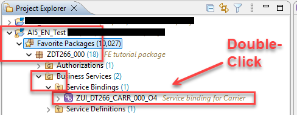| Navigate to `APB_EN` > `Favorite Packages` > `ZLOCAL` > `ZDT266` > `ZDT266_`**`000`**    > `Business Services` > **`Service Bindings`**.     Double-click on **`ZUI_DT266_CARR_000_O4`**.  |
      | 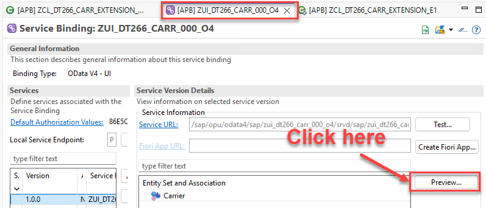 | In the new screen click on **`Preview...`**|

      - Run the Fiori App first for **Airline ID = 'AA'** by entering the ID and clicking on **`Go`** where you get a reponse:

        <table>
            <tr>
                <td>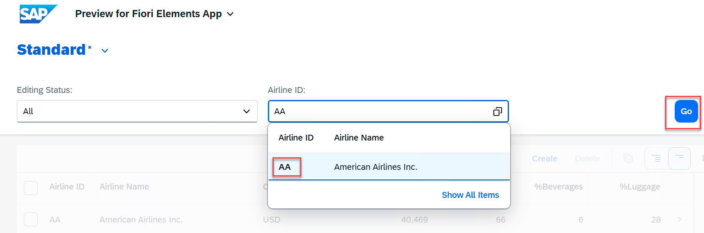</td>
                <td>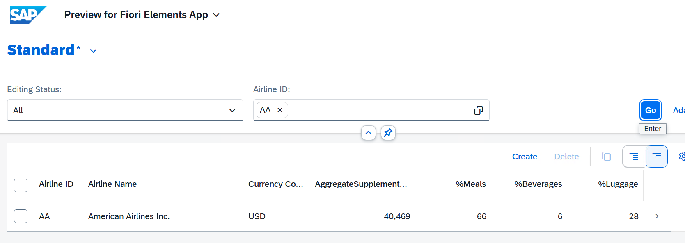</td>
            </tr>
        </table>
      
      - Run the Fiori App now for  **Airline ID = 'AC'**. This time we run into an **ABAP Runtime error**:

        <table>
            <tr>
                <td>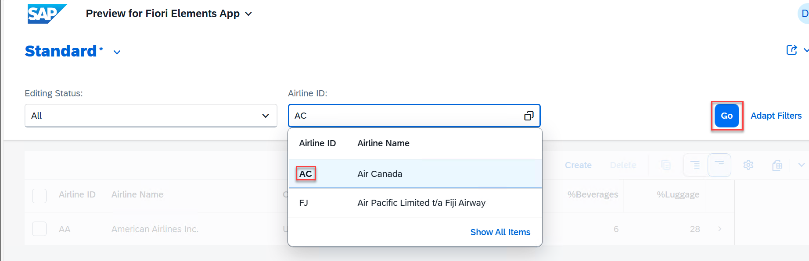</td>
                <td>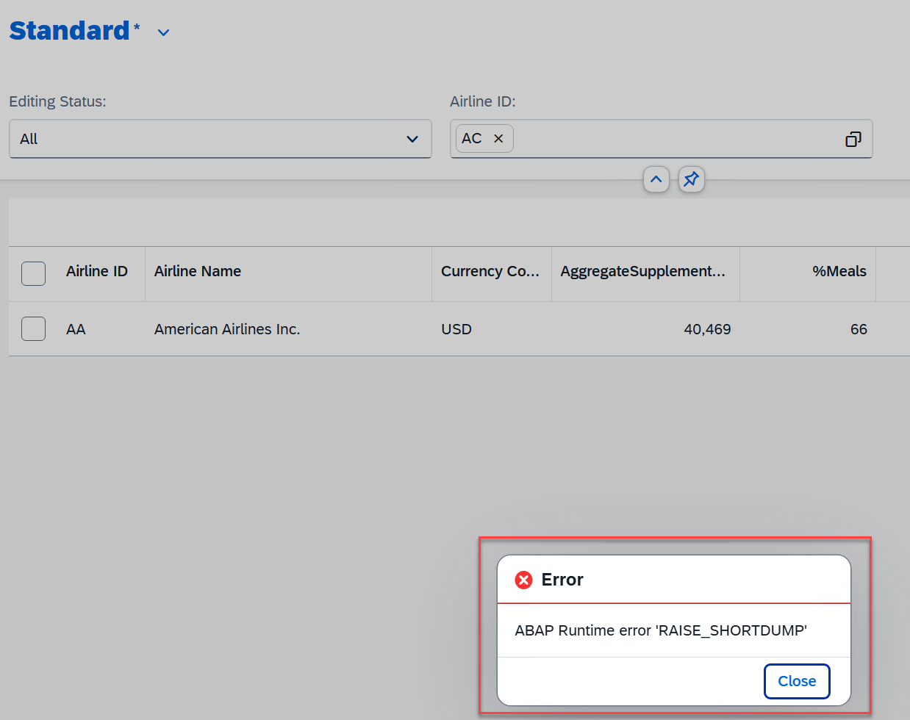</td>
            </tr>
        </table>
 
      -----

   2. Open the **`Feed Reader`** in the ABAP Development Tools (ADT).  
      
      - By clicking on the search button in the upper right corner (or by pressing **`CTRL+3`** in ADT) open the Quick Access and search for `Feed Reader`:

        <table>
            <tr>
                <td>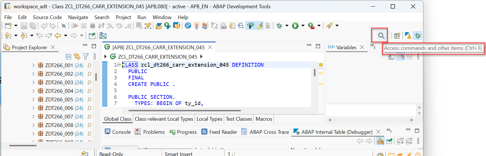</td>
                <td>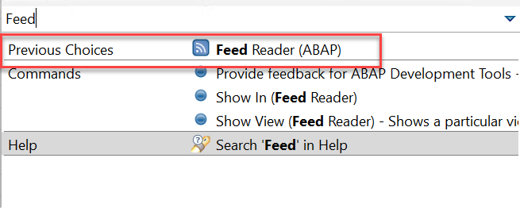</td>
            </tr>
        </table>

        ---

        🟠 _**REMARK:**_ For a **list of shortcuts** (like **`CTRL+3`**) refer to [``Keyboard Shortcuts for ABAP Development``](https://help.sap.com/docs/ABAP_PLATFORM_NEW/c238d694b825421f940829321ffa326a/4ec299d16e391014adc9fffe4e204223.html) and [``Useful Keyboard Shortcuts for ABAP in Eclipse``](https://community.sap.com/t5/application-development-and-automation-blog-posts/useful-keyboard-shortcuts-for-abap-in-eclipse/ba-p/13072397).
      
        ---
        
      - In the new tab `Feed Reader` expand the results for your project. The errors are displayed in the section **`Runtime Errors caused by me`**:

        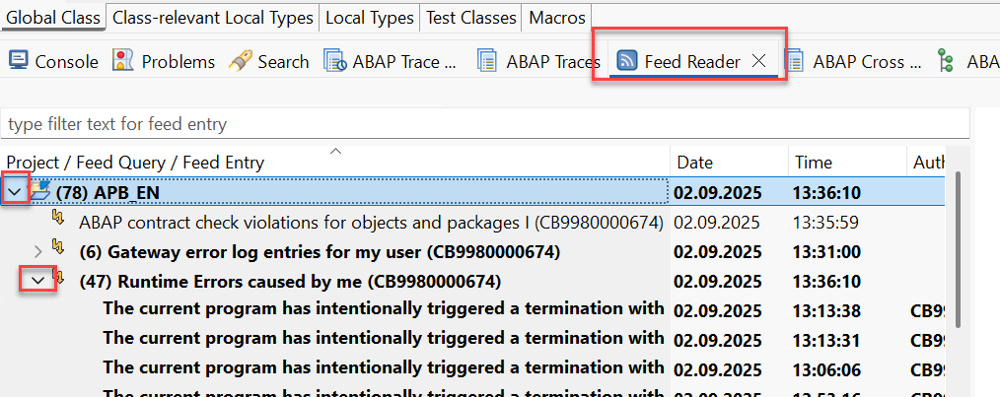

        - As there is no automatic refresh mark the row **`Runtime Errors caused by me`** and perform a refresh, either via right click or by pressing of **`F5`**:
      
          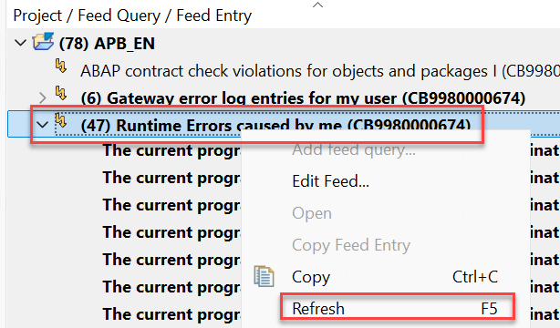 

      - Click on your new error in the list. The corresponding dump with the details of the runtime error is then shown on the right side:

        <kbd>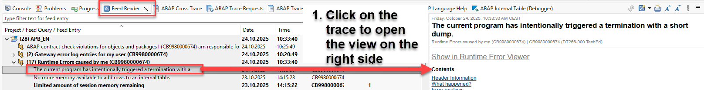</kbd> 

      - By click on the right side on **`Show in Runtime Error Viewer`** a separate view opens on the top of the ADT in Eclipse:

        <kbd>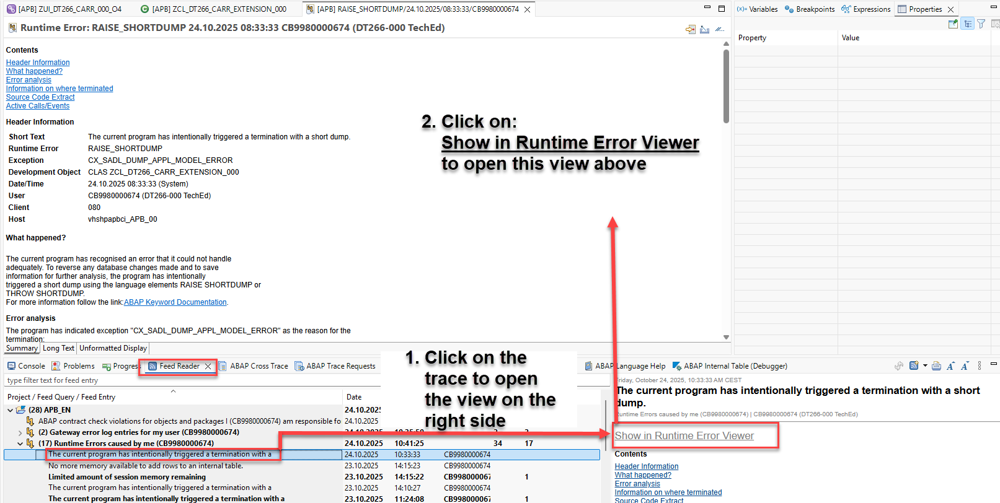</kbd>

      -----
   3. Analyze the error with the Feed Reader:
   
      - Click on  **`Error Analysis`**. There the root cause is shown as **Devision by zero**:

        <table>
            <tr>
                <td>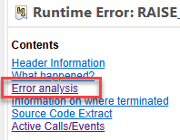</td>
                <td>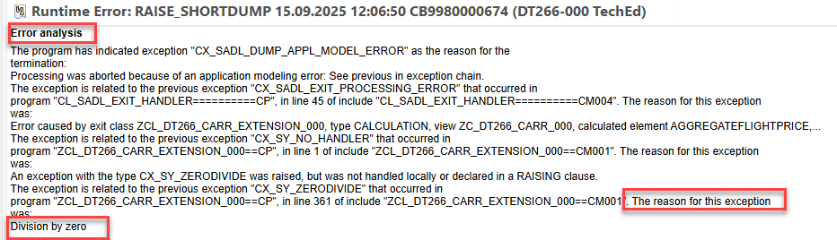</td>
            </tr>
        </table>

        🟠 _**REMARK:**_ It is important to read the whole error analysis as when the error is captured by a framework first the framework output is shown and (_as here_) at the end finally the error in our custom extension class is provided.

      - Click on **`Active Call/Events`** to get to the call stack in which the dump was written:

        <table>
            <tr>
                <td>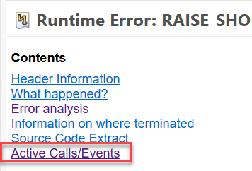</td>
                <td>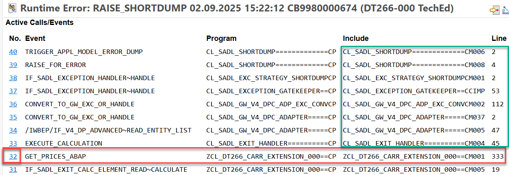</td>
            </tr>
        </table>  

        The call stack in the figure above shows 
        - that the dump is finally written by the **`SADL framework`** in class `CL_SADL_SHORTDUMP` and 
        - that this dump creation is triggered by an exception in the method `GET_PRICES_ABAP` of class `ZCL_DT266_CARR_EXTENSION_000`.  
        
        🟠 _**REMARK:**_ It is usually important to focus on the first coding from an API or application code and not to focus on the framework exception handling (_here:_ the SADL framework in class `CL_SADL_...`)
      

      - Click on the **`32`** (_hightlighted in blue in the left column **`No.`**_):

        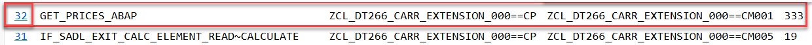 
      
        to navigate to the source code where the exception was raised (sometimes one has to click two times):

        <kbd>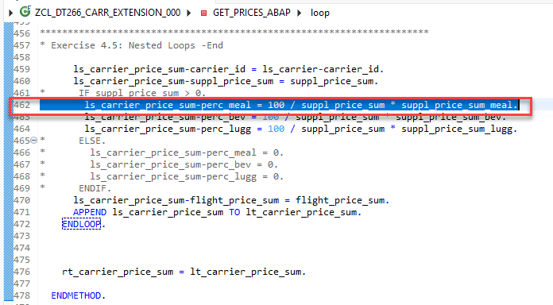 </kbd>
      -----

   4. Anaylze the Error in the **`Debugger`**: 
      - Set a breakpoint (by clicking on the number 462) where the exception was raised:

        <kbd>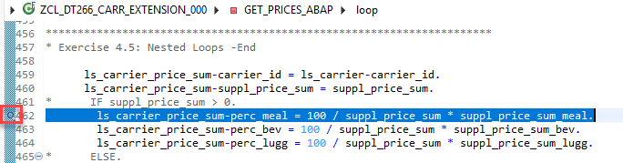</kbd> 

      - Run again the step for **Airline ID = 'AC'**:
      
        - Due to the breakpoint the processing stops there and the debugger opens (Confirm the perspective switch by pressing Switch in the appearing dialog if needed):
          <kbd></kbd> 
      
        - Hover the mouse over **`suppl_price_sum`**, then its value is shown. It is zero, so the Divsor is zero:
      
            <kbd>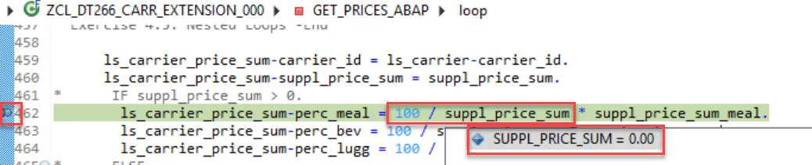</kbd>    

        - Hovering the mouse over **`lt_connection`** in line 143 shows that the list of connections for this Airline ID has **0 rows**. 

          <kbd>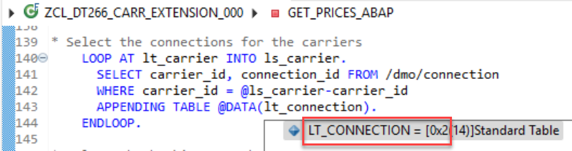</kbd> 
      
      > **Finding:** For this Airline ID (Carrier_ID) = 'AC' there are no connections
      and accordingly no bookings and no supplements.

      -----

   5. Press `F8` to resume the call in ADT and correct the ABAP Code:

      Switch back to the `ABAP perspective` via the Quick Access ().   

      Correct the ABAP code to handle the case that we have no supplements for some Airline ID (Carrier ID) and accordingly no total price for the supplements. 
      
      In this case we want to set the percentages ``perc_*`` for all the categories ``meal, bev, lugg`` to zero. 
      
      For this change remove the comments by marking the lines with **`*`** in about line 459 to 469 and press **`Ctrl+>`**:
      
       <table>
       <tr>
           <td>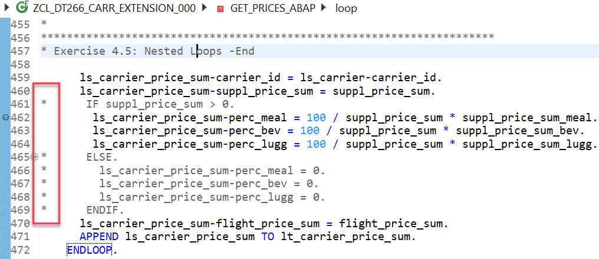</td>
           <td>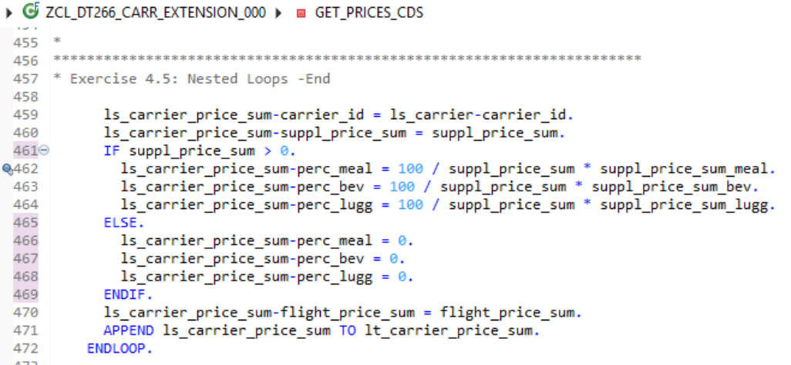</td>
       </tr>
      </table>  

      so we have the following coding:

      <kbd></kbd> 

      -----
   6. Activate the ABAP Code by pressing **`Ctrl+F3`** or by clicking on the match icon .

      And delete the breakpoint from the source code.

      -----

   7. Now you can repeat the call of the Fiori App for **Airline ID = 'AC'** and should get a result where all is empty:

      <table>
       <tr>
           <td></td>
           <td>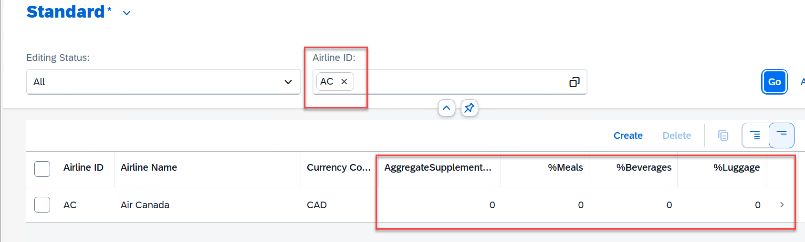</td>
       </tr>
      </table>

 ## Summary & Next Exercise
 [^Top of page](#)
 
 Now that you've...
 
 - used the _FEED READER_ for error analysis,

 - used the Debugger and Breakpoints to analyze the content of the session variables.

 Congratulations! 🎉
 
 In this hands-on exercise group, you have hopefully have some more insights into error analysis capabilities such as analyzing Runtime Error dumps!
 
 Thank you for stopping by!
 
 You can now ...
 - continue with the next exercise ► **[Exercise 2: Memory Inspector](../ex02/README.md)**   
 - or return to ► **[Home - DT266](/README.md#exercises)**.
 
 ## License
 
 Copyright (c) 2024 SAP SE or an SAP affiliate company. All rights reserved. This project is licensed under the Apache Software License, version 2.0 except as noted otherwise in the [LICENSE](LICENSES/Apache-2.0.txt) file.
