[Home - DT266](/README.md#exercises)

# Exercise 2: Usage of the Memory Inspector

## Introduction

In the previous exercise, we have learned to work with the **`Feed Reader`** to analyze runtime errors. 

They were caused by an issue in a single line of ABAP code which leads there to an exception / error (see [Exercise 1](../ex01/README.md)). 

In this exercise, after a change in the ABAP code an Out-Of-Memory error is thrown:  
- this runtime error is usually  not related to the call of a single line of code and the coding is functionally correct without any obvious error, 
- but it is not written optimal: 
    - We consume too much memory, more than allowed for a single process. 
    - Accordingly we get an Out-of-Memory error, the ``TSV_TNEW_PAGE_ALLOC_FAILED`` error.
- To analyze such memory issues an additional tool, the _Memory_Inspector_ is introduced. We analyze with the `Memory Inspector` the memory consumption and increase.

We start with a code change in method _`GET_PRICES_ABAP`_  of ABAP class _`ZCL_DT266_CARR_EXTENSION_###`_. This code change is intended to reduce our selections only to bookings of the specified Airline IDs and/or for the specific categories of interest. 

> [!NOTE]
> For this use **`ZDT266_###`** , where **`###`** is your suffix.  

### Exercises

- [2.1 - Coding Change for Reading the Supplements](#exercise-21-coding-change-for-reading-the-supplements)
- [2.2 - Analysis of the Out of Memory Error with the Memory Inspector](#exercise-22-analysis-of-the-out-of-memory-error-with-the-memory-inspector)
- [2.3 - Correction of the ABAP Code](#exercise-23-correction-of-the-abap-code)

### Summary:  
- [Summary & Next Exercise](#summary--next-exercise)  

### Exercises

## Exercise 2.1: Coding Change for Reading the Supplements
[^Top of page](#)

**Here, we implement an ABAP code change so that not all supplements are read.** 

> [!Note]
> Even the ABAP Test Cockpit (ATC) check shows this finding:
> <kbd></kbd>

**Accordingly, we implement code changes introducing a `WHERE`-cluase with which we specfiy the selection of only the supplements for the bookings for the Airline ID specified or selection only for the specific supplement categories which we show in the output of the Fiori App.**

 

  
🔵 Click to expand!

   1. To change the ABAP code just comment the old ABAP code by marking the lines and pressing **`Ctrl+<`**: 
      - in the code shown below mark the lines 200 to 205, 
      - and press **`Ctrl+<`**.

        <table>
          <tr>
           <td>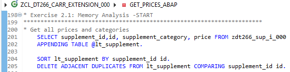</td>
           <td>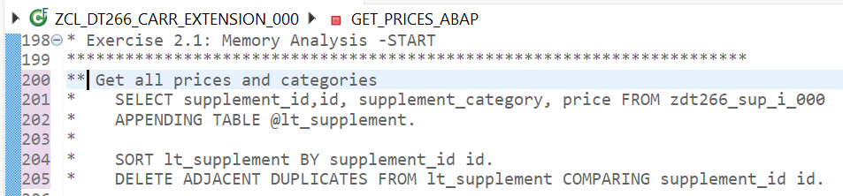</td>
          </tr>
        </table>      

      By this we remove the old code where all the supplement prices and categories are selected from table **`ZDT266_SUP_I_###`**:
      - even if for the Airline ID there are no connections or bookings, so also no bookings
      - independent of the supplement categories of interest (``meal, beverages, luggage``)
    
   2. Replace it with new coding where we only select by the relevant bookings (part1 of code) or by the relevant categories (part2 of code).

      ℹ️ **It is enough to mark in the ABAP code the lines 208 to 265 and press ``Ctrl+>`` as the new coding shown below is already provided in the method but commented out:**.
      
       <table>
       <tr>
           <td>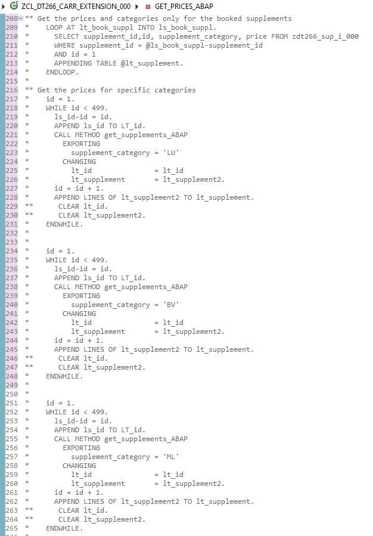</td>
           <td>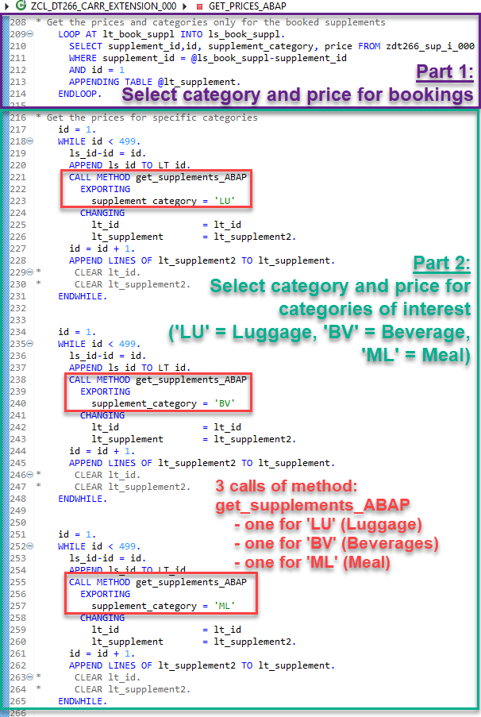</td>
       </tr>
      </table> 
      
       
      
      In the second part shown above on the right side we call for all three different categories (`luggage, beverages, meal`) another method of class **`ZCL_DT266_CARR_EXTENSION_###`** called **`get_supplements_ABAP`**:

      <kbd>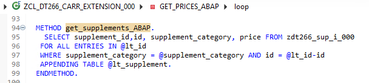</kbd>

   3. ℹ️ **The change then has to be activated by pressing ``Ctrl+F3`` or by clicking on the match icon** 
      .

   4. Run again the Fiori App for **Airline ID = 'AA'**. Now it fails with the Out-of-Memory error **`TSV_TNEW_PAGE_ALLOC_FAILED`**:

      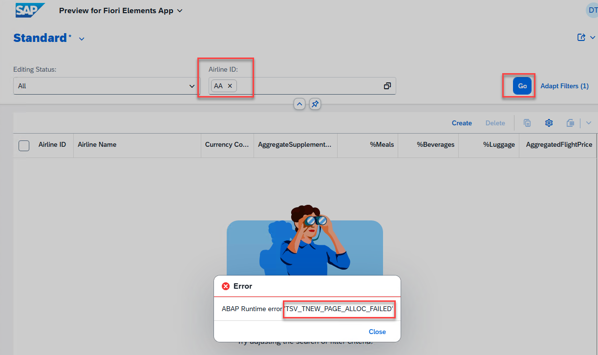

 ## Exercise 2.2: Analysis of the Out of Memory Error with the Memory Inspector
[^Top of page](#)

> With the code change in the previous exercise [2.1 - Coding Change for Reading the Supplements](#exercise-21-coding-change-for-reading-the-supplements) an **`Out of Memory`** runtime error appears when calling the Fiori App for Airline ID = 'AA'.
> We set a breakpoint where the error appears. Then call the Fiori App for Airline ID = 'AA' again and create **`Memory Snapshots`** during this processing for the first 3 times when we hit subsequently the breakpoint.  Finally, we analyze and compare those snapshot in the **`Memory Inspector`** to find the root-cause of the high memory consumption. 

> [!IMPORTANT]    
> Prerequisite for this exercise is that you have implemented the **specific** code change in the previous exercise [2.1 - Coding Change for Reading the Supplements](#exercise-21-coding-change-for-reading-the-supplements)

 
 

  
🔵 Click to expand!

   1. **First analyze the error in the `Feed Reader`**:

      - In the `Feed Reader`tab perform a refresh for the **`Runtime Errors caused by me`**: 
      
        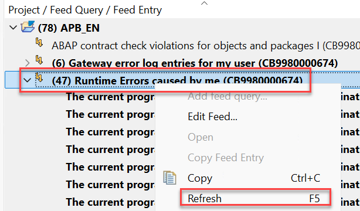

      - A new runtime error is displayed: _**"No More memory available to add rows to an internal table"**_. 

        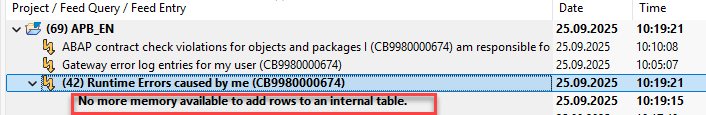

      - In the `Summary` tab of the ``Runtime Error Viewer`` go to the **`Error Analysis`** section. 
        
        There the root cause is shown that no additional row could be appended: 

        <table>
          <tr>
           <td>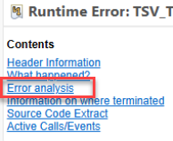</td>
           <td>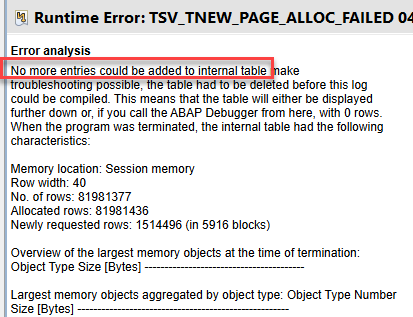</td>
          </tr>
        </table>

      - In the sections **`Information on where terminated`** and **`Source Code Extract`** we see the line where the out of memory error occured. Here we tried to append additional rows from **`lt_supplement2`** to **`lt_suppement`** which failed due to reaching the memory limit:

        <table>
            <tr>
                <td>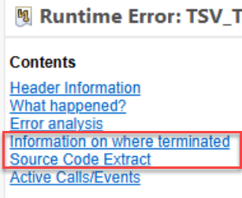</td>
                <td>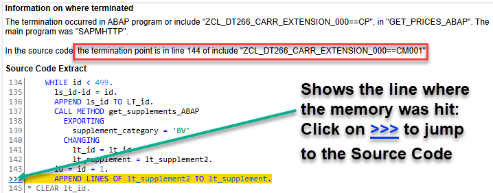</td>
            </tr>
        </table>        

      -----

   2. **Start the Debugger**:
      - In the `Source Code Extract` click on the blue marked **`>>>`**:

        <kbd></kbd>

        to navigate to the source code (where the runtime error occured). 
      
      - Add there a breakpoint:

        <kbd>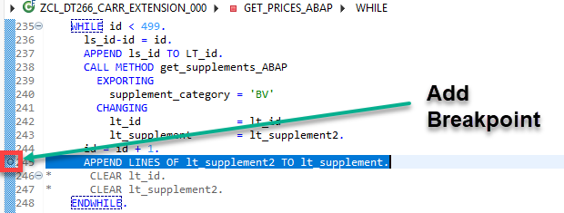</kbd>

      -----  

   3. **Create 3 Memory Snapshots as described below:**

      | Create 3 Memory Snapshots | Screenshots|
      |---|---|
      |**Process until the breakpoint:**   Rerun the Fiori App for **Airline ID = 'AA'**.   Due to the breakpoint the processing stops at line 245 the first time. | <kbd>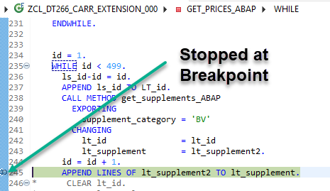</kbd> |
      | **1. Create the first memory snapshot:** <ul> <li> Go to the ABAP Debugger Actions icon () in the toolbar </li> <li> choose above in the dropdown list  **`Create Memory Snapshot`** and </li> </ul> <ul><li>  click **OK** in the pop-up </li></ul> | 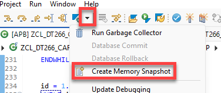 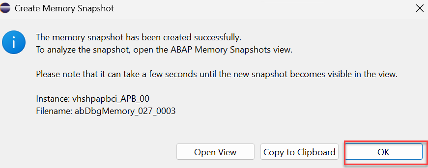 |
      |**Continue processing:**   The breakpoint is in a **`While Loop`** where the code inside this loop is processed for each **id = 1,2 ...** until it reaches **id = 498**.   By pressing **`F8`** or clicking in the menu the button **`Resume`** 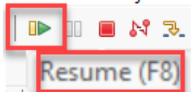 <ul><li> the ABAP code is further processed </li> <li> until we reach again the breakpoint </li> <li> as we are still in the same **`WHILE`** loop, </li> <li> but now for the next **`id`** which increased from **2** to **3** </li></ul>| <kbd>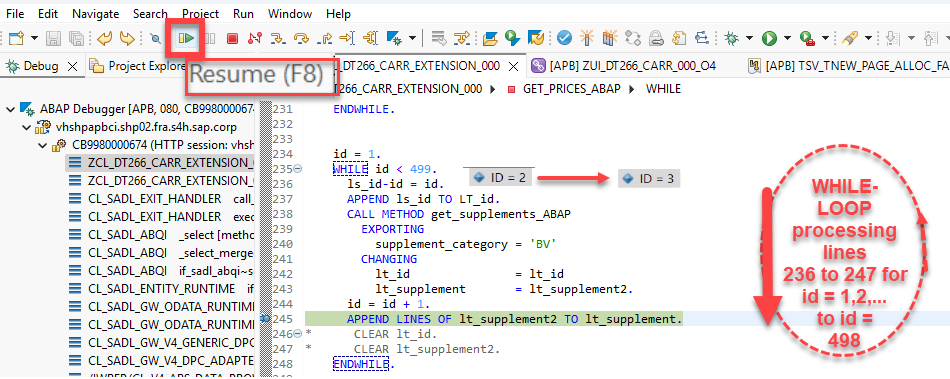</kbd> |
      | **2. Create the second memory snapshot:** <ul><li> choose above in the dropdown list  **`Create Memory Snapshot`** and </li><li> click **OK** in the pop-up </li></ul> |  |
      | **Continue processing:**   Press again **`F8`** or click in the menu the button **`Resume`**  <ul><li> the processing stops at same breakpoint </li> <li> as we are still in the same **`WHILE`** loop, </li> <li> but now for the next **`id`** which increased from **3** to **4** </li></ul>| <kbd>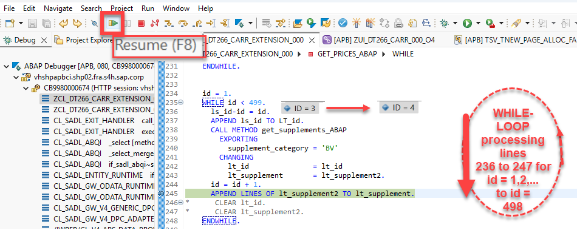</kbd> | 
      | **3. Create the third memory snapshot:** <ul><li> Choose  in the dropdown list  **`Create Memory Snapshot`**  </li><li> **But this time click `Open View` in the pop-up** </li></ul> | 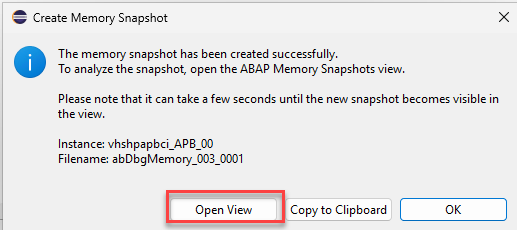 |
      |A new tab **`ABAP Memory Snapshots`** opens below in the ADT where you see 2 or 3 of your snapshots <ul><li> Alternatively, use the Quick Access (Ctrl+3) to open the ABAP Memory Snapshots tab. </li></ul> |<kbd>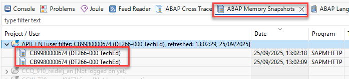</kbd>|
      | Perform a refresh by marking the line with your project and with right-click choose `Refresh`.| 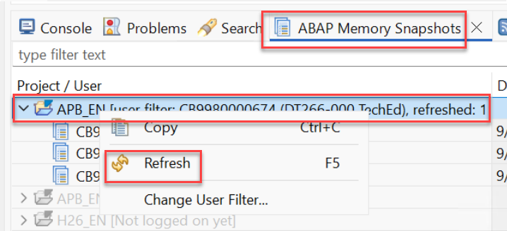|
      | Now you see all 3 snapshots  |  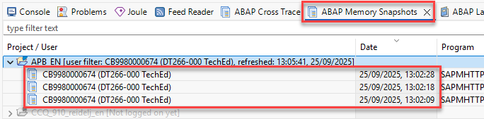|

      - ℹ️ **Terminate then directly the processing to ensure that the memory is released.**
          
         - To terminate the debugging and processing just click on the red button:

            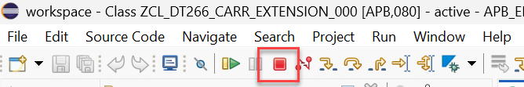

         - Switch back to the `ABAP perspective` via the Quick Access ().    

      -----      

<!--

        - Rerun the Fiori App for **Airline ID = 'AA'**. Due to the breakpoint the processing stops at line 245 the first time:
        
           <kbd></kbd> 
           
        - **Create the first memory snapshot from the ABAP Debugger:** 
            - choose above in the dropdown list  **`Create Memory Snapshot`** and
            - click **OK** in the pop-up

                <table>
                <tr>
                    <td></td>
                    <td></td>
                </tr>
                </table> 

            - The breakpoint is in a **`While Loop`** where the code inside this loop is processed several times:
              It is processed for each **id = 1,2 ...** until it reaches **id = 498**: 
            - By click of **`F8`** or click in the menu the button **`Resume`**   
              - the ABAP code is further processed 
              - until we reach again the breakpoint still in the same **`WHILE`** loop,  
              - but now for the next **`id`** which increased from **2** to **3**:
           
                <kbd></kbd> 

        - **Create the second memory snapshot:**
            - choose above in the dropdown list  **`Create Memory Snapshot`** and
            - click **OK** in the pop-up
              <table>
               <tr>
                <td></td>
                <td></td>
               </tr>
              </table> 

            - Afterwards click again in the Debugger **`F8`** or choose again in the menue:
      
              .

              - The processing stops again at the same break point as we are still in the same **`WHILE`** loop, 
              - but now **`id`** has increased from **3** to **4**.
            
                <kbd></kbd>

        -   **Create the third and last memory snapshot:** 
            
            - **But this time in the pop-up click `Open View`**

              <table>
               <tr>
                <td></td>
                <td></td>
               </tr>
              </table> 
            
              A new tab **`ABAP Memory Snapshots`** opens below in the ADT where you see 2 or 3 of your snapshots:

              <kbd></kbd>

        - ℹ️ **Terminate then directly the processing to ensure that the memory is released.**
          
          - To terminate the debugging and processing just click on the red button:

            

      - Perform a refresh by marking the line with your project and with right-click choose Refresh:

        

      
      - Now we have in total 3 memory snapshots:

        

      -----  

-->

   4. **Analysis of a single Memory Snapshot:**

      By double-click on the oldest (oldest timestamp) memory snapshot the **`Overview`** of the **`Memory Inspector`** opens:

      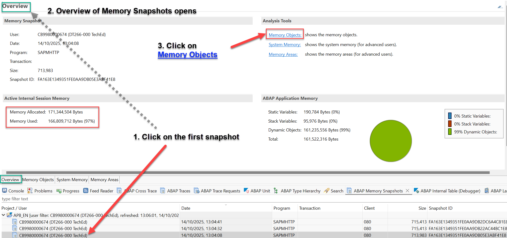

      The **`Overview`** shows the memory consumpion of about 188 million Bytes.
      
      To analyze which objects consume so much memory select in the ``Analysis Tools`` the link **`Memory Objects`**. 

      <kbd>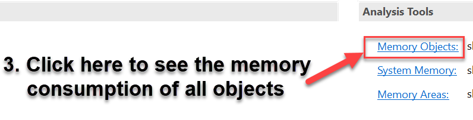</kbd>

      This view shows that nearly all the memory is consumed by **`lt_supplement`**:

      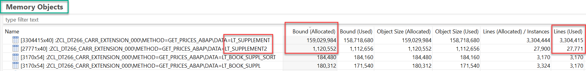

      The session table **`lt_supplement`** has already 159,029,984 Bytes due to 3.3 million rows. 
     
      -----  

   5. **Compare the Snapshots:** 

        **Compare the first with the second snapshot:** 
        - mark both lines and by right mouse click select **`Compare`**:
        
          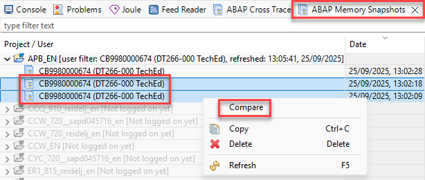  
           
        - The **`Overview`** displayed shows now in addition the **delta** in Bytes:
           
           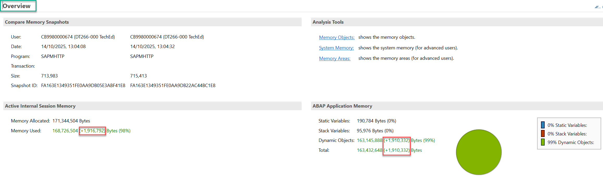 
           
        - In the Analysis Tool **`Memory Objects`** the **Delta** is also visible on single object level: 
           
           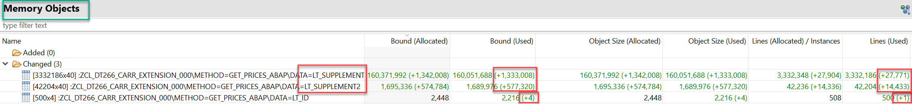 

        **Compare in addition the last two snapshots:** 
        - mark both lines and by right mouse click **`Compare`**:
              
            <kbd>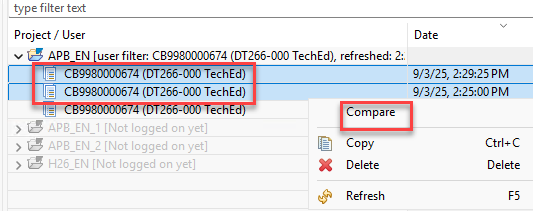</kbd> 
              
        - Select again the Analysis Tool **`Memory Objects`** where the Delta is also shown for memory and for lines / rows:
            
          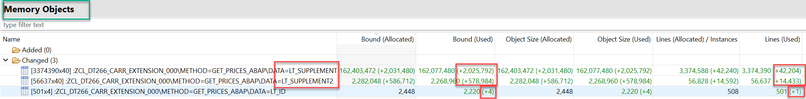 

        **From those comparisions we get:**  
        - **LT_ID** has 
            - in the first snaphot  499 rows, 
              - in the second  increased by 1 row to 500 rows, 
              - in the third increased by 1 row to 501 rows.  
            - Each additional row increased the memory by +4 Bytes (id is defined as `int4`, an integer with 4 Bytes),
        - **LT_SUPPLEMENT2** has 
            - in the first snapshot 27,771 rows, 
              - in the second increased by `14,433` rows to 42,204 rows  and the memory increased by 577,320 Bytes,
              - in the third increased by increased by `14,433` rows to 56,637 rows and the memory increased by 578,984 Bytes.
        - **LT_SUPPLEMENT** has
            - in the first snapshot 3,304,415 rows,
              - in the second increased by **`27,771`** rows to 3,332,186 rows and the memory increased by 1,333,008 Bytes,
              - in the third increased by **`42,204`** (= **`27,771`** + `14,433`) to 3,374,390 rows and the memory by 2,025,792 Bytes,
              - so it increased by the total of the
                  - previous **`27,771`** rows from LT_SUPPLEMENT2 (which we already appended before and now a further time) and
                  - the new `14,433` rows from LT_SUPPLEMENT2  
        
        **In Summary with each iteration in WHILE LOOP we:** 
        - append the new id to lt_id which is never cleared and call the method ``get_supplements_ABAP`` for this increasing list of ids.
        - append always further `14,433` results to LT_SUPPLEMENT2 (keeping the previous ones) 
        - append then all those entries (the previously already appended and the new determined) of LT_SUPPLEMENT2 again and again to LT_SUPPLEMENT.
        
        🟠 The issue is that the previous entries are never cleared. The developer of the method **`GET_PRICES_ABAP`** expected that the method **`GET_SUPPLEMENTS_ABAP`** 
        - would not return the whole list of lt_id, 
        - would return in lt_supplement2 only the new results for the new IDs and not append the new results keeping the old ones:

          <kbd></kbd>

        ℹ️ The developer of method **`GET_PRICES_ABAP`** has therefore to ensure that after each call of method **`get_supplements_ABAP`** previous results are cleared and to keep only the new determined results in lt_supplement2 before appending them to lt_supplement .

## Exercise 2.3: Correction of the ABAP Code
[^Top of page](#)

> Correct the ABAP code to avoid the Out-of-Memory runtime error **`TSV_TNEW_PAGE_ALLOC_FAILED`** by adding in the source code a clear for the previous IDs and lt_supplement2 values with **`CLEAR lt_id.`** and **`CLEAR lt_supplement2`**.

 
 

  
🔵 Click to expand!

   1. For this you only have to remove the comments for the CLEAR statements and also you can now delete the breakpoint:
       <table>
       <tr>
           <td>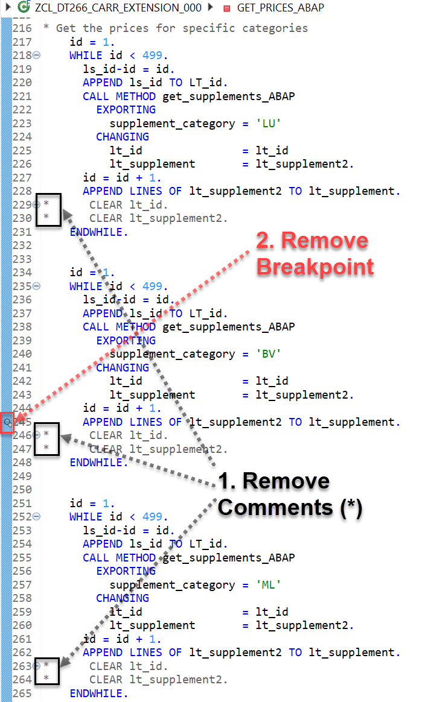</td>
           <td>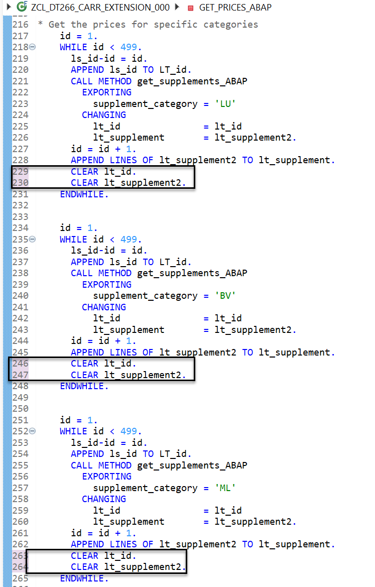</td>
       </tr>
      </table>  
      
      By this we add in the source code a clear for the previous IDs and lt_supplement2 values with **`CLEAR lt_id.`** and **`CLEAR lt_supplement2`**.

      
 

   2. ℹ️ **The change then has to be activated by pressing ``Ctrl+F3`` or by clicking on the match icon** 
      .
      
      This will solve the issue. When you rerun the Fiori app you will see no memory issue anymore.

 ## Summary & Next Exercise
 [^Top of page](#)
 
 Now that you've...
 
 - analyzed in debugger with memory snapshots a non-linearity leading to high memory consumption and finally to Out-of-Memory errors,
 - detected non-linearities which decrease performance,
 - ensured that when calling other methods or function modules in a loop  non-linearities are avoided,
 - initialized session tables (_here:_ using ABAP command `CLEAR`) to ensure that only the actual required data is processed, 
 
 you are done with the memory analysis. Congratulations! 🎉
 
 In this hands-on exercise group, you have hopefully some more insights into ADT debugger capabilities such as the Memory Inspector!
 
 Thank you for stopping by!
 
 You can now ...
 - continue with the next exercise  ► **[Exercise 3: ABAP Cross Trace](../ex03/README.md)**   
 - or return to ► **[Home - DT266](/README.md#exercises)**.
 
 ## License
 
 Copyright (c) 2024 SAP SE or an SAP affiliate company. All rights reserved. This project is licensed under the Apache Software License, version 2.0 except as noted otherwise in the [LICENSE](LICENSES/Apache-2.0.txt) file.
