[Home - DT266](/README.md#exercises)

# Exercise 2: Usage of the Memory Inspector

## Introduction

In the previous exercise, we have learned to work with the **`Feed Reader`** to analyze runtime errors. 

They were caused by an issue in a single line of ABAP code which leads there to an exception / error (see [Exercise 1](../ex01/README.md)). 

In this exercise, after a change in the ABAP code an Out-Of-Memory error is thrown:  
- this runtime error is usually  not related to the call of a single line of code and the coding is functionally correct without any obvious error, 
- but it is not written optimal: 
    - We consume too much memory, more than allowed for a single process. 
    - Accordingly we get an Out-of-Memory error, the ``TSV_TNEW_PAGE_ALLOC_FAILED`` error.
- To analyze such memory issues an additional tool, the _Memory_Inspector_ is introduced. We analyze with the `Memory Inspector` the memory consumption and increase.

We start with a code change in method _`GET_PRICES_ABAP`_  of ABAP class _`ZCL_DT266_CARR_EXTENSION_###`_. This code change is intended to reduce our selections only to bookings of the specified Airline IDs and/or for the specific categories of interest. 

<!--
> [!NOTE]
> For this use **`ZDT266_###`** , where **`###`** is your suffix.  
-->

### Exercises

- [2.1 - Coding Change for Reading the Supplements](#exercise-21-coding-change-for-reading-the-supplements)
- [2.2 - Analysis of the Out of Memory Error with the Memory Inspector](#exercise-22-analysis-of-the-out-of-memory-error-with-the-memory-inspector)
- [2.3 - Correction of the ABAP Code](#exercise-23-correction-of-the-abap-code)


### Summary:  
- [Summary & Next Exercise](#summary--next-exercise)  

### Exercises

## Exercise 2.1: Coding Change for Reading the Supplements
[^Top of page](#)

**Here, we implement an ABAP code change so that not all supplements are read.** 

> [!Note]
> Even the ABAP Test Cockpit (ATC) check shows this finding:
> <kbd>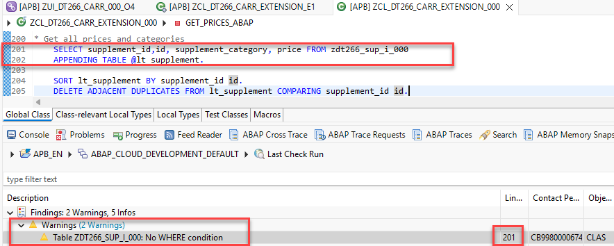</kbd>

**Accordingly, we implement code changes introducing a `WHERE`-clause in which we specfiy the selection of only the supplements for the bookings for the Airline ID specified or selection only for the specific supplement categories which we show in the output of the Fiori App.**

Here you can either exchange the coding completely (Version 1)  or perform manually the delta of changes (Version 2):

Version 1: Exchange the Code completely in class ZCL_DT266_CARR_EXTENSION_###:

 <details>
  <summary>🔵 Click to expand </summary>
  
  To completely exchange the coding in class ZCL_DT266_CARR_EXTENSION_###:**
  > - Delete the complete current source code in the class **`ZCL_DT266_CARR_EXTENSION_###`**. 
  > - Insert the code snippet provided below (🟡📄) by: 
  >   - 💡 Make use of the _Copy Raw Content_ () function to copy the provided code snippet.  
  >   - 💡 Replace all occurrences of the placeholder **`###`** with your personal suffix using the ADT function _**Replace All**_ (_**Ctrl+F**_).
  > - ℹ️ Activate the ABAP Code by pressing **`Ctrl+F3`** or by clicking on the match icon .

```<ABAP>
CLASS zcl_dt266_carr_extension_### DEFINITION
      PUBLIC
      FINAL
      CREATE PUBLIC .

  PUBLIC SECTION.
    TYPES: BEGIN OF ty_id,
             id TYPE int4,
           END OF ty_id.
    TYPES: BEGIN OF ty_carrier,
             carrier_id TYPE /dmo/carrier_id,
           END OF ty_carrier.
    TYPES: BEGIN OF ty_connection,
             carrier_id    TYPE /dmo/carrier_id,
             connection_id TYPE /dmo/connection_id,
           END OF ty_connection.
    TYPES: BEGIN OF ty_booking,
             travel_id     TYPE /dmo/travel_id,
             booking_id    TYPE /dmo/booking_id,
             carrier_id    TYPE /dmo/carrier_id,
             connection_id TYPE /dmo/connection_id,
             flight_price  TYPE /dmo/flight_price,
           END OF ty_booking.
    TYPES: BEGIN OF ty_book_suppl,
             travel_id     TYPE /dmo/travel_id,
             booking_id    TYPE /dmo/booking_id,
             "Exercise 4.4: Correction for FOR ALL ENTRIES SELECT -START
**********************************************************************
*             booking_supplement_id TYPE /dmo/booking_supplement_id,
             "Exercise 4.4: Correction for FOR ALL ENTRIES SELECT -END
**********************************************************************
             supplement_id TYPE /dmo/supplement_id,
             price         TYPE /dmo/supplement_price,
           END OF ty_book_suppl.
    TYPES: BEGIN OF ty_supplement,
             supplement_id       TYPE /dmo/supplement_id,
             id                  TYPE int4,
             supplement_category TYPE /dmo/supplement_category,
             price               TYPE /dmo/supplement_price,
           END OF ty_supplement.
    TYPES: BEGIN OF ty_cds_result_suppl,
             carrier_id           TYPE /dmo/carrier_id,
             suppl_price_sum      TYPE /dmo/supplement_price,
             suppl_price_sum_bev  TYPE /dmo/supplement_price,
             suppl_price_sum_meal TYPE /dmo/supplement_price,
             suppl_price_sum_lugg TYPE /dmo/supplement_price,
           END OF ty_cds_result_suppl.
    TYPES: BEGIN OF ty_cds_result_flight,
             carrier_id       TYPE /dmo/carrier_id,
             flight_price_sum TYPE /dmo/supplement_price,
           END OF ty_cds_result_flight.
    TYPES: BEGIN OF ty_carrier_price_sum,
             carrier_id       TYPE /dmo/carrier_id,
             suppl_price_sum  TYPE /dmo/supplement_price,
             perc_meal        TYPE int4,
             perc_bev         TYPE int4,
             perc_lugg        TYPE int4,
             flight_price_sum TYPE /dmo/supplement_price,
           END OF ty_carrier_price_sum.
    TYPES: tt_carrier_price_sum TYPE STANDARD TABLE OF ty_carrier_price_sum WITH DEFAULT KEY.
    TYPES: tt_carrier_id TYPE STANDARD TABLE OF ty_carrier WITH DEFAULT KEY.
    TYPES: tt_id TYPE STANDARD TABLE OF ty_id WITH DEFAULT KEY.
    TYPES: tt_supplement TYPE STANDARD TABLE OF ty_supplement WITH DEFAULT KEY.

    INTERFACES:
      if_oo_adt_classrun,
      if_sadl_exit_calc_element_read.
  PROTECTED SECTION.
  PRIVATE SECTION.
    METHODS get_prices_ABAP IMPORTING  lt_carrier                  TYPE tt_carrier_id
                            RETURNING
                                       VALUE(rt_carrier_price_sum) TYPE tt_carrier_price_sum
                            EXCEPTIONS zero_devide.
    METHODS get_supplements_ABAP IMPORTING supplement_category TYPE  /dmo/supplement_category
                                 CHANGING
                                           lt_supplement       TYPE tt_supplement
                                           lt_id               TYPE tt_id.
    METHODS get_prices_CDS IMPORTING lt_carrier                  TYPE tt_carrier_id
                           RETURNING
                                     VALUE(rt_carrier_price_sum) TYPE tt_carrier_price_sum.
ENDCLASS.


CLASS zcl_dt266_carr_extension_### IMPLEMENTATION.


  METHOD if_oo_adt_classrun~main.

    "    out->write( |[DT266] Run finished for ZCL_DT266_LOOP1_{ group_id }. | ).
  ENDMETHOD.


  METHOD get_supplements_ABAP.
    SELECT supplement_id,id, supplement_category, price FROM zdt266_sup_i_###
        FOR ALL ENTRIES IN @lt_id
        WHERE supplement_category = @supplement_category AND id = @lt_id-id
  APPENDING TABLE @lt_supplement.
  ENDMETHOD.


  METHOD get_prices_ABAP.

    DATA:
      group_id              TYPE string VALUE '###',
      id                    TYPE int4,
      ls_id                 TYPE ty_id,
      lt_id                 TYPE STANDARD TABLE OF ty_id,
      ls_carrier            TYPE ty_carrier,
      ls_connection         TYPE ty_connection,
      ls_booking            TYPE ty_booking,
      ls_book_suppl         TYPE ty_book_suppl,
      ls_supplement         TYPE ty_supplement,
      ls_supplement2        TYPE ty_supplement,
      ls_carrier_price_sum  TYPE ty_carrier_price_sum,
      suppl_price_sum       TYPE /dmo/supplement_price,
      suppl_price_sum_meal  TYPE /dmo/supplement_price,
      suppl_price_sum_bev   TYPE /dmo/supplement_price,
      suppl_price_sum_lugg  TYPE /dmo/supplement_price,
      flight_price_sum      TYPE /dmo/supplement_price,
      l_tabix_1             TYPE sy-tabix,
      l_tabix_2             TYPE sy-tabix,
      lt_booking_sort       TYPE SORTED TABLE OF ty_booking WITH NON-UNIQUE KEY primary_key  COMPONENTS carrier_id,
      lt_book_suppl_sort    TYPE SORTED TABLE OF ty_book_suppl WITH NON-UNIQUE KEY primary_key  COMPONENTS travel_id booking_id, supplement_id,booking_supplement_id,
      lt_supplement_sort    TYPE SORTED TABLE OF ty_supplement WITH NON-UNIQUE KEY primary_key COMPONENTS supplement_id id,
      lt_supplement_sort2   TYPE SORTED TABLE OF ty_supplement WITH NON-UNIQUE KEY primary_key COMPONENTS supplement_category
                              WITH NON-UNIQUE SORTED KEY key_id_cat COMPONENTS supplement_id id,
      lt_supplement         TYPE STANDARD TABLE OF ty_supplement
                              WITH NON-UNIQUE SORTED KEY key_id_cat COMPONENTS supplement_id id,
      lt_supplement2        TYPE STANDARD TABLE OF ty_supplement,
      lt_supplement3        TYPE STANDARD TABLE OF ty_supplement,
      lt_carrier_price_sum  TYPE STANDARD TABLE OF ty_carrier_price_sum,
      table_supplement      TYPE tabname,
      oref                  TYPE REF TO cx_root,
      text                  TYPE string.

    table_supplement = |zdt266_sup_i_{ group_id }|.

    " Select the connections for the carriers
    LOOP AT lt_carrier INTO ls_carrier.
      SELECT carrier_id, connection_id FROM /dmo/connection
      WHERE carrier_id = @ls_carrier-carrier_id
      APPENDING TABLE @DATA(lt_connection).
    ENDLOOP.

    " Select the bookings on those connections related to the different carriers
    LOOP AT lt_connection INTO ls_connection.
      SELECT travel_id, booking_id, carrier_id, connection_id, flight_price
      FROM /dmo/booking
      WHERE carrier_id = @ls_connection-carrier_id
      AND connection_id = @ls_connection-connection_id
      APPENDING TABLE @DATA(lt_booking).
    ENDLOOP.

    " Sorted tables
    lt_booking_sort = lt_booking.


    " Exercise 4.4: Compare with FAE -START
*********************************************************************
    " Get the Supplements (like beverages, meals, luggages) additionally booked.
    LOOP AT lt_booking INTO ls_booking.
      SELECT  travel_id, booking_id, supplement_id, price FROM /dmo/book_suppl
      WHERE travel_id = @ls_booking-travel_id
      AND booking_id = @ls_booking-booking_id
      APPENDING TABLE @DATA(lt_book_suppl).
    ENDLOOP.

*    SELECT  travel_id, booking_id, supplement_id, price FROM /dmo/book_suppl
*    FOR ALL ENTRIES IN @lt_booking
*    WHERE travel_id = @lt_booking-travel_id
*    AND booking_id = @lt_booking-booking_id
*    APPENDING TABLE @DATA(lt_book_suppl).
**********************************************************************
    " Exercise 4.4: Compare with FAE -END

    " Exercise 4.4: Table Comparison Tool -START
**********************************************************************
*    LOOP AT lt_booking INTO ls_booking.
*      SELECT  * FROM /dmo/book_suppl
*      WHERE travel_id = @ls_booking-travel_id
*      AND booking_id = @ls_booking-booking_id
*      APPENDING TABLE @DATA(lt_book_suppl3).
*    ENDLOOP.
*    SORT lt_book_suppl BY travel_id booking_id supplement_id price.
*    SORT lt_book_suppl2 BY travel_id booking_id supplement_id price.
*    SORT lt_book_suppl3 BY travel_id booking_id supplement_id price.
**********************************************************************
    " Exercise 4.4: Table Comparison Tool --END

    " Sorted tables
    lt_book_suppl_sort = lt_book_suppl.


    IF lt_book_suppl IS NOT INITIAL.
      " Exercise 2.1: Memory Analysis -START
**********************************************************************
      " Get all prices and categories
*      SELECT supplement_id,id, supplement_category, price FROM zdt266_sup_i_###
*      APPENDING TABLE @lt_supplement.
*
*      SORT lt_supplement BY supplement_id id.
*      DELETE ADJACENT DUPLICATES FROM lt_supplement COMPARING supplement_id id.


      " Get the prices and categories only for the booked supplements
    LOOP AT lt_book_suppl INTO ls_book_suppl.
      SELECT supplement_id,id, supplement_category, price FROM zdt266_sup_i_###
      WHERE supplement_id = @ls_book_suppl-supplement_id
      AND id = 1
      APPENDING TABLE @lt_supplement.
    ENDLOOP.

      " Get the prices for specific categories
    id = 1.
    WHILE id < 499.
      ls_id-id = id.
      APPEND ls_id TO LT_id.
      CALL METHOD get_supplements_ABAP
        EXPORTING
          supplement_category = 'LU'
        CHANGING
          lt_id               = lt_id
          lt_supplement       = lt_supplement2.
      id = id + 1.
      APPEND LINES OF lt_supplement2 TO lt_supplement.
*      CLEAR lt_id.
*      CLEAR lt_supplement2.
    ENDWHILE.


    id = 1.
    WHILE id < 499.
      ls_id-id = id.
      APPEND ls_id TO LT_id.
      CALL METHOD get_supplements_ABAP
        EXPORTING
          supplement_category = 'BV'
            CHANGING
          lt_id               = lt_id
          lt_supplement       = lt_supplement2.
      id = id + 1.
      APPEND LINES OF lt_supplement2 TO lt_supplement.
*      CLEAR lt_id.
*      CLEAR lt_supplement2.
    ENDWHILE.


    id = 1.
    WHILE id < 499.
      ls_id-id = id.
      APPEND ls_id TO LT_id.
      CALL METHOD get_supplements_ABAP
        EXPORTING
          supplement_category = 'ML'
        CHANGING
          lt_id               = lt_id
          lt_supplement       = lt_supplement2.
      id = id + 1.
      APPEND LINES OF lt_supplement2 TO lt_supplement.
*      CLEAR lt_id.
*      CLEAR lt_supplement2.
    ENDWHILE.


      " Sorted tables
    lt_supplement_sort = lt_supplement.
**********************************************************************
      " Exercise 2.1: Memory Analysis -End
    ENDIF.


    " Sorting tables for using BINARY SEARCH before the first LOOP starts.
    SORT lt_supplement BY supplement_id id.
*    SORT lt_book_suppl BY travel_id booking_id supplement_id.
*    SORT lt_booking BY carrier_id.

    LOOP AT lt_carrier INTO ls_carrier.
      suppl_price_sum = 0.
      suppl_price_sum_meal = 0.
      suppl_price_sum_bev = 0.
      suppl_price_sum_lugg = 0.
      flight_price_sum = 0.


      "*" Exercise 4.3: READ TABLE -START
**********************************************************************
      LOOP AT lt_booking_sort INTO ls_booking WHERE carrier_id = ls_carrier-carrier_id.
        LOOP AT lt_book_suppl_sort INTO ls_book_suppl
        WHERE travel_id = ls_booking-travel_id AND booking_id = ls_booking-booking_id.
          READ TABLE lt_supplement INTO ls_supplement
          WHERE supplement_id = ls_book_suppl-supplement_id AND id = 1.
*          WITH KEY key_id_cat COMPONENTS supplement_id = ls_book_suppl-supplement_id  id = 1.
*
          "// Option 1: Consider to sort the table lt_supplement before the LOOP AT by the key fields for which we access the table and use BINARY SEARCH:
*            READ TABLE lt_supplement INTO ls_supplement
*            WITH KEY  supplement_id = ls_book_suppl-supplement_id  id = 1 BINARY SEARCH.
*
          "// Option 2: READ TABLE is fast when we have an as SORTED defined table where the primary key fits to the key of the WHERE Clause
          "//           lt_supplement_sort TYPE SORTED TABLE OF ty_supplement WITH NON-UNIQUE KEY primary_key COMPONENTS supplement_id id,
*         READ TABLE lt_supplement_sort INTO ls_supplement
*            WHERE supplement_id = ls_book_suppl-supplement_id AND id = 1.
**
          "// Option 3: In case the table is already defined as sorted table which does not fit to the key access we have here (supplement_id & id)
          "//           one can add ad in the definition a further SORTED KEY which fits:
          "//          lt_supplement_sort2   TYPE SORTED TABLE OF ty_supplement WITH NON-UNIQUE KEY primary_key COMPONENTS supplement_category
          "//      WITH NON-UNIQUE SORTED KEY key_id_cat COMPONENTS supplement_id id,
*            READ TABLE lt_supplement_sort2 INTO ls_supplement
*                 WITH KEY key_id_cat COMPONENTS supplement_id = ls_book_suppl-supplement_id  id = 1.

          suppl_price_sum = suppl_price_sum + ls_supplement-price.
          CASE ls_supplement-supplement_category.
            WHEN 'ML'.
              suppl_price_sum_meal = suppl_price_sum_meal + ls_supplement-price.
            WHEN 'BV'.
              suppl_price_sum_bev = suppl_price_sum_bev + ls_supplement-price.
            WHEN 'LU'.
              suppl_price_sum_lugg = suppl_price_sum_lugg + ls_supplement-price.
          ENDCASE.
        ENDLOOP.
        flight_price_sum = flight_price_sum + ls_booking-flight_price.
      ENDLOOP.
**********************************************************************
      " Exercise 4.3: READ TABLE -End


      " Exercise 4.5: Nested Loops -START
**********************************************************************
*      suppl_price_sum = 0.
*      suppl_price_sum_meal = 0.
*      suppl_price_sum_bev = 0.
*      suppl_price_sum_lugg = 0.
*      flight_price_sum = 0.
*      LOOP AT lt_booking INTO ls_booking WHERE carrier_id = ls_carrier-carrier_id.
*        LOOP AT lt_book_suppl INTO ls_book_suppl
*        WHERE travel_id = ls_booking-travel_id AND booking_id = ls_booking-booking_id.
*          LOOP AT lt_supplement INTO ls_supplement
*            WHERE supplement_id = ls_book_suppl-supplement_id AND id = 1.
*            suppl_price_sum = suppl_price_sum + ls_supplement-price.
*            CASE ls_supplement-supplement_category.
*              WHEN 'ML'.
*                suppl_price_sum_meal = suppl_price_sum_meal + ls_supplement-price.
*              WHEN 'BV'.
*                suppl_price_sum_bev = suppl_price_sum_bev + ls_supplement-price.
*              WHEN 'LU'.
*                suppl_price_sum_lugg = suppl_price_sum_lugg + ls_supplement-price.
*            ENDCASE.
*            EXIT.
*          ENDLOOP.
*        ENDLOOP.
*        flight_price_sum = flight_price_sum + ls_booking-flight_price.
*      ENDLOOP.
*
*
*      suppl_price_sum = 0.
*      suppl_price_sum_meal = 0.
*      suppl_price_sum_bev = 0.
*      suppl_price_sum_lugg = 0.
*      flight_price_sum = 0.
*      LOOP AT lt_booking_sort INTO ls_booking WHERE carrier_id = ls_carrier-carrier_id.
*        LOOP AT lt_book_suppl_sort INTO ls_book_suppl
*        WHERE travel_id = ls_booking-travel_id AND booking_id = ls_booking-booking_id.
*            LOOP AT lt_supplement_sort INTO ls_supplement
*            WHERE supplement_id = ls_book_suppl-supplement_id and id = 1.
*            suppl_price_sum = suppl_price_sum + ls_supplement-price.
*            CASE ls_supplement-supplement_category.
*              WHEN 'ML'.
*                suppl_price_sum_meal = suppl_price_sum_meal + ls_supplement-price.
*              WHEN 'BV'.
*                suppl_price_sum_bev = suppl_price_sum_bev + ls_supplement-price.
*              WHEN 'LU'.
*                suppl_price_sum_lugg = suppl_price_sum_lugg + ls_supplement-price.
*            ENDCASE.
*            EXIT.
*            ENDLOOP.
*        ENDLOOP.
*        flight_price_sum = flight_price_sum + ls_booking-flight_price.
*      ENDLOOP.
*
*      suppl_price_sum = 0.
*      suppl_price_sum_meal = 0.
*      suppl_price_sum_bev = 0.
*      suppl_price_sum_lugg = 0.
*      flight_price_sum = 0.
*      LOOP AT lt_booking_sort INTO ls_booking WHERE carrier_id = ls_carrier-carrier_id.
*        LOOP AT lt_book_suppl_sort INTO ls_book_suppl
*        WHERE travel_id = ls_booking-travel_id AND booking_id = ls_booking-booking_id.
*            LOOP AT lt_supplement INTO ls_supplement
*            USING KEY key_id_cat WHERE supplement_id = ls_book_suppl-supplement_id and id = 1.
*            suppl_price_sum = suppl_price_sum + ls_supplement-price.
*            CASE ls_supplement-supplement_category.
*              WHEN 'ML'.
*                suppl_price_sum_meal = suppl_price_sum_meal + ls_supplement-price.
*              WHEN 'BV'.
*                suppl_price_sum_bev = suppl_price_sum_bev + ls_supplement-price.
*              WHEN 'LU'.
*                suppl_price_sum_lugg = suppl_price_sum_lugg + ls_supplement-price.
*            ENDCASE.
*            EXIT.
*            ENDLOOP.
*        ENDLOOP.
*        flight_price_sum = flight_price_sum + ls_booking-flight_price.
*      ENDLOOP.
*
*
*      suppl_price_sum = 0.
*      suppl_price_sum_meal = 0.
*      suppl_price_sum_bev = 0.
*      suppl_price_sum_lugg = 0.
*      flight_price_sum = 0.
*      LOOP AT lt_booking_sort INTO ls_booking WHERE carrier_id = ls_carrier-carrier_id.
*        READ TABLE lt_book_suppl_sort TRANSPORTING NO FIELDS
*        WITH KEY travel_id = ls_booking-travel_id  booking_id = ls_booking-booking_id.
*        l_tabix_1 = sy-tabix.
*        LOOP AT lt_book_suppl_sort INTO ls_book_suppl FROM l_tabix_1.
*          IF ls_book_suppl-travel_id = ls_booking-travel_id AND ls_book_suppl-booking_id = ls_booking-booking_id.
*            READ TABLE lt_supplement TRANSPORTING NO FIELDS
*            WITH KEY key_id_cat components supplement_id = ls_book_suppl-supplement_id  id = 1.
*            l_tabix_2 = sy-tabix.
*            LOOP AT lt_supplement INTO ls_supplement USING KEY key_id_cat FROM l_tabix_2.
*              IF ls_supplement-supplement_id = ls_book_suppl-supplement_id AND ls_supplement-id = 1.
*                suppl_price_sum = suppl_price_sum + ls_supplement-price.
*                CASE ls_supplement-supplement_category.
*                  WHEN 'ML'.
*                    suppl_price_sum_meal = suppl_price_sum_meal + ls_supplement-price.
*                  WHEN 'BV'.
*                    suppl_price_sum_bev = suppl_price_sum_bev + ls_supplement-price.
*                  WHEN 'LU'.
*                    suppl_price_sum_lugg = suppl_price_sum_lugg + ls_supplement-price.
*                ENDCASE.
*                EXIT.
*              ELSE.
*                EXIT.
*              ENDIF.
*            ENDLOOP.
*          ELSE.
*            EXIT.
*          ENDIF.
*        ENDLOOP.
*        flight_price_sum = flight_price_sum + ls_booking-flight_price.
*      ENDLOOP.
*
*
*
**********************************************************************
      " Exercise 4.5: Nested Loops -End

      ls_carrier_price_sum-carrier_id = ls_carrier-carrier_id.
      ls_carrier_price_sum-suppl_price_sum = suppl_price_sum.
      IF suppl_price_sum > 0.
      ls_carrier_price_sum-perc_meal = 100 / suppl_price_sum * suppl_price_sum_meal.
      ls_carrier_price_sum-perc_bev = 100 / suppl_price_sum * suppl_price_sum_bev.
      ls_carrier_price_sum-perc_lugg = 100 / suppl_price_sum * suppl_price_sum_lugg.
      ELSE.
        ls_carrier_price_sum-perc_meal = 0.
        ls_carrier_price_sum-perc_bev = 0.
        ls_carrier_price_sum-perc_lugg = 0.
      ENDIF.
      ls_carrier_price_sum-flight_price_sum = flight_price_sum.
      APPEND ls_carrier_price_sum TO lt_carrier_price_sum.
    ENDLOOP.


    rt_carrier_price_sum = lt_carrier_price_sum.

  ENDMETHOD.


  METHOD get_prices_CDS.

    DATA:
      ls_carrier           TYPE ty_carrier,
      ls_cds_result_suppl  TYPE ty_cds_result_suppl,
      ls_cds_result_flight TYPE ty_cds_result_flight,
      ls_carrier_price_sum TYPE ty_carrier_price_sum,
      suppl_price_sum      TYPE /dmo/supplement_price,
      suppl_price_sum_meal TYPE /dmo/supplement_price,
      suppl_price_sum_bev  TYPE /dmo/supplement_price,
      suppl_price_sum_lugg TYPE /dmo/supplement_price,
      flight_price_sum     TYPE /dmo/supplement_price,
      group_id             TYPE string VALUE '###',
      lt_carrier_price_sum TYPE STANDARD TABLE OF ty_carrier_price_sum.

    SELECT
      carrierid,
      suppl_price_sum,
      suppl_price_sum_bev,
      suppl_price_sum_meal,
      suppl_price_sum_lugg
    FROM
      z_i_price_###
    FOR ALL ENTRIES IN @lt_carrier WHERE carrierid = @lt_carrier-carrier_id AND id = 2
    %_HINTS HDB 'NO_USE_HEX_PLAN'
    INTO TABLE @DATA(lt_cds_result_suppl).

    SELECT
      carrierid,
      flight_price_sum
    FROM
      z_i_price_flight
      FOR ALL ENTRIES IN @lt_carrier WHERE carrierid = @lt_carrier-carrier_id
    INTO TABLE @DATA(lt_cds_result_flight).

    SORT lt_cds_result_suppl BY carrierid.
    SORT LT_CDS_result_FLIGHT BY carrierid.

    LOOP AT lt_carrier INTO ls_carrier.
      ls_carrier_price_sum-carrier_id = ls_carrier-carrier_id.
      ls_carrier_price_sum-flight_price_sum = 0.
      ls_carrier_price_sum-suppl_price_sum = 0.
      ls_carrier_price_sum-perc_bev = 0.
      ls_carrier_price_sum-perc_meal = 0.
      ls_carrier_price_sum-perc_lugg = 0.

      READ TABLE lt_CDS_RESULT_SUPPL INTO ls_cds_result_suppl
      WITH KEY carrierid = ls_carrier-carrier_id BINARY SEARCH.
      IF sy-subrc = 0.
        ls_carrier_price_sum-suppl_price_sum = ls_cds_result_suppl-suppl_price_sum.
        IF ls_cds_result_suppl-suppl_price_sum > 0.
          ls_carrier_price_sum-perc_meal = 100 / ls_cds_result_suppl-suppl_price_sum * ls_cds_result_suppl-suppl_price_sum_meal.
          ls_carrier_price_sum-perc_bev = 100 / ls_cds_result_suppl-suppl_price_sum * ls_cds_result_suppl-suppl_price_sum_bev.
          ls_carrier_price_sum-perc_lugg = 100 / ls_cds_result_suppl-suppl_price_sum * ls_cds_result_suppl-suppl_price_sum_lugg.
        ELSE.
          ls_carrier_price_sum-perc_meal = 0.
          ls_carrier_price_sum-perc_bev = 0.
          ls_carrier_price_sum-perc_lugg = 0.
        ENDIF.
      ENDIF.
      READ TABLE lt_CDS_RESULT_FLIGHT INTO ls_cds_result_flight
      WITH KEY carrierid = ls_carrier-carrier_id BINARY SEARCH.
      IF sy-subrc = 0.
        ls_carrier_price_sum-flight_price_sum = ls_cds_result_flight-flight_price_sum.
      ENDIF.
      APPEND ls_carrier_price_sum TO lt_carrier_price_sum.
    ENDLOOP.


    rt_carrier_price_sum = lt_carrier_price_sum.

  ENDMETHOD.


  METHOD if_sadl_exit_calc_element_read~calculate.

    DATA:
      lt_carrier TYPE tt_carrier_id,
      ls_carrier TYPE ty_carrier.

    DATA lt_original_data TYPE STANDARD TABLE OF zc_dt266_carr_### WITH DEFAULT KEY.

    lt_original_data = CORRESPONDING #( it_original_data ).


    LOOP AT lt_original_data ASSIGNING FIELD-SYMBOL(<fs_original_data1>).
      ls_carrier-carrier_id = <fs_original_data1>-CarrierId.
      APPEND ls_carrier TO lt_carrier.
    ENDLOOP.

    "* Exercise 5: CDS view Analysis -START
**********************************************************************
    DATA(lt_carrier_price_sum) = get_prices_ABAP( lt_carrier = lt_carrier ).
*    DATA(lt_carrier_price_sum) = get_prices_CDS( lt_carrier = lt_carrier ).
**********************************************************************
    "* Exercise 5: CDS view Analysis -End


    LOOP AT lt_original_data ASSIGNING FIELD-SYMBOL(<fs_original_data>).
      <fs_original_data>-AggregateSupplementPrice = lt_carrier_price_sum[ carrier_id = <fs_original_data>-CarrierID ]-suppl_price_sum.
      <fs_original_data>-PercMeal = lt_carrier_price_sum[ carrier_id = <fs_original_data>-CarrierID ]-perc_meal.
      <fs_original_data>-PercBeverages = lt_carrier_price_sum[ carrier_id = <fs_original_data>-CarrierID ]-perc_bev.
      <fs_original_data>-PercLuggage = lt_carrier_price_sum[ carrier_id = <fs_original_data>-CarrierID ]-perc_lugg.
      <fs_original_data>-AggregateFlightPrice = lt_carrier_price_sum[ carrier_id = <fs_original_data>-CarrierID ]-flight_price_sum.
    ENDLOOP.

    ct_calculated_data = CORRESPONDING #(  lt_original_data ).
  ENDMETHOD.


  METHOD if_sadl_exit_calc_element_read~get_calculation_info.
  ENDMETHOD.
ENDCLASS.

```
 </details>
 
 Version2: Perform manually the delta changes
 <details>
  <summary>🔵 Click to expand</summary>


   1. To change the ABAP code just comment the old ABAP code by marking the lines and pressing **`Ctrl+<`**: 
      - in the code shown below mark the lines 200 to 205, 
      - and press **`Ctrl+<`**.

        <table>
          <tr>
           <td><kbd>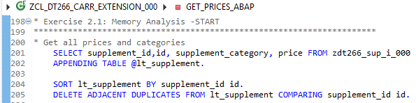</kbd></td>
           <td><kbd>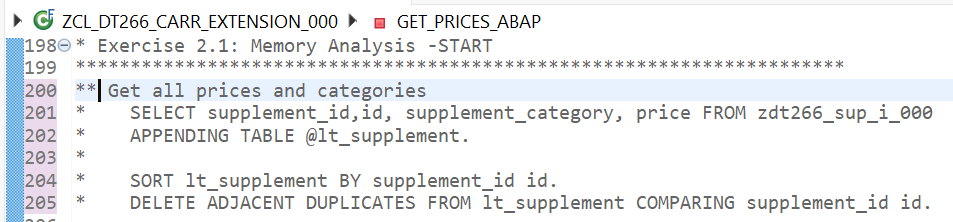</kbd></td>
          </tr>
        </table>      

      By this we remove the old code where all the supplement prices and categories are selected from table **`ZDT266_SUP_I_###`**:
      - even if for the Airline ID there are no connections or bookings, so we also have no bookings,
      - independent of the supplement categories of interest (``meal, beverages, luggage``).
    
   2. Replace it with new coding where we only select by the relevant bookings (part 1 of code) or by the relevant categories (part 2 of code).

      ℹ️ **It is enough to mark in the ABAP code the lines 208 to 265 and press ``Ctrl+>`` as the new coding shown below is already provided in the method but commented out:**.
      
       <table>
       <tr>
           <td>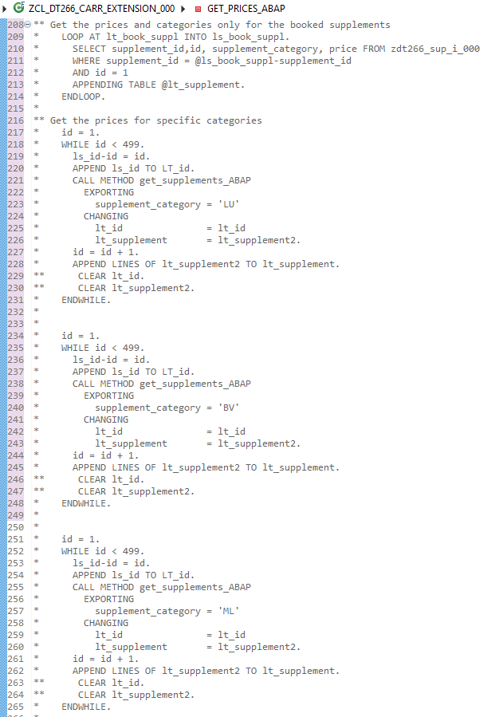</td>
           <td>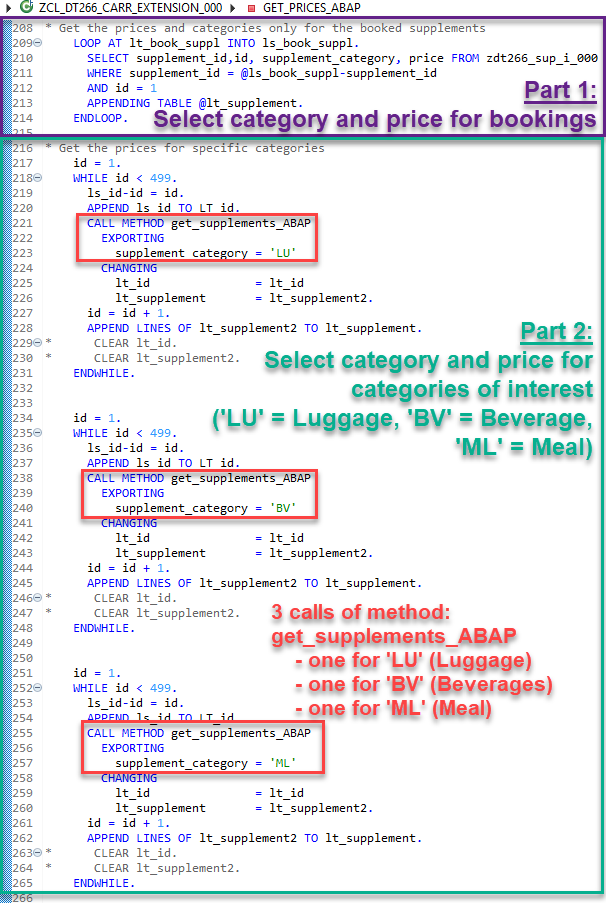</td>
       </tr>
      </table> 
      
      <br>
      
      In the second part shown above on the right side we call for all three different categories (`luggage, beverages, meal`) another method of class **`ZCL_DT266_CARR_EXTENSION_###`** called **`get_supplements_ABAP`**:

      <kbd>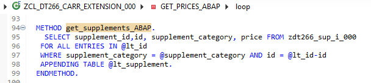</kbd>

   3. ℹ️ **The change then has to be activated by pressing ``Ctrl+F3`` or by clicking on the match icon** 
      .

   4. Run again the Fiori App for **Airline ID = 'AA'**. Now it fails with the Out-of-Memory error **`TSV_TNEW_PAGE_ALLOC_FAILED`**:

      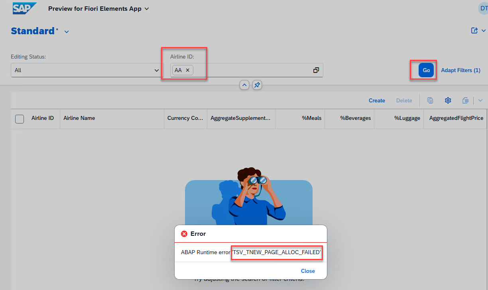

</details>


 ## Exercise 2.2: Analysis of the Out of Memory Error with the Memory Inspector
[^Top of page](#)

> With the code change in the previous exercise [2.1 - Coding Change for Reading the Supplements](#exercise-21-coding-change-for-reading-the-supplements) an **`Out of Memory`** runtime error appears when calling the Fiori App for Airline ID = 'AA'.
> We set a breakpoint where the error appears. Then call the Fiori App for Airline ID = 'AA' again and create **`Memory Snapshots`** during this processing for the first 3 times when we hit subsequently the breakpoint.  Finally, we analyze and compare those snapshot in the **`Memory Inspector`** to find the root-cause of the high memory consumption. 

> [!IMPORTANT]    
> Prerequisite for this exercise is that you have implemented the **specific** code change in the previous exercise [2.1 - Coding Change for Reading the Supplements](#exercise-21-coding-change-for-reading-the-supplements)

 
 <details>
  <summary>🔵 Click to expand!</summary>

   1. **First analyze the error in the `Feed Reader`**:

      - In the `Feed Reader`tab perform a refresh for the **`Runtime Errors caused by me`**: 
      
        

      - A new runtime error is displayed: _**"No More memory available to add rows to an internal table"**_. 

        <kbd>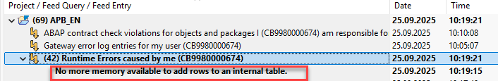</kbd>

      - In the `Summary` tab of the ``Runtime Error Viewer`` go to the **`Error Analysis`** section. 
        
        There the root cause is shown that no additional row could be appended: 

        <table>
          <tr>
           <td><kbd>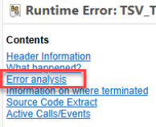</kbd></td>
           <td>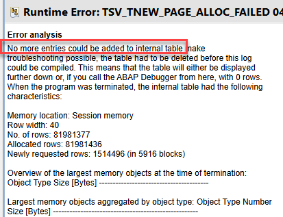</td>
          </tr>
        </table>

      - In the sections **`Information on where terminated`** and **`Source Code Extract`** we see the line where the out of memory error occured. Here we tried to append additional rows from **`lt_supplement2`** to **`lt_suppement`** which failed due to reaching the memory limit:

        <table>
            <tr>
                <td><kbd>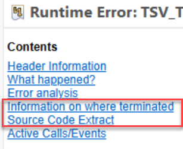</kbd></td>
                <td>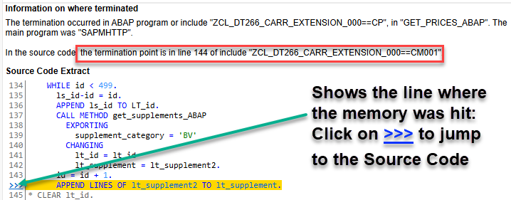</td>
            </tr>
        </table>        

      -----

   2. **Start the Debugger**:
      - In the `Source Code Extract` click on the blue marked **`>>>`**:

        <kbd></kbd>

        to navigate to the source code (where the runtime error occured). 
      
      - Add there a breakpoint:

        <kbd>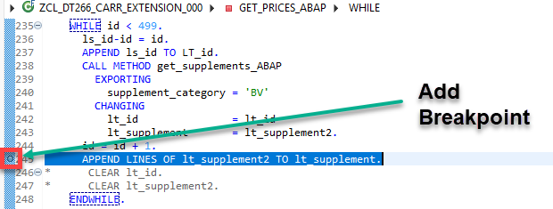</kbd>

      -----  

   3. **Create 3 Memory Snapshots as described below:**

      | Create 3 Memory Snapshots | Screenshots|
      |---|---|
      |**Process until the breakpoint:** <br> Rerun the Fiori App for **Airline ID = 'AA'**. <br> Due to the breakpoint the processing stops at line 245 the first time. | <kbd>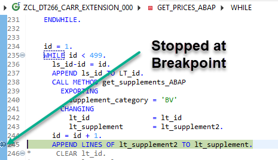</kbd> |
      | **1. Create the first memory snapshot:** <ul> <li> Go to the ABAP Debugger Actions icon () in the toolbar </li> <li> choose above in the dropdown list  **`Create Memory Snapshot`** and </li> </ul> <ul><li>  click **OK** in the pop-up </li></ul> | 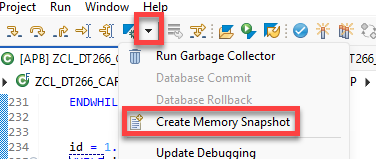 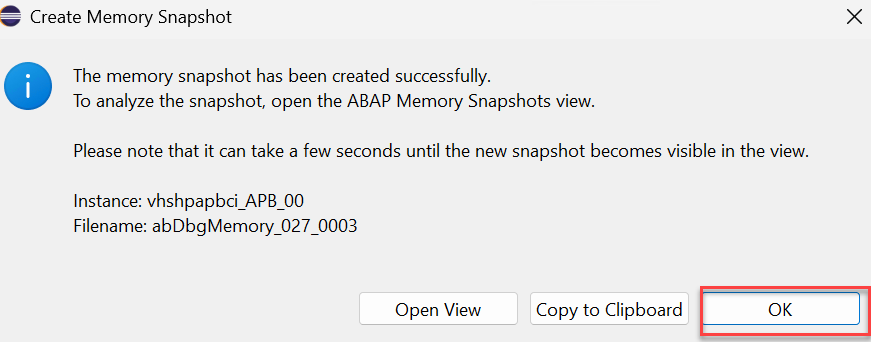 |
      |**Continue processing:** <br> The breakpoint is in a **`While Loop`** where the code inside this loop is processed for each **id = 1,2 ...** until it reaches **id = 498**. <br> By pressing **`F8`** or clicking in the menu the button **`Resume`** 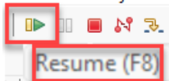 <ul><li> the ABAP code is further processed </li> <li> until we reach again the breakpoint </li> <li> as we are still in the same **`WHILE`** loop, </li> <li> but now for the next **`id`** which increased from **2** to **3** </li></ul>| <kbd>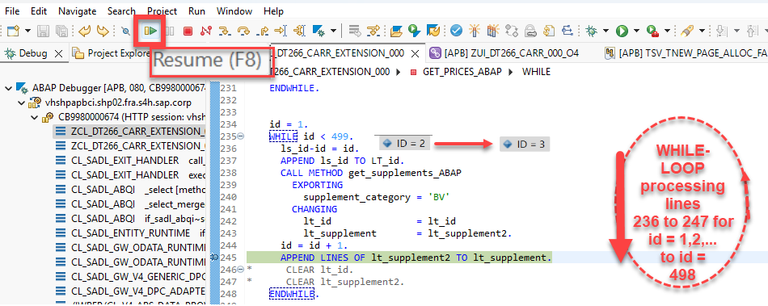</kbd> |
      | **2. Create the second memory snapshot:** <ul><li> choose above in the dropdown list  **`Create Memory Snapshot`** and </li><li> click **OK** in the pop-up </li></ul> |  |
      | **Continue processing:** <br> Press again **`F8`** or click in the menu the button **`Resume`**  <ul><li> the processing stops at same breakpoint </li> <li> as we are still in the same **`WHILE`** loop, </li> <li> but now for the next **`id`** which increased from **3** to **4** </li></ul>| <kbd>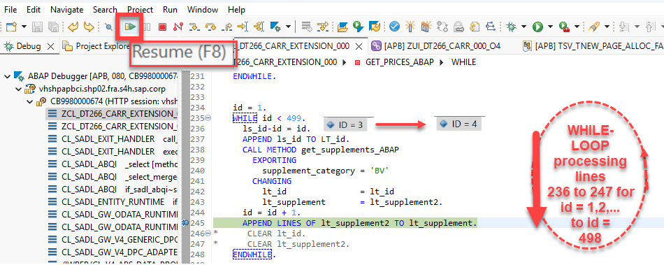</kbd> | 
      | **3. Create the third memory snapshot:** <ul><li> Choose  in the dropdown list  **`Create Memory Snapshot`**  </li><li> ⚠️**But this time click `Open View` in the pop-up** </li></ul> | 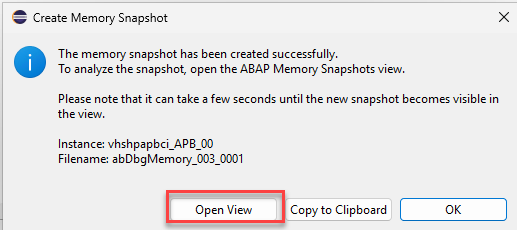 |
      |A new tab **`ABAP Memory Snapshots`** opens below in the ADT where you see 2 or 3 of your snapshots <ul><li> Alternatively, use the Quick Access (Ctrl+3) to open the ABAP Memory Snapshots tab. </li></ul> |<kbd>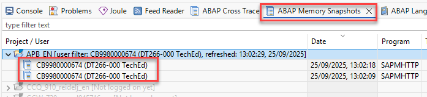</kbd>|
      | Perform a refresh by marking the line with your project and with right-click choose `Refresh`.| 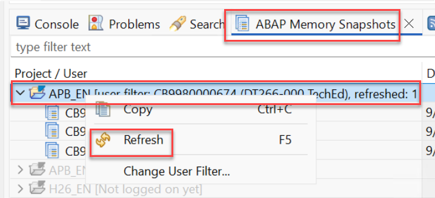|
      | Now you see all 3 snapshots  |  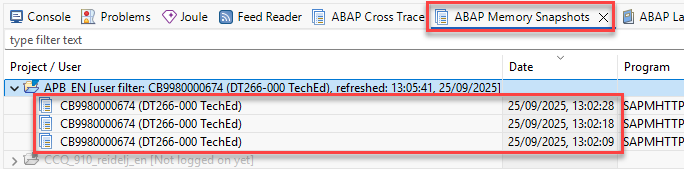|

      - ℹ️ **Terminate then directly the processing to ensure that the memory is released.**
          
         - To terminate the debugging and processing just click on the red button:

            <kbd>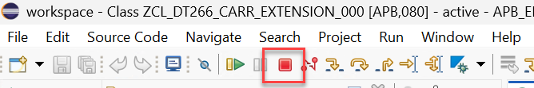</kbd>

 

      -----      

<!--

        - Rerun the Fiori App for **Airline ID = 'AA'**. Due to the breakpoint the processing stops at line 245 the first time:
        
           <kbd></kbd> 
           
        - **Create the first memory snapshot from the ABAP Debugger:** 
            - choose above in the dropdown list  **`Create Memory Snapshot`** and
            - click **OK** in the pop-up

                <table>
                <tr>
                    <td></td>
                    <td></td>
                </tr>
                </table> 

            - The breakpoint is in a **`While Loop`** where the code inside this loop is processed several times:
              It is processed for each **id = 1,2 ...** until it reaches **id = 498**: 
            - By click of **`F8`** or click in the menu the button **`Resume`**   
              - the ABAP code is further processed 
              - until we reach again the breakpoint still in the same **`WHILE`** loop,  
              - but now for the next **`id`** which increased from **2** to **3**:
           
                <kbd></kbd> 

        - **Create the second memory snapshot:**
            - choose above in the dropdown list  **`Create Memory Snapshot`** and
            - click **OK** in the pop-up
              <table>
               <tr>
                <td></td>
                <td></td>
               </tr>
              </table> 

            - Afterwards click again in the Debugger **`F8`** or choose again in the menue:
      
              .

              - The processing stops again at the same break point as we are still in the same **`WHILE`** loop, 
              - but now **`id`** has increased from **3** to **4**.
            
                <kbd></kbd>

        -   **Create the third and last memory snapshot:** 
            
            - **But this time in the pop-up click `Open View`**

              <table>
               <tr>
                <td></td>
                <td></td>
               </tr>
              </table> 
            
              A new tab **`ABAP Memory Snapshots`** opens below in the ADT where you see 2 or 3 of your snapshots:

              <kbd></kbd>

        - ℹ️ **Terminate then directly the processing to ensure that the memory is released.**
          
          - To terminate the debugging and processing just click on the red button:

            


      - Perform a refresh by marking the line with your project and with right-click choose Refresh:

        

      
      - Now we have in total 3 memory snapshots:

        

      -----  

-->


   4. **Analysis of a single Memory Snapshot:**

      By double-click on the oldest (oldest timestamp) memory snapshot the **`Overview`** of the **`Memory Inspector`** opens:

      <kbd>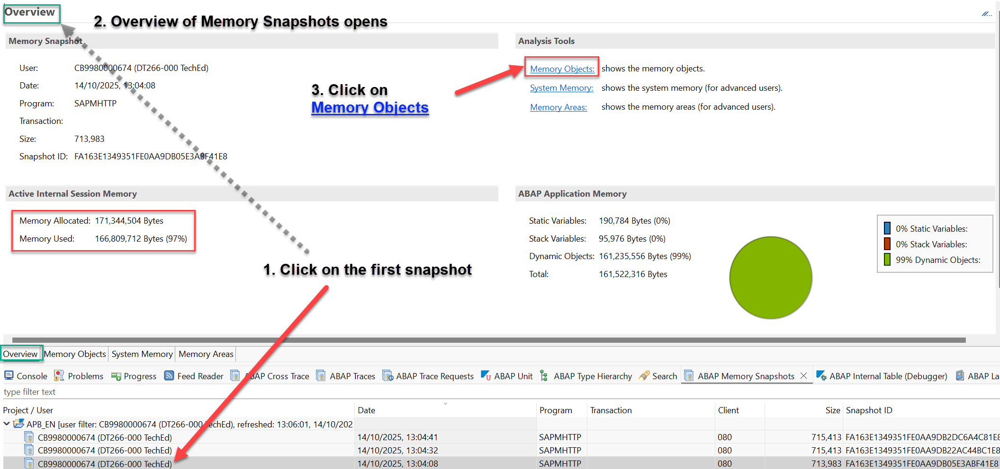</kbd>

      The **`Overview`** shows the memory consumpion of about 188 million Bytes.
      
      To analyze which objects consume so much memory select in the ``Analysis Tools`` the link **`Memory Objects`**. 

      <kbd>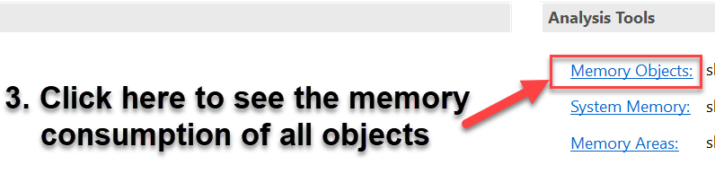</kbd>

      This view shows that nearly all the memory is consumed by **`lt_supplement`**:

      <kbd>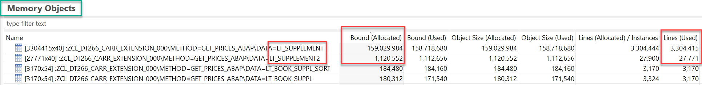</kbd>

      The session table **`lt_supplement`** has already 159,029,984 Bytes due to 3.3 million rows. 
     
      -----  

   5. **Compare the Snapshots:** 


        **Compare the first with the second snapshot:** 
        - mark both lines and by right mouse click select **`Compare`**:
        
          <kbd>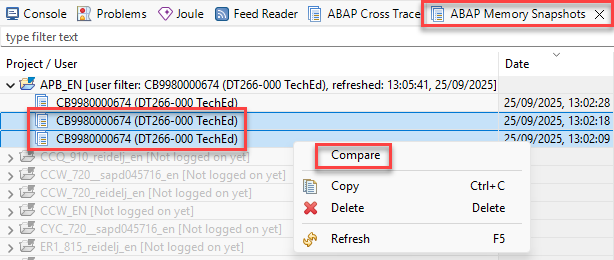</kbd>  
           
        - The **`Overview`** displayed shows now in addition the **delta** in Bytes:
           
           <kbd>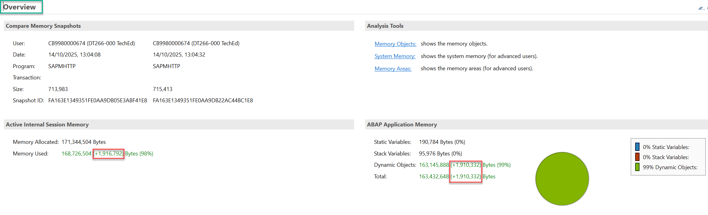</kbd> 
           
        - In the Analysis Tool **`Memory Objects`** the **Delta** is also visible on single object level: 
           
           <kbd>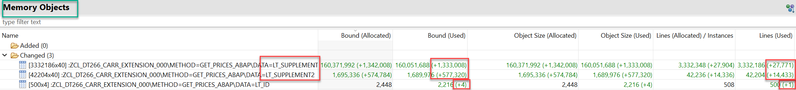</kbd> 

        **Compare in addition the last two snapshots:** 
        - mark both lines and by right mouse click **`Compare`**:
              
            <kbd>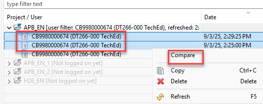</kbd> 
              
        - Select again the Analysis Tool **`Memory Objects`** where the Delta is also shown for memory and for lines / rows:
            
          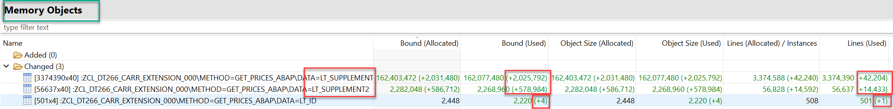 

        **From those comparisions we get:**  
        - **LT_ID** has 
            - in the first snaphot  499 rows, 
              - in the second  increased by 1 row to 500 rows, 
              - in the third increased by 1 row to 501 rows.  
            - Each additional row increased the memory by +4 Bytes (id is defined as `int4`, an integer with 4 Bytes),
        - **LT_SUPPLEMENT2** has 
            - in the first snapshot 27,771 rows, 
              - in the second increased by `14,433` rows to 42,204 rows  and the memory increased by 577,320 Bytes,
              - in the third increased by increased by `14,433` rows to 56,637 rows and the memory increased by 578,984 Bytes.
        - **LT_SUPPLEMENT** has
            - in the first snapshot 3,304,415 rows,
              - in the second increased by **`27,771`** rows to 3,332,186 rows and the memory increased by 1,333,008 Bytes,
              - in the third increased by **`42,204`** (= **`27,771`** + `14,433`) to 3,374,390 rows and the memory by 2,025,792 Bytes,
              - so it increased by the total of the
                  - previous **`27,771`** rows from LT_SUPPLEMENT2 (which we already appended before and now a further time) and
                  - the new `14,433` rows from LT_SUPPLEMENT2  
        
        **In Summary with each iteration in WHILE LOOP we:** 
        - append the new id to lt_id which is never cleared and call the method ``get_supplements_ABAP`` for this increasing list of ids.
        - append always further `14,433` results to LT_SUPPLEMENT2 (keeping the previous ones) 
        - append then all those entries (the previously already appended and the new determined) of LT_SUPPLEMENT2 again and again to LT_SUPPLEMENT.
        
        🟠 The issue is that the previous entries are never cleared. The developer of the method **`GET_PRICES_ABAP`** expected that the method **`GET_SUPPLEMENTS_ABAP`** 
        - would not return the whole list of lt_id, 
        - would return in lt_supplement2 only the new results for the new IDs and not append the new results keeping the old ones:

          <kbd></kbd>

        ℹ️ The developer of method **`GET_PRICES_ABAP`** has therefore to ensure that after each call of method **`get_supplements_ABAP`** previous results are cleared and to keep only the new determined results in lt_supplement2 before appending them to lt_supplement .

</details>

## Exercise 2.3: Correction of the ABAP Code
[^Top of page](#)

> Correct the ABAP code to avoid the Out-of-Memory runtime error **`TSV_TNEW_PAGE_ALLOC_FAILED`** by adding in the source code a clear for the previous IDs and lt_supplement2 values with **`CLEAR lt_id.`** and **`CLEAR lt_supplement2`**.


 
 <details>
  <summary>🔵 Click to expand!</summary>

   1. Switch back to the `ABAP perspective` via the Quick Access ().   

   2. To correct the ABAP code you only have to remove the comments for the CLEAR statements and also you can now delete the breakpoint:
       <table>
       <tr>
           <td>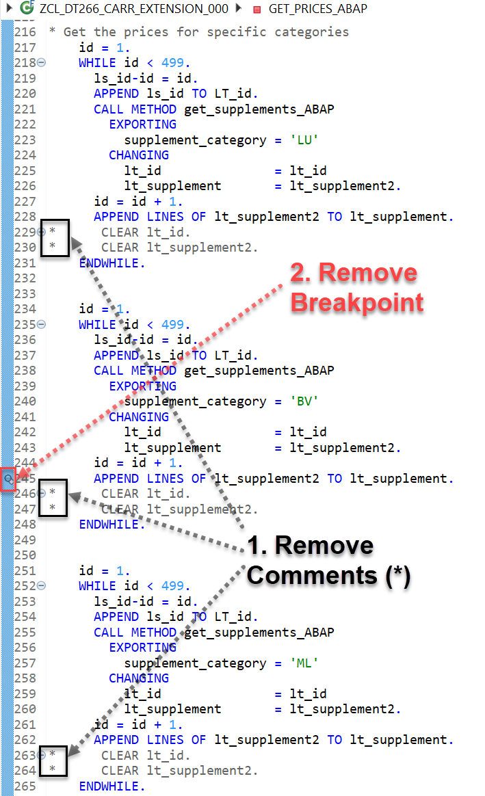</td>
           <td>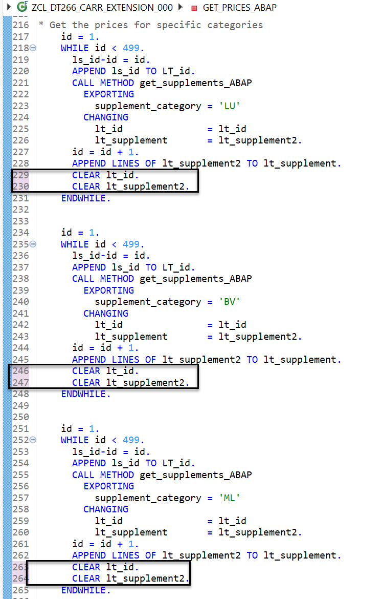</td>
       </tr>
      </table>  
      
      By this we add in the source code a clear for the previous IDs and lt_supplement2 values with **`CLEAR lt_id.`** and **`CLEAR lt_supplement2`**.


      
 

   3. ℹ️ **The change then has to be activated by pressing ``Ctrl+F3`` or by clicking on the match icon** 
      .
      
      This will solve the issue. When you rerun the Fiori app you will see no memory issue anymore.

</details>

 ## Summary & Next Exercise
 [^Top of page](#)
 
 Now that you've...
 
 - analyzed in debugger with memory snapshots a non-linearity leading to high memory consumption and finally to Out-of-Memory errors,
 - detected non-linearities which decrease performance,
 - ensured that when calling other methods or function modules in a loop  non-linearities are avoided,
 - initialized session tables (_here:_ using ABAP command `CLEAR`) to ensure that only the actual required data is processed, 
 
 you are done with the memory analysis. Congratulations! 🎉
 
 In this hands-on exercise group, you have hopefully some more insights into ADT debugger capabilities such as the Memory Inspector!
 
 Thank you for stopping by!
 
 You can now ...
 - continue with the next exercise  ► **[Exercise 3: ABAP Cross Trace](../ex03/README.md)**   
 - or return to ► **[Home - DT266](/README.md#exercises)**.
 
 ## License
 
 Copyright (c) 2024 SAP SE or an SAP affiliate company. All rights reserved. This project is licensed under the Apache Software License, version 2.0 except as noted otherwise in the [LICENSE](LICENSES/Apache-2.0.txt) file.
