 [Home - DT266](/README.md#exercises)

# Exercise 3: Usage of the ABAP Cross Trace

## Introduction

In exercise 1, we have learned to work with the **`Feed Reader`** for analysis of runtime errors. (see [Exercise 1](../ex01/README.md)). With the feed reader, you can navigate to errors in case there is already a specific error location assigned to the error. 

This is not always the case. In this exercise we get an error message on the UI with an initially unclear origin in the RAP BO stack. 

In order to understand and analyse different ABAP Cloud components which includes RAP BO implementation at runtime, the _ABAP Cross Trace_ can be used. It helps to analyse the runtime between different components like the RAP Runtime and the specific Business Object implementation.

> [!NOTE]
> For this use **`ZDT266_###`** , where **`###`** is your suffix.  

### Exercises

- [3.1 - Learn about the ABAP Cross Trace and set up a Trace Configuration](#exercise-31-learn-about-the-abap-cross-trace-and-set-up-a-trace-configuration)
- [3.2 - Analyse an error message with the ABAP Cross Trace](#exercise-32-analyse-an-error-message-with-the-abap-cross-trace)
- [3.3 - Analyse an unexpected instance modification](#exercise-33-analyse-an-unexpected-instance-modification)

### Summary:  
- [Summary & Next Exercise](#summary--next-exercise)  

## Exercises

## Exercise 3.1: Learn about the ABAP Cross Trace and set up a Trace Configuration
[^Top of page](#)

> Here we learn about the cross trace tool and how to set it up:
> 1. Access the ABAP Cross Trace Tool in ADT
> 2. Understand how to configure a ABAP Cross Trace configuration
> 3. Create an ABAP Cross Trace configuration

 
 

  
🔵 Click to expand!

  
   1. First we have to open the **`ABAP Cross Trace`** tool in the ABAP Development Tools (ADT). It can be accessed either by navigation
      **`Window`** -> **`Show View`** -> **`Other...`** or by pressing **`CTRL+3`** in ADT (and search in both cases for _Cross Trace_):

      <table>
       <tr>
           <td>
            <td> 
            <kbd>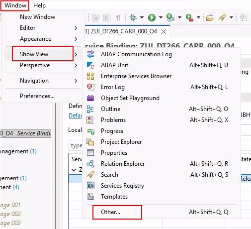
            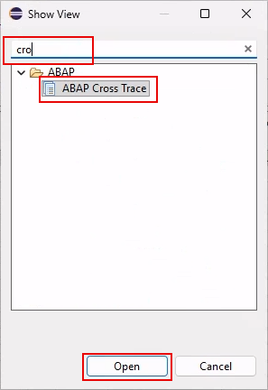 </kbd>
            </td>
           </td>
           <td><kbd>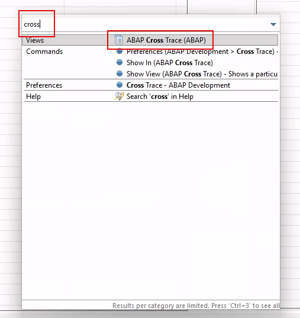</kbd></td>
       </tr>
      </table>
      

   2. This opened a new tab **`ABAP Cross Trace`** at the bottom of your ADT perspective. For this exercise, create a new personal trace configuration via right-click  and **`Create...`** in the tab **`Trace Configurations`**. 
        <kbd>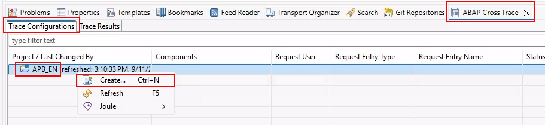</kbd>
       
   3. Now you can configure the trace configuration.  
      - Unmark **`Activate Trace`** to prevent that the trace is active immediately after trace configuration creation. This is especially useful if multiple steps are needed in order to reproduce the issue. We will activate the tracing at a later point in time, which reduces the traced transactions.
      -  Traces are deleted after a few days per default. This can by changed by manually using the time picker in section **`Deletion At`** . We do not need to modify this setting in this exercise.
      -  In order to distinguish different trace configurations, we can specify the description **`DT266 ###`** where ### is your group number. This description will be applied as a prefix to the traces created using this configuration.
      -  The default traced user is your assigned Logon User, see **`Request Filters`** field **`User`**. In case a different ABAP or business user has to be traced, it can be changed here. We do not need to change it for this exercise.
      - We can also filter for specific request entry types, e.g OData V4, RFC or transaction. The interaction in this exercise is based on a OData V4 Service Binding, therefore we choose ODATA V4 as **`Request Entry Type`** .

        <kbd>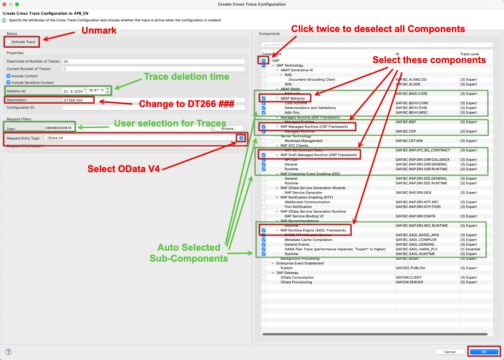</kdb>

      On the right-hand side, the traced components can be selected. This can be useful in case you already narrowed down the problem to specific frameworks or components or want to concentrate on these. You can do so by only choosing the ones in scope of your desired trace context. In general, the default can be used. In case you do not see the desired error, selecting all components can be a good strategy to ensure every traceable content is traced.

      For this exercise, we first deselect all components by clicking the selecting the top component **`SAP`** twice. This deselects all components.
      Then we select a minimal set of runtime components for this exercise:
      - ABAP Behavior
      - RAP Managed Runtime ( CSP Framework)
      - RAP Draft Managed Runtime ( DSP Framework)
      - RAP Runtime Engine ( SADL Framework )

      The sub-components are selected automatically when selecting the top component.

      After Selection, we create the configured configuration by clicking **`OK`**. The trace configuration now was created and shows up in the tab **`Trace Configurations`** as a new entry. 
  
 
  

## Exercise 3.2: Analyse an error message with the ABAP Cross Trace
[^Top of page](#)

> In the Fiori App, we produce an error message while tracing the issue with the ABAP cross trace. Afterwards we analyse the trace and track down the origin of the error message.

 
 

  
🔵 Click to expand!

  ### 1. Produce the error message 
  On List Report just in the last exercises, filter for **Airline ID = 'AA'** by entering the ID and click on **`Go`**.
  <kbd>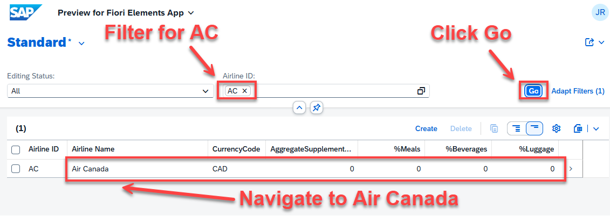</kdb
  
  Then click on the first entry in the table in order to navigate to the Object Page.
  On the Objectpage, edit the Airline by clicking **`Edit`** 
  
  <kbd>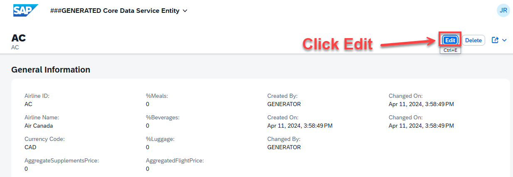</kbd>

  
 In Edit Mode, now change the Airline Name to "TechEd 2025". 
 <kbd></kbd>
 
 Afterwards save the changes by clicking **`Save`**.
 <kbd>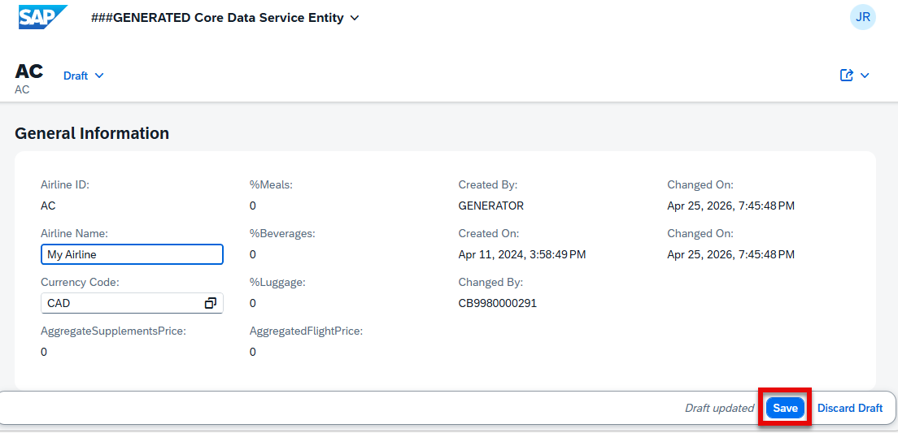</kbd>
     
Now we can see an error message: A state message with an error now shows up for the field Airline Name, stating that the field should not be initial. This state message prevents the activation of our draft instance. It seems like there might be something wrong with our RAP BO implementation.

 <kdd>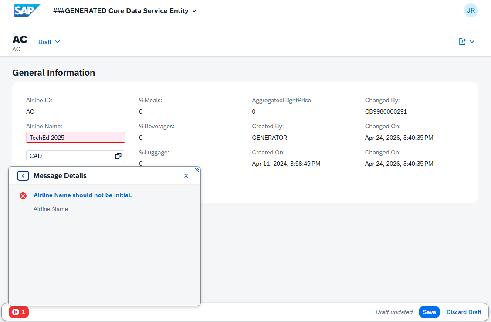</kbd> 

### 2.  Reproduce and trace the error

In contrast to runtime errors such error messages on the UI can be challenging to track down in the BO stack: sometimes the message is even thrown by other BOs participating in the same transaction which makes troubleshooting difficult. This is where the ABAP cross trace can help. 

1. In order to use the ABAP cross trace, we head back to **`ABAP Cross Trace`** view. In the tab **`Trace Configuration`** we the activate the trace configuration again in the cross trace tab with right-click and selecting **`Activate Tracing`**.

<kbd></kbd>

Then in the Fiori App, we reproduce the error by clicking save again. Then the error message is still shown on the UI:

 <kbd>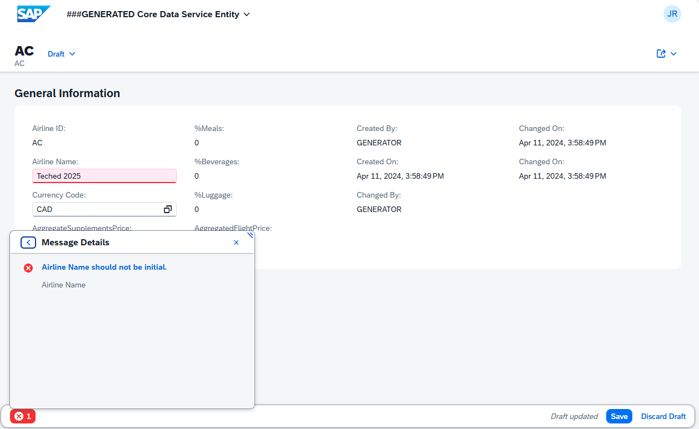</kbd> 

After reproduction, we deactivate the trace configuration again via right-click and **`Deactivate Tracing`**. 

 <kbd>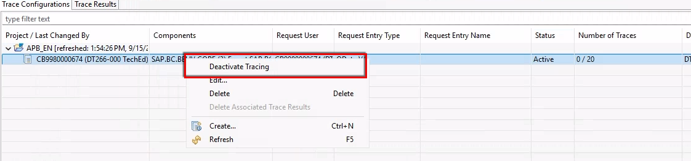</kbd> 

We now created a trace of the error which we can analyse in the next exercise. 

### 3. Analyse and solve the error

We created ABAP cross traces during reproduction of the error. In order to inspect them we navigate to the trace results by clicking the tab **`Trace Results...`**. 
<kbd>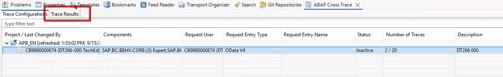</kbd>

There we can see two created traces. By double-clicking, we navigate to the trace with the property EML:READ
<kbd>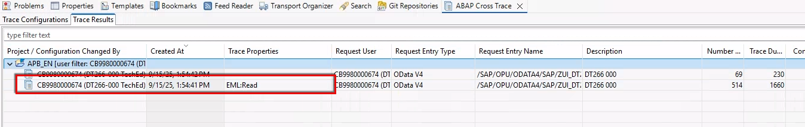</kbd>

 The trace is opened and shows a lot of information grouped into different columns:
  
 <kbd>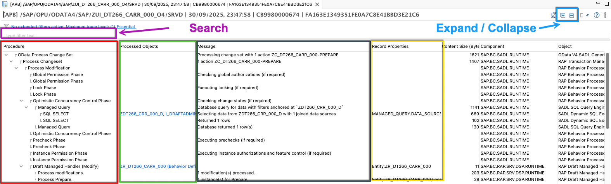</kbd> 
 
- In the Search field, the Trace can be searched
- The column **`Procedure`** on the left gives both a first indication what step was processed and how the step is nested in relation to the other procedures.
- In the column **`Processed Objects`**, specific ABAP objects that were processed during the procedure are listed, e.g. specific draft table or even action implementation. Via **`CTRL`** + click, you can even navigate to the ABAP object listed in the Processed Objects column.
- The column **`Message`** gives a more detailed but brief explanation what happened during the procedure.
- In the column **`Record Properties`**, further information is logged, such as RAP messages thrown during the transaction
- The controls in the right upper corner expand and collapse sections of the trace.

The trace with all its properties can be overwhelming. Luckily there is a search feature included in the trace view which we can use to search for the error behavior we have encountered.
 <kbd>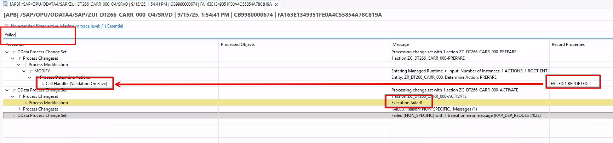</kbd> 

The error message on the UI could be created in the business object implementation, as it tries to highlight data inconsistencies. Therefore, in case of error messages on the UI, it makes a lot of sense to search for the message in the cross trace.
To do so, we use the search bar above the table and search for **`failed`** (In RAP, errors are propagated trough failed keys, they are marked as such and are searchable in the cross trace).  

The trace is filtered to entries applicable to our search term. We see that the processing of the changeset has failed. The reason for this failed execution lays in the trace entries before. There we see that the procedure "Call Handler ( Validation On Save ) has two a record property containing failed keys ( failed: 1 ).
With a double-click on the entry in the cross trace, we can expand the content which was logged. 

 <kbd>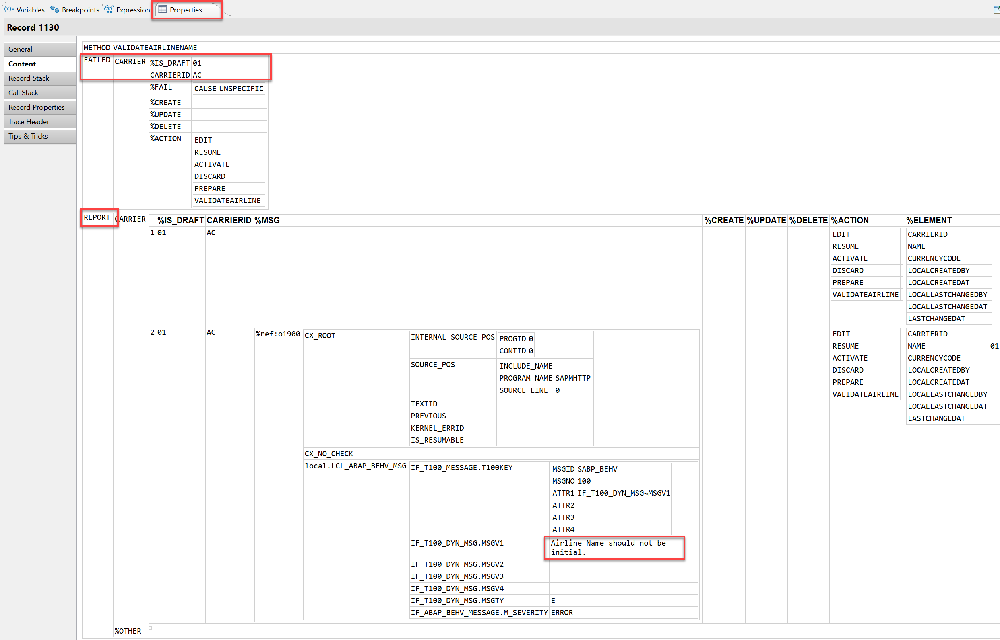</kbd> 

The double-click opened the properties view. When inspecting the traced content of the record, we can find the error message "Airline Name should not be initial" in the trace, which was logged additionally to the failed key to reported. The procedure under inspection is called "Call Handler (Validation On Save), which hints that the error message might originate from a validation on save. Therefore, we continue to search for validation procedures in the trace by searching for "validate" in the search bar:

 <kbd>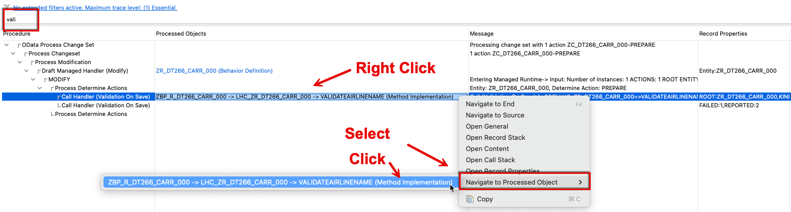</kbd> 

There we see for a procedure "Call Handler (Validation On Save) in the column processed object. In the record properties of the validation trace record we can see that this validation outputs 1 failed key and two reported messages in the column **`Record Properties`**. Therefore, we want to inspect this validation further by navigating to the validation implementation. You can reach the context menu of the record via right-click. There first select **`Navigate to Processed Objects`** and then select click on the mentioned method implementation to navigate.

After navigation, we can inspect the validation implementation:

 <kbd>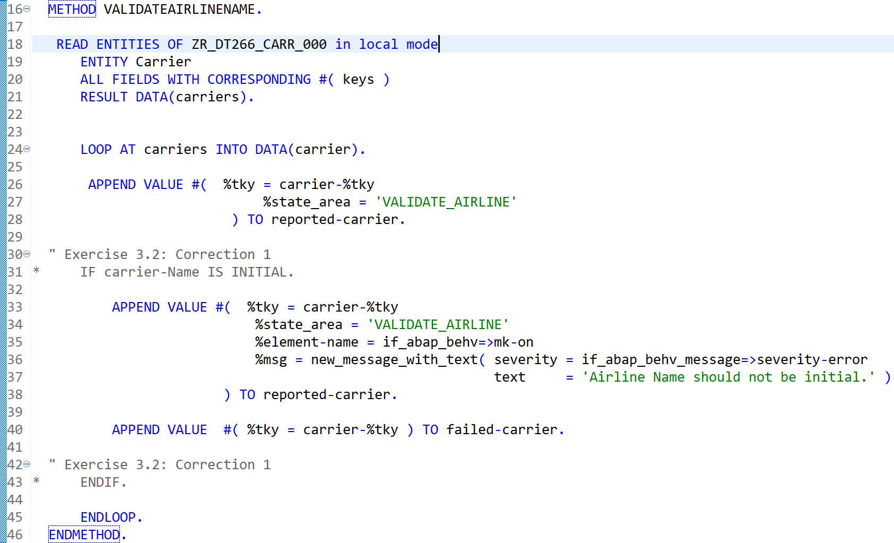 </kbd>

We can see that there is an issue in our validation: the validation always outputs an error message to fill in data without checking if the data is initial. We can fix this by inserting the code commented in line 32 and 44. After modification and activation of the changes the class should look like this:

<kbd> 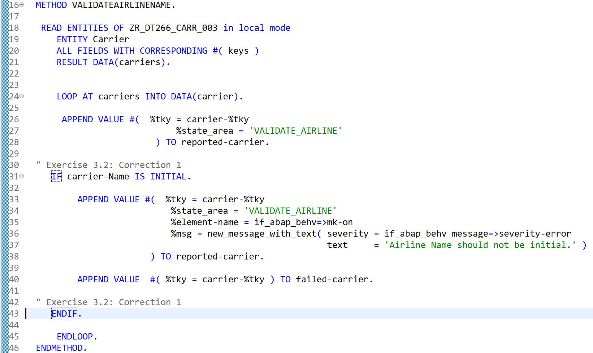 </kbd>

In order to check if the changes fix the error, we navigate back to our Fiori App. There the error is still shown. In order to check if the correction works, we try to click save again:

<kbd>  </kbd>

 This time the changes get saved successfully - the error in the validation has been mitigated: The Airline Name has been modified to "TechEd 2025". 

  <kbd> 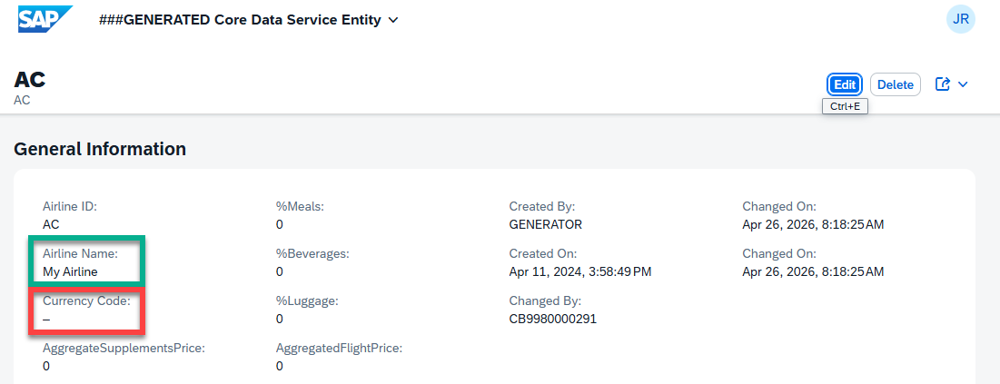 </kbd>
 
 However, the UI now shows no Currency Code, which was "USD" beforehand. This unexpected behavior is inspected in the next section of the exercise.

## Exercise 3.3: Analyse an unexpected instance modification
[^Top of page](#)

> In the Fiori App, we see unexpected modifications of our carrier instance. We reproduce the modification while tracing the issue with the ABAP cross trace. Afterwards we analyse the trace and track down the modification.

 
 

  
🔵 Click to expand!

### Reproduce the Error

In the last exercise we saw that the Currency Code field gets cleared in case an Airline with a Currency Code is saved:

<kbd>  </kbd>

We don't want to trace to much, therefore we try to get as far as possible to the state where we can reproduce the new error. For this we click the button **`Edit`** again. 

<kbd> 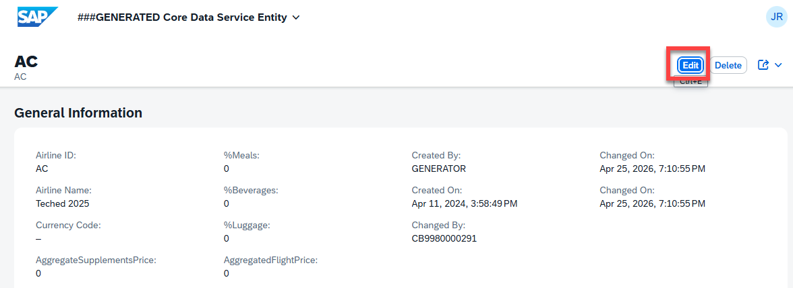 </kbd>

Afterwards we use the value help in order to select a new currency code and to fill the field, e.g. "USD".

   <table>
       <tr>
           <td><kbd>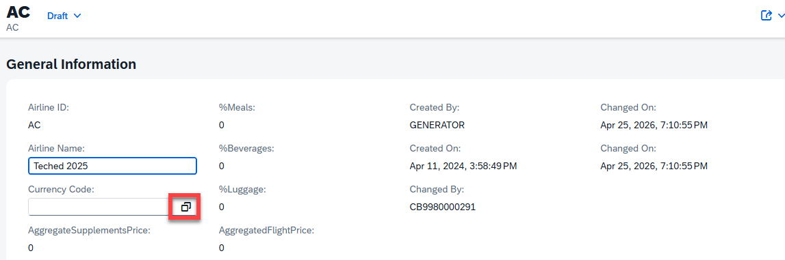</kbd></td>
           <td><kbd>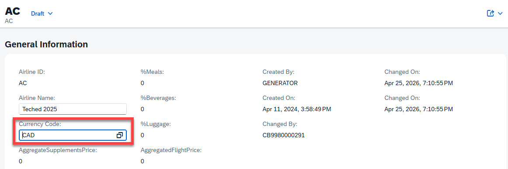</kbd></td>
       </tr>
      </table>

Before we now reproduce the error, we want to activate the ABAP cross trace configuration for tracing again. To do so, we switch to ADT and in the view **`ABAP Cross Trace`** we switch again to **`Trace Configuration`**. There we can see the trace configuration prepared in the last section and activate it again via right-click + **`Activate Tracing`**.

<kbd>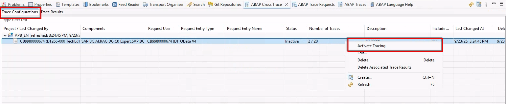</kbd>

The trace configuration should show up as "Active" again as depicted below:

<kbd>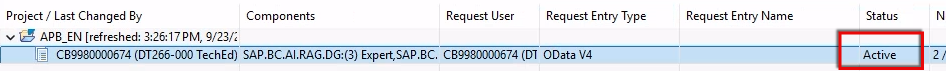</kbd> 

Now we are ready to reproduce the error. For this we go back to the Fiori UI and click **`Save`**

<kbd>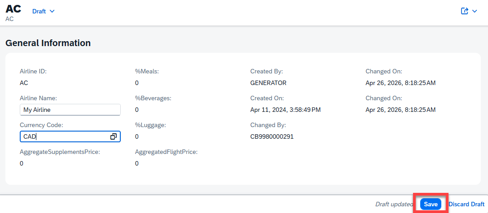</kbd> 

We successfully reproduced the error if the draft has been successfully saved, but the currency code field has been cleared again:

<kbd>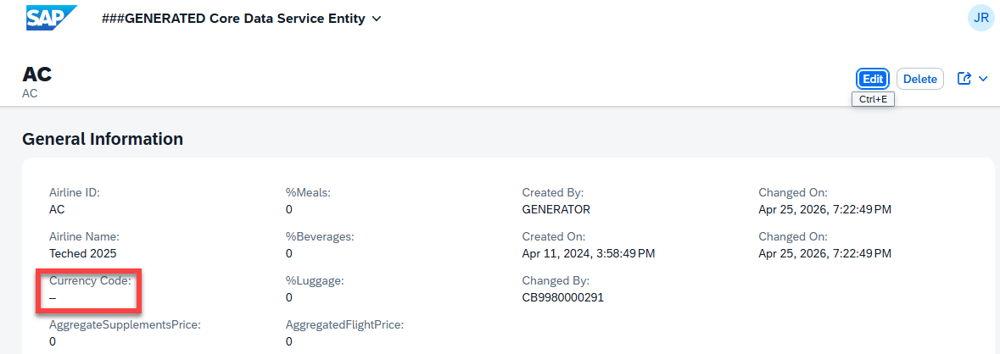</kbd> 

We now can go back to ADT and deactivate the trace configuration again to prevent further tracing. For this, in the **`Trace Configurations`** right-click on the previously created configuration and click **`Deactivate Tracing`**.

<kbd>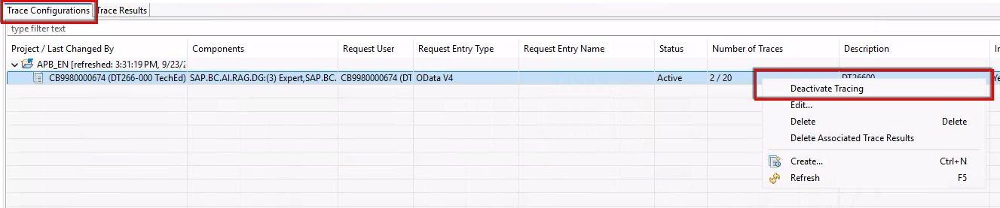</kbd> 

We now see that the Number of Traces has increased. In case the trace does not yet appear, refresh the trace records by pressing either **`F5`** or right-click **`Refresh`**. To inspect the new trace, we switch to the tab **`Trace Results`** and select the most recent, new trace and open it via double-click:

   <table>
       <tr>
           <td><kbd>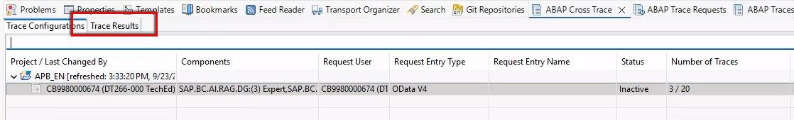</kbd></td>
           <td><kbd>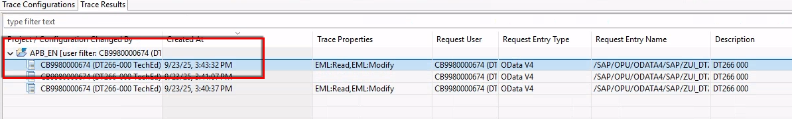</kbd></td>
       </tr>
      </table>

After double-clicking, a new trace opened. To expand the trace for further inspection, we can expand all entries using the corresponding button:

<kbd>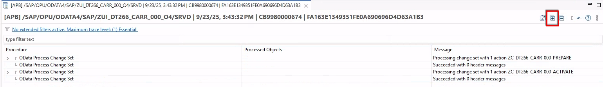</kbd> 

We can see again many entries in the trace. Therefore, we now need again an entry point to start our investigation. 

The faulty behavior seems to be a faulty modification. Therefore, we start by analysing RAP modifications logged in the trace. 
For this, we again use the search inside the trace and enter **`modify`** as a search term. Like this we can inspect all RAP modifications that were traced. We see, that the last MODIFY refers to a determination located in a RAP BO extension in the column **`Processed Objects`** This information is derived by the naming starting with "zz". 

<kbd>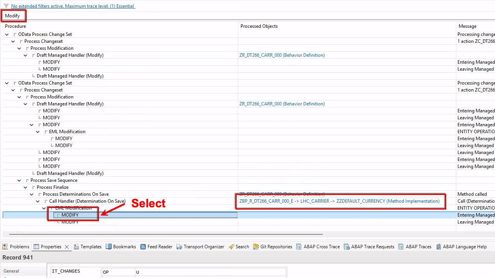</kbd> 

By selecting the MODIFY trace entry below, the tab **`Properties`** refreshes and we can inspect the data of the EML Modify:

<kbd>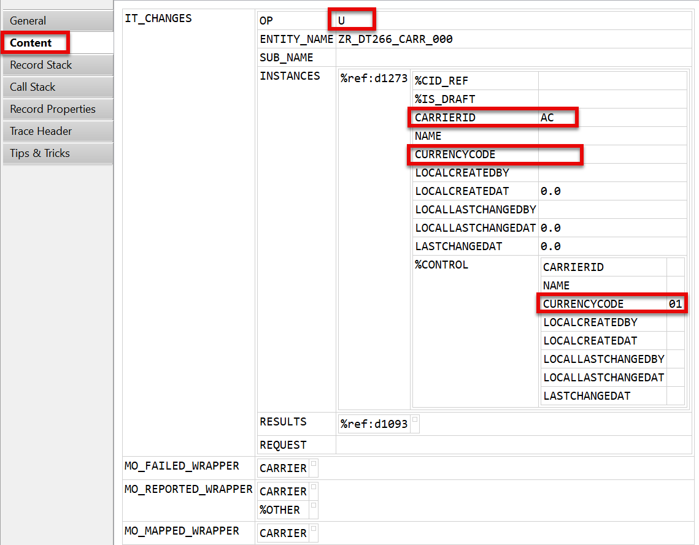</kbd> 

From the data, we can see that this MODIFY is of type update 'U', the key 'AA' matches the faulty behavior on the UI of the airline. Additionally, we can see, that the modify operation is an update for the field currency code ( %control ), and an initial value is passed for this field( currency code ). This precisely describes the observed behavior. Therefore, we navigate to the implementation via **`CTRL`** + Click. 

<kbd>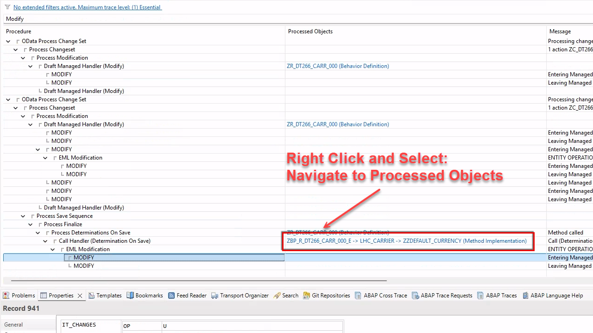</kbd> 

The now opened source code reveals a RAP determination implementation. The prefix "zz" hints, that this determination very likely is an extension to the given BO, not directly visible in the behavior implementation of the base business object. Extensions are an important part of ABAP Cloud and therefore extension coding is traced by the ABAP cross trace as well.

When further inspecting the implementation, the logic seems to be the wrong way around: it does not default initial entries. Instead, non-initial currency codes are cleared. This observation could be verified by using the ADT debugging tool presented in exercise 1. The logic below seems to be the correct way around; therefore we comment the upper section of the method and insert the correct version below. The purpose of the determination is a defaulting mechanism to set the currency code to the default 'EUR' in case no currency code is supplied initially.

   <table>
       <tr>
           <td>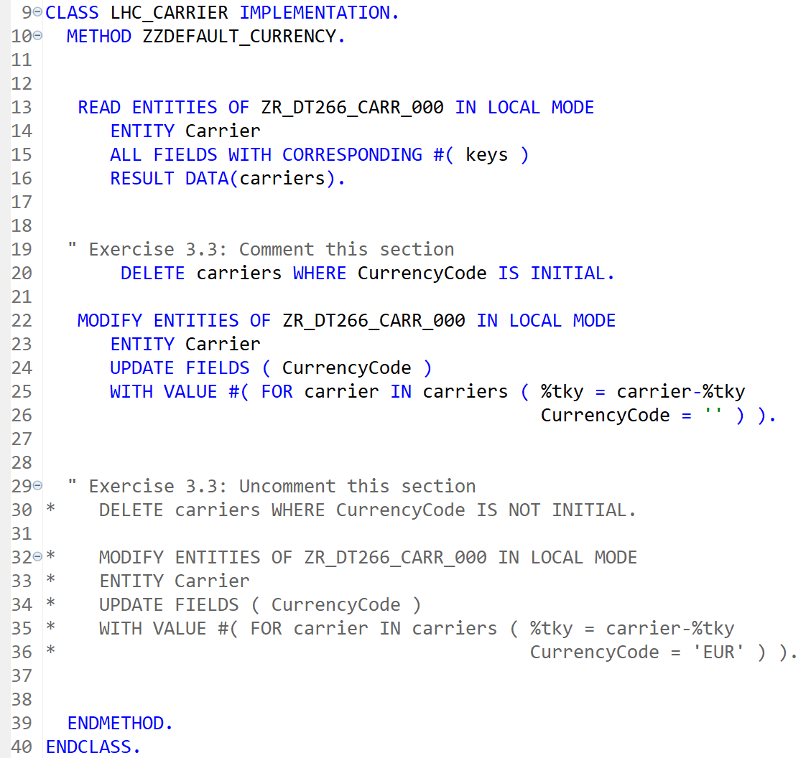</td>
           <td>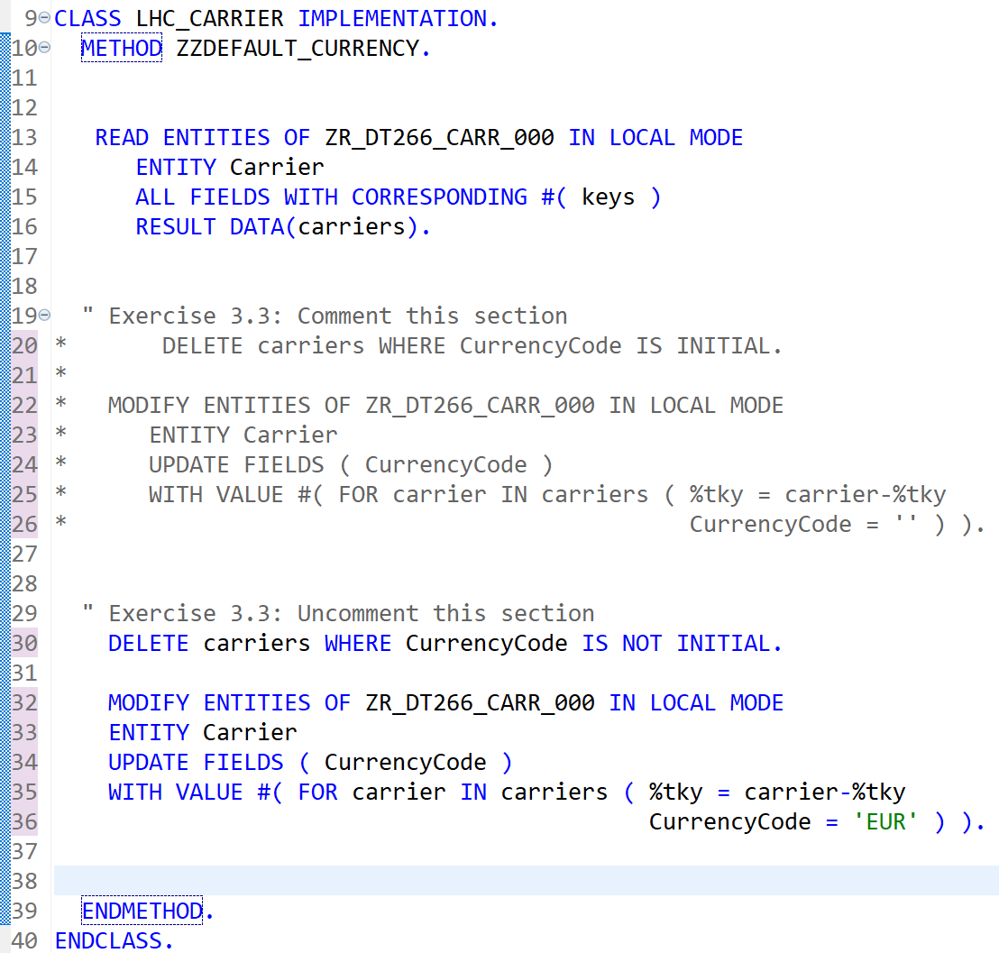</td>
       </tr>
      </table>

Afterwards, the source has to be saved and activated.

To ensure, the error has been resolved, we again try to reproduce the error in the Fiori UI by clicking **`Edit`** and selecting a new currency Code using the value help. After this, we click **`Save`**.

   <table>
       <tr>
           <td><kbd>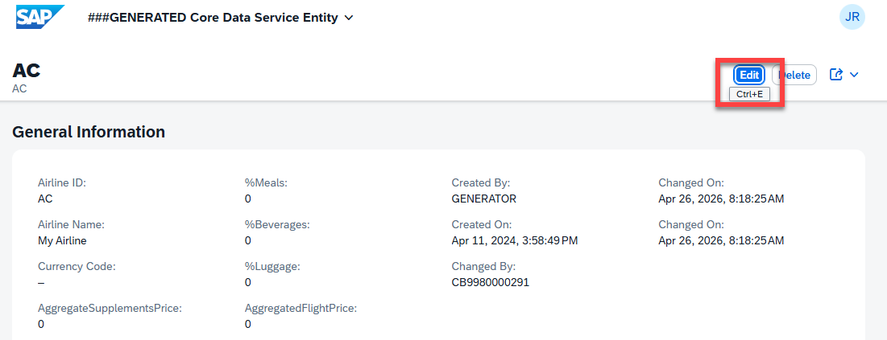</kbd></td>
           <td><kbd>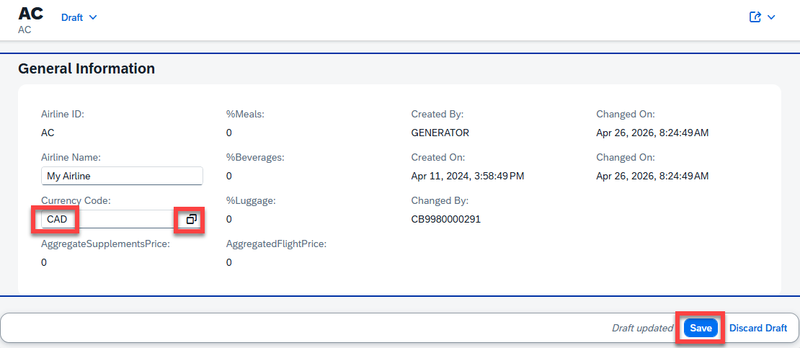</kbd></td>
       </tr>
      </table>

Now, both Airline Name and Currency Code have been saved successfully: you have traced, analysed and fixed both errors by using the ABAP Cross Trace.

<kbd>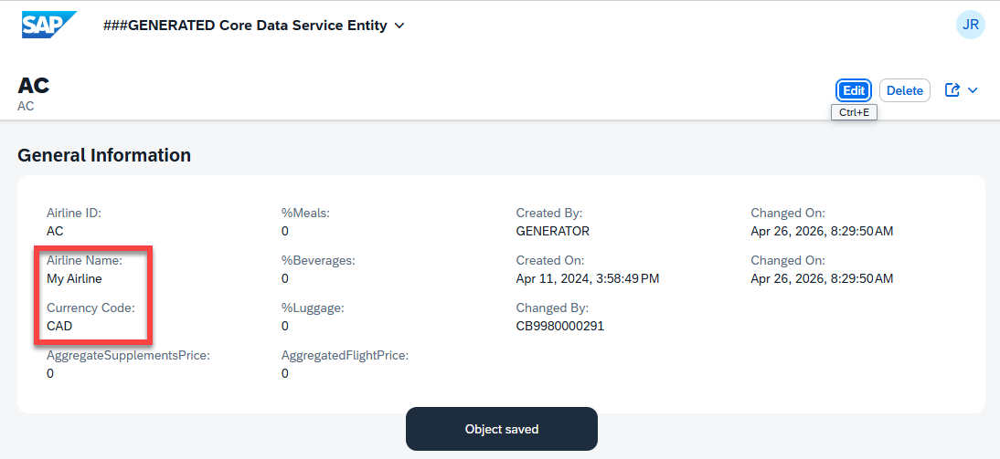</kbd> 

 ## Summary & Next Exercise
 [^Top of page](#)
 
 In this hands-on exercise group, you gained insights into the powerful ABAP Cloud trace tool ABAP cross trace, how to configure if and how to use it. 

Now that you've used the cross trace, you now can set up a ABAP cross trace configuration and use the trace tool to troubleshoot your runtime issues. You now are able trace an issue across ABAP Cloud components, narrow down the runtime scope of the error to analyse the root cause either in or between different participating components.
  
 You can now ...
 - continue with the next exercise block (B) ► **[Exercise 4: Analyse Performance Issues with ABAP Trace and Table Comparison Tool](../ex04/README.md)**   
 - or return to ► **[Home - DT266](/README.md#exercises)**.
 
 ## License
 
 Copyright (c) 2024 SAP SE or an SAP affiliate company. All rights reserved. This project is licensed under the Apache Software License, version 2.0 except as noted otherwise in the [LICENSE](LICENSES/Apache-2.0.txt) file.
