 [Home - DT266](/README.md#exercises)

# Exercise 3: Usage of the ABAP Cross Trace

## Introduction

> [!IMPORTANT]    
> **As the code changes in the previous exercises are prerequisites for this Exercise 3 and/or for the** [Exercise 4](../ex04/README.md)**:**
> - Prerequisite for this Exercise 3 is that you have at least implemented the code change of  [Exercise 1.1 - Runtime Error Analysis with the Feed Reader](../ex01/README.md##exercise-11-runtime-error-analysis-with-the-feed-reader).
> - Prerequisite for the [Exercise 4](../ex04/README.md) is that you implemented in addition the code changes of 
>   - [Exercise 2.1 - Coding Change for Reading the Supplements](../ex02/README.md#exercise-21-coding-change-for-reading-the-supplements) >   - [Exercise 2.3 - Correction of the ABAP Code](../ex02/README.md#exercise-23-correction-of-the-abap-code)
> **We have provided a code snippet below to directly start with this Exercise 3 and with the** [Exercise 4](../ex04/README.md):
> - To insert directly the code containing all prerequisites first delete the complete current source code in the class **`ZCL_DT266_CARR_EXTENSION_###`**, then insert the code snippet provided below (🟡📄), and replace all occurrences of the placeholder **`###`** with your personal suffix using the ADT function _**Replace All**_ (_**Ctrl+F**_).

**Code Snippet for** [Exercise 3](../ex03/README.md) **and/or** [Exercise 4](../ex04/README.md) **in case the code changes of the previous exercises were not yet implemented:**

 <details>
  <summary>🟡 Click to expand </summary>
  
  To completely exchange the coding in class ZCL_DT266_CARR_EXTENSION_###:**
  > - Delete the complete current source code in the class **`ZCL_DT266_CARR_EXTENSION_###`**. 
  > - Insert the code snippet provided below (🟡📄) by: 
  >   - 💡 Make use of the _Copy Raw Content_ () function to copy the provided code snippet.  
  >   - 💡 Replace all occurrences of the placeholder **`###`** with your personal suffix using the ADT function _**Replace All**_ (_**Ctrl+F**_).
  > - ℹ️ Activate the ABAP Code by pressing **`Ctrl+F3`** or by clicking on the match icon .

```<ABAP>
CLASS zcl_dt266_carr_extension_### DEFINITION
      PUBLIC
      FINAL
      CREATE PUBLIC .

  PUBLIC SECTION.
    TYPES: BEGIN OF ty_id,
             id TYPE int4,
           END OF ty_id.
    TYPES: BEGIN OF ty_carrier,
             carrier_id TYPE /dmo/carrier_id,
           END OF ty_carrier.
    TYPES: BEGIN OF ty_connection,
             carrier_id    TYPE /dmo/carrier_id,
             connection_id TYPE /dmo/connection_id,
           END OF ty_connection.
    TYPES: BEGIN OF ty_booking,
             travel_id     TYPE /dmo/travel_id,
             booking_id    TYPE /dmo/booking_id,
             carrier_id    TYPE /dmo/carrier_id,
             connection_id TYPE /dmo/connection_id,
             flight_price  TYPE /dmo/flight_price,
           END OF ty_booking.
    TYPES: BEGIN OF ty_book_suppl,
             travel_id     TYPE /dmo/travel_id,
             booking_id    TYPE /dmo/booking_id,
             "Exercise 4.4: Correction for FOR ALL ENTRIES SELECT -START
**********************************************************************
*             booking_supplement_id TYPE /dmo/booking_supplement_id,
             "Exercise 4.4: Correction for FOR ALL ENTRIES SELECT -END
**********************************************************************
             supplement_id TYPE /dmo/supplement_id,
             price         TYPE /dmo/supplement_price,
           END OF ty_book_suppl.
    TYPES: BEGIN OF ty_supplement,
             supplement_id       TYPE /dmo/supplement_id,
             id                  TYPE int4,
             supplement_category TYPE /dmo/supplement_category,
             price               TYPE /dmo/supplement_price,
           END OF ty_supplement.
    TYPES: BEGIN OF ty_cds_result_suppl,
             carrier_id           TYPE /dmo/carrier_id,
             suppl_price_sum      TYPE /dmo/supplement_price,
             suppl_price_sum_bev  TYPE /dmo/supplement_price,
             suppl_price_sum_meal TYPE /dmo/supplement_price,
             suppl_price_sum_lugg TYPE /dmo/supplement_price,
           END OF ty_cds_result_suppl.
    TYPES: BEGIN OF ty_cds_result_flight,
             carrier_id       TYPE /dmo/carrier_id,
             flight_price_sum TYPE /dmo/supplement_price,
           END OF ty_cds_result_flight.
    TYPES: BEGIN OF ty_carrier_price_sum,
             carrier_id       TYPE /dmo/carrier_id,
             suppl_price_sum  TYPE /dmo/supplement_price,
             perc_meal        TYPE int4,
             perc_bev         TYPE int4,
             perc_lugg        TYPE int4,
             flight_price_sum TYPE /dmo/supplement_price,
           END OF ty_carrier_price_sum.
    TYPES: tt_carrier_price_sum TYPE STANDARD TABLE OF ty_carrier_price_sum WITH DEFAULT KEY.
    TYPES: tt_carrier_id TYPE STANDARD TABLE OF ty_carrier WITH DEFAULT KEY.
    TYPES: tt_id TYPE STANDARD TABLE OF ty_id WITH DEFAULT KEY.
    TYPES: tt_supplement TYPE STANDARD TABLE OF ty_supplement WITH DEFAULT KEY.

    INTERFACES:
      if_oo_adt_classrun,
      if_sadl_exit_calc_element_read.
  PROTECTED SECTION.
  PRIVATE SECTION.
    METHODS get_prices_ABAP IMPORTING  lt_carrier                  TYPE tt_carrier_id
                            RETURNING
                                       VALUE(rt_carrier_price_sum) TYPE tt_carrier_price_sum
                            EXCEPTIONS zero_devide.
    METHODS get_supplements_ABAP IMPORTING supplement_category TYPE  /dmo/supplement_category
                                 CHANGING
                                           lt_supplement       TYPE tt_supplement
                                           lt_id               TYPE tt_id.
    METHODS get_prices_CDS IMPORTING lt_carrier                  TYPE tt_carrier_id
                           RETURNING
                                     VALUE(rt_carrier_price_sum) TYPE tt_carrier_price_sum.
ENDCLASS.


CLASS zcl_dt266_carr_extension_### IMPLEMENTATION.


  METHOD if_oo_adt_classrun~main.

    "    out->write( |[DT266] Run finished for ZCL_DT266_LOOP1_{ group_id }. | ).
  ENDMETHOD.


  METHOD get_supplements_ABAP.
    SELECT supplement_id,id, supplement_category, price FROM zdt266_sup_i_###
        FOR ALL ENTRIES IN @lt_id
        WHERE supplement_category = @supplement_category AND id = @lt_id-id
  APPENDING TABLE @lt_supplement.
  ENDMETHOD.


  METHOD get_prices_ABAP.

    DATA:
      group_id              TYPE string VALUE '###',
      id                    TYPE int4,
      ls_id                 TYPE ty_id,
      lt_id                 TYPE STANDARD TABLE OF ty_id,
      ls_carrier            TYPE ty_carrier,
      ls_connection         TYPE ty_connection,
      ls_booking            TYPE ty_booking,
      ls_book_suppl         TYPE ty_book_suppl,
      ls_supplement         TYPE ty_supplement,
      ls_supplement2        TYPE ty_supplement,
      ls_carrier_price_sum  TYPE ty_carrier_price_sum,
      suppl_price_sum       TYPE /dmo/supplement_price,
      suppl_price_sum_meal  TYPE /dmo/supplement_price,
      suppl_price_sum_bev   TYPE /dmo/supplement_price,
      suppl_price_sum_lugg  TYPE /dmo/supplement_price,
      flight_price_sum      TYPE /dmo/supplement_price,
      l_tabix_1             TYPE sy-tabix,
      l_tabix_2             TYPE sy-tabix,
      lt_booking_sort       TYPE SORTED TABLE OF ty_booking WITH NON-UNIQUE KEY primary_key  COMPONENTS carrier_id,
      lt_book_suppl_sort    TYPE SORTED TABLE OF ty_book_suppl WITH NON-UNIQUE KEY primary_key  COMPONENTS travel_id booking_id, supplement_id,booking_supplement_id,
      lt_supplement_sort    TYPE SORTED TABLE OF ty_supplement WITH NON-UNIQUE KEY primary_key COMPONENTS supplement_id id,
      lt_supplement_sort2   TYPE SORTED TABLE OF ty_supplement WITH NON-UNIQUE KEY primary_key COMPONENTS supplement_category
                              WITH NON-UNIQUE SORTED KEY key_id_cat COMPONENTS supplement_id id,
      lt_supplement         TYPE STANDARD TABLE OF ty_supplement
                              WITH NON-UNIQUE SORTED KEY key_id_cat COMPONENTS supplement_id id,
      lt_supplement2        TYPE STANDARD TABLE OF ty_supplement,
      lt_supplement3        TYPE STANDARD TABLE OF ty_supplement,
      lt_carrier_price_sum  TYPE STANDARD TABLE OF ty_carrier_price_sum,
      table_supplement      TYPE tabname,
      oref                  TYPE REF TO cx_root,
      text                  TYPE string.

    table_supplement = |zdt266_sup_i_{ group_id }|.

    " Select the connections for the carriers
    LOOP AT lt_carrier INTO ls_carrier.
      SELECT carrier_id, connection_id FROM /dmo/connection
      WHERE carrier_id = @ls_carrier-carrier_id
      APPENDING TABLE @DATA(lt_connection).
    ENDLOOP.

    " Select the bookings on those connections related to the different carriers
    LOOP AT lt_connection INTO ls_connection.
      SELECT travel_id, booking_id, carrier_id, connection_id, flight_price
      FROM /dmo/booking
      WHERE carrier_id = @ls_connection-carrier_id
      AND connection_id = @ls_connection-connection_id
      APPENDING TABLE @DATA(lt_booking).
    ENDLOOP.

    " Sorted tables
    lt_booking_sort = lt_booking.


    " Exercise 4.4: Compare with FAE -START
*********************************************************************
    " Get the Supplements (like beverages, meals, luggages) additionally booked.
    LOOP AT lt_booking INTO ls_booking.
      SELECT  travel_id, booking_id, supplement_id, price FROM /dmo/book_suppl
      WHERE travel_id = @ls_booking-travel_id
      AND booking_id = @ls_booking-booking_id
      APPENDING TABLE @DATA(lt_book_suppl).
    ENDLOOP.

*    SELECT  travel_id, booking_id, supplement_id, price FROM /dmo/book_suppl
*    FOR ALL ENTRIES IN @lt_booking
*    WHERE travel_id = @lt_booking-travel_id
*    AND booking_id = @lt_booking-booking_id
*    APPENDING TABLE @DATA(lt_book_suppl).
**********************************************************************
    " Exercise 4.4: Compare with FAE -END

    " Exercise 4.4: Table Comparison Tool -START
**********************************************************************
*    LOOP AT lt_booking INTO ls_booking.
*      SELECT  * FROM /dmo/book_suppl
*      WHERE travel_id = @ls_booking-travel_id
*      AND booking_id = @ls_booking-booking_id
*      APPENDING TABLE @DATA(lt_book_suppl3).
*    ENDLOOP.
*    SORT lt_book_suppl BY travel_id booking_id supplement_id price.
*    SORT lt_book_suppl2 BY travel_id booking_id supplement_id price.
*    SORT lt_book_suppl3 BY travel_id booking_id supplement_id price.
**********************************************************************
    " Exercise 4.4: Table Comparison Tool --END

    " Sorted tables
    lt_book_suppl_sort = lt_book_suppl.


    IF lt_book_suppl IS NOT INITIAL.
      " Exercise 2.1: Memory Analysis -START
**********************************************************************
      " Get all prices and categories
*      SELECT supplement_id,id, supplement_category, price FROM zdt266_sup_i_###
*      APPENDING TABLE @lt_supplement.
*
*      SORT lt_supplement BY supplement_id id.
*      DELETE ADJACENT DUPLICATES FROM lt_supplement COMPARING supplement_id id.


      " Get the prices and categories only for the booked supplements
    LOOP AT lt_book_suppl INTO ls_book_suppl.
      SELECT supplement_id,id, supplement_category, price FROM zdt266_sup_i_###
      WHERE supplement_id = @ls_book_suppl-supplement_id
      AND id = 1
      APPENDING TABLE @lt_supplement.
    ENDLOOP.

      " Get the prices for specific categories
    id = 1.
    WHILE id < 499.
      ls_id-id = id.
      APPEND ls_id TO LT_id.
      CALL METHOD get_supplements_ABAP
        EXPORTING
          supplement_category = 'LU'
        CHANGING
          lt_id               = lt_id
          lt_supplement       = lt_supplement2.
      id = id + 1.
      APPEND LINES OF lt_supplement2 TO lt_supplement.
      CLEAR lt_id.
      CLEAR lt_supplement2.
    ENDWHILE.


    id = 1.
    WHILE id < 499.
      ls_id-id = id.
      APPEND ls_id TO LT_id.
      CALL METHOD get_supplements_ABAP
        EXPORTING
          supplement_category = 'BV'
            CHANGING
          lt_id               = lt_id
          lt_supplement       = lt_supplement2.
      id = id + 1.
      APPEND LINES OF lt_supplement2 TO lt_supplement.
      CLEAR lt_id.
      CLEAR lt_supplement2.
    ENDWHILE.


    id = 1.
    WHILE id < 499.
      ls_id-id = id.
      APPEND ls_id TO LT_id.
      CALL METHOD get_supplements_ABAP
        EXPORTING
          supplement_category = 'ML'
        CHANGING
          lt_id               = lt_id
          lt_supplement       = lt_supplement2.
      id = id + 1.
      APPEND LINES OF lt_supplement2 TO lt_supplement.
      CLEAR lt_id.
      CLEAR lt_supplement2.
    ENDWHILE.


      " Sorted tables
    lt_supplement_sort = lt_supplement.
**********************************************************************
      " Exercise 2.1: Memory Analysis -End
    ENDIF.


    " Sorting tables for using BINARY SEARCH before the first LOOP starts.
    SORT lt_supplement BY supplement_id id.
    SORT lt_book_suppl BY travel_id booking_id supplement_id.
*    SORT lt_booking BY carrier_id.

    LOOP AT lt_carrier INTO ls_carrier.
      suppl_price_sum = 0.
      suppl_price_sum_meal = 0.
      suppl_price_sum_bev = 0.
      suppl_price_sum_lugg = 0.
      flight_price_sum = 0.


      "*" Exercise 4.3: READ TABLE -START
**********************************************************************
      LOOP AT lt_booking_sort INTO ls_booking WHERE carrier_id = ls_carrier-carrier_id.
        LOOP AT lt_book_suppl_sort INTO ls_book_suppl
        WHERE travel_id = ls_booking-travel_id AND booking_id = ls_booking-booking_id.
          READ TABLE lt_supplement INTO ls_supplement
          WHERE supplement_id = ls_book_suppl-supplement_id AND id = 1.
*          WITH KEY key_id_cat COMPONENTS supplement_id = ls_book_suppl-supplement_id  id = 1.
*
          "// Option 1: Consider to sort the table lt_supplement before the LOOP AT by the key fields for which we access the table and use BINARY SEARCH:
*            READ TABLE lt_supplement INTO ls_supplement
*            WITH KEY  supplement_id = ls_book_suppl-supplement_id  id = 1 BINARY SEARCH.
*
          "// Option 2: READ TABLE is fast when we have an as SORTED defined table where the primary key fits to the key of the WHERE Clause
          "//           lt_supplement_sort TYPE SORTED TABLE OF ty_supplement WITH NON-UNIQUE KEY primary_key COMPONENTS supplement_id id,
*         READ TABLE lt_supplement_sort INTO ls_supplement
*            WHERE supplement_id = ls_book_suppl-supplement_id AND id = 1.
**
          "// Option 3: In case the table is already defined as sorted table which does not fit to the key access we have here (supplement_id & id)
          "//           one can add ad in the definition a further SORTED KEY which fits:
          "//          lt_supplement_sort2   TYPE SORTED TABLE OF ty_supplement WITH NON-UNIQUE KEY primary_key COMPONENTS supplement_category
          "//      WITH NON-UNIQUE SORTED KEY key_id_cat COMPONENTS supplement_id id,
*            READ TABLE lt_supplement_sort2 INTO ls_supplement
*                 WITH KEY key_id_cat COMPONENTS supplement_id = ls_book_suppl-supplement_id  id = 1.

          suppl_price_sum = suppl_price_sum + ls_supplement-price.
          CASE ls_supplement-supplement_category.
            WHEN 'ML'.
              suppl_price_sum_meal = suppl_price_sum_meal + ls_supplement-price.
            WHEN 'BV'.
              suppl_price_sum_bev = suppl_price_sum_bev + ls_supplement-price.
            WHEN 'LU'.
              suppl_price_sum_lugg = suppl_price_sum_lugg + ls_supplement-price.
          ENDCASE.
        ENDLOOP.
        flight_price_sum = flight_price_sum + ls_booking-flight_price.
      ENDLOOP.
**********************************************************************
      " Exercise 4.3: READ TABLE -End


      " Exercise 4.5: Nested Loops -START
**********************************************************************
*      suppl_price_sum = 0.
*      suppl_price_sum_meal = 0.
*      suppl_price_sum_bev = 0.
*      suppl_price_sum_lugg = 0.
*      flight_price_sum = 0.
*      LOOP AT lt_booking INTO ls_booking WHERE carrier_id = ls_carrier-carrier_id.
*        LOOP AT lt_book_suppl INTO ls_book_suppl
*        WHERE travel_id = ls_booking-travel_id AND booking_id = ls_booking-booking_id.
*          LOOP AT lt_supplement INTO ls_supplement
*            WHERE supplement_id = ls_book_suppl-supplement_id AND id = 1.
*            suppl_price_sum = suppl_price_sum + ls_supplement-price.
*            CASE ls_supplement-supplement_category.
*              WHEN 'ML'.
*                suppl_price_sum_meal = suppl_price_sum_meal + ls_supplement-price.
*              WHEN 'BV'.
*                suppl_price_sum_bev = suppl_price_sum_bev + ls_supplement-price.
*              WHEN 'LU'.
*                suppl_price_sum_lugg = suppl_price_sum_lugg + ls_supplement-price.
*            ENDCASE.
*            EXIT.
*          ENDLOOP.
*        ENDLOOP.
*        flight_price_sum = flight_price_sum + ls_booking-flight_price.
*      ENDLOOP.
*
*
*      suppl_price_sum = 0.
*      suppl_price_sum_meal = 0.
*      suppl_price_sum_bev = 0.
*      suppl_price_sum_lugg = 0.
*      flight_price_sum = 0.
*      LOOP AT lt_booking_sort INTO ls_booking WHERE carrier_id = ls_carrier-carrier_id.
*        LOOP AT lt_book_suppl_sort INTO ls_book_suppl
*        WHERE travel_id = ls_booking-travel_id AND booking_id = ls_booking-booking_id.
*            LOOP AT lt_supplement_sort INTO ls_supplement
*            WHERE supplement_id = ls_book_suppl-supplement_id and id = 1.
*            suppl_price_sum = suppl_price_sum + ls_supplement-price.
*            CASE ls_supplement-supplement_category.
*              WHEN 'ML'.
*                suppl_price_sum_meal = suppl_price_sum_meal + ls_supplement-price.
*              WHEN 'BV'.
*                suppl_price_sum_bev = suppl_price_sum_bev + ls_supplement-price.
*              WHEN 'LU'.
*                suppl_price_sum_lugg = suppl_price_sum_lugg + ls_supplement-price.
*            ENDCASE.
*            EXIT.
*            ENDLOOP.
*        ENDLOOP.
*        flight_price_sum = flight_price_sum + ls_booking-flight_price.
*      ENDLOOP.
*
*      suppl_price_sum = 0.
*      suppl_price_sum_meal = 0.
*      suppl_price_sum_bev = 0.
*      suppl_price_sum_lugg = 0.
*      flight_price_sum = 0.
*      LOOP AT lt_booking_sort INTO ls_booking WHERE carrier_id = ls_carrier-carrier_id.
*        LOOP AT lt_book_suppl_sort INTO ls_book_suppl
*        WHERE travel_id = ls_booking-travel_id AND booking_id = ls_booking-booking_id.
*            LOOP AT lt_supplement INTO ls_supplement
*            USING KEY key_id_cat WHERE supplement_id = ls_book_suppl-supplement_id and id = 1.
*            suppl_price_sum = suppl_price_sum + ls_supplement-price.
*            CASE ls_supplement-supplement_category.
*              WHEN 'ML'.
*                suppl_price_sum_meal = suppl_price_sum_meal + ls_supplement-price.
*              WHEN 'BV'.
*                suppl_price_sum_bev = suppl_price_sum_bev + ls_supplement-price.
*              WHEN 'LU'.
*                suppl_price_sum_lugg = suppl_price_sum_lugg + ls_supplement-price.
*            ENDCASE.
*            EXIT.
*            ENDLOOP.
*        ENDLOOP.
*        flight_price_sum = flight_price_sum + ls_booking-flight_price.
*      ENDLOOP.
*
*
*      suppl_price_sum = 0.
*      suppl_price_sum_meal = 0.
*      suppl_price_sum_bev = 0.
*      suppl_price_sum_lugg = 0.
*      flight_price_sum = 0.
*      LOOP AT lt_booking_sort INTO ls_booking WHERE carrier_id = ls_carrier-carrier_id.
*        READ TABLE lt_book_suppl_sort TRANSPORTING NO FIELDS
*        WITH KEY travel_id = ls_booking-travel_id  booking_id = ls_booking-booking_id.
*        l_tabix_1 = sy-tabix.
*        LOOP AT lt_book_suppl_sort INTO ls_book_suppl FROM l_tabix_1.
*          IF ls_book_suppl-travel_id = ls_booking-travel_id AND ls_book_suppl-booking_id = ls_booking-booking_id.
*            READ TABLE lt_supplement TRANSPORTING NO FIELDS
*            WITH KEY key_id_cat components supplement_id = ls_book_suppl-supplement_id  id = 1.
*            l_tabix_2 = sy-tabix.
*            LOOP AT lt_supplement INTO ls_supplement USING KEY key_id_cat FROM l_tabix_2.
*              IF ls_supplement-supplement_id = ls_book_suppl-supplement_id AND ls_supplement-id = 1.
*                suppl_price_sum = suppl_price_sum + ls_supplement-price.
*                CASE ls_supplement-supplement_category.
*                  WHEN 'ML'.
*                    suppl_price_sum_meal = suppl_price_sum_meal + ls_supplement-price.
*                  WHEN 'BV'.
*                    suppl_price_sum_bev = suppl_price_sum_bev + ls_supplement-price.
*                  WHEN 'LU'.
*                    suppl_price_sum_lugg = suppl_price_sum_lugg + ls_supplement-price.
*                ENDCASE.
*                EXIT.
*              ELSE.
*                EXIT.
*              ENDIF.
*            ENDLOOP.
*          ELSE.
*            EXIT.
*          ENDIF.
*        ENDLOOP.
*        flight_price_sum = flight_price_sum + ls_booking-flight_price.
*      ENDLOOP.
*
*
*
**********************************************************************
      " Exercise 4.5: Nested Loops -End

      ls_carrier_price_sum-carrier_id = ls_carrier-carrier_id.
      ls_carrier_price_sum-suppl_price_sum = suppl_price_sum.
      IF suppl_price_sum > 0.
      ls_carrier_price_sum-perc_meal = 100 / suppl_price_sum * suppl_price_sum_meal.
      ls_carrier_price_sum-perc_bev = 100 / suppl_price_sum * suppl_price_sum_bev.
      ls_carrier_price_sum-perc_lugg = 100 / suppl_price_sum * suppl_price_sum_lugg.
      ELSE.
        ls_carrier_price_sum-perc_meal = 0.
        ls_carrier_price_sum-perc_bev = 0.
        ls_carrier_price_sum-perc_lugg = 0.
      ENDIF.
      ls_carrier_price_sum-flight_price_sum = flight_price_sum.
      APPEND ls_carrier_price_sum TO lt_carrier_price_sum.
    ENDLOOP.


    rt_carrier_price_sum = lt_carrier_price_sum.

  ENDMETHOD.


  METHOD get_prices_CDS.

    DATA:
      ls_carrier           TYPE ty_carrier,
      ls_cds_result_suppl  TYPE ty_cds_result_suppl,
      ls_cds_result_flight TYPE ty_cds_result_flight,
      ls_carrier_price_sum TYPE ty_carrier_price_sum,
      suppl_price_sum      TYPE /dmo/supplement_price,
      suppl_price_sum_meal TYPE /dmo/supplement_price,
      suppl_price_sum_bev  TYPE /dmo/supplement_price,
      suppl_price_sum_lugg TYPE /dmo/supplement_price,
      flight_price_sum     TYPE /dmo/supplement_price,
      group_id             TYPE string VALUE '###',
      lt_carrier_price_sum TYPE STANDARD TABLE OF ty_carrier_price_sum.

    SELECT
      carrierid,
      suppl_price_sum,
      suppl_price_sum_bev,
      suppl_price_sum_meal,
      suppl_price_sum_lugg
    FROM
      z_i_price_###
    FOR ALL ENTRIES IN @lt_carrier WHERE carrierid = @lt_carrier-carrier_id AND id = 2
    %_HINTS HDB 'NO_USE_HEX_PLAN'
    INTO TABLE @DATA(lt_cds_result_suppl).

    SELECT
      carrierid,
      flight_price_sum
    FROM
      z_i_price_flight
      FOR ALL ENTRIES IN @lt_carrier WHERE carrierid = @lt_carrier-carrier_id
    INTO TABLE @DATA(lt_cds_result_flight).

    SORT lt_cds_result_suppl BY carrierid.
    SORT LT_CDS_result_FLIGHT BY carrierid.

    LOOP AT lt_carrier INTO ls_carrier.
      ls_carrier_price_sum-carrier_id = ls_carrier-carrier_id.
      ls_carrier_price_sum-flight_price_sum = 0.
      ls_carrier_price_sum-suppl_price_sum = 0.
      ls_carrier_price_sum-perc_bev = 0.
      ls_carrier_price_sum-perc_meal = 0.
      ls_carrier_price_sum-perc_lugg = 0.

      READ TABLE lt_CDS_RESULT_SUPPL INTO ls_cds_result_suppl
      WITH KEY carrierid = ls_carrier-carrier_id BINARY SEARCH.
      IF sy-subrc = 0.
        ls_carrier_price_sum-suppl_price_sum = ls_cds_result_suppl-suppl_price_sum.
        IF ls_cds_result_suppl-suppl_price_sum > 0.
          ls_carrier_price_sum-perc_meal = 100 / ls_cds_result_suppl-suppl_price_sum * ls_cds_result_suppl-suppl_price_sum_meal.
          ls_carrier_price_sum-perc_bev = 100 / ls_cds_result_suppl-suppl_price_sum * ls_cds_result_suppl-suppl_price_sum_bev.
          ls_carrier_price_sum-perc_lugg = 100 / ls_cds_result_suppl-suppl_price_sum * ls_cds_result_suppl-suppl_price_sum_lugg.
        ELSE.
          ls_carrier_price_sum-perc_meal = 0.
          ls_carrier_price_sum-perc_bev = 0.
          ls_carrier_price_sum-perc_lugg = 0.
        ENDIF.
      ENDIF.
      READ TABLE lt_CDS_RESULT_FLIGHT INTO ls_cds_result_flight
      WITH KEY carrierid = ls_carrier-carrier_id BINARY SEARCH.
      IF sy-subrc = 0.
        ls_carrier_price_sum-flight_price_sum = ls_cds_result_flight-flight_price_sum.
      ENDIF.
      APPEND ls_carrier_price_sum TO lt_carrier_price_sum.
    ENDLOOP.


    rt_carrier_price_sum = lt_carrier_price_sum.

  ENDMETHOD.


  METHOD if_sadl_exit_calc_element_read~calculate.

    DATA:
      lt_carrier TYPE tt_carrier_id,
      ls_carrier TYPE ty_carrier.

    DATA lt_original_data TYPE STANDARD TABLE OF zc_dt266_carr_### WITH DEFAULT KEY.

    lt_original_data = CORRESPONDING #( it_original_data ).


    LOOP AT lt_original_data ASSIGNING FIELD-SYMBOL(<fs_original_data1>).
      ls_carrier-carrier_id = <fs_original_data1>-CarrierId.
      APPEND ls_carrier TO lt_carrier.
    ENDLOOP.

    "* Exercise 5: CDS view Analysis -START
**********************************************************************
    DATA(lt_carrier_price_sum) = get_prices_ABAP( lt_carrier = lt_carrier ).
*    DATA(lt_carrier_price_sum) = get_prices_CDS( lt_carrier = lt_carrier ).
**********************************************************************
    "* Exercise 5: CDS view Analysis -End


    LOOP AT lt_original_data ASSIGNING FIELD-SYMBOL(<fs_original_data>).
      <fs_original_data>-AggregateSupplementPrice = lt_carrier_price_sum[ carrier_id = <fs_original_data>-CarrierID ]-suppl_price_sum.
      <fs_original_data>-PercMeal = lt_carrier_price_sum[ carrier_id = <fs_original_data>-CarrierID ]-perc_meal.
      <fs_original_data>-PercBeverages = lt_carrier_price_sum[ carrier_id = <fs_original_data>-CarrierID ]-perc_bev.
      <fs_original_data>-PercLuggage = lt_carrier_price_sum[ carrier_id = <fs_original_data>-CarrierID ]-perc_lugg.
      <fs_original_data>-AggregateFlightPrice = lt_carrier_price_sum[ carrier_id = <fs_original_data>-CarrierID ]-flight_price_sum.
    ENDLOOP.

    ct_calculated_data = CORRESPONDING #(  lt_original_data ).
  ENDMETHOD.


  METHOD if_sadl_exit_calc_element_read~get_calculation_info.
  ENDMETHOD.
ENDCLASS.

```
 </details>


In exercise 1, we have learned how to work with the **`Feed Reader`** for analysis of runtime errors. (see [Exercise 1](../ex01/README.md)). With the feed reader, you can navigate to errors in case there is already a specific error location assigned to the error. 

This is not always the case. In this exercise we get an error message on the UI with an initially unclear origin in the RAP BO stack. 

In order to understand and analyse different ABAP Cloud components which includes RAP BO implementation at runtime, the _ABAP Cross Trace_ can be used. It helps to analyse the runtime between different components like the RAP Runtime and the specific Business Object implementation.

<!--
> [!NOTE]
> For this use **`ZDT266_###`** , where **`###`** is your suffix.  
-->

### Exercises

- [3.1 - Learn about the ABAP Cross Trace and set up a Trace Configuration](#exercise-31-learn-about-the-abap-cross-trace-and-set-up-a-trace-configuration)
- [3.2 - Analyse an error message with the ABAP Cross Trace](#exercise-32-analyse-an-error-message-with-the-abap-cross-trace)
- [3.3 - Analyse an unexpected instance modification](#exercise-33-analyse-an-unexpected-instance-modification)


### Summary:  
- [Summary & Next Exercise](#summary--next-exercise)  

## Exercises

## Exercise 3.1: Learn about the ABAP Cross Trace and set up a Trace Configuration
[^Top of page](#)

> Here we learn about the cross trace tool and how to set it up:
> 1. Access the ABAP Cross Trace Tool in ADT
> 2. Understand how to configure a ABAP Cross Trace Configuration
> 3. Create an ABAP Cross Trace Configuration

 
 <details>
  <summary>🔵 Click to expand!</summary>

  
   1. First we have to open the **`ABAP Cross Trace`** tool in the ABAP Development Tools (ADT). It can be accessed either by navigation
      **`Window`** -> **`Show View`** -> **`Other...`** or by click **`CTRL+3`** in ADT (and search in both cases for _Cross Trace_):

      <table>
       <tr>
           <td>
            <td> 
            <kbd>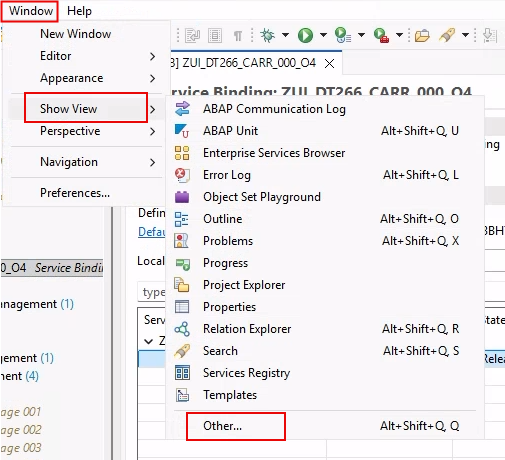
            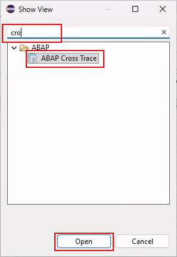 </kbd>
            </td>
           </td>
           <td><kbd>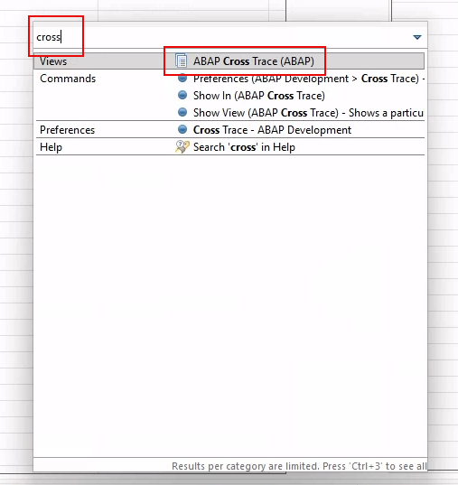</kbd></td>
       </tr>
      </table>
      

   2. This opened a new tab **`ABAP Cross Trace`** at the bottom of your ADT perspective. For this exercise, create a new personal trace configuration via right click  and **`Create...`** in the tab **`Trace Configurations`**. 
        <kbd>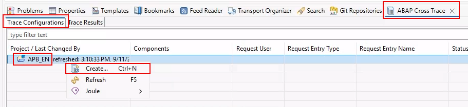</kbd>
       
   3. Now you can configure the trace configuration.  
      - Unmark **`Activate Trace`** to prevent that the trace is active immediately after trace configuration creation. This is especially useful if multiple steps are needed in order to reproduce the issue. We will activate the tracing at a later point in time, which reduces the traced transactions.
      -  Traces are deleted after a few days per default. This can be changed by manually using the time picker in section **`Deletion At`** . We do not need to modify this setting in this exercise.
      -  In order to distinguish different trace configurations, we can specify the description **`DT266 000`** where 000 is your group number. This description will be applied as a prefix to the traces created using this configuration.
      -  The default traced user is your assigned Logon User, see **`Request Filters`** field **`User`**. In case a different ABAP or business user has to be traced, it can be changed here. We do not need to change it for this exercise.
      - We can also filter for specific request entry types, e.g OData V4, RFC or transaction. The interaction in this exercise is based on a OData V4 Service Binding, therefore we choose ODATA V4 as **`Request Entry Type`** .

        <kbd>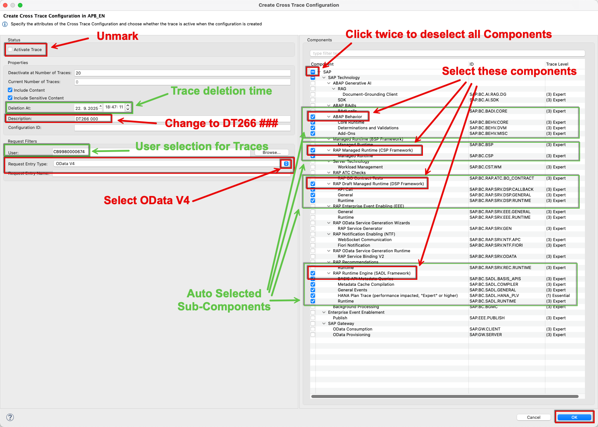</kdb>

      On the right-hand side, the traced components can be selected. This can be useful in case you already narrowed down the problem to specific frameworks or components or want to concentrate on these. You can do so by only choosing the ones in scope of your desired trace context. In general, the default can be used. In case you do not see the desired error, selecting all components can be a good strategy to ensure every traceable content is traced.

      For this exercise, we first deselect all components by clicking the selecting the top component **`SAP`** twice. This deselects all components.
      Then we select a minimal set of runtime components for this exercise:
      - ABAP Behavior
      - RAP Managed Runtime ( CSP Framework)
      - RAP Draft Managed Runtime ( DSP Framework)
      - RAP Runtime Engine ( SADL Framework )

      The sub-components are selected automatically when selecting the top component.

      After Selection, we create the configured configuration by clicking **`OK`**. The trace configuration now was created and shows up in the tab **`Trace Configurations`** as a new entry. 
  
 </details>  

## Exercise 3.2: Analyse an error message with the ABAP Cross Trace
[^Top of page](#)

> In the Fiori App, we produce an error message while tracing the issue with the ABAP cross trace. Afterwards we analyse the trace and track down the origin of the error message.

 
 <details>
  <summary>🔵 Click to expand!</summary>

  ### 1. Produce the error message 
  On List Report just in the last exercises, filter for **Airline ID = 'AC'** by entering the ID and click on **`Go`**.
  <kbd>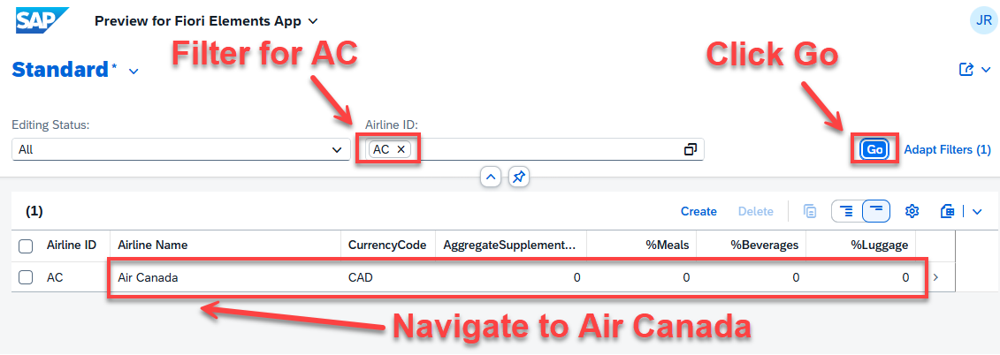</kdb>
  
  Then click on the first entry in the table in order to navigate to the Object Page.
  On the Objectpage, edit the Airline by clicking **`Edit`** 
  
  <kbd>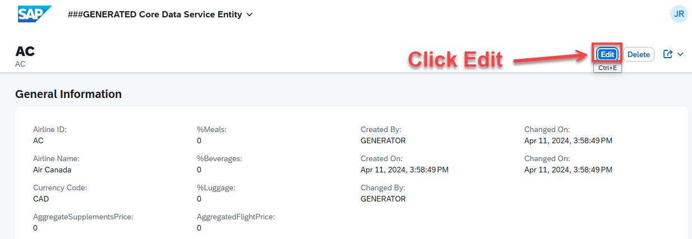</kbd>

  
 In Edit Mode, now change the Airline Name to "My Airline". 
 <kbd>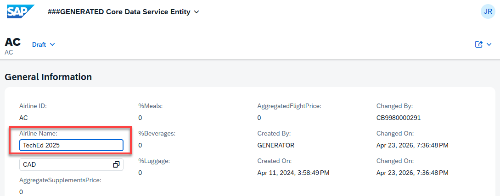</kbd>
 
 Afterwards save the changes by clicking **`Save`**.
 <kbd>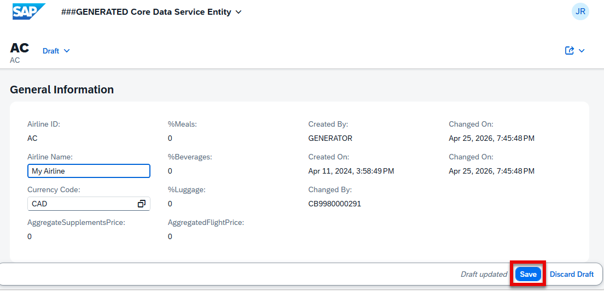</kbd>
     
Now we can see an error message: A state message with an error now shows up for the field Airline Name, stating that the field should not be initial. This state message prevents the activation of our draft instance. It seems like there might be something wrong with our RAP BO implementation.

 <kdd>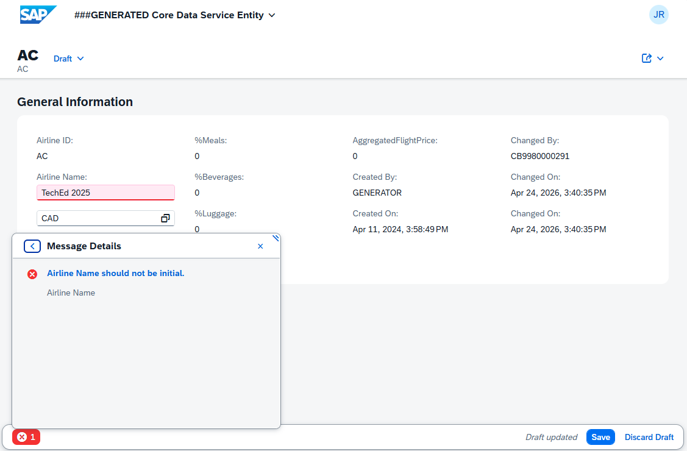</kbd> 


### 2.  Reproduce and trace the error

In contrast to runtime errors such error messages on the UI can be challenging to track down in the BO stack: sometimes the message is even thrown by other BOs participating in the same transaction which makes troubleshooting difficult. This is where the ABAP cross trace can help. 

1. In order to use the ABAP cross trace, we head back to **`ABAP Cross Trace`** view. In the tab **`Trace Configuration`** we the activate the trace configuration again in the cross trace tab with right-click and selecting **`Activate Tracing`**.

<kbd></kbd>


Then in the Fiori App, we reproduce the error by clicking save again. Then the error message is still shown on the UI:

 <kbd>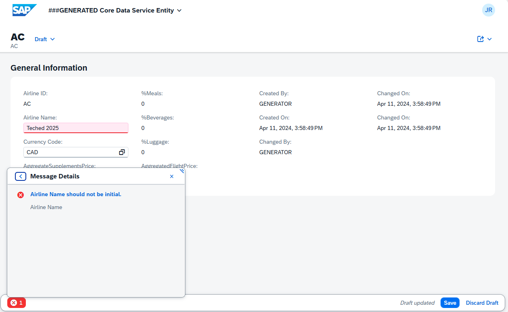</kbd> 

After reproduction, we deactivate the trace configuration again via right-click and **`Deactivate Tracing`**. 

 <kbd>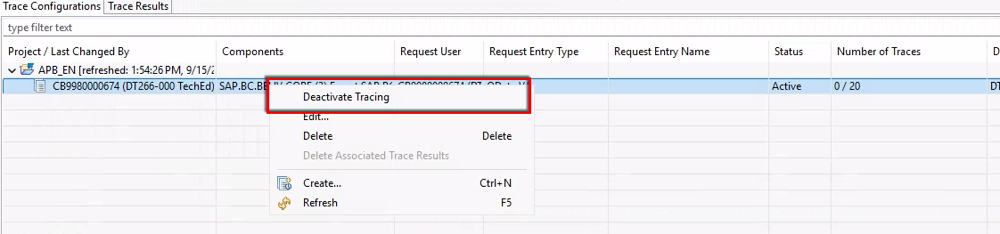</kbd> 

We now created a trace of the error which we now can analyse. 


### 3. Analyse and solve the error

We created ABAP cross traces during reproduction of the error. In order to inspect them we navigate to the trace results by clicking the tab **`Trace Results...`**. 
<kbd>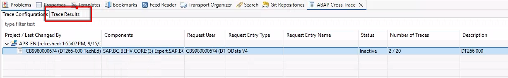</kbd>

There we can see two created traces. By double-clicking, we navigate to the trace with the property **`EML:READ`**:
<kbd>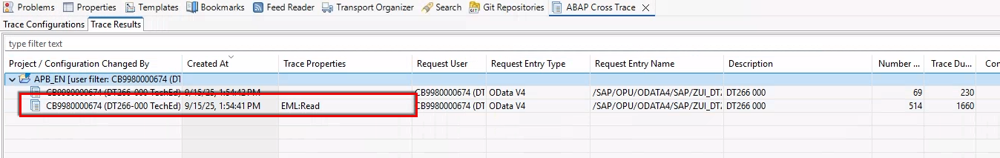</kbd>

 The trace is opened and shows a lot of information grouped into different columns:
  
 <kbd>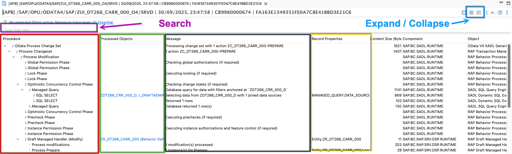</kbd> 
 
- In the Search field, the Trace can be searched.
- The column **`Procedure`** on the left gives both a first indication what step was processed and how the step is nested in relation to the other procedures in a hierarchical display. It specifies the original step of the trace record, e.g. the RAP method. In this hierarchy the begin and then end of each trace record are marked by  and . 
- In the column **`Processed Objects`**, the specific ABAP development objects that were processed during the procedure are shown, e.g. specific draft table, the class name of the exit handlers or even action implementations. 
  - Via **`CTRL`** + click, you can even navigate to the ABAP object listed in the Processed Objects column.
  - In the **`Processed Objects`** column the class name of the exit handlers which are called directly from the **`Procedure`** are shown at the beginning .
- The column **`Message`** gives a more detailed but brief explanation what happened during the procedure.
- In the column **`Record Properties`**, further information is logged, such as RAP messages thrown during the transaction. The record properties are key-value pairs and provide the keywords for filtering. 
  - The RAP messages thrown during the transaction in the column **`Record Properties`** are shown at the end  of the **`Procedure`** trace record: <br>
    <kbd>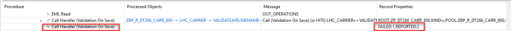</kbd>.
- The controls in the right upper corner expand and collapse sections of the trace. 

The trace with all its properties can be overwhelming. Luckily there is a search feature included in the trace view which we can use to search for the error behavior we have encountered.

#### 3a. Search for failed key(s) to find the error message in ABAP Cross Trace

The error message on the UI could be created in the business object implementation, as it tries to highlight data inconsistencies. Therefore, in case of error messages on the UI, it makes a lot of sense to search for the message in the cross trace.
To do so, we use the search bar above the table and search for **`failed`**.

🟠 _**REMARK:**_ In RAP, errors are propagated through **`failed`** keys, they are marked as such and shown in the column **`Record Properties`**. They are searchable in the cross trace.  

 <kbd>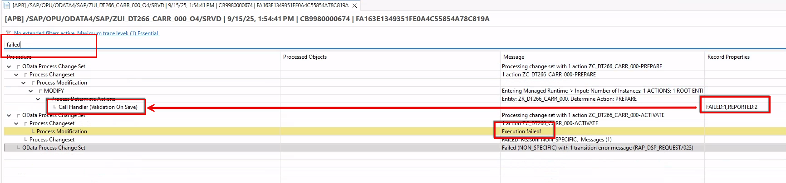</kbd> 


The trace is filtered to entries applicable to our search term. We see that the processing of the changeset has failed. The reason for this failed execution lays in the trace entries before. There we see that the procedure **`Call Handler ( Validation On Save )`** has a record property containing failed keys ( **`FAILED:1`** ).


With a right-click on the trace record in the cross trace, we open a context menu.

<kbd>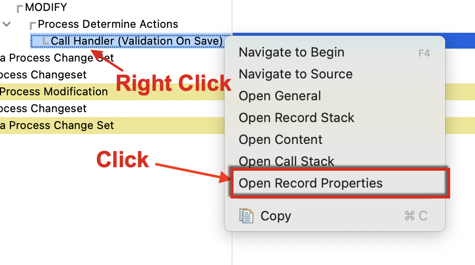</kbd> 

There we click on **`Open Content`**. This opens a view Properties in the bottom or in the right section of ADT were we can explore the Record Properties logged in the trace record. 

<kbd>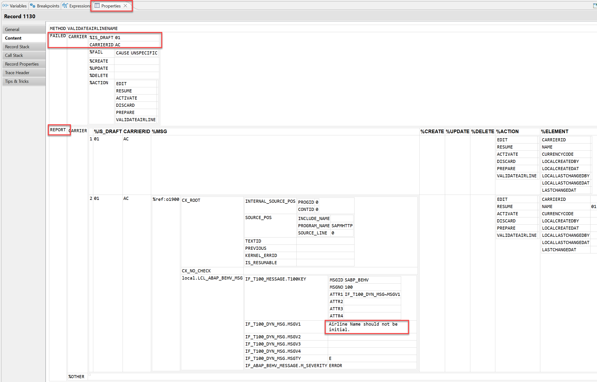</kbd> 

When inspecting the traced content of the record, we can find the error message **`Airline Name should not be initial`** in the trace, which was logged additionally to the reported failed key. The procedure under inspection is called **`Call Handler (Validation On Save)`**, which hints that the error message might originate from a validation on save. Therefore, we continue to search for validation procedures in the trace using the search term **`validation`** in the search bar.

#### 3b. New Search for the Validation Call

The previous search for **`failed`** guided us to the RAP procedure **`Call Handler (Validation On Save)`**:

<kbd></kbd>.

With this filter we just see the **End**   of the trace record for this validation on save. 

But we need also the **Begin**   of the trace record as there the processed objects (like draft tables, custom validations, etc. ) are shown:

 <kbd>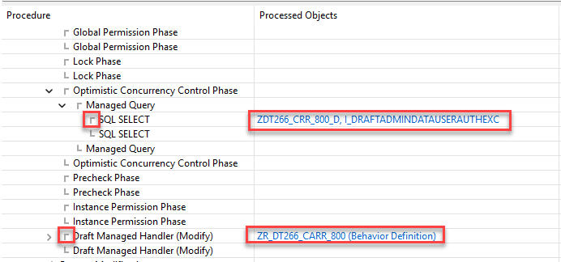</kbd>

So we perform a new search, this time for **`validation`** to have both displayed, the begin and the end of the RAP procedure **`Call Handler (Validation On Save)`** (you could also search for _call handler_, _validation on save_). 

- There we see for the procedure **`Call Handler (Validation On Save)`** an entry in the column **`Processed Objects`** at the begin of the trace record. 
- And at the end of for thís trace record we can see again that this validation outputs 1 failed key and two reported messages (in the column **`Record Properties`**). 

<kbd>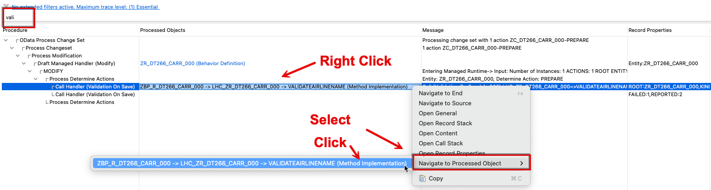</kbd> 

Now we can inspect this validation further by navigating to the validation implementation shown in the column **`Processed Objects`**. You can reach the context menu of the record via right-click. There first select **`Navigate to Processed Objects`** and then select click on the mentioned method implementation to navigate.


After navigation, we can inspect the validation implementation:

 <kbd>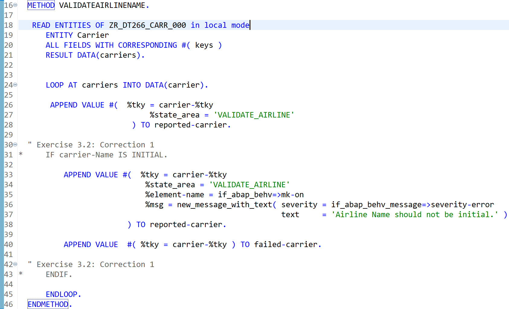 </kbd>

We can see that there is an issue in our validation: the validation always outputs an error message to fill in data without checking if the data is initial. We can fix this by inserting the code commented in line 31 and 43. After modification and activation of the changes the class should look like this:

<kbd> 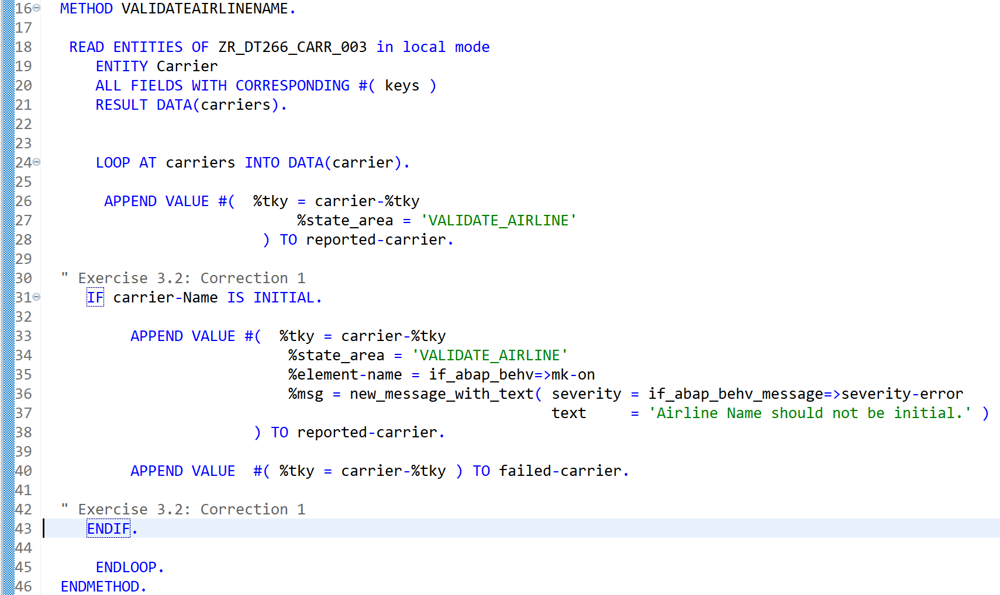 </kbd>

In order to check if the changes fix the error, we navigate back to our Fiori App. There the error is still shown. In order to check if the correction works, we try to click save again:

<kbd>  </kbd>

 This time the changes get saved successfully - the error in the validation has been mitigated: The Airline Name has been modified to "My Airline". 

  <kbd> 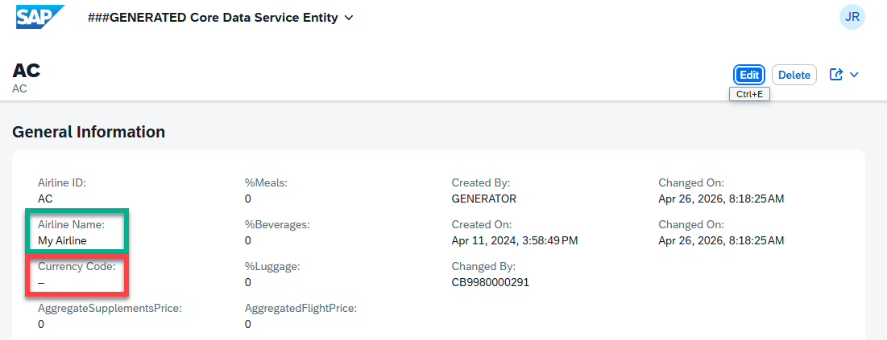 </kbd>
 
 However, the UI now shows no Currency Code, which was "CAD" beforehand. This unexpected behavior is inspected in the next section of the exercise.

</details>

## Exercise 3.3: Analyse an unexpected instance modification
[^Top of page](#)

> In the Fiori App, we see unexpected modifications of our carrier instance. We reproduce the modification while tracing the issue with the ABAP cross trace. Afterwards we analyse the trace and track down the modification.


 
 <details>
  <summary>🔵 Click to expand!</summary>

### Reproduce the Error

In the last exercise we saw that the Currency Code field gets cleared in case an Airline with a Currency Code is saved:

<kbd>  </kbd>

We don't want to trace to much, therefore we try to get as far as possible to the state where we can reproduce the new error. For this we click the button **`Edit`** again. 

<kbd> 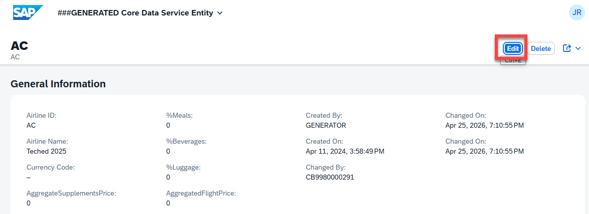 </kbd>

Afterwards we use the value help in order to select a new currency code and to fill the field, e.g. "CAD".

   <table>
       <tr>
           <td><kbd>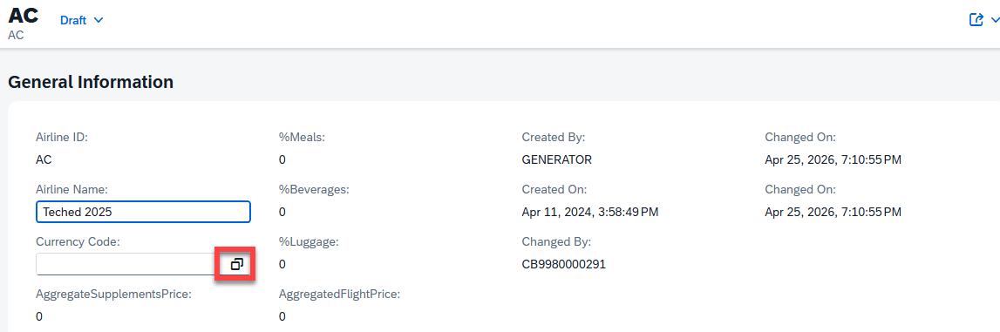</kbd></td>
           <td><kbd>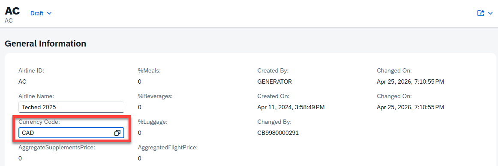</kbd></td>
       </tr>
      </table>

Before we now reproduce the error, we want to activate the ABAP cross trace configuration for tracing again. To do so, we switch to ADT and in the view **`ABAP Cross Trace`** we switch again to **`Trace Configuration`**. There we can see the trace configuration prepared in the last section and activate it again via right-click + **`Activate Tracing`**.

<kbd>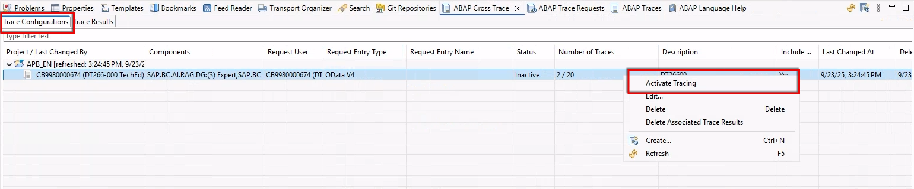</kbd>

The trace configuration should show up as "Active" again as depicted below:

<kbd>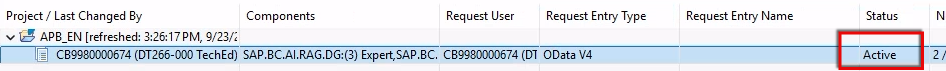</kbd> 

Now we are ready to reproduce the error. For this we go back to the Fiori UI and click **`Save`**

<kbd>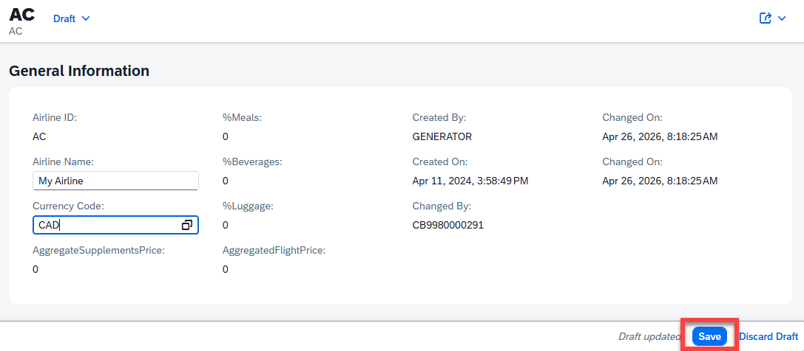</kbd> 

We successfully reproduced the error if the draft has been successfully saved, but the currency code field has been cleared again:

<kbd>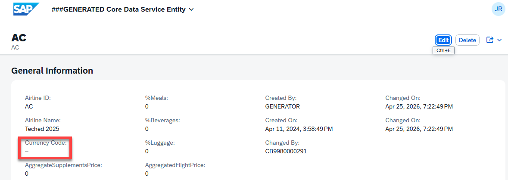</kbd> 

We now can go back to ADT and deactivate the trace configuration again to prevent further tracing. For this, in the **`Trace Configurations`** right-click on the previously created configuration and click **`Deactivate Tracing`**.

<kbd>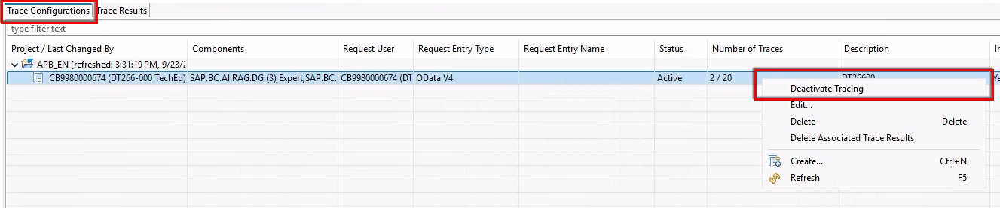</kbd> 

We now see that the Number of Traces has increased. In case the trace does not yet appear, refresh the trace records by clicking either **`F5`** or right-click **`Refresh`**. To inspect the new trace, we switch to the tab **`Trace Results`** and select the most recent, new trace and open it via right-click and open:

  
<td><kbd>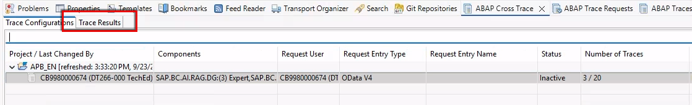</kbd></td>

<td><kbd>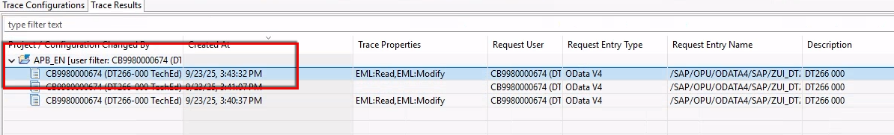</kbd></td>
     

This openes a new trace. To expand the trace for further inspection, we can expand all entries using the corresponding button:

<kbd>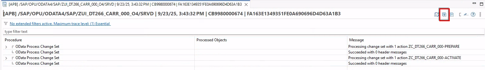</kbd> 

We can see again many entries in the trace. Therefore, we now need again an entry point to start our investigation. 

The faulty behavior seems to be a faulty modification. Therefore, we start by analysing RAP modifications logged in the trace. 
For this, we again use the search inside the trace and enter **`modify`** as a search term. Like this we can inspect all RAP modifications that were traced. We see, that the last MODIFY refers to a determination located in a RAP BO extension in the column **`Processed Objects`** This information is derived by the naming starting with "zz". 

<kbd>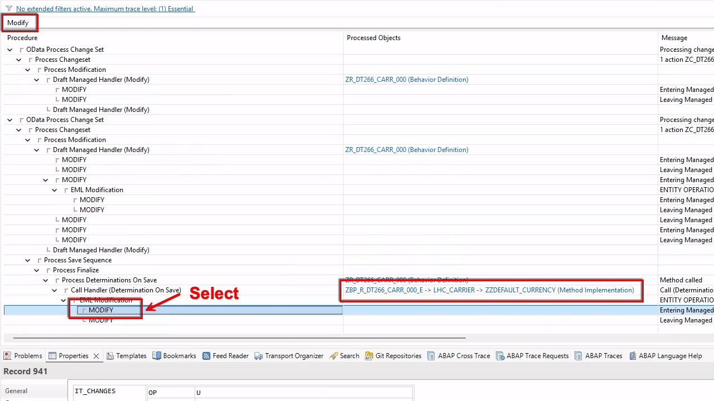</kbd> 


By selecting the MODIFY trace entry below, the tab **`Properties`** refreshes and we can inspect the data of the EML Modify:

<kbd>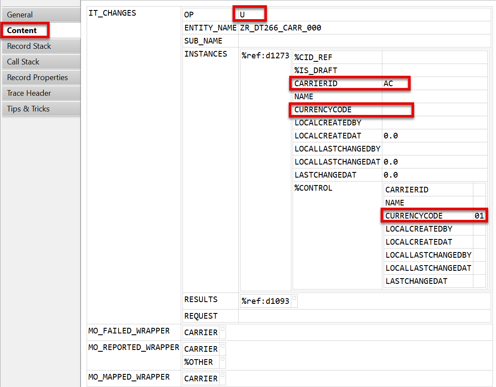</kbd> 

From the data, we can see that this MODIFY is of type update 'U', the key 'AA' matches the faulty behavior on the UI of the airline. Additionally, we can see, that the modify operation is an update for the field currency code ( %control ), and an initial value is passed for this field( currency code ). This precisely describes the observed behavior. Therefore, we navigate to the implementation again as in the section before: Select the trace entry, right click, select **`Navigate to Processed Objects`** and then click on the method implementation to navigate. 

<kbd>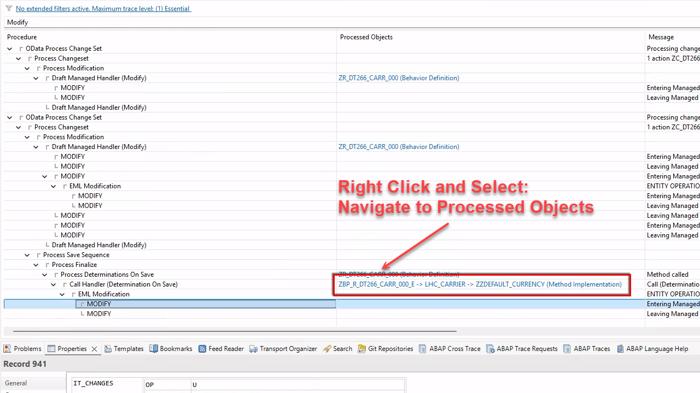</kbd> 


The now opened source code reveals a RAP determination implementation. The prefix "zz" hints, that this determination very likely is an extension to the given BO, not directly visible in the behavior implementation of the base business object. Extensions are an important part of ABAP Cloud and therefore extension coding is traced by the ABAP cross trace as well.

When further inspecting the implementation, the logic seems to be the wrong way around: it does not default initial entries. Instead, non-initial currency codes are cleared. This observation could be verified by using the ADT debugging tool presented in exercise 1. The logic below seems to be the correct way around; therefore we comment the upper section of the method and insert the correct version below. The purpose of the determination is a defaulting mechanism to set the currency code to the default 'EUR' in case no currency code is supplied initially.

   <table>
       <tr>
           <td>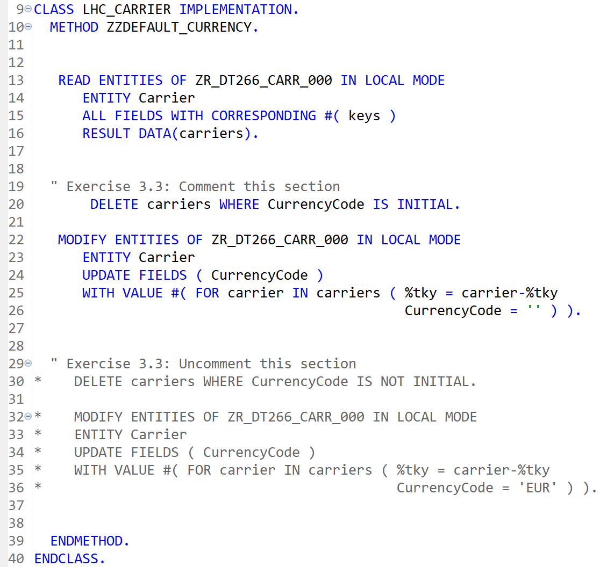</td>
           <td>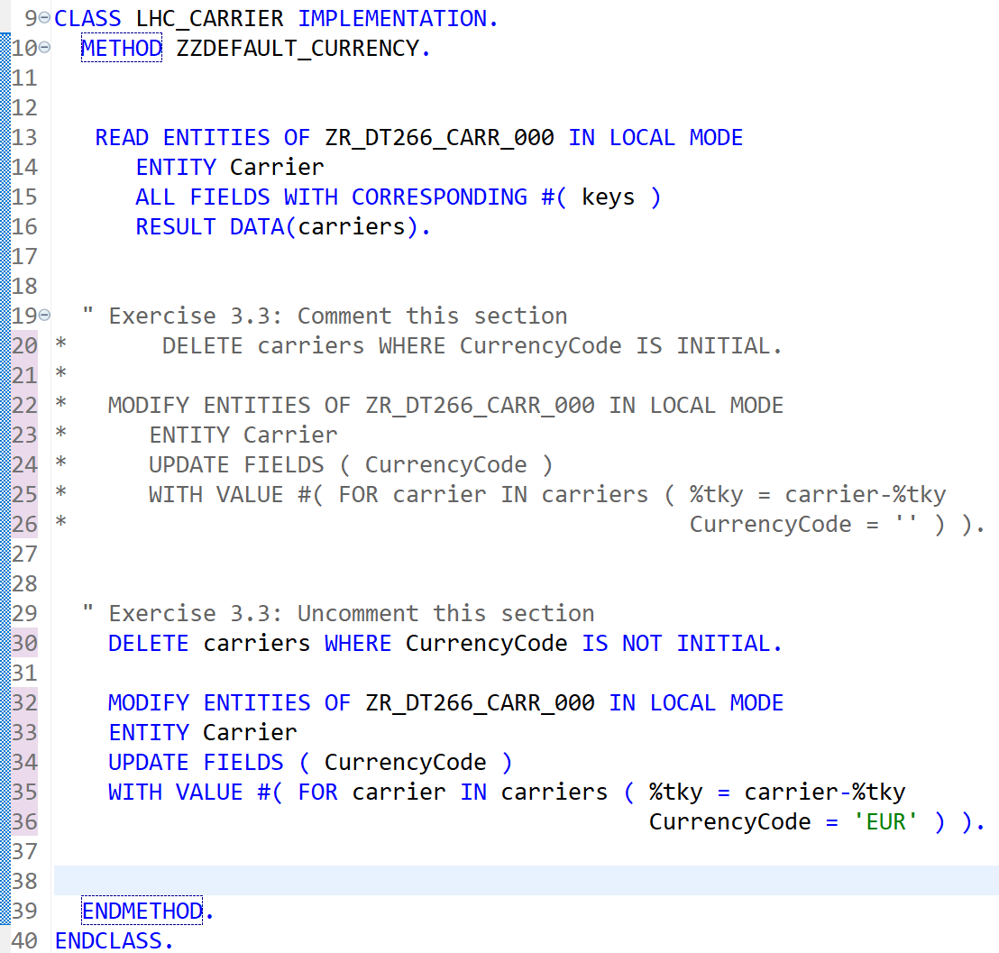</td>
       </tr>
      </table>

Afterwards, the source has to be saved and activated.

To ensure, the error has been resolved, we again try to reproduce the error in the Fiori UI by clicking **`Edit`** and selecting a new currency Code using the value help. After this, we click **`Save`**.

   <table>
       <tr>
           <td><kbd>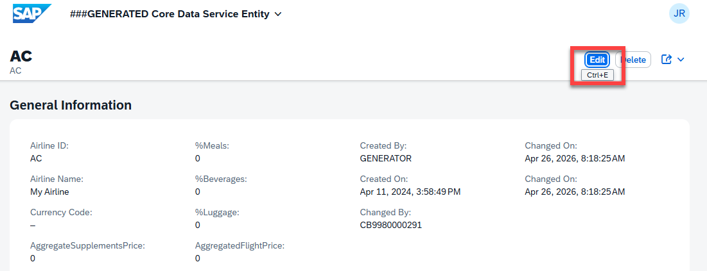</kbd></td>
           <td><kbd>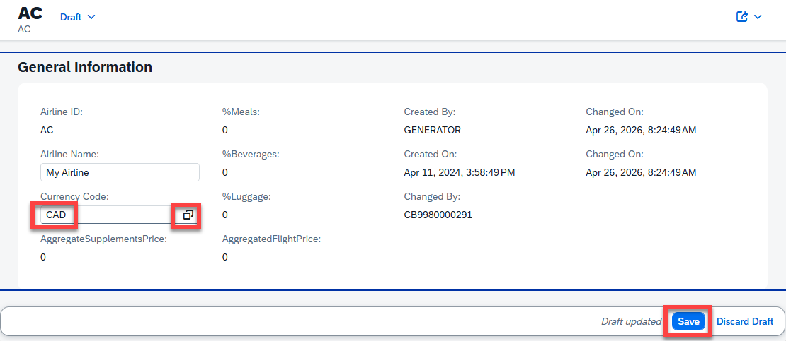</kbd></td>
       </tr>
      </table>

Now, both Airline Name and Currency Code have been saved successfully: you have traced, analysed and fixed both errors by using the ABAP Cross Trace.

<kbd>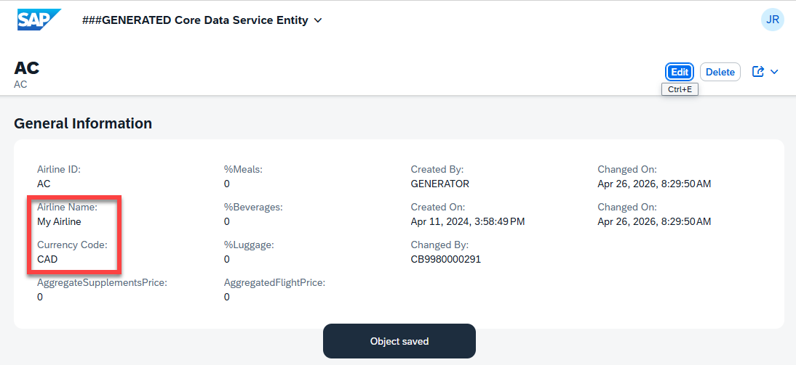</kbd> 


</details>


 ## Summary & Next Exercise
 [^Top of page](#)
 
 In this hands-on exercise group, you gained insights into the powerful ABAP Cloud trace tool ABAP cross trace, how to configure if and how to use it. 

 Now that you've used the cross trace, you now can set up a ABAP cross trace configuration to your troubleshooting needs and use it while reproducing an issue to trace across ABAP Cloud components, narrow down the runtime scope of the error to analyse the root cause either in or between different participating components.
  
 You can now ...
 - continue with the next exercise block ► **[Exercise 4: Analyse Performance Issues with ABAP Trace and Table Comparison Tool](../ex04/README.md)**   
 - or return to ► **[Home - DT266](/README.md#exercises)**.
 
 ## License
 
 Copyright (c) 2024 SAP SE or an SAP affiliate company. All rights reserved. This project is licensed under the Apache Software License, version 2.0 except as noted otherwise in the [LICENSE](LICENSES/Apache-2.0.txt) file.
