[Home - DT266](/README.md#exercises)

# Exercise 4: Analyze Performance Issues with ABAP Trace and Table Comparison Tool

## Introduction

> [!IMPORTANT]    
> Prerequisite for this exercise is that you have implemented **both specific subsequent** code changes 
> - Code change of exercise [2.1 - Coding Change for Reading the Supplements](../ex02/README.md#exercise-21-coding-change-for-reading-the-supplements)
> - Code change of exercise [2.3 - Correction of the ABAP Code](../ex02/README.md#exercise-23-correction-of-the-abap-code)
>
> **In case they are not yet implemented a code snippet is provided below to speed up the process:** In this case delete the complete current source code in the class **`ZCL_DT266_CARR_EXTENSION_000`**, insert the code snippet provided below (🟡📄), and replace all occurrences of the placeholder **`###`** with your personal suffix using the ADT function _**Replace All**_ (_**Ctrl+F**_).
     
   

     
🟡📄Click to expand and replace the source code if not performed the previous exercises!

   > - 💡 Make use of the _Copy Raw Content_ () function to copy the provided code snippet.
   > - 💡 Replace all occurrences of the placeholder **`###`** with your personal suffix using the ADT function _**Replace All**_ (_**Ctrl+F**_).

      CLASS zcl_dt266_carr_extension_### DEFINITION
      PUBLIC
      FINAL
      CREATE PUBLIC .

      PUBLIC SECTION.
        TYPES: BEGIN OF ty_id,
                id TYPE int4,
              END OF ty_id.
        TYPES: BEGIN OF ty_carrier,
                carrier_id TYPE /dmo/carrier_id,
              END OF ty_carrier.
        TYPES: BEGIN OF ty_connection,
                carrier_id    TYPE /dmo/carrier_id,
                connection_id TYPE /dmo/connection_id,
              END OF ty_connection.
        TYPES: BEGIN OF ty_booking,
                travel_id     TYPE /dmo/travel_id,
                booking_id    TYPE /dmo/booking_id,
                carrier_id    TYPE /dmo/carrier_id,
                connection_id TYPE /dmo/connection_id,
                flight_price  TYPE /dmo/flight_price,
              END OF ty_booking.
        TYPES: BEGIN OF ty_book_suppl,
                travel_id             TYPE /dmo/travel_id,
                booking_id            TYPE /dmo/booking_id,
    *Exercise 4.4: Correction for FOR ALL ENTRIES SELECT -START
    **********************************************************************
    *             booking_supplement_id TYPE /dmo/booking_supplement_id,
    *Exercise 4.4: Correction for FOR ALL ENTRIES SELECT -END
    **********************************************************************
                supplement_id         TYPE /dmo/supplement_id,
                price                 TYPE /dmo/supplement_price,
              END OF ty_book_suppl.
        TYPES: BEGIN OF ty_supplement,
                supplement_id       TYPE /dmo/supplement_id,
                id                  TYPE int4,
                supplement_category TYPE /dmo/supplement_category,
                price               TYPE /dmo/supplement_price,
              END OF ty_supplement.
        TYPES: BEGIN OF ty_cds_result_suppl,
                carrier_id           TYPE /dmo/carrier_id,
                suppl_price_sum      TYPE /dmo/supplement_price,
                suppl_price_sum_bev  TYPE /dmo/supplement_price,
                suppl_price_sum_meal TYPE /dmo/supplement_price,
                suppl_price_sum_lugg TYPE /dmo/supplement_price,
              END OF ty_cds_result_suppl.
        TYPES: BEGIN OF ty_cds_result_flight,
                carrier_id       TYPE /dmo/carrier_id,
                flight_price_sum TYPE /dmo/supplement_price,
              END OF ty_cds_result_flight.
        TYPES: BEGIN OF ty_carrier_price_sum,
                carrier_id       TYPE /dmo/carrier_id,
                suppl_price_sum  TYPE /dmo/supplement_price,
                perc_meal        TYPE int4,
                perc_bev         TYPE int4,
                perc_lugg        TYPE int4,
                flight_price_sum TYPE /dmo/supplement_price,
              END OF ty_carrier_price_sum.
        TYPES: tt_carrier_price_sum TYPE STANDARD TABLE OF ty_carrier_price_sum WITH DEFAULT KEY.
        TYPES: tt_carrier_id TYPE STANDARD TABLE OF ty_carrier WITH DEFAULT KEY.
        TYPES: tt_id TYPE STANDARD TABLE OF ty_id WITH DEFAULT KEY.
        TYPES: tt_supplement TYPE STANDARD TABLE OF ty_supplement WITH DEFAULT KEY.

        INTERFACES:
          if_oo_adt_classrun,
          if_sadl_exit_calc_element_read.
      PROTECTED SECTION.
      PRIVATE SECTION.
        METHODS get_prices_ABAP IMPORTING  lt_carrier                  TYPE tt_carrier_id
                                RETURNING
                                          VALUE(rt_carrier_price_sum) TYPE tt_carrier_price_sum
                                EXCEPTIONS zero_devide.
        METHODS get_supplements_ABAP IMPORTING supplement_category TYPE  /dmo/supplement_category
                                    CHANGING
                                              lt_supplement       TYPE tt_supplement
                                              lt_id               TYPE tt_id.
        METHODS get_prices_CDS IMPORTING lt_carrier                  TYPE tt_carrier_id
                              RETURNING
                                        VALUE(rt_carrier_price_sum) TYPE tt_carrier_price_sum.
    ENDCLASS.

    CLASS ZCL_DT266_CARR_EXTENSION_### IMPLEMENTATION.

      METHOD if_oo_adt_classrun~main.

    *    out->write( |[DT266] Run finished for ZCL_DT266_LOOP1_{ group_id }. | ).
      ENDMETHOD.

      METHOD get_supplements_ABAP.
        SELECT supplement_id,id, supplement_category, price FROM zdt266_sup_i_###
            FOR ALL ENTRIES IN @lt_id
            WHERE supplement_category = @supplement_category AND id = @lt_id-id
      APPENDING TABLE @lt_supplement.
      ENDMETHOD.

      METHOD get_prices_ABAP.

        DATA:
          group_id              TYPE string VALUE '###',
          id                    TYPE int4,
          ls_id                 TYPE ty_id,
          lt_id                 TYPE STANDARD TABLE OF ty_id,
          ls_carrier            TYPE ty_carrier,
          ls_connection         TYPE ty_connection,
          ls_booking            TYPE ty_booking,
          ls_book_suppl         TYPE ty_book_suppl,
          ls_supplement         TYPE ty_supplement,
          ls_supplement2        TYPE ty_supplement,
          ls_carrier_price_sum  TYPE ty_carrier_price_sum,
          suppl_price_sum       TYPE /dmo/supplement_price,
          suppl_price_sum_meal  TYPE /dmo/supplement_price,
          suppl_price_sum_bev   TYPE /dmo/supplement_price,
          suppl_price_sum_lugg  TYPE /dmo/supplement_price,
          flight_price_sum      TYPE /dmo/supplement_price,
          l_tabix_1             TYPE sy-tabix,
          l_tabix_2             TYPE sy-tabix,
          lt_booking_sort       TYPE SORTED TABLE OF ty_booking WITH NON-UNIQUE KEY primary_key  COMPONENTS carrier_id,
          lt_book_suppl_sort    TYPE SORTED TABLE OF ty_book_suppl WITH NON-UNIQUE KEY primary_key  COMPONENTS travel_id booking_id, supplement_id,booking_supplement_id,
          lt_supplement_sort    TYPE SORTED TABLE OF ty_supplement WITH NON-UNIQUE KEY primary_key COMPONENTS supplement_id id,
          lt_supplement_sort2   TYPE SORTED TABLE OF ty_supplement WITH NON-UNIQUE KEY primary_key COMPONENTS supplement_category
          WITH NON-UNIQUE SORTED KEY key_id_cat COMPONENTS supplement_id id,
          lt_supplement         TYPE STANDARD TABLE OF ty_supplement
          WITH NON-UNIQUE SORTED KEY key_id_cat COMPONENTS supplement_id id,
          lt_supplement2        TYPE STANDARD TABLE OF ty_supplement,
          lt_supplement3        TYPE STANDARD TABLE OF ty_supplement,
          lt_carrier_price_sum  TYPE STANDARD TABLE OF ty_carrier_price_sum,
          table_supplement      TYPE tabname,
          oref                  TYPE REF TO cx_root,
          text                  TYPE string.

        table_supplement = |zdt266_sup_i_{ group_id }|.

    * Select the connections for the carriers
        LOOP AT lt_carrier INTO ls_carrier.
          SELECT carrier_id, connection_id FROM /dmo/connection
          WHERE carrier_id = @ls_carrier-carrier_id
          APPENDING TABLE @DATA(lt_connection).
        ENDLOOP.

    * Select the bookings on those connections related to the different carriers
        LOOP AT lt_connection INTO ls_connection.
          SELECT travel_id, booking_id, carrier_id, connection_id, flight_price
          FROM /dmo/booking
          WHERE carrier_id = @ls_connection-carrier_id
          AND connection_id = @ls_connection-connection_id
          APPENDING TABLE @DATA(lt_booking).
        ENDLOOP.

    *Sorted tables
        lt_booking_sort = lt_booking.

    * Exercise 4.4: Compare with FAE -START
    **********************************************************************
    * Get the Supplements (like beverages, meals, luggages) additionally booked.
        LOOP AT lt_booking INTO ls_booking.
          SELECT  travel_id, booking_id, supplement_id, price FROM /dmo/book_suppl
          WHERE travel_id = @ls_booking-travel_id
          AND booking_id = @ls_booking-booking_id
          APPENDING TABLE @DATA(lt_book_suppl).
        ENDLOOP.

    *    SELECT  travel_id, booking_id, supplement_id, price FROM /dmo/book_suppl
    *    FOR ALL ENTRIES IN @lt_booking
    *    WHERE travel_id = @lt_booking-travel_id
    *    AND booking_id = @lt_booking-booking_id
    *    APPENDING TABLE @DATA(lt_book_suppl).
    **********************************************************************
    * Exercise 4.4: Compare with FAE -END

    * Exercise 4.4: Table Comparison Tool -START
    **********************************************************************
    *    LOOP AT lt_booking INTO ls_booking.
    *      SELECT  * FROM /dmo/book_suppl
    *      WHERE travel_id = @ls_booking-travel_id
    *      AND booking_id = @ls_booking-booking_id
    *      APPENDING TABLE @DATA(lt_book_suppl3).
    *    ENDLOOP.
    *    SORT lt_book_suppl BY travel_id booking_id supplement_id price.
    *    SORT lt_book_suppl2 BY travel_id booking_id supplement_id price.
    *    SORT lt_book_suppl3 BY travel_id booking_id supplement_id price.
    **********************************************************************
    * Exercise 4.4: Table Comparison Tool --END

    * Sorted tables
        lt_book_suppl_sort = lt_book_suppl.

    * Exercise 2.1: Memory Analysis -START
    **********************************************************************
    ** Get all prices and categories
    *    SELECT supplement_id,id, supplement_category, price FROM zdt266_sup_i_###
    *    APPENDING TABLE @lt_supplement.
    *
    *    SORT lt_supplement BY supplement_id id.
    *    DELETE ADJACENT DUPLICATES FROM lt_supplement COMPARING supplement_id id.

    * Get the prices and categories only for the booked supplements
        LOOP AT lt_book_suppl INTO ls_book_suppl.
          SELECT supplement_id,id, supplement_category, price FROM zdt266_sup_i_###
          WHERE supplement_id = @ls_book_suppl-supplement_id
          AND id = 1
          APPENDING TABLE @lt_supplement.
        ENDLOOP.

    * Get the prices for specific categories
        id = 1.
        WHILE id < 499.
          ls_id-id = id.
          APPEND ls_id TO LT_id.
          CALL METHOD get_supplements_ABAP
            EXPORTING
              supplement_category = 'LU'
            CHANGING
              lt_id               = lt_id
              lt_supplement       = lt_supplement2.
          id = id + 1.
          APPEND LINES OF lt_supplement2 TO lt_supplement.
          CLEAR lt_id.
          CLEAR lt_supplement2.
        ENDWHILE.

        id = 1.
        WHILE id < 499.
          ls_id-id = id.
          APPEND ls_id TO LT_id.
          CALL METHOD get_supplements_ABAP
            EXPORTING
              supplement_category = 'BV'
            CHANGING
              lt_id               = lt_id
              lt_supplement       = lt_supplement2.
          id = id + 1.
          APPEND LINES OF lt_supplement2 TO lt_supplement.
          CLEAR lt_id.
          CLEAR lt_supplement2.
        ENDWHILE.

        id = 1.
        WHILE id < 499.
          ls_id-id = id.
          APPEND ls_id TO LT_id.
          CALL METHOD get_supplements_ABAP
            EXPORTING
              supplement_category = 'ML'
            CHANGING
              lt_id               = lt_id
              lt_supplement       = lt_supplement2.
          id = id + 1.
          APPEND LINES OF lt_supplement2 TO lt_supplement.
          CLEAR lt_id.
          CLEAR lt_supplement2.
        ENDWHILE.

    *Sorted tables
        lt_supplement_sort = lt_supplement.
    **********************************************************************
    * Exercise 2.1: Memory Analysis -End

    * Sorting tables for using BINARY SEARCH before the first LOOP starts.
        SORT lt_supplement BY supplement_id id.
    *    SORT lt_book_suppl BY travel_id booking_id supplement_id.
    *    SORT lt_booking BY carrier_id.

        LOOP AT lt_carrier INTO ls_carrier.
          suppl_price_sum = 0.
          suppl_price_sum_meal = 0.
          suppl_price_sum_bev = 0.
          suppl_price_sum_lugg = 0.
          flight_price_sum = 0.

    * Exercise 4.3: READ TABLE -START
    **********************************************************************
          LOOP AT lt_booking_sort INTO ls_booking WHERE carrier_id = ls_carrier-carrier_id.
            LOOP AT lt_book_suppl_sort INTO ls_book_suppl
            WHERE travel_id = ls_booking-travel_id AND booking_id = ls_booking-booking_id.
              READ TABLE lt_supplement INTO ls_supplement
              WHERE supplement_id = ls_book_suppl-supplement_id AND id = 1.
    *          WITH KEY key_id_cat COMPONENTS supplement_id = ls_book_suppl-supplement_id  id = 1.
    *
    **// Option 1: Consider to sort the table lt_supplement before the LOOP AT by the key fields for which we access the table and use BINARY SEARCH:
    *            READ TABLE lt_supplement INTO ls_supplement
    *            WITH KEY  supplement_id = ls_book_suppl-supplement_id  id = 1 BINARY SEARCH.
    *
    **// Option 2: READ TABLE is fast when we have an as SORTED defined table where the primary key fits to the key of the WHERE Clause
    **//           lt_supplement_sort TYPE SORTED TABLE OF ty_supplement WITH NON-UNIQUE KEY primary_key COMPONENTS supplement_id id,
    *         READ TABLE lt_supplement_sort INTO ls_supplement
    *            WHERE supplement_id = ls_book_suppl-supplement_id AND id = 1.
    **
    **// Option 3: In case the table is already defined as sorted table which does not fit to the key access we have here (supplement_id & id)
    **//           one can add ad in the definition a further SORTED KEY which fits:
    **//          lt_supplement_sort2   TYPE SORTED TABLE OF ty_supplement WITH NON-UNIQUE KEY primary_key COMPONENTS supplement_category
    **//      WITH NON-UNIQUE SORTED KEY key_id_cat COMPONENTS supplement_id id,
    *            READ TABLE lt_supplement_sort2 INTO ls_supplement
    *                 WITH KEY key_id_cat COMPONENTS supplement_id = ls_book_suppl-supplement_id  id = 1.

              suppl_price_sum = suppl_price_sum + ls_supplement-price.
              CASE ls_supplement-supplement_category.
                WHEN 'ML'.
                  suppl_price_sum_meal = suppl_price_sum_meal + ls_supplement-price.
                WHEN 'BV'.
                  suppl_price_sum_bev = suppl_price_sum_bev + ls_supplement-price.
                WHEN 'LU'.
                  suppl_price_sum_lugg = suppl_price_sum_lugg + ls_supplement-price.
              ENDCASE.
            ENDLOOP.
            flight_price_sum = flight_price_sum + ls_booking-flight_price.
          ENDLOOP.
    **********************************************************************
    * Exercise 4.3: READ TABLE -End

    * Exercise 4.5: Nested Loops -START
    **********************************************************************
    *      suppl_price_sum = 0.
    *      suppl_price_sum_meal = 0.
    *      suppl_price_sum_bev = 0.
    *      suppl_price_sum_lugg = 0.
    *      flight_price_sum = 0.
    *      LOOP AT lt_booking INTO ls_booking WHERE carrier_id = ls_carrier-carrier_id.
    *        LOOP AT lt_book_suppl INTO ls_book_suppl
    *        WHERE travel_id = ls_booking-travel_id AND booking_id = ls_booking-booking_id.
    *          LOOP AT lt_supplement INTO ls_supplement
    *            WHERE supplement_id = ls_book_suppl-supplement_id AND id = 1.
    *            suppl_price_sum = suppl_price_sum + ls_supplement-price.
    *            CASE ls_supplement-supplement_category.
    *              WHEN 'ML'.
    *                suppl_price_sum_meal = suppl_price_sum_meal + ls_supplement-price.
    *              WHEN 'BV'.
    *                suppl_price_sum_bev = suppl_price_sum_bev + ls_supplement-price.
    *              WHEN 'LU'.
    *                suppl_price_sum_lugg = suppl_price_sum_lugg + ls_supplement-price.
    *            ENDCASE.
    *            EXIT.
    *          ENDLOOP.
    *        ENDLOOP.
    *        flight_price_sum = flight_price_sum + ls_booking-flight_price.
    *      ENDLOOP.
    *
    *
    *      suppl_price_sum = 0.
    *      suppl_price_sum_meal = 0.
    *      suppl_price_sum_bev = 0.
    *      suppl_price_sum_lugg = 0.
    *      flight_price_sum = 0.
    *      LOOP AT lt_booking_sort INTO ls_booking WHERE carrier_id = ls_carrier-carrier_id.
    *        LOOP AT lt_book_suppl_sort INTO ls_book_suppl
    *        WHERE travel_id = ls_booking-travel_id AND booking_id = ls_booking-booking_id.
    *            LOOP AT lt_supplement_sort INTO ls_supplement
    *            WHERE supplement_id = ls_book_suppl-supplement_id and id = 1.
    *            suppl_price_sum = suppl_price_sum + ls_supplement-price.
    *            CASE ls_supplement-supplement_category.
    *              WHEN 'ML'.
    *                suppl_price_sum_meal = suppl_price_sum_meal + ls_supplement-price.
    *              WHEN 'BV'.
    *                suppl_price_sum_bev = suppl_price_sum_bev + ls_supplement-price.
    *              WHEN 'LU'.
    *                suppl_price_sum_lugg = suppl_price_sum_lugg + ls_supplement-price.
    *            ENDCASE.
    *            EXIT.
    *            ENDLOOP.
    *        ENDLOOP.
    *        flight_price_sum = flight_price_sum + ls_booking-flight_price.
    *      ENDLOOP.
    *
    *      suppl_price_sum = 0.
    *      suppl_price_sum_meal = 0.
    *      suppl_price_sum_bev = 0.
    *      suppl_price_sum_lugg = 0.
    *      flight_price_sum = 0.
    *      LOOP AT lt_booking_sort INTO ls_booking WHERE carrier_id = ls_carrier-carrier_id.
    *        LOOP AT lt_book_suppl_sort INTO ls_book_suppl
    *        WHERE travel_id = ls_booking-travel_id AND booking_id = ls_booking-booking_id.
    *            LOOP AT lt_supplement INTO ls_supplement
    *            USING KEY key_id_cat WHERE supplement_id = ls_book_suppl-supplement_id and id = 1.
    *            suppl_price_sum = suppl_price_sum + ls_supplement-price.
    *            CASE ls_supplement-supplement_category.
    *              WHEN 'ML'.
    *                suppl_price_sum_meal = suppl_price_sum_meal + ls_supplement-price.
    *              WHEN 'BV'.
    *                suppl_price_sum_bev = suppl_price_sum_bev + ls_supplement-price.
    *              WHEN 'LU'.
    *                suppl_price_sum_lugg = suppl_price_sum_lugg + ls_supplement-price.
    *            ENDCASE.
    *            EXIT.
    *            ENDLOOP.
    *        ENDLOOP.
    *        flight_price_sum = flight_price_sum + ls_booking-flight_price.
    *      ENDLOOP.
    *
    *
    *      suppl_price_sum = 0.
    *      suppl_price_sum_meal = 0.
    *      suppl_price_sum_bev = 0.
    *      suppl_price_sum_lugg = 0.
    *      flight_price_sum = 0.
    *      LOOP AT lt_booking_sort INTO ls_booking WHERE carrier_id = ls_carrier-carrier_id.
    *        READ TABLE lt_book_suppl_sort TRANSPORTING NO FIELDS
    *        WITH KEY travel_id = ls_booking-travel_id  booking_id = ls_booking-booking_id.
    *        l_tabix_1 = sy-tabix.
    *        LOOP AT lt_book_suppl_sort INTO ls_book_suppl FROM l_tabix_1.
    *          IF ls_book_suppl-travel_id = ls_booking-travel_id AND ls_book_suppl-booking_id = ls_booking-booking_id.
    *            READ TABLE lt_supplement TRANSPORTING NO FIELDS
    *            WITH KEY key_id_cat components supplement_id = ls_book_suppl-supplement_id  id = 1.
    *            l_tabix_2 = sy-tabix.
    *            LOOP AT lt_supplement INTO ls_supplement USING KEY key_id_cat FROM l_tabix_2.
    *              IF ls_supplement-supplement_id = ls_book_suppl-supplement_id AND ls_supplement-id = 1.
    *                suppl_price_sum = suppl_price_sum + ls_supplement-price.
    *                CASE ls_supplement-supplement_category.
    *                  WHEN 'ML'.
    *                    suppl_price_sum_meal = suppl_price_sum_meal + ls_supplement-price.
    *                  WHEN 'BV'.
    *                    suppl_price_sum_bev = suppl_price_sum_bev + ls_supplement-price.
    *                  WHEN 'LU'.
    *                    suppl_price_sum_lugg = suppl_price_sum_lugg + ls_supplement-price.
    *                ENDCASE.
    *                EXIT.
    *              ELSE.
    *                EXIT.
    *              ENDIF.
    *            ENDLOOP.
    *          ELSE.
    *            EXIT.
    *          ENDIF.
    *        ENDLOOP.
    *        flight_price_sum = flight_price_sum + ls_booking-flight_price.
    *      ENDLOOP.
    *
    *
    *
    **********************************************************************
    * Exercise 4.5: Nested Loops -End

          ls_carrier_price_sum-carrier_id = ls_carrier-carrier_id.
          ls_carrier_price_sum-suppl_price_sum = suppl_price_sum.
          IF suppl_price_sum > 0.
            ls_carrier_price_sum-perc_meal = 100 / suppl_price_sum * suppl_price_sum_meal.
            ls_carrier_price_sum-perc_bev = 100 / suppl_price_sum * suppl_price_sum_bev.
            ls_carrier_price_sum-perc_lugg = 100 / suppl_price_sum * suppl_price_sum_lugg.
          ELSE.
            ls_carrier_price_sum-perc_meal = 0.
            ls_carrier_price_sum-perc_bev = 0.
            ls_carrier_price_sum-perc_lugg = 0.
          ENDIF.
          ls_carrier_price_sum-flight_price_sum = flight_price_sum.
          APPEND ls_carrier_price_sum TO lt_carrier_price_sum.
        ENDLOOP.

        rt_carrier_price_sum = lt_carrier_price_sum.

      ENDMETHOD.

      METHOD get_prices_CDS.

        DATA:
          ls_carrier           TYPE ty_carrier,
          ls_cds_result_suppl  TYPE ty_cds_result_suppl,
          ls_cds_result_flight TYPE ty_cds_result_flight,
          ls_carrier_price_sum TYPE ty_carrier_price_sum,
          suppl_price_sum      TYPE /dmo/supplement_price,
          suppl_price_sum_meal TYPE /dmo/supplement_price,
          suppl_price_sum_bev  TYPE /dmo/supplement_price,
          suppl_price_sum_lugg TYPE /dmo/supplement_price,
          flight_price_sum     TYPE /dmo/supplement_price,
          group_id             TYPE string VALUE '###',
          lt_carrier_price_sum TYPE STANDARD TABLE OF ty_carrier_price_sum.

        SELECT
          carrierid,
          suppl_price_sum,
          suppl_price_sum_bev,
          suppl_price_sum_meal,
          suppl_price_sum_lugg
        FROM
          z_i_price_###
          FOR ALL ENTRIES IN @lt_carrier WHERE carrierid = @lt_carrier-carrier_id AND id = 2
        INTO TABLE @DATA(lt_cds_result_suppl).

        SELECT
          carrierid,
          flight_price_sum
        FROM
          z_i_price_flight
          FOR ALL ENTRIES IN @lt_carrier WHERE carrierid = @lt_carrier-carrier_id
        INTO TABLE @DATA(lt_cds_result_flight).

        SORT lt_cds_result_suppl BY carrierid.
        SORT LT_CDS_result_FLIGHT BY carrierid.

        LOOP AT lt_carrier INTO ls_carrier.
          ls_carrier_price_sum-carrier_id = ls_carrier-carrier_id.
          ls_carrier_price_sum-flight_price_sum = 0.
          ls_carrier_price_sum-suppl_price_sum = 0.
          ls_carrier_price_sum-perc_bev = 0.
          ls_carrier_price_sum-perc_meal = 0.
          ls_carrier_price_sum-perc_lugg = 0.

          READ TABLE lt_CDS_RESULT_SUPPL INTO ls_cds_result_suppl
          WITH KEY carrierid = ls_carrier-carrier_id BINARY SEARCH.
          IF sy-subrc = 0.
            ls_carrier_price_sum-suppl_price_sum = ls_cds_result_suppl-suppl_price_sum.
            IF ls_cds_result_suppl-suppl_price_sum > 0.
              ls_carrier_price_sum-perc_meal = 100 / ls_cds_result_suppl-suppl_price_sum * ls_cds_result_suppl-suppl_price_sum_meal.
              ls_carrier_price_sum-perc_bev = 100 / ls_cds_result_suppl-suppl_price_sum * ls_cds_result_suppl-suppl_price_sum_bev.
              ls_carrier_price_sum-perc_lugg = 100 / ls_cds_result_suppl-suppl_price_sum * ls_cds_result_suppl-suppl_price_sum_lugg.
            ELSE.
              ls_carrier_price_sum-perc_meal = 0.
              ls_carrier_price_sum-perc_bev = 0.
              ls_carrier_price_sum-perc_lugg = 0.
            ENDIF.
          ENDIF.
          READ TABLE lt_CDS_RESULT_FLIGHT INTO ls_cds_result_flight
          WITH KEY carrierid = ls_carrier-carrier_id BINARY SEARCH.
          IF sy-subrc = 0.
            ls_carrier_price_sum-flight_price_sum = ls_cds_result_flight-flight_price_sum.
          ENDIF.
          APPEND ls_carrier_price_sum TO lt_carrier_price_sum.
        ENDLOOP.

        rt_carrier_price_sum = lt_carrier_price_sum.

      ENDMETHOD.

      METHOD if_sadl_exit_calc_element_read~calculate.

        DATA:
          lt_carrier TYPE tt_carrier_id,
          ls_carrier TYPE ty_carrier.

        DATA lt_original_data TYPE STANDARD TABLE OF zc_dt266_carr_### WITH DEFAULT KEY.

        lt_original_data = CORRESPONDING #( it_original_data ).

        LOOP AT lt_original_data ASSIGNING FIELD-SYMBOL(<fs_original_data1>).
          ls_carrier-carrier_id = <fs_original_data1>-CarrierId.
          APPEND ls_carrier TO lt_carrier.
        ENDLOOP.

    * Exercise 5: CDS view Analysis -START
    **********************************************************************
        DATA(lt_carrier_price_sum) = get_prices_ABAP( lt_carrier = lt_carrier ).
    *    DATA(lt_carrier_price_sum) = get_prices_CDS( lt_carrier = lt_carrier ).
    **********************************************************************
    * Exercise 5: CDS view Analysis -End

        LOOP AT lt_original_data ASSIGNING FIELD-SYMBOL(<fs_original_data>).
          <fs_original_data>-AggregateSupplementPrice = lt_carrier_price_sum[ carrier_id = <fs_original_data>-CarrierID ]-suppl_price_sum.
          <fs_original_data>-PercMeal = lt_carrier_price_sum[ carrier_id = <fs_original_data>-CarrierID ]-perc_meal.
          <fs_original_data>-PercBeverages = lt_carrier_price_sum[ carrier_id = <fs_original_data>-CarrierID ]-perc_bev.
          <fs_original_data>-PercLuggage = lt_carrier_price_sum[ carrier_id = <fs_original_data>-CarrierID ]-perc_lugg.
          <fs_original_data>-AggregateFlightPrice = lt_carrier_price_sum[ carrier_id = <fs_original_data>-CarrierID ]-flight_price_sum.
        ENDLOOP.

        ct_calculated_data = CORRESPONDING #(  lt_original_data ).
      ENDMETHOD.

      METHOD if_sadl_exit_calc_element_read~get_calculation_info.
      ENDMETHOD.
    ENDCLASS.

   

   

**Difference of ABAP Trace Tool to the ABAP Cross Trace**:  
In the previous exercise 3, you've made yourself familiar with the ABAP Cross Trace. (see [Exercise 3](../ex03/README.md)). 

The focus of this exercise 4 is on performance analysis using the ``ABAP Trace``. There we learn different techniques to improve the runtime in ABAP code. In addition with help of the ``Table Comparison Tool`` we analye a functional error introduced with one of our optimizations. 

While the _ABAP Cross Trace_  
- provides specific analysis tools for insight in OData requests and interaction between ABAP Cloud Framework and custom code, 
- and the main focus is on analyzing errors and data flow between different software components. 

the _ABAP Trace Tool_ (also called _ABAP Profiler Tool_) is a generic tool to analyze
- any kind of ABAP code processed
- where most runtime is being consumed,  
- where effort for refactoring and optimization can best be applied, and  
- the program flow, which is useful when you are trying to understand a problem or learn about code you need to analyze or maintain.

In the first section we explain the usage of this Tool to discover all the performance issues in our custom extension in the ABAP class _`ZCL_DT266_CARR_EXTENSION_000`_ in method _`GET_PRICES_ABAP`_. 

<!--
> [!Note]
> For this use **`ZDT266_###`** , where **`###`** is your suffix.   
-->

### Exercises

- [4.1 - Creation and Analysis of an ABAP Trace](#exercise-41-creation-and-analysis-of-an-abap-trace)
- [4.2 - Use Table Buffering to Improve the Performance](#exercise-42-use-table-buffering-to-improve-the-performance)
- [4.3 - Use Secondary Index & Key to Improve the Performance](#exercise-43-use-secondary-index--key-to-improve-the-performance)

<!-- 
- [4.3 - Use BINARY SEARCH for READ TABLE Performance](#exercise-43-use-binary-search-for-read-table-performance)

-->
### Optional Exercise:  
- [4.4 - Usage of the Table Comparison Tool](#exercise-44-usage-of-the-table-comparison-tool)
- [4.5 - Performance of Nested LOOPs](#exercise-45-performance-of-nested-loops)
### Summary:  
- [Summary & Next Exercise](#summary--next-exercise)  

### Exercises

## Exercise 4.1: Creation and Analysis of an ABAP Trace
[^Top of page](#)

> **Here we learn to create and profile an ABAP trace. And we learn to analyze the ABAP trace to identify improvement potential.**
> - The performance issues discovered will be further analyzed in exercises 4.2, 4.3 and 4.4. 
> - There we will discuss and implement solutions for them and will significantly improve the runtime.

 

  
🔵 Click to expand!

   

  🟠 _**REMARK** (before we start)_:  
    Creation of an ABAP trace has the following sequence of steps:
  
      1. Before tracing run once your program (eliminate side effects).
      2. Create an ABAP Trace Request.
      3. Perform the Profiling (apply filters and provide which activities & operations to trace).
      4. Run the program with this Trace Request created (the corresponding requests are traced at the backend )
      5. Delete the ABAP Trace Request.
      6. Open the recorded trace in separate view 'ABAP Traces' to analyze. 
   
   ----
   So we create our first trace:

   1. **Run once before starting the trace the Fiori App for Airline ID = 'AA'** to eliminate any side-effects of compilation, initialization of caches, etc.

   2. **Go to the ABAP Trace Requests view and create an ABAP Trace Request with the title `before`:** 

        Create the trace request by the following steps:   

        | Steps to create Trace Request | Background Information |
        |-------|--------|
        | **Open the tab `ABAP Trace Requests`:**     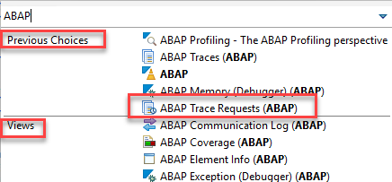 |<ul><li> Press **`CTRL+3`** in ADT to open the Quick Access for Eclipse Views. </li> <li>  Search there for the View called **`ABAP Trace Requests`**,   which you will find either under `Views` or `Previous Choices`.</li> <li> A new tab `ABAP Trace Request` opens. </li> </ul>| 
        | **Start the creation of a Trace Request:**     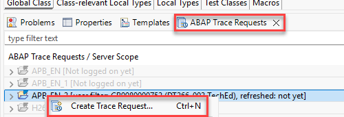 | <ul><li> In this new tab `ABAP Trace Request`: </li> <li> Right-click on your Cloud Project and click on:   **`Create Trace Request...`   (a pop-up for profiling will open)** </li> </ul> |
        | **Set the following filters (do not change user):**     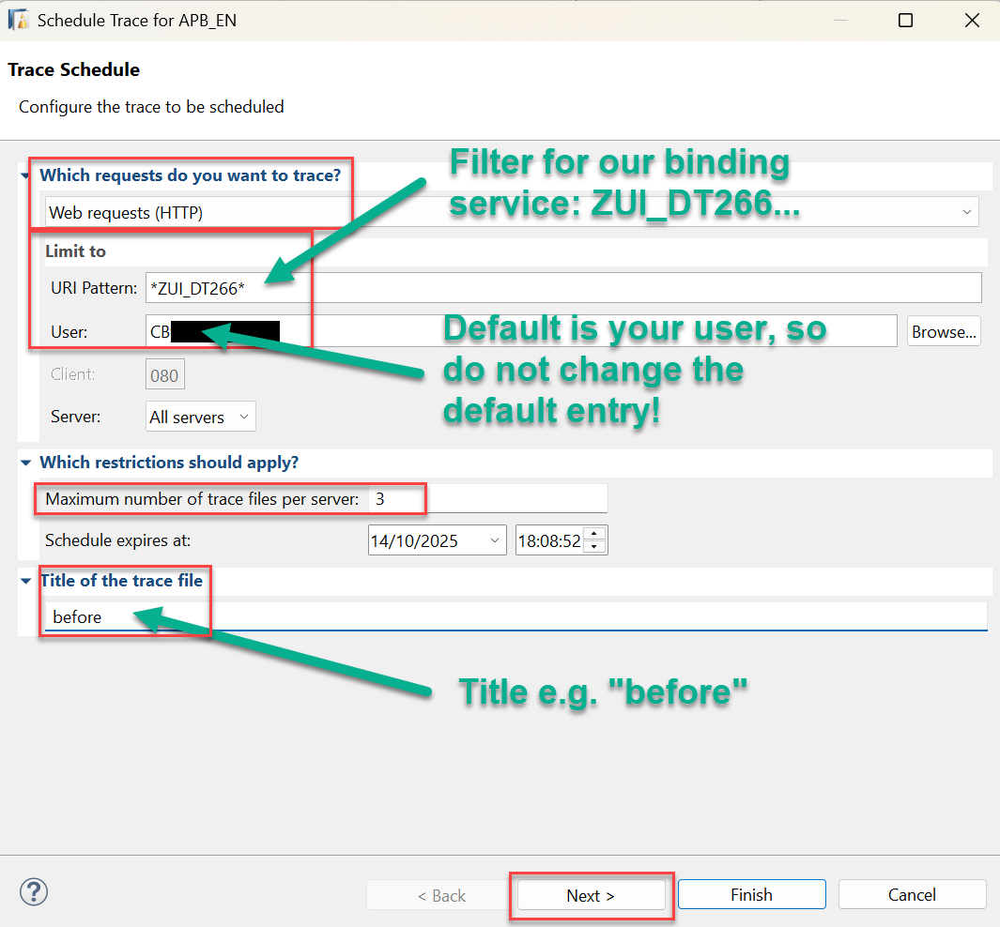   Click **`Next >`**. |  Enter the following values: <ul> <li> _Which requests do you want to trace?_ <code>Web requests (HTTP)</code>  <ul> <li> trace only HTTP requests arriving at ABAP back-end</li> </ul> </li>   <li> _Limit to > URI Pattern:_  **`*ZUI_DT266*`** (URL of the request contains our binding service **ZUI_DT266_CARR_000_O4**)  <ul> <li> trace only for specific URL string pattern</li> </ul></li> <li> _Limit to > User:_ Default is your user with which your are logged in your project (do not change!) </li>   <li> _Maximum number of trace files per server:_ **`3`**  (leave default) </li>   <li> _Title of the trace file:_  arbitrary  (enter e.g. _`before`_) <ul>  <li> important is to find later again the correct trace for specific App and for a specific phase of development or code change </li> </ul> </li> </ul>     Why filters?   - to avoid the cumbersome search for correct trace   - to reduce the overhead of tracing.   |
        | **Define the following aggregation level and the following statements to trace:**    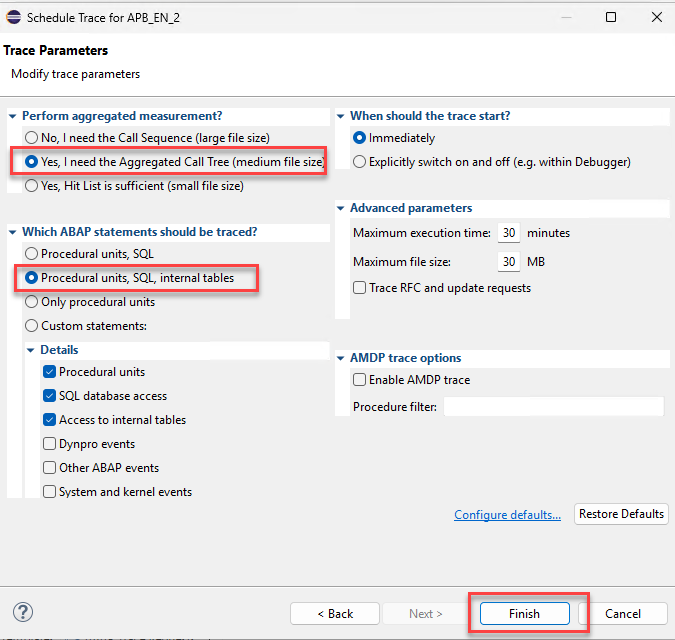   Click **`Finish`**. |  <ul> <li> _Perform aggregated measurement?_ **`Yes, I need the Aggregated Call Tree (minimum file size)`** </li> <ul>  <li>  trace events with same call stack accumulated in one entry. </li> <li> Other options: <ul> <li> `No, I need the Call Sequence`: each trace record is a separate trace entry (no aggregation).</li> <li> `Yes, Hit List is sufficient`: (trace events aggregated by call position) </li> </ul> </li> </ul> </li> <li> _Which ABAP statements should be traced?_   **`Procedual units, SQL, internal tables`** <ul> <li> `Procedual units`: trace records ABAP modularization events like `CALL METHOD` and `CALL FUNCTION` </li> <li> `SQL`: trace records database activities like `SELECT` and `UPDATE` </li> <li> `internal tables`: trace records operations on internal tables like `READ TABLE` and `LOOP AT` and `APPEND` </li> </ul> </li> </ul>     |

            
         
        Now the trace is active.
        
         

         

   4. **Run the Fiori App for Airline ID = 'AA'**: 
      - Enter the `Airline ID = 'AA'` and click on **`Go`**. 
      - Wait until the request is finished and the result is shown (During this run the trace is already recorded):
      <table>
       <tr>
           <td>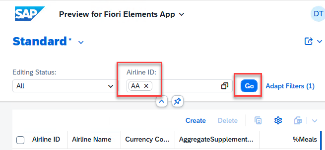</td>
           <td>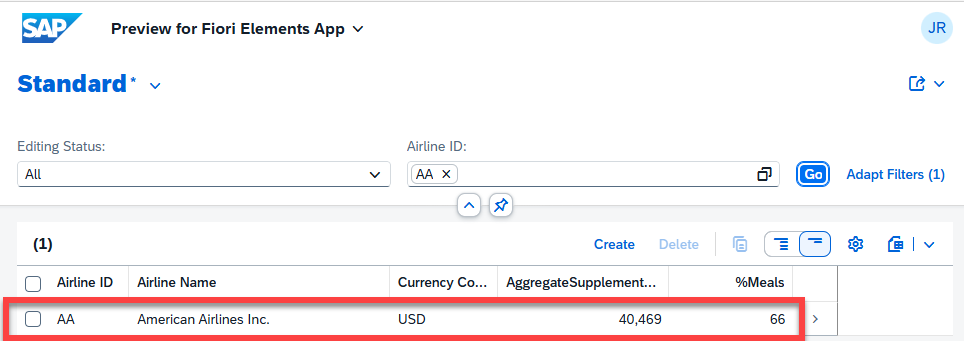</td>
       </tr>
      </table>
      

   5. **Delete the Trace Request:**  
      
      Delete the trace request in the View called `ABAP Trace Requests` with right-mouse click on the **`All servers`**. You have to expand the tree: 
        
        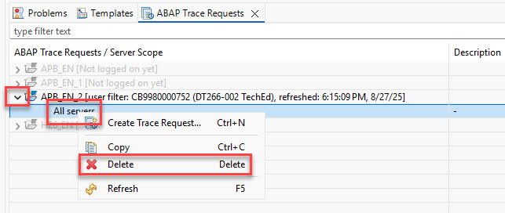

   6. **Open the recorded trace `before`:**
   
      - Open the view **`ABAP Traces`**: 
        - Use shortcut **`CTRL+3`** to open Eclipse views, 
        - Search there for the view called `ABAP Traces` which you will find either under `Views` or `Previous Choices`:
   
          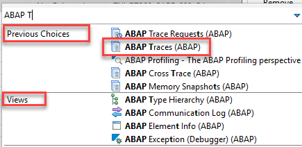
      
      - In the new opened view `ABAP Traces` right-click on your Cloud Project and click on **`Refresh`**.   Then you will see the new trace(s) recorded (_here:_ the trace **`before`**). 

        <table>
          <tr>
           <td>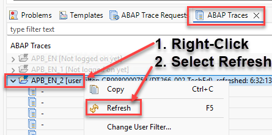</td>
           <td>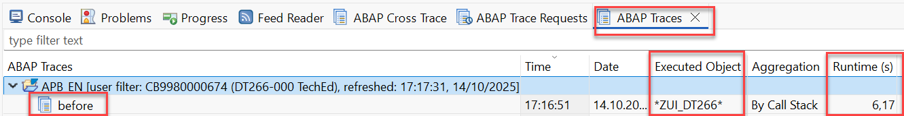</td>
          </tr>
        </table>

         

      - Double-Click on the trace (_here:_ on the trace **`before`**) visible in the tab **`ABAP Traces`**. 
        
        - An `Overview` opens showing the overall runtime (e.g. 6,017 s), and how much time is database time and how much time is for ABAP processing.
        
        
          <kbd>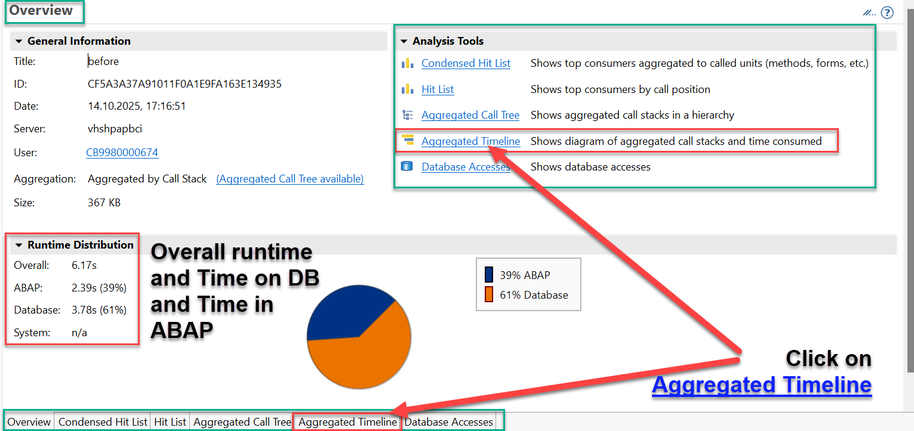</kbd>

                

   7. **Analyze the trace `before`:** 

      Besides the overview there are several `Analysis Tools` (marked green in figure above). 
      
      - From those tools one of the most useful is the **`Aggregated Timeline`**: 
      
        - There you can scroll down the call stack using the **`Scroll Icon`**   to the lowest ABAP code parts in the call stacks consuming most runtime.   
        - By hovering the mouse you can see details of those ABAP code parts

      <kbd>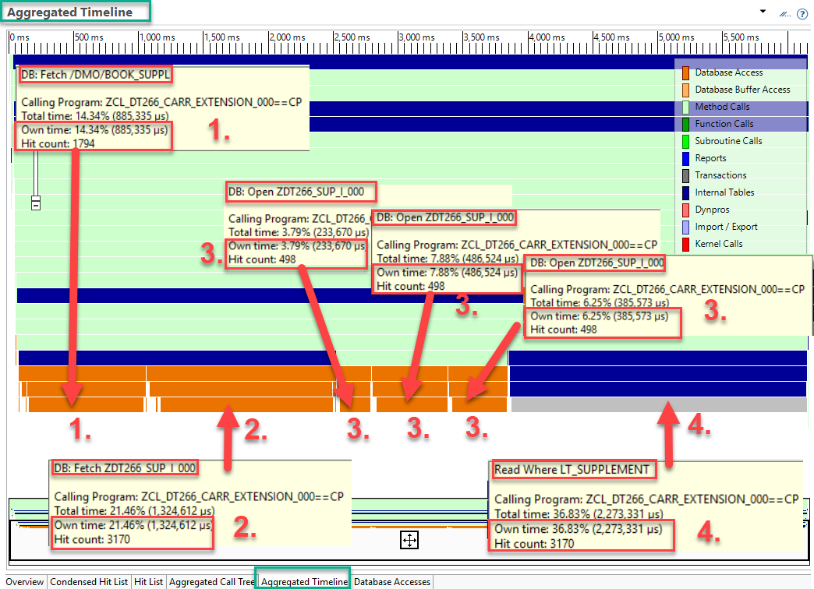</kbd>  

      Here we see 4 main contributions to the runtime: 
      |1. Long DB Fetch on DB table `DMO_BOOK_SUPPL` (orange) |2. A long DB Fetch on DB table `ZDT266_SUP_I_000` (orange) | 3. Three subsequent blocks of DB Fetches on DB table `ZDT266_SUP_I_000` (orange) | 4. A `READ Where` statement on an internal table `lt_supplement` (grey) |
      |---|---|---|---|
      |12% to 17% of runtime <ul> <li> for 1794 calls   (_Hit count_) </li>  </ul> |  ~22% of runtime <ul> <li> for 3170 calls (_Hit count_) </li> </ul>  | 18% of runtime   (3 times 3.5% to 8% of time) <ul> <li> for 3 x 498 calls (_Hit count_) </li>  </ul>|~37% of runtime <ul> <li> for 3170 calls (_Hit count_) </li>  </ul>   |
      |Improvement in   _Exercise 4.4_ |  Improvement in   _Exercise 4.2_ | Improvement in   _Exercise 4.2 & 4.3_ |Improvement in   _Exercise 4.3_ |
  
  
       
        
        
   8. **Navigate to corresponding location in either the Source Code or in other analysis tools:** 

      - By right-mouse-click on any of them you can go to the source code (here shown for the second orange block):
        <table>
          <tr>
           <td>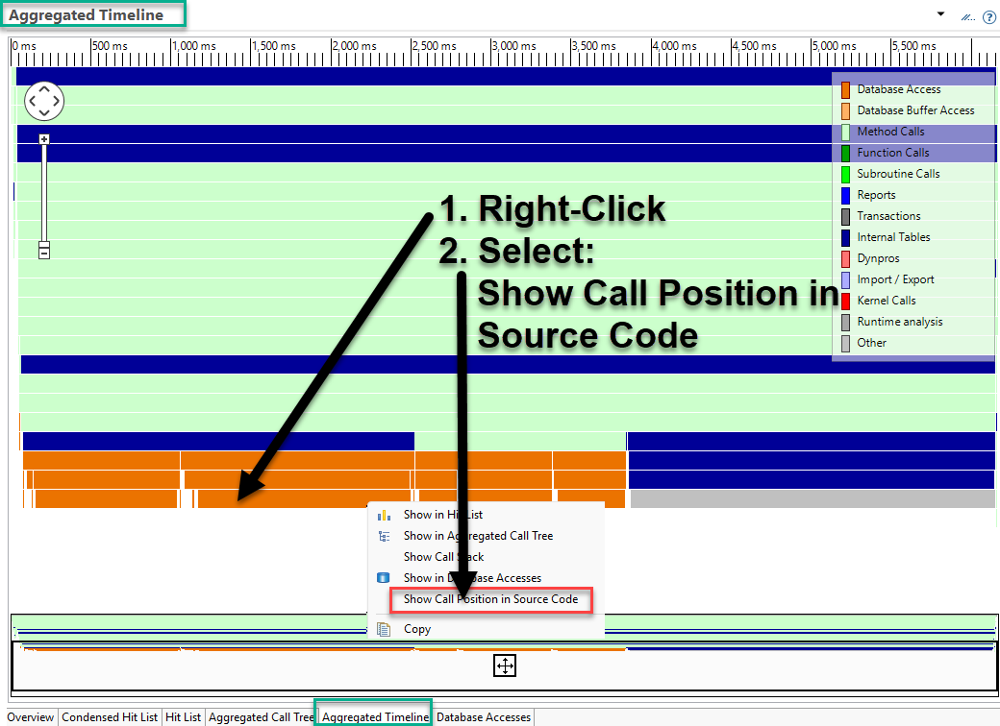</td>
           <td>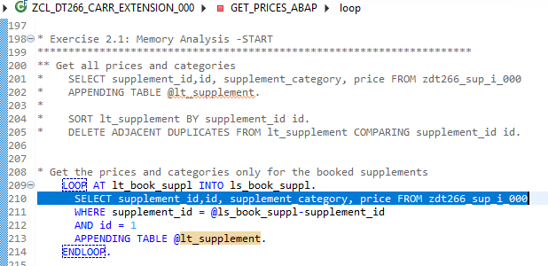</td>
          </tr>
        </table>

      
      - By right-mouse-click you can also navigate for this database call to its location in the other Analysis Tools like the **`Aggregated Call Tree`**: 

        <kbd>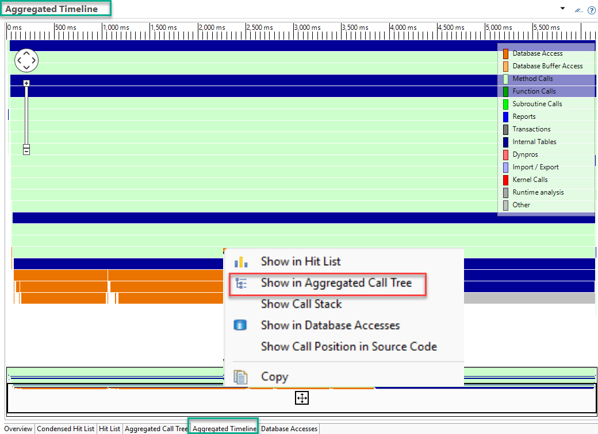</kbd>

         

      - In the `Aggregated Call Tree` the location of this trace event is shown together with the complete call stack. 
        - by clicking on **`Show`** and **`Hide`** you can expand/close the subtrees. 

          <kbd>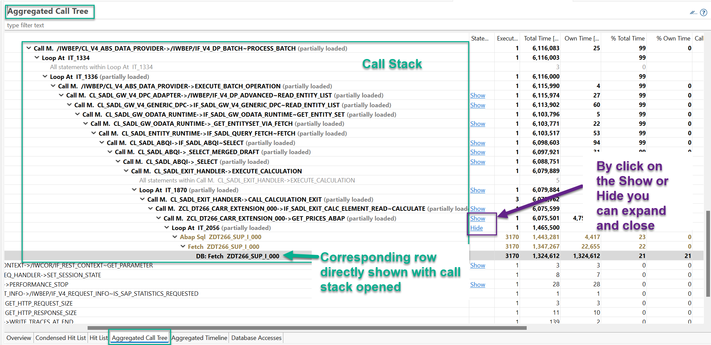</kbd>
           

      - A further helpful view is the **`Hit List`** where the SQL statements and internal table accesses are sorted descending by their contribution to the overall runtime:

        <kbd>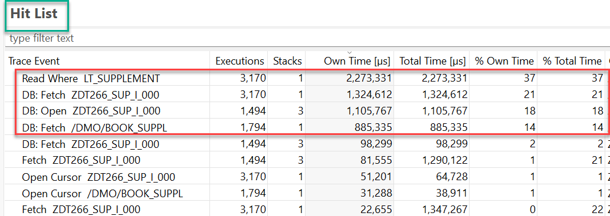</kbd>      
           

> **Now at the end of this exercise 4.1:** 
> - you have made yourself familiar with the **`ABAP Trace`** (with the filter options for `Trace Requests` and with the different `Analysis Tools`),
> - you have used the ABAP trace called _`before`_  to analyze where most runtime is consumed and what we need to improve:
> 
>   1. A long **`DB Fetch`** on table **`ZDT266_SUP_I_000`** (orange) which we improve in _Exercise 4.2._ 
>      - after this we perform a further ABAP trace which we will call _`buffered`_.
>   2. Further three subsequent blocks of **`DB Fetches`** on table **`ZDT266_SUP_I_000`** which we improve in _Exercise 4.2. & 4.3._
>   3. A **`READ Where`** statement on an internal table **`lt_supplement`** which we improve in _Exercise 4.3._
>      - after this we perform a further ABAP trace which we will call _`read table`_.
>   4. A long `DB Fetch` on table **`/DMO/BOOK_SUPPL`** which we improve in _Exercise 4.4._ 
>      - after this we perform the final ABAP trace, which we will call _`final`_. 

**Comment:** _You could also consider to perform after each improvement an ABAP trace but this might be quite time consuming.
So let us start with improving the runtime in the following exercises._

## Exercise 4.2: Use Table Buffering to Improve the Performance
[^Top of page](#)

**In this exercise enable `Full Table Buffering` for table `ZDT266_SUP_I_000`**.

> In the previous exercise 4.1 we have identified long runtime for DB accesses to table **`ZDT266_SUP_I_000`** (_labeled as 2. and 3._).
> - This database table **`ZDT266_SUP_I_000`** is just a master table containing only the different types of supplements and their categories and prices. 
> - As this table rareley changes it is an optimal candidate for table buffering. 

> [!IMPORTANT]    
> Prerequisite for this exercise is that you have implemented **both specific subsequent** code changes 
> - Code change of exercise [2.1 - Coding Change for Reading the Supplements](../ex02/README.md#exercise-21-coding-change-for-reading-the-supplements)
> - Code change of exercise [2.3 - Correction of the ABAP Code](../ex02/README.md#exercise-23-correction-of-the-abap-code)

**Alternatively, you can implement the code snippet provided above at the beginning of exercise 4 to speed up the process:** In this case delete the complete current source code in the class **`ZCL_DT266_CARR_EXTENSION_000`**, insert the code snippet provided above (🟡📄), and replace all occurrences of the placeholder **`###`** with your personal suffix using the ADT function _**Replace All**_ (_**Ctrl+F**_).

 

  
🔵 Click to expand!

   
   In this exercise we turn on **Table Buffering** for table **`ZDT266_SUP_I_000`** used in two different selects (_labeled with 2. and 3._) in the figure below:  

   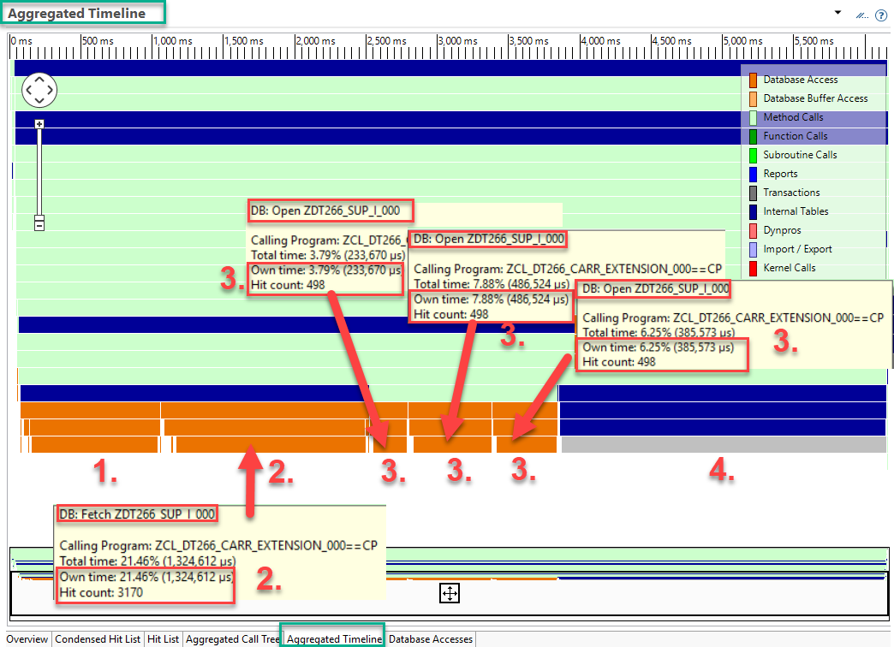

   1. **Activate Table Buffering for table  `ZDT266_SUP_I_000`:** 

      - Navigate to `APB_EN` >  `Favorite Packages` > `ZLOCAL` > `ZDT266_`**`000`** > `Dictionary`> `Database Tables` >   `ZDT266_SUP_I_`**`000`** >  `Technical Table Settings` > `ZDT266_SUP_I_`**`000`** 
      <!--
        - _where **`###`** is your suffix._
      <-->  

        <kbd>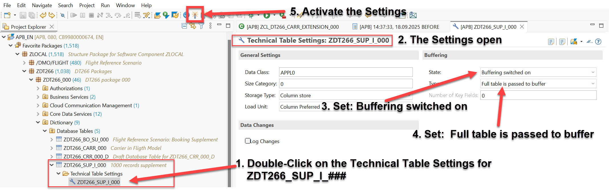</kbd>  
      
      - Then double-click on `ZDT266_SUP_I_`**`000`** and change the settings for **`Buffering`**: 
        - Change first for `State`: From **`Buffering not allowed`** change to **`Buffering switched on`** 
        - Afterwards change for `Type`: From **`No buffering`** change to **`Full table is passed to buffer`**.       
        - ℹ️ **The change then has to be activated by pressing ``Ctrl+F3`` or by clicking on the match icon** .

   2. **Go to the ABAP Trace Requests view and create a new trace with title `buffered`:**
      - Run once (before tracing) the Fiori App for **Airline ID = 'AA'**.   
      - Create the new ABAP `Trace Request` with new title  **`buffered`** (so we later know that the trace was performed after table buffering), 
            - else no further changes for configuration required (as still same as previously configured). 
        - Run again the  Fiori App for **Airline ID = 'AA'**  and wait until the result is shown. 
        - Delete the  ABAP `Trace Request`. 
      - A new trace is shown in the view **`ABAP Traces`** (after refresh):
        <table>
         <tr>
           <td></td>
           <td>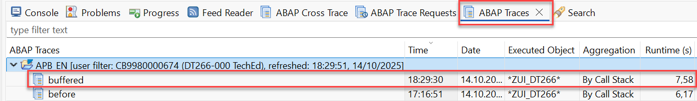</td>
         </tr>
        </table>

   3. **Analyze the new trace called `buffered`:**
      
      >🟠 **_REMARK_**: We use below for comparison the screenshots of the Aggregated Timelines for the two traces **`before`** (the old one before buffering) and **`buffered`** (the new one with buffering).
      
      >_**There is not yet the possibility in ADT to directly compare ABAP traces (as would be in SAP GUI.). So we created screenshots of the Aggregated Timelines for the two trace **`before`** and **`buffered`** in the following comparison.**_ 

       

      **Comparison of Traces:**

      | The DB Select (_labeled as 2._) on the table **`ZDT266_SUP_I_000`** | The 3 blocks of DB selects (_labeled as 3._) on the same table |
      |---|---|
      | **Before buffering (for label 2):** <ul> <li>  shown in orange color (as DB access) </li> <li> taking ~1.5 s </li> </ul> | **Before buffering (for label 3):**  <ul> <li> shown in orange color (as DB access) </li> <li> each taking 0.2 s - 0.6 s </li> </ul> |
      | 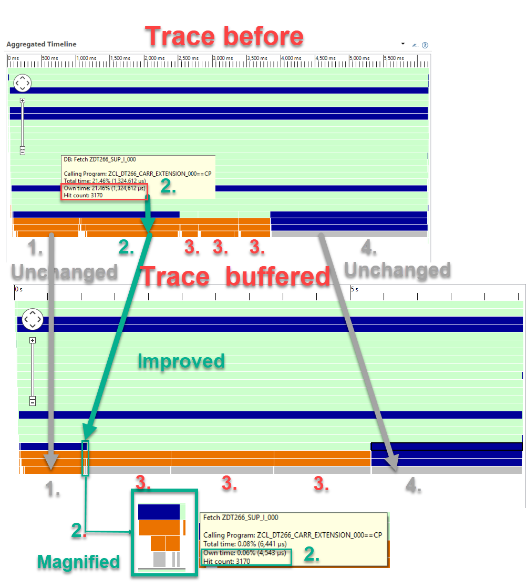 | 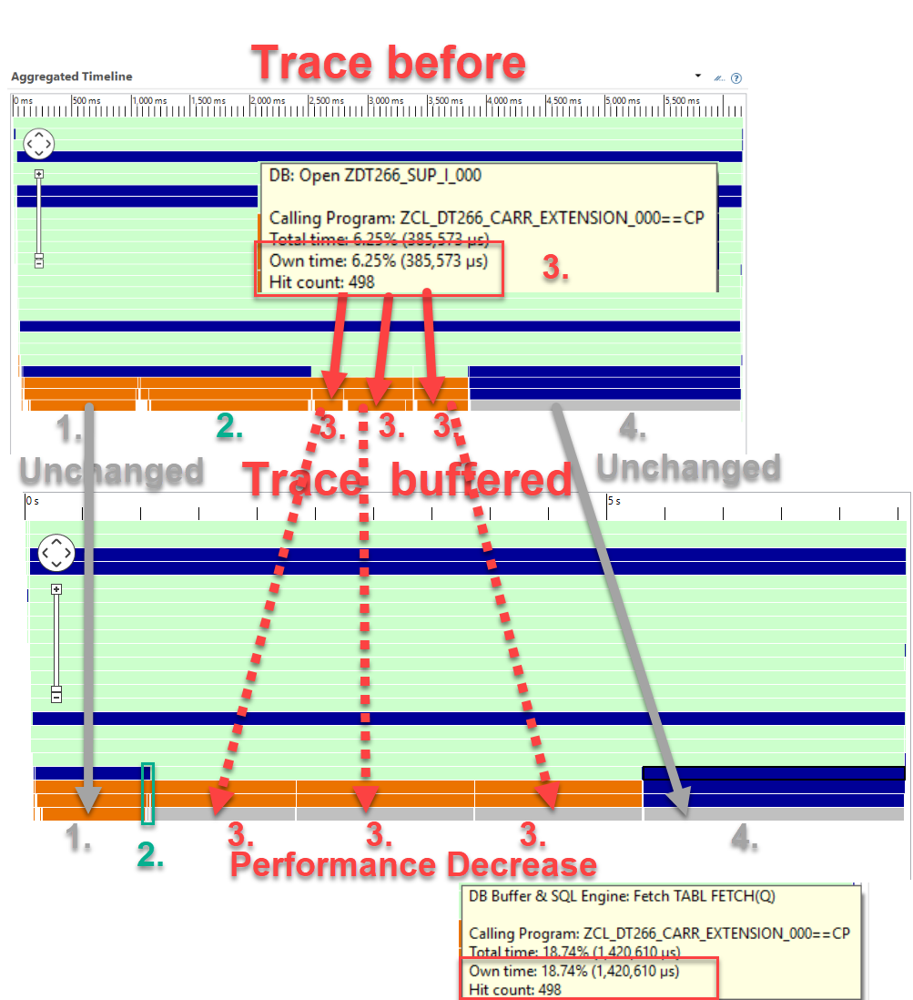 |
      | **After buffering (for label 2):** <ul> <li> shown in grey (as other access: Table Buffer) </li> <li> **Now only taking ~0.005 s instead of ~1.5 s** </li> </ul>  | **After buffering (for label 3):** <ul> <li> shown in grey (as other access: Table Buffer) </li> <li> ℹ️ **Now each taking 1.2 s - 1.7 s instead of 0.2 - 0.6 s** </li> </ul> |
      | **Source Code for 2.:**   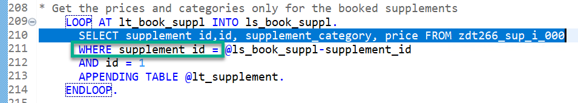 | **Source Code for 3.:**   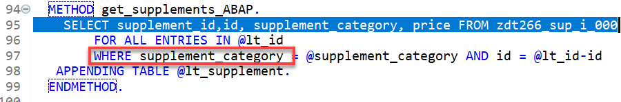|
      | The source code is:   `WHERE `**`supplement_id`**`= ... AND id = ...`,   containing all the **key fields** of the table **`ZDT266_SUP_I_000`**: <ul> <li> `supplement_id` and `id` </li> </ul>   | The source code is:   `WHERE`**`supplement_category`**`= ... AND id = ...`   _Here:_ A **key field** of the table **`ZDT266_SUP_I_000`** is missing:  <ul> <li> ℹ️ The key field **`supplement_id` is missing** </li> <li> Instead `supplement_category` is used  </li>  </ul> |
      | Key Fields of **`ZDT266_SUP_I_000`** are:   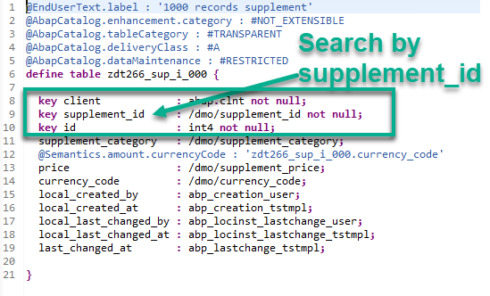| Key Fields of **`ZDT266_SUP_I_000`** are:   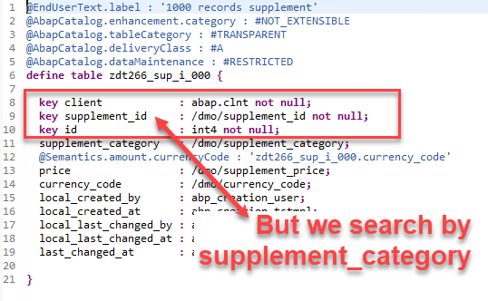|
      | **Next required step:**   No further action required as tabled is ordered by key fields allowing fast access | **Next required step:**    ℹ️**Secondary Index required to support access by other fields**   |

      ----
      🟠 **_REMARK_**: The reason for this real long Table Buffer Access is that we have quite a huge table in the buffer with 24,000 entries. For huge tables access to table buffer is only fast for select by the key fields of the table. Or by creation of a suitable secondary index.

<!--

   4. **Create an additional secondary index for table `ZDT266_SUP_I_###`:**

      This is similar to creation of a Database Index.
      - A secondary index is only required 
        - if the selection **is not by the selective key fields but by other selective fields** and 
        - if the buffered table has a high number of entries (_here:_ 24,000 rows).
      - This secondary index needs to have 
        - the selective fields (_here:_ **`supplement_category`** and **`id`**)  used in the select:     
          **`WHERE supplement_category = ... AND id = ...`**   

        - and the **`client`** (is always added by the DB interface).
      

      | Steps to create Index | Background Information |
      |---|---|
      |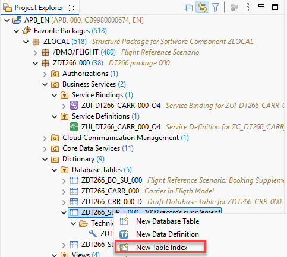| <ul> <li> Navigate to `APB_EN` >  `Favorite Packages` > `ZLOCAL` > `ZDT266_`**`###`** > `Dictionary`> `Database Tables` > `ZDT266_SUP_I_`**`###`** <ul><li> where **`###`** is your suffix </li> </ul>  <li> Right-Mouse click on table `ZDT266_SUP_I_###` and click `New Table Index` </li> <li> A pop-up opens. </li></ul>|
      |  |In the pop-up enter: <ul> <li> Package: **`ZDT266_###`** (with your suffix instead of ###) </li> <li> Name: **`ZDT266_SUP_I_###~CAT`** (with your suffix instead of ###)  </li> <li> Description: _Arbitrary e.g. provide there the fields used which are Category and ID_  </li>  </ul> Then click on **`Next`** | 
      | </td>| As we are in local package no transport is required:   Directly click on **`Finish`** |
      | 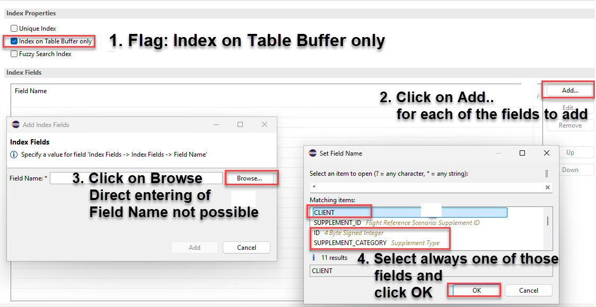 | **Provide the index properties:** <ul> <li> As we only want to access the table buffer set the flag for  **`Index on Table Buffer only`**. </li></ul> **Provide the index fields:** <ul> <li> Via the **`Add`** Button you have to **add one by one subsequently** the index fields `CLIENT`, `SUPPLEMENT_CATEGORY`, and `ID` _(as only one field can be chosen and added)_ </li></ul>|

      
   5. **ℹ️ The change then has to be activated by ``Ctrl+F3`` or by click on the match icon** .

         

   6. **We could now create another trace.... But let us first improve further the ABAP Code.**

-->

## Exercise 4.3: Use Secondary Index & Key to Improve the Performance
[^Top of page](#)

**In this exercise we create a secondary key for `lt_supplement` and secondary index for table `ZDT266_SUP_I_000` to improve the performance.**

> In the previous exercise 4.2 we have partially improved the runtime just changing settings for buffering.  
> But accesses to the Table Buffer by different fields as the key fields showed bad performance for larger tables.
> - The table buffer stores the table sorted by the table key fields in the Extended Memory like sorted internal tables.
> - The access is always fast if we select or read by the key fields used in the database table definition or in the definition of a sorted internal table. So if we select by criteria for which those objects are sorted.
> - But the tables accesses are slow if the access is by other fields even if they are selective.
> - A similar issue we have for a READ TABLE statement where the table is defined as standard table.  

> Improve by using secondary index / secondary sorted key the performance of both, 
> - the selects on table **`ZDT266_SUP_I_000`** and 
> - the **`READ TABLE lt_supplement ... WHERE supplement_id = ... and id = 1`**.  

> [!IMPORTANT]    
> Prerequisite for this exercise is that you have implemented **three specific subsequent** changes: 
> - Code change of exercise [2.1 - Coding Change for Reading the Supplements](../ex02/README.md#exercise-21-coding-change-for-reading-the-supplements)
> - Code change of exercise [2.3 - Correction of the ABAP Code](../ex02/README.md#exercise-23-correction-of-the-abap-code)
> - Activation of Buffering [4.2 - Use Table Buffering to Improve the Performance](#exercise-42-use-table-buffering-to-improve-the-performance)

  
🔵 Click to expand!

 

>🟠 **_REMARK_**: **Background information on secondary indexes in the Table Buffer and secondary sorted keys:**  
> In this exercise we address two performance issues, Table Buffer accesses (_labeled as 3._) and `READ TABLE LT_SUPPLEMENT... WHERE...` statements on an internal table **`LT_SUPPLEMENT`** (_labeled as 4._):
>  <kbd>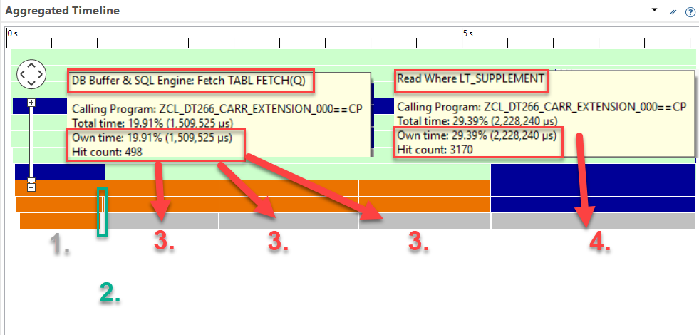</kbd>  
> The Table Buffer accesses and the  `READ TABLE LT_SUPPLEMENT... WHERE...` statement shall be improved by secondary index / key:
>   - this is similar to creation of an index for a database table.
>   - Searching by name in a phone book is fast as it is sorted
>     - Similar it is fast to search in the Table Buffer for Key fields as in the Table Buffer the table is sorted by the key fields,
>     - Similar it is fast to search a row of a sorted internal table (defined as sorted) if we search by the corresponding key fields, 
>   - Travel books and novels are not sorted by names but they have at the end often an index which is sorted by name. 
>     - Similar is the functionality of a secondary index / key.
>   
>  **When do we need such indexes?**

   | Index / Key  | For the Table Buffer | For internal session table|
   |----|----|----|
   | Statement to improve: | <kbd></kbd> | <kbd>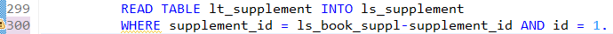</kbd> |
   | Changes required:           | <ul><li> Index to be created  for the fields in the WHERE-clause above <ul><li> _supplement_category_ </li> <li> _id_ </li> </ul></ul>  | <ul><li> Secondary sorted key to be declared in the internal table definition </li> <ul><li> with fields: _supplement_id_ & _id_ </li></ul> <li> Secondary sorted key usage to be added in the READ TABLE statement </li></ul>| 
   | When is it **not** required?   Addditional Index/Key not required e.g. for a telephone book **as it is already sorted**  | Not required if the selection  _is  by  selective key fields of the database table_ **as table sorted in the Table Buffer** | Not required if the selection _is by the selective key fields_ **if the table is defined as sorted by given key** |
   | Only required: <ul><li> if frequently accessed </li><li> table has many rows </li> <li> table not sorted </li> <li> sorted table but accessed by different keys </li> </ul> | Select on table in our case: <ul><li> is called  3 x 498 times </li><li> DB table has 24,000 rows </li> <li> table is sorted by **`supplement_id`** </li> <li> **but table is accessed by `supplement_category`** </li></ul>    | READ TABLE in our case: <ul><li> is called 3170 times </li><li> internal table has  27,074 rows</li> <li> internal table is not sorted </li> <li> table is accessed by **`supplement_id`** </li> </ul>    |

<!--
    - **For the Table Buffer:** 
      A secondary index is only required 
      - if the selection **is not by the selective key fields** (_by which the table is ordered in the Table Buffer_) but by other selective fields,  
      - if the buffered table has a high number of entries (_here:_ 24,000 rows),
      - and if Select is frequently called (here 3 x 498 times).
    - **For internal session tables:** 
      A secondary sorted key is only required
      - if the selection **is not by the selective key fields** (_if the table is defined as sorted by given key_) but by other selective fields,  
      - if the internal table has a high number of entries (_here:_ 27,074 rows),
      - and if Select is frequently called (here 3170 times).   
    - This secondary index and secondary keys needs to have 
      - the selective fields (_here:_ **`supplement_category`** and **`id`**)  used in the select:  **`WHERE supplement_category = ... AND id = ...`**  
        - and for the Table Buffer access the **`client`** (is always added by the DB interface).

-->

----

 

1. **First create an additional secondary key for table `LT_SUPPLEMENT` in the method `GET_PRICES_ABAP` of the class `ZCL_DT266_CARR_EXTENSION_000`:**
   

   We need a secondary key for the READ TABLE on **`lt_supplement`** with **27,074 rows** (which are **not sorted**) as the statement is called frequently (**3170 times**) due to the outer loops:
   
     <kbd>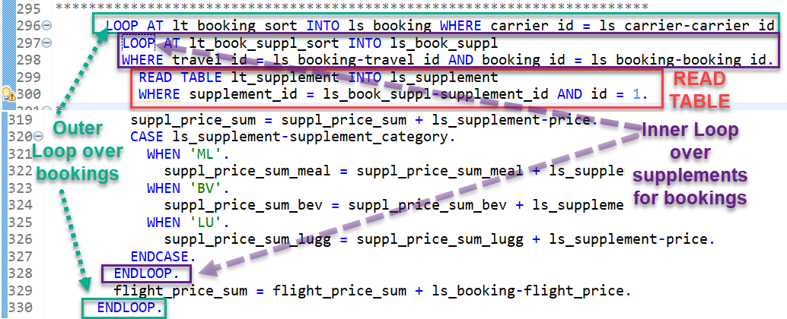</kbd>
  
   
   - This secondary sorted key must be declared in the definition of the table **`LT_SUPPLEMENT`**   (_this is already in the current ABAP code in line 128 and 129, no need to change the code_):

     <kbd>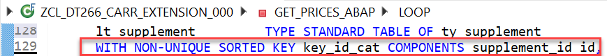</kbd>

     - where the components in secondary SORTED KEY **must be** the same as in the `WHERE`-clause of the `READ TABLE` statement: `READ TABLE...WHERE supplement_id = ... and id = 1.`

   - In the `READ TABLE` statement we have to provide the key to use by replacing 
       
     <kbd></kbd>
       
     with

     <kbd></kbd>

     >🟠 **_REMARK_**: The ABAP Test Cockpit (ATC) checks also suggests to use this key for the READ TABLE statement:
     > <kbd>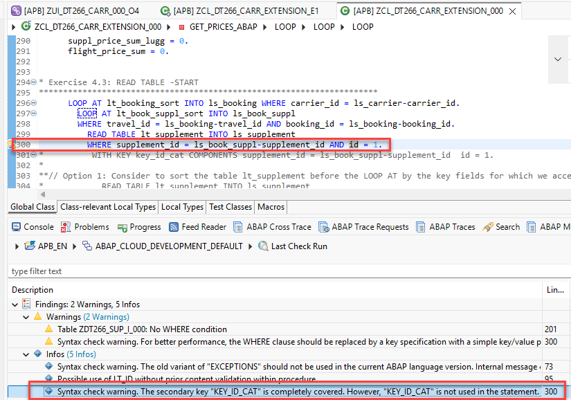</kbd>
     
     **Perform the change in our code:**
     - Mark the line 300 and comment it by pressing **`Ctrl + <`** (so the code will not be processed anymore)
     - Mark the lines 301 and remove the comment by pressing **`Ctrl + >`**  (so this code will now be processed) 
     
       <kbd>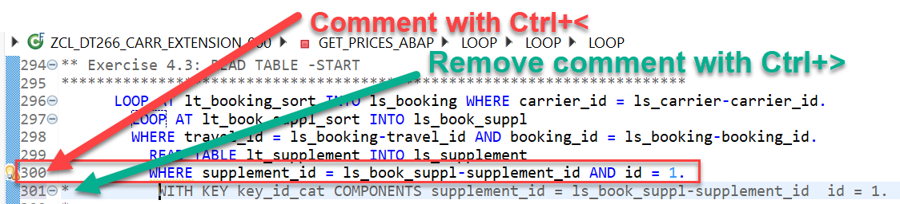</kbd>

     
     - By this the new code should be as follows:
     
       <kbd></kbd>

     - ℹ️ **The change then has to be activated by pressing ``Ctrl+F3`` or by clicking on the match icon**
      .  

       🟠 **_REMARK_**: Syntax for usage of secondary key:
         - **`WITH KEY`** (_followed by the secondary key_: **`key_id_cat`**) instead of **`WHERE`** to be used.
         - Using **`WITH KEY`** the component specifications are just listed one after another with a `blank`as separator.      

  
----

    

2. **Next create an additional secondary index for buffered table `ZDT266_SUP_I_000`:**

      | Steps to create Index | Background Information |
      |---|---|
      || <ul> <li> Navigate to `APB_EN` >  `Favorite Packages` > `ZLOCAL` > `ZDT266_`**`000`** > `Dictionary`> `Database Tables` > `ZDT266_SUP_I_`**`000`**  <!-- <ul><li> where **`000`** is your suffix </li> </ul> --> <li> Right-mouse-click on table `ZDT266_SUP_I_000` and click `New Table Index` </li> <li> A pop-up opens. </li></ul>|
      |  |In the pop-up enter: <ul> <li> Package: **`ZDT266_000`** <!-- (with your suffix instead of 000) --> </li> <li> Name: **`ZDT266_SUP_I_000~CAT`** <!--(with your suffix instead of 000)-->  </li> <li> Description: _Arbitrary e.g. provide there the fields used which are Category and ID_  </li>  </ul> Then click on **`Next`** | 
      | </td>| As we are in local package no transport is required:   Directly click on **`Finish`** |
      |  | **Provide the index properties:** <ul> <li> As we only want to access the table buffer set the flag for  **`Index on Table Buffer only`**. </li></ul> **Provide the index fields `CLIENT`, `SUPPLEMENT_CATEGORY`, and `ID`:** <ul> <li> Via the **`Add`** Button you have to **add one by one subsequently** the index fields `CLIENT`, `SUPPLEMENT_CATEGORY`, and `ID` _(as only one field can be chosen and added)_ </li></ul>|

      
3. **ℹ️ The change then has to be activated by pressing ``Ctrl+F3`` or by clicking on the match icon** .

----

 

4. **Go to the ABAP Trace Requests view and create a new trace with title `read table`:**
      - _Before tracing:_ Run once the Fiori App for **Airline ID = 'AA'**.  
      - Create a new ABAP trace with new Title: **`read table`** 
          - **you only need to change the Title of the trace file** to **`read table`** 
              - as we know then later that this trace was performed after changes to the **`READ TABLE`** statement, 
            - else you need no other changes for profiling (as still same as previously configured). 
          - Then run again the Fiori App for **Airline ID = 'AA'**  and wait until the result is back. 
          - Delete the  ABAP trace request.
      - A new trace is shown in the view **`ABAP Traces`** (after refresh):
        <table>
         <tr>
           <td></td>
           <td>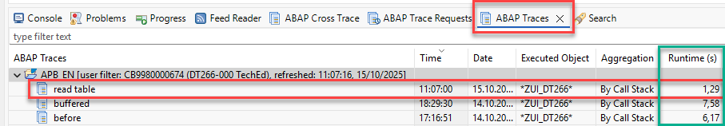</td>
         </tr>
        </table>

 5. **Analyze the new trace `read table`:**
      
      In the trace the whole runtime is now significantly decreased to 1-2 s (the `Aggregated Timeline` is shown in the figure below):

      <kbd>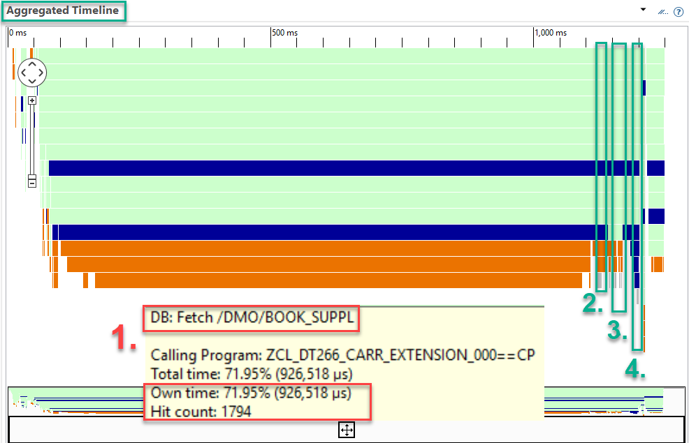</kdb>

      ----

      In the trace in figure above (_labeled as 1., 2., 3., 4._):

      - _Labeled as 1.:_ Remaining Performance Issue for the `DB Fetch` on table `/DMO/BOOK_SUPPL` (_will be improved in exercise 4.4._),
      - _Labeled as 2.:_  With buffering very fast previously long running `DB Fetch` on table ` ZDT266_SUP_I_000`,
      - _Labeled as 3.:_ With buffering and secondary index very fast the three subsequent blocks of `DB Fetches` on table `ZDT266_SUP_I_000`.
      - _Labeled as 4.:_ With ABAP Code change very fast `READ TABLE  Where` statement on  internal table `lt_supplement`.
      
  

    

<!--

## Exercise 4.3: Use BINARY SEARCH for READ TABLE Performance
[^Top of page](#)

> In the previous exercise 4.2 we have improved the runtime just changing settings and creating index. 

> Now we will do some ABAP code changes to improve the performance of a `READ TABLE` statement called very frequently in a LOOP.

 

  
🔵 Click to expand!

 
 1. **Performance Issue for internal table accesses:**
    
    In the figure below the  **`READ TABLE`** statement (_labeled as 4. on the right side in the figure_) shows high contribution to the overall runtime: 

    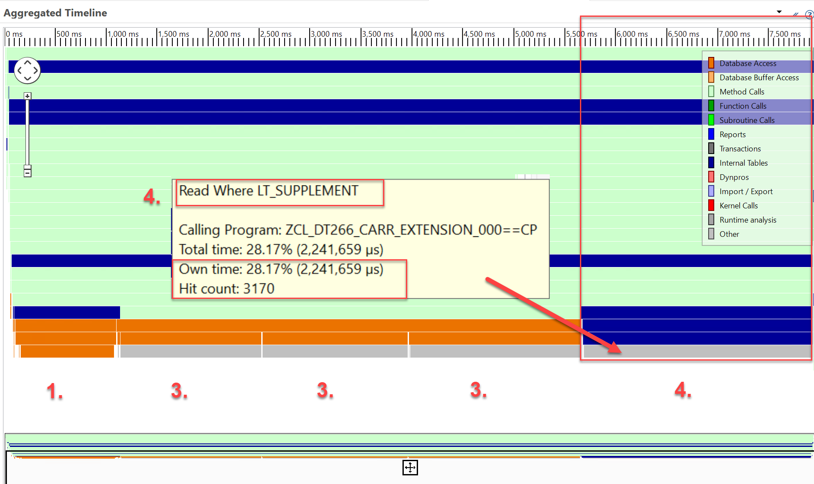

     

    **The root cause of this performance issue is a high number of table rows to be scanned**

    | Three Reasons for the high number of scans  | Analysis in  ABAP Code|
    |---|----|
    |**1.) Huge number of calls of `READ TABLE`:** <ul><li> The `Hitcount` in figure on the right shows that **`READ TABLE`** is called **3,170** times.</li> <li> _**Reason for the many calls:**_    The **`READ TABLE`** is inside two loops   (`LOOP AT... ENDLOOP`) : <ul> <li> _Green:_   Loop over the bookings for the airline   </li> <li> _Violet:_   Inner loop over the supplements </li> </ul> <li> We have **3,170** supplements for the bookings for the airline.  </li></ul>  | Huge number of calls (Hitcount):   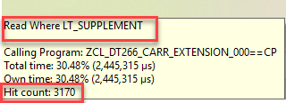   READ TABLE inside two loops:     |
    |**2.) Search in a table with arbitrary ordered rows:**   The **`READ TABLE`**  has to search for the first row in internal table `lt_supplement` where  **`supplement_id`** and **`id`** have specfic values: <ul> <li> **`supplement_id`** = `ls_book_suppl-supplement_id` </li> <li> **`id`** =  `1` </li> </ul> </li> </ul>  to fetch then the data of this row.     The sequence of rows in `lt_supplement` is arbitrary due to the declaration of the internal table `lt_supplement`: <ul> <li> as **`STANDARD`** and not as **`SORTED`** table </li>  <li> in opposite to tables `lt_supplement_sort` and `lt_supplement_sort2` defined as **`SORTED`** </li> </ul> Due to searching in an arbitrary sequence of rows:   ℹ️Complete scan required to find specific row.    |   **Search in a table for specific row to fetch the content:**     <kbd></kbd>         **Arbitrary order of `lt_supplement` as defined as STANDARD table:**     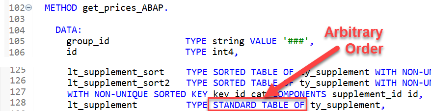 |
    | **3.) Huge number of rows in the table:**   The table `lt_supplements` has  **27,074 rows**.   So we have:  <ul> <li>   3,170 calls (LOOPs) </li> <li> each of them scanning the complete table (arbitrary sequence) </li><li> with  24,000 rows </li> </ul> for specific **`supplement_id`** and **`id`**.  ℹ️ So we  scan in total 3,170 x 27,074 = 85,824,580 entries! | **Visible e.g. in the debugger:** 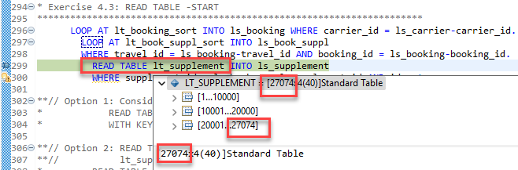 |

    🟠 **_REMARK_**: _Let us first perform the code correction for better performance_ and trace again.
        
        Afterwards we provide the details: 
          - why those code changes improve the performance, 
          - in which case which option above shall be used.

 2. **Improve the ABAP Code:** 

    Perform the following code changes for the performance optimization   (in method `GET_PRICES_ABAP` of class `ZCL_DT266_CARR_EXTENSION_000`): 
      - Mark the lines 299 and 300 and comment them by click of **`Ctrl + <`** (so the code will not be processed anymore)
      - Mark the lines 301 to 317 and remove the comment by click of **`Ctrl + >`**  (so this code will now be processed) 
         

        <kbd>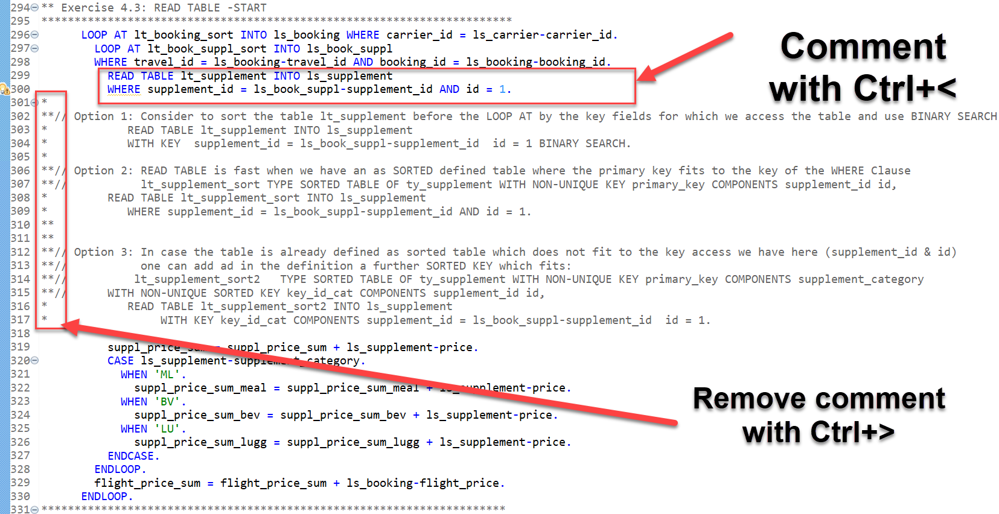</kbd>

         
  
        By this the new code should be as follows (containing 3 alternative solutions for our 3 options):
        
        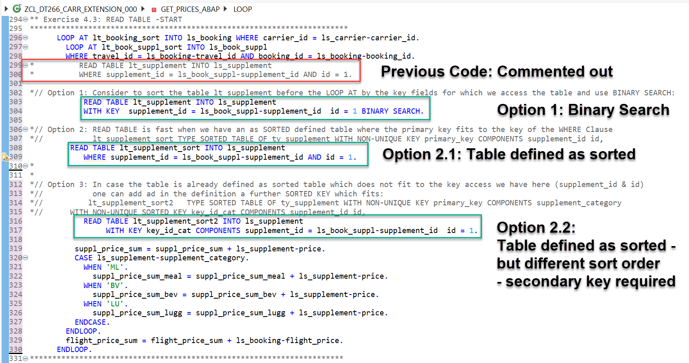

     

    🟠 **_REMARK_**: **The new ABAP code has some prerequisites.** Those prerequisites are already implemented in the ABAP code:   
      - **For Option 1:** 
        - ⚠Mandatory prerequisite is to sort `lt_supplement` by same components as in `READ TABLE` **(_else we get wrong results!_).**  
        - Already in ABAP code:
            <kbd></kbd>
      - **For Option 2.2:** 
        - Prerequisite is `secondary SORTED key`  to be defined in the declaration of the table.
        - Already in the ABAP Code:   
          <kbd></kbd>

 3. ℹ️ The change then has to be activated by ``Ctrl+F3`` or by click on the match icon** 
      .

 4. **Create a new trace:**
      - _Before tracing:_ Run once the Fiori App for **Airline ID = 'AA'**.  
      - Create a new ABAP trace with new Title: **`read table`** 
          - **you only need to change the Title of the trace file** to **`read table`** 
              - as we know then later that this trace was performed after changes to the **`READ TABLE`** statement, 
            - else you need no other changes for profiling (as still same as previously configured). 
          - Then run again the Fiori App for **Airline ID = 'AA'**  and wait until the result is back. 
          - Delete the  ABAP trace request.
      - A new trace is shown in the view **`ABAP Traces`** (after refresh):
        <table>
         <tr>
           <td></td>
           <td></td>
         </tr>
        </table>

 5. **Analyze the new trace:**
      
      In the trace the whole runtime is now significantly decreased to 1-2 s (the `Aggregated Timeline` is shown in the figure below):

      

      ----

      In the trace in figure above (_labeled as 1., 2., 3., 4._):

      - _Labeled as 1.:_ Remaining Performance Issue for the `DB Fetch` on table `/DMO/BOOK_SUPPL` (_will be improved in exercise 4.4._),
      - _Labeled as 2.:_  With buffering very fast previously long running `DB Fetch` on table ` ZDT266_SUP_I_000`,
      - _Labeled as 3.:_ With buffering and secondary index very fast the three subsequent blocks of `DB Fetches` on table `ZDT266_SUP_I_000`.
      - _Labeled as 4.:_ With ABAP Code change very fast `READ TABLE  Where` statement on  internal table `lt_supplement`.
      
  
      
      ----

      **Check how long are now the runtimes for our 3 different alternatives to the previous `READ TABLE` statement:**

      - As we know that the **`Read Table`** statements are called  3170 times: 

        <kbd>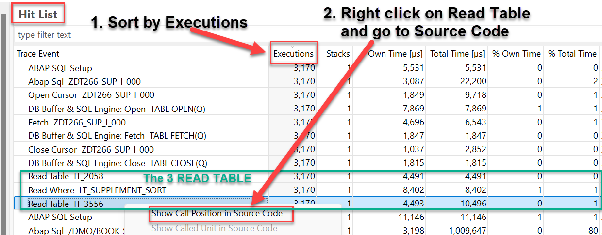</kbd>

      - If we navigate from the `Hitlist` via right mouse click to the source codes we can see that they are from our new coding:
        
        <kbd>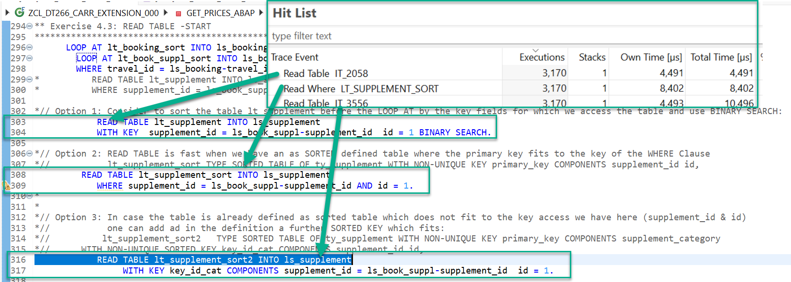</kbd>

6.  **Details on the alternative solutions:**
    

      > 🟠 **Short explanation of the BINARY SEARCH**:    
      > - If a telephone book is not sorted one has to scan the whole telephone book for a given name to find the corresponding telephone number.    
      > - As it is sorted you can find the name very fast by using an approach which is the **`BINARY SEARCH`**.

    The fast **`BINARY SEARCH`** can be used:
    - if the rows of the table itself are sorted (as in a telephone book) or 
    - if there is at least a sorted index (e.g. as at the end of e.g. travel guides or science books).

     

    -----

    **The 3 cases of the data definition of tables considered:**  
      <kbd></kbd>  
      - **Case 1:** Table defined as **STANDARD** table (arbitrary order of the rows)
      - **Case 2.1:** Table defined as **SORTED** table ordered by **same components** (_here:_ `supplement_id` and `id`)   as used in the `READ TABLE...WHERE supplement_id = ... and id = 1.`
      - **Case 2.2:** Table defined as **SORTED** table with **different components** (_here:_ `supplement_category`)   as used in the `READ TABLE...WHERE supplement_id = ... and id = 1.` 

    -----

      **Different Options for those different cases:**

      
      - **Option 1:** Sort the table in the code and use BINARY SEARCH:
        - **Option only valid for Case 1:** Table defined as **`STANDARD`** table (_it has an arbitrary order of the rows_).
          - **Prerequisite:**  ⚠Mandatory is to sort `lt_supplement` by same components as in `READ TABLE` **(_else we get wrong results!_)**.   <kbd></kbd>
          - **Code change for the `READ TABLE`:**    
            
            <kbd></kbd>

            - Add: **`BINARY SEARCH`** (_by this the kernel expects a sorted table and used the BINARY SEARCH,_ **Do not  use without sorting!**)
            - _Further Syntax changes:_ **`WITH KEY`** instead of **`WHERE`** to be used
              - Using **`WITH KEY`** the component specifications are just listed one after another with a `blank`as separator
            
      - **Option 2.1:** Define the table already as SORTED by the components required in the `READ TABLE` statement. 
        - **Option only valid for Case 2.1:** Table defined as **`SORTED`** table with **same components** (_here:_ `supplement_id` and `id`)   as used in the `READ TABLE...WHERE supplement_id = ... and id = 1.`
          - **Prerequisite**: Table defined as **SORTED** by **same components** as in `READ TABLE...WHERE supplement_id = ... and id = 1.` (_here:_  `supplement_id` and `id`) 
            - Then automatically the BINARY SEARCH is used by ABAP Kernel.  
          - **Code change for the `READ TABLE`:** No change, just use the table defined as **SORTED**:

            <kbd></kbd>

      - **Option 2.2:** Create as sorted index a secondary sorted key and use this key in the `READ TABLE`statement:
        - **Option valid for two cases:** 
          - **Case 2.2:** Table defined as **`SORTED`** table with **different components** (_here:_ `supplement_category`)   as used in the `READ TABLE...WHERE supplement_id = ... and id = 1.`)
            - Sorting of the table itself is usually not possible, as the sorting by `supplement_category` might be required in other parts of the code 
          - **For Case 1:** Table defined as **STANDARD** table (_it has an arbitrary order of the rows_).

        - Option 2.2 uses a sorted index, _the so-called secondary SORTED KEY_.

          - **Prerequisite**: First a secondary SORTED Key must be declared in the data definition of the table:
            - Components in secondary SORTED KEY **must be** the same as used in the `READ TABLE` statement
            - This declaration is already implemented in line 128:  
              <kbd></kbd>

          - **Code change for the `READ TABLE`:**   In the `READ TABLE` statement the usage of the key to be implemented: 
            
            <kbd>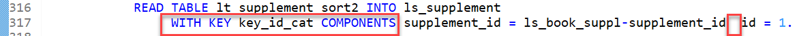</kbd>

            - With following syntax:
              - **`WITH KEY`** (_followed by the secondary key_: **`key_id_cat`**) instead of **`WHERE`** to be used.
                - secondary key defined with same components as in the READ TABLE statement 
                - Using **`WITH KEY`** the component specifications are just listed one after another with a `blank`as separator

    **Common approach for all alternative solutions:**
    - In all options we ensure that we have either the table itself sorted or a sorted key (acting as index). T

    We managed now to reduce the runtime from more than 6 s to only 1-2 s. 

        
    

-->

 ## Exercise 4.4: Usage of the Table Comparison Tool
[^Top of page](#)

> [!NOTE] 
> **This exercise is optional.**

**In this exercise we perform a code change solving the remaining performance issue by using a `FOR ALL ENTRIES` select on table `/dmo/book_suppl`.** 
> - Our first approach is 
>   - to replace 
>     - the **`SELECT ...FROM /dmo/book_suppl WHERE ... APPENDING TABLE @DATA(lt_book_suppl)`** with 
>     - the outer **`LOOP AT lt_booking INTO ls_booking.`** 
>   - by 
>     - a **`SELECT ...FROM /dmo/book_suppl FOR ALL ENTRIES IN @lt_booking WHERE ... APPENDING TABLE @DATA(lt_book_suppl)`**.
> - But this first approach leads to wrong results. 
> - We use the **`Table Comparison Tool`** to find the root cause for the different results.
> - Then we correct this issue.

> [!IMPORTANT]    
> Prerequisite for this exercise is that you have implemented **three specific subsequent** changes: 
> - Code change of exercise [2.1 - Coding Change for Reading the Supplements](../ex02/README.md#exercise-21-coding-change-for-reading-the-supplements)
> - Code change of exercise [2.3 - Correction of the ABAP Code](../ex02/README.md#exercise-23-correction-of-the-abap-code)
> - Activation of Buffering [4.2 - Use Table Buffering to Improve the Performance](#exercise-42-use-table-buffering-to-improve-the-performance)
> - Creation of the secondary key & index [4.3 - Use Secondary Index & Key to Improve the Performance](#exercise-43-use-secondary-index--key-to-improve-the-performance)

 

  
🔵 Click to expand!

 1. **Analysis of performance issue:**
    
    In the last ABAP trace (_called **`read table`**_) there is still about 70% of runtime (1 s) remaining for 1794 selects on table **`/DMO/BOOK_SUPPL`**:
    
    
      
      

    By right-click on this DB Fetch and select `Show Call Position in Source Code` navigate to the source code:
    - The corresponding Select is in a `LOOP AT lt_booking` (with `lt_booking` having 1794 rows) 

      <table>
        <tr>
          <td>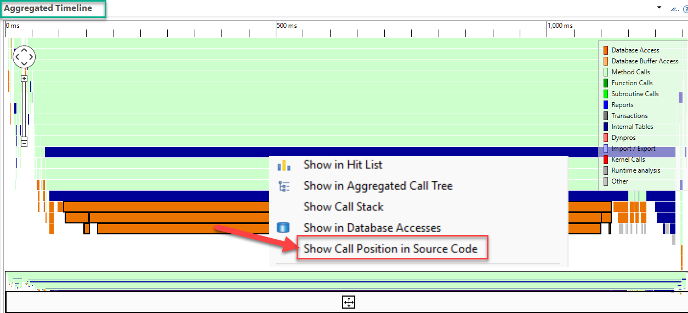</td>
          <td>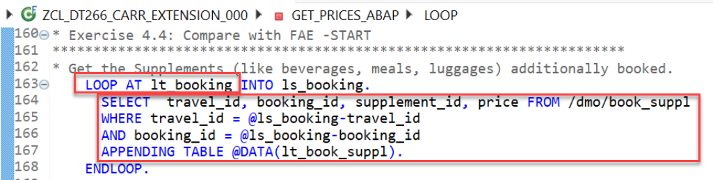</td>
        </tr>
      </table> 

    - This leads to 1794 separate single selects on table **`/DMO/BOOK_SUPPL`**. 

    To improve the runtime we use a `FOR ALL ENTRIES` statement replacing the single selects in the LOOP. 
    Via `FOR ALL ENTRIES` the results for the whole list of travel_id & booking_id values (in lt_booking) are retrieved in one or just a few array select.

 2. **Change the code to a `FOR ALL ENTRIES` select in the method `GET_PRICES_ABAP` of the class `ZCL_DT266_CARR_EXTENSION_000`:**   
      
     - Comment out the code in lines 162 to 168 (mark them and press **`Ctrl+<`**) and 
     - Remove the comments in lines 170 to 174 (mark them and press **`Ctrl+>`**). 
     - So the code in lines 162 to 174 is changed from figure on the left to figure on the right:
     
    <table>
    <tr>
        <td>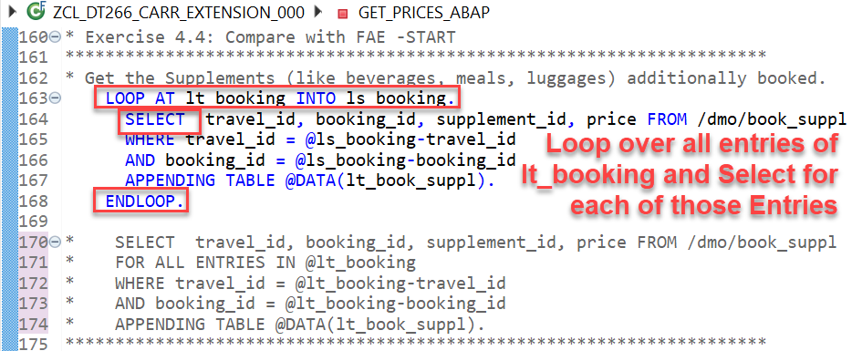</td>
        <td>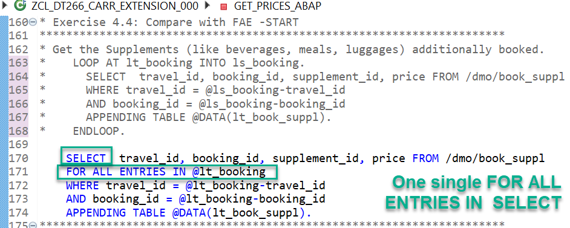</td>
    </tr>
    </table>      

 3. ℹ️ **The change then has to be activated by pressing ``Ctrl+F3`` or by clicking on the match icon** 
     .

 4.  **Run the Fiori App for Airline ID = 'AA'**.  
 
     ℹ️Then in the results there is a discrepancy when we compare the previous result to the new result, e.g. for AggregateSupplement..:
      
     - Before: 

       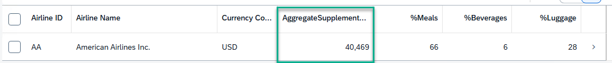
      
     - Now:

       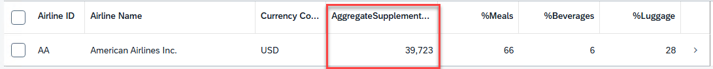
 

 5. **Go back to class `ZCL_DT266_CARR_EXTENSION_000` and implement 4 code changes to compare the differences:** 
    - **First change (lines 162 to 168):** 
      - To have both (previous and new) selects for comparison, remove the comments in lines 162 to 168 (mark them and press **`Ctrl+>`**):
        <table>
         <tr>
           <td>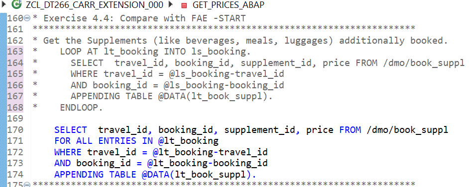</td>
           <td>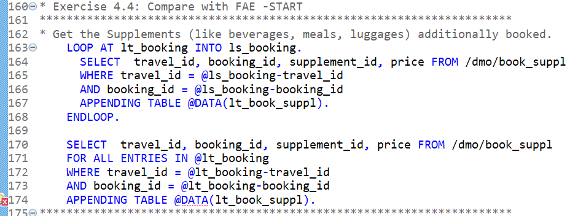</td>
         </tr>
        </table>         
    - **Second change (line 167):** 
      - To both results (previous and new) results, they have to be in  different tables.
      - Change in line 167  **`lt_book_suppl`** to **`lt_book_suppl2`** (contains now the previous result):

        <table>
          <tr>
           <td></td>
           <td>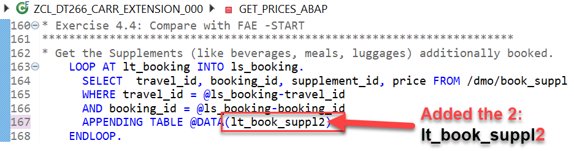</td>
         </tr>
        </table>  
    - **Third change (lines 180 to 185) and fourth change (lines 186 to 188):** 
      - Remove the comments in lines **180** to **188** (mark the lines and press **`Ctrl+>`**):
        - **Third Change** (_lines 180 to 185_): New `SELECT * FROM` into `lt_book_suppl3` to have all possible DB fields,
        -  **Fourth change** (_lines 186 to 188_):  For a meaningfull row by row comparison they need to be sorted.

          <table>
            <tr>
              <td>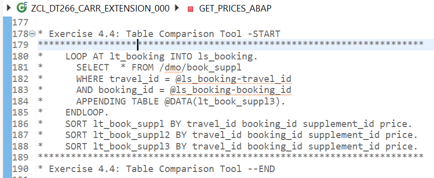</td>
              <td>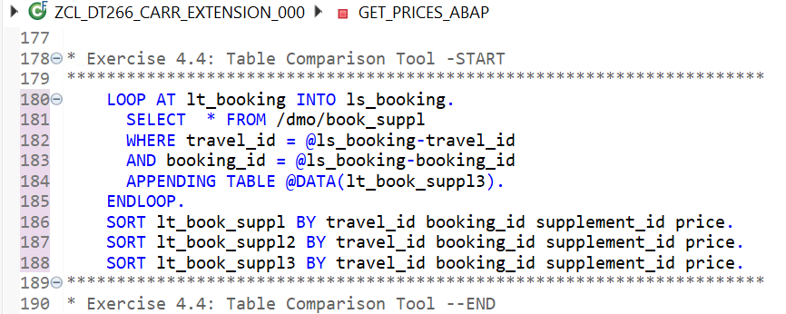</td>
            </tr>
          </table>  

   

 6.  ℹ️**The change then has to be activated by pressing ``Ctrl+F3`` or by clicking on the match icon** 
    .

 7. **To call the debugger set a breakpoint  after the selects and sortings are performed:** 
    - set the breakpoint in the next row (line 193) after the sortings are performed. Wee need the debugger:
      - as all the ABAP internal tables are just runtime objects existing only during the runtime
      - so only during debugging we can easily check their values
      - we choose line 193 as there all the tables are filled and sorted:   `lt_book_suppl`, `lt_book_suppl2`, and `lt_book_suppl3`.    
        <kbd>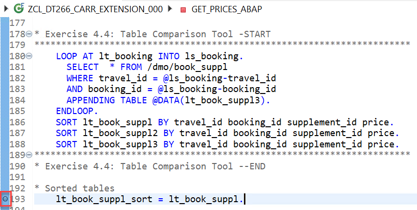</kbd>
    
 8. **Rerun the Fiori App for Airline ID = 'AA'**. 
    
    The processing stops at the breakpoint and  the debugger opens. 
    
    Now we can compare in the debugger the sorted results of the 3 selects.
    
    The current content of the runtime objects (like internal variables and internal tables) is shown on the right in the View **`Variables`**. 
    - Expand there **`Locals`** to see our current tables and their contents:

      <kbd>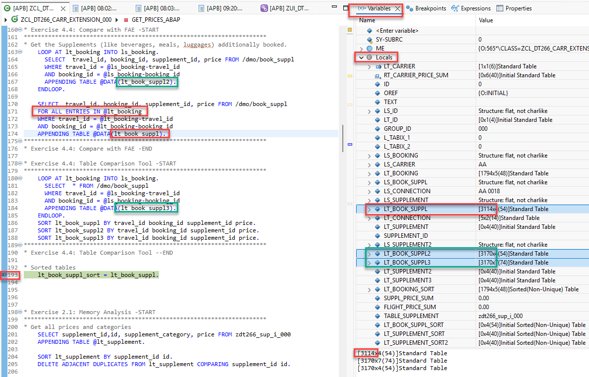</kbd>   

 9. **Start in the debugger the `Table Comparison Tool`:**
    | Start the Table Comparison Tool | |
    |---|---|
    | Mark first in the **`Variable`** view on the right the following two tables: <ul><li> **`lt_book_suppl2`** (result of the original select) </li> <li> **`lt_book_suppl`** (result of the `FOR ALL ENTRIES` select) </li></ul>   and via Right-mouse-click use **`Compare Tables`** | <kbd>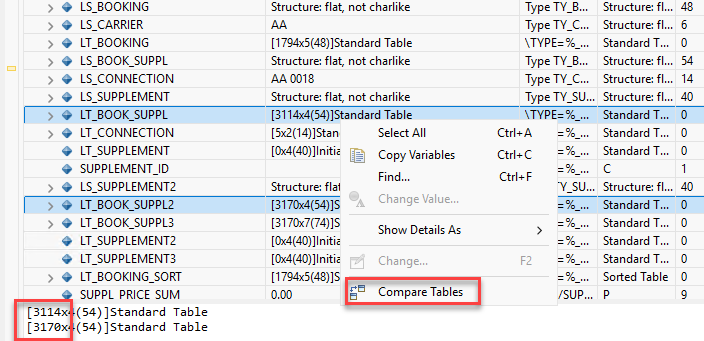</kbd>|

    - The **Comparison Result** of the **`Table Comparison Tool`** opens and shows the differences between the tables:
      - _on the left side:_ table **`lt_book_suppl`** (result of the `FOR ALL ENTRIES` select with 3114 rows), 
      - _on the right side:_ table **`lt_book_suppl2`** (result of original selects in the LOOP with 3170 rows, so with additional rows).
      - the Table Comparison Tool highlights in green the additional rows in **`lt_book_suppl`** on the right side: 
        <kbd>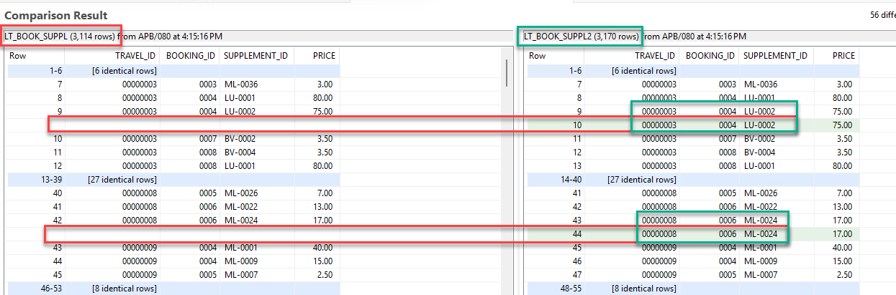</kbd>   

      - In this **Comparison Result** we notice that we have following pattern  with regards to   `TRAVEL_ID, BOOKING_ID, SUPPLEMENT_ID`:
        - If those fields have duplicates in **`lt_book_suppl2`** then **only one of those rows** appears in **`lt_book_suppl`**, 
        - If those fields are unique in **`lt_book_suppl2`** on the right side we have the same rows in **`lt_book_suppl`** on the left side.

       

    - **Compare as next the results for the following two tables:**
      - **`lt_book_suppl`**  (of the `FOR ALL ENTRIES` select)  
      - **`lt_book_suppl3`** (selection of all table fields: `SELECT * FROM`) 
    

    - Mark those two tables in the view **`Variables`** and via right-mouse-click use **`Compare Tables`**:
        <kbd>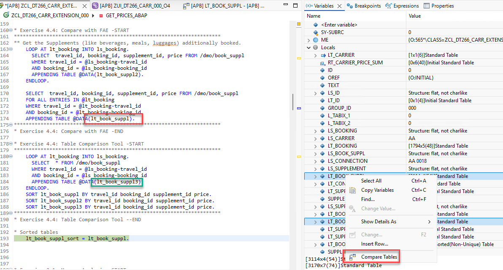</kbd>
    

      - In the figure below the comparison is presented. This comparison shows:  
        - for the missing rows in **`lt_book_suppl`** we have identical rows in **`lt_book_suppl3`** comparing the fields `TRAVEL_ID, BOOKING_ID, SUPPLEMENT_ID, and PRICE` 
        - For those identical rows in **`lt_book_suppl3`** (with regards to fields `TRAVEL_ID, BOOKING_ID, SUPPLEMENT_ID, and PRICE`) they differ in the field `BOOKING_SUPPLEMENT_ID`:

          <kbd></kbd>

       

10. **Now stop running the debugger**: 
    - press in the Debugger **`F8`** or choose in the menue:
      .

11. **Summary of the Observations in Table Comparison Tool**  

    On the database there are duplicates for the selected fields `TRAVEL_ID, BOOKING_ID, SUPPLEMENT_ID, and PRICE`. 
    
    They differ by a not selected key field `BOOKING_SUPPLEMENT_ID` of table `/DMO/BOOK_SUPPL`: 
     
    
    <kbd>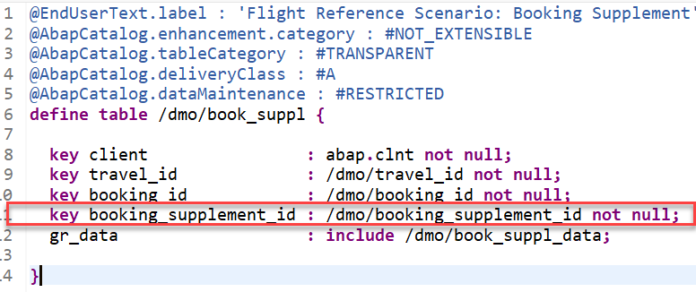</kbd>  
    
    Those  duplicates are not fetched by an `FOR ALL ENTRIES` select:
    - The reason is explained in the [ABAP Keyword Documentation for FOR ALL ENTRIES](https://help.sap.com/doc/abapdocu_cp_index_htm/CLOUD/en-US/ABENWHERE_ALL_ENTRIES.html):
      
      >🟠 With respect to rows occurring more than once in the result set, the addition FOR ALL ENTRIES has the same effect as when the addition DISTINCT is specified in the definition of the selection set...
    
    Only when we select all key fields in an `FOR ALL ENTRIES` select we can ensure that we have all different rows selected. 
    
12. **Correct the code**
    
    To get all results in the `FOR ALL ENTRIES` select all key fields by inserting the additional selection of field `BOOKING_SUPPLEMENT_ID`. 
    
    Besides this we can remove now the code just inserted for comparison (as it containing the Selects in the LOOPs responsible for the increased runtime).

    
    **12a. Implement 2 code changes to remove the selects just used for analysis:** 
    - **First change: Remove again the original select** 
      - Comment again the lines 162 to 168 (mark them and press **`Ctrl+<`**):
        <table>
         <tr>
           <td></td>
           <td></td>
         </tr>
        </table>   
    - **Second change: Remove the selection of the whole table and the sorts**  
      - Set again the comments in lines 180 to 188 (mark the lines and press **`Ctrl+<`**)
      <table>
       <tr>
           <td></td>
           <td></td>
       </tr>
      </table>

       

    **12b. Implement two code changes to get all results in the `FOR ALL ENTRIES` select (including the duplicates on the database table):**
    - **First change:** Add in in line 170 the key field `booking_supplement_id,` between `booking_id`and `supplement_id`:
        <table>
          <tr>
           <td></td>
           <td>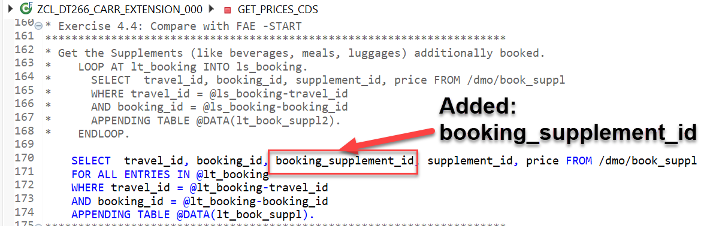</td>
         </tr>
        </table> 

      so our new coding looks like:

      <kbd>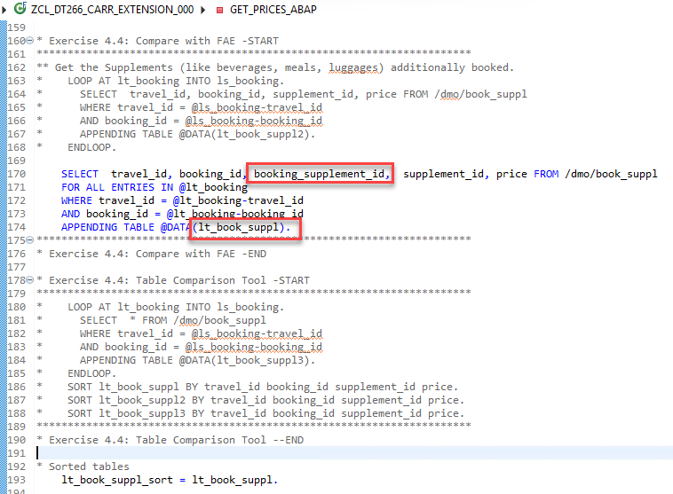</kbd>

    - **Second change:** Ensure that the this new field `booking_supplement_id` is added in the declarations: 
      - Due to additional field in table `lt_book_suppl` the definition **`ty_book_suppl`** for the rows `ls_book_suppl` of `lt_book_suppl` needs to be updated:
      - Remove the comment in line 29 to add this field to the row type definition:
      <table>
       <tr>
           <td>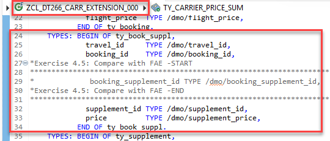</td>
           <td>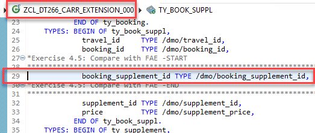</td>
       </tr>
      </table>      

13. ℹ️**The change then has to be activated by pressing ``Ctrl+F3`` or by clicking on the match icon** 
    .

14. **Go to the ABAP Trace Requests view and create a new ABAP trace with title `final`:** 

    - Before tracing: Run once the Fiori App for **Airline ID = 'AA'**.  
    - Create a new ABAP trace
      - Create a Trace Request with new Title: **`final`** 
        - **you only need to change the Title of the trace file** to **`final`** 
        - this is a suggestion as we know then later that this trace was performed after the **`final`** changes, 
        - else you need no other changes for profiling (as still same as previously configured). 
      - Then run again the Fiori App for **Airline ID = 'AA'**  and wait until the result is back. 
      - Delete the  ABAP trace request.
    - A new trace **`final`** is shown in the view **`ABAP Traces`** (after refresh):
      <table>
        <tr>
          <td></td>
          <td>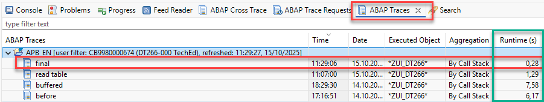</td>
        </tr>
      </table>
   
    
    We should now have the correct results:
    
    <kbd></kbd>
    
    And in the ABAP trace see a runtime less than 0,4 s:
    
    <kbd>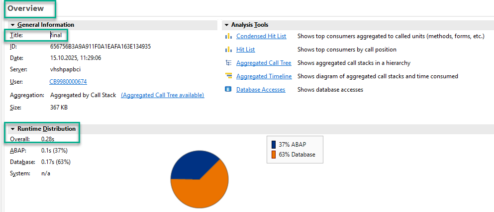</kbd>
    

     

## Exercise 4.5: Performance of Nested LOOPs 
[^Top of page](#)

> [!NOTE] 
> **This exercise is optional.**

**Here we analyze 3 options to improve the runtime of a code part with three nested loops in the class `ZCL_DT266_CARR_EXTENSION_000`.**  
> - **Unoptimized:** Three nested `LOOP AT TABLE... WHERE` statements with all tables defined as STANDARD tables.
> - **Optimizations:**
> 1. Three nested `LOOP AT TABLE... WHERE` statements with all tables defined as SORTED tables,
> 2. Three nested `LOOP AT TABLE... WHERE` statements where the outer two are on SORTED tables, 
>    - but the inner LOOP on STANDARD table using a SECONDARY SORTED KEY,
> 2. Three nested `LOOP AT TABLE... WHERE` statements where the outer two are on SORTED tables,  
>    - but the inner LOOP on STANDARD table 
>      - using READ TABLE with secondary sorted key to get start value
>      - and LOOP FROM this start value USING the sorted key.

> [!IMPORTANT]    
> Prerequisite for this exercise is that you have implemented **three specific subsequent** changes: 
> - Code change of exercise [2.1 - Coding Change for Reading the Supplements](../ex02/README.md#exercise-21-coding-change-for-reading-the-supplements)
> - Code change of exercise [2.3 - Correction of the ABAP Code](../ex02/README.md#exercise-23-correction-of-the-abap-code)
> - Activation of Buffering [4.2 - Use Table Buffering to Improve the Performance](#exercise-42-use-table-buffering-to-improve-the-performance)
> - Creation of the secondary key & index [4.3 - Use Secondary Index & Key to Improve the Performance](#exercise-43-use-secondary-index--key-to-improve-the-performance)
> - Usage of the FOR ALL ENTRIES select [4.4 - Usage of the Table Comparison Tool](#exercise-44-usage-of-the-table-comparison-tool)

 

  
🔵 Click to expand!

1. First we replace the current code in about lines 296 to 330 where we have the `READ TABLE` statement (analyzed in previous exercise 4.4) with a `LOOP AT TABLE`statement in the class `ZCL_DT266_CARR_EXTENSION_000`.
    
    For this replacement, go back to class `ZCL_DT266_CARR_EXTENSION_000`,   mark those lines 296 to 330 and press **`Ctrl+<`** to comment them:
      <table>
       <tr>
           <td>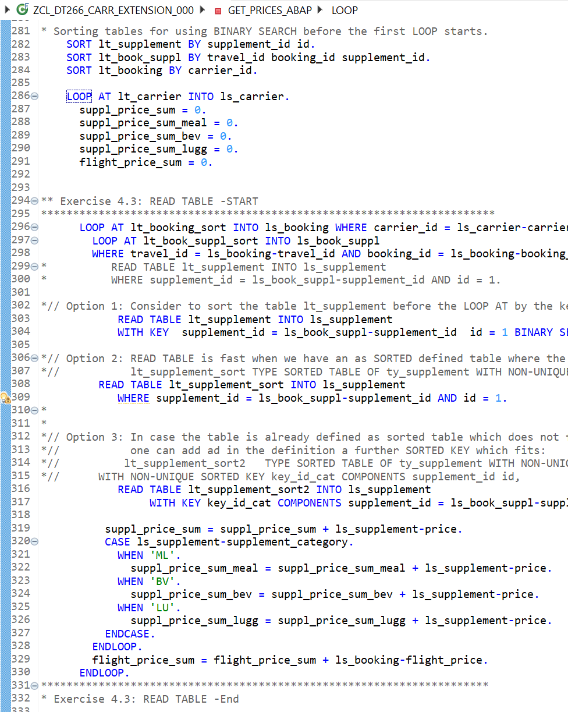</td>
           <td>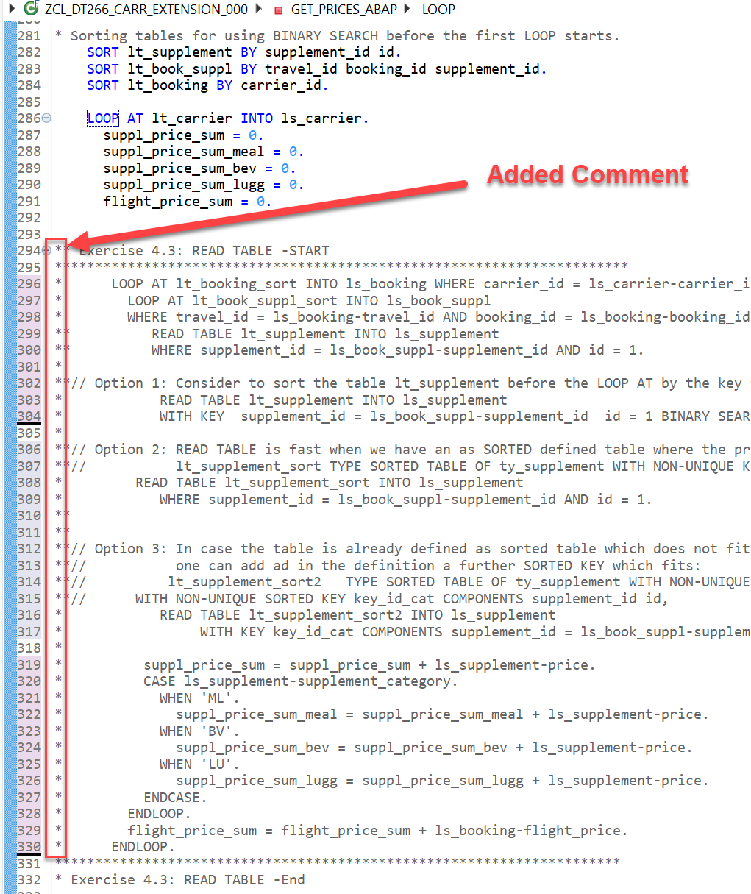</td>
       </tr>
      </table>    

    

    Instead we add the code in lines 340 to 363 (so we mark those lines and remove the commment by pressing **`Ctrl+>`**):

      <table>
       <tr>
           <td>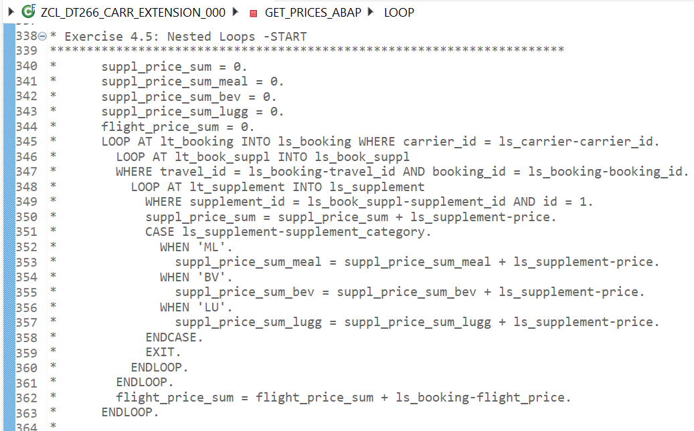</td>
           <td>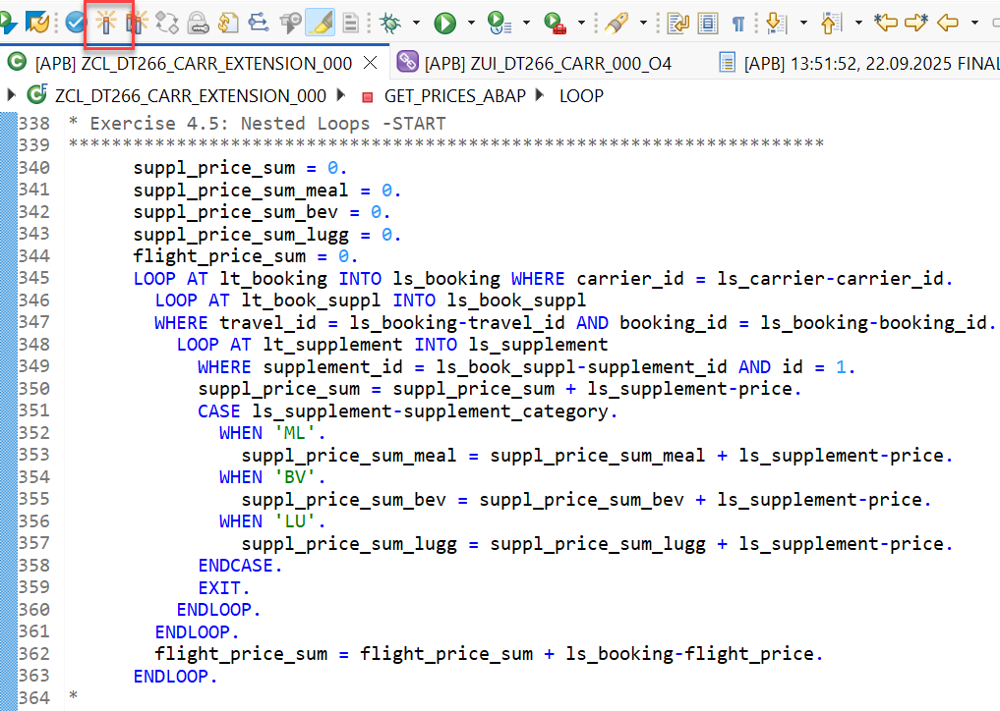</td>
       </tr>
      </table> 

  
2. Activate the code by pressing **`Ctrl+F3`** or by clicking on the match icon 

3. Go to the ABAP Trace Requests view and perform a new ABAP trace with title `nested loop`.  

    - Before tracing: Run once the Fiori App for **Airline ID = 'AA'**.  
    - Create a new ABAP trace
      - Create a Trace Request with new Title: **`nested loop`** 
        - **you only need to change the Title of the trace file** to **`nested loop`** 
        - else you need no other changes for profiling (as still same as previously configured). 
      - Then run again the Fiori App for **Airline ID = 'AA'**  and wait until the result is back. 
      - Delete the  ABAP trace request.
    - A new trace **`nested loop`** is shown in the view **`ABAP Traces`** (after refresh):
      <table>
        <tr>
          <td></td>
          <td>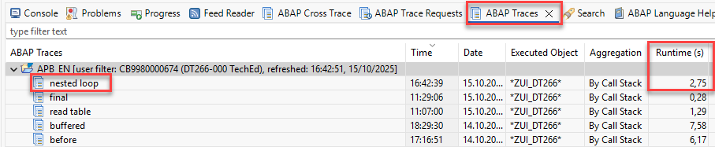</td>
        </tr>
      </table>

    
    - The runtime shows to have increased again:
    
      <kbd>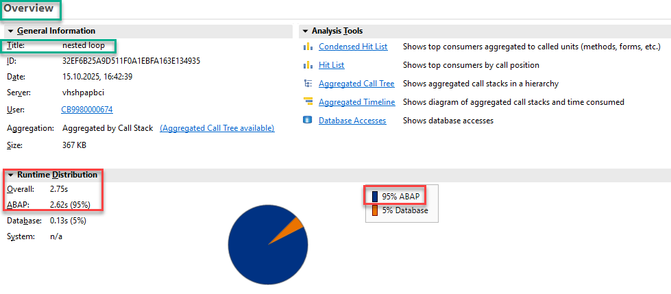</kbd>
    
      <kbd>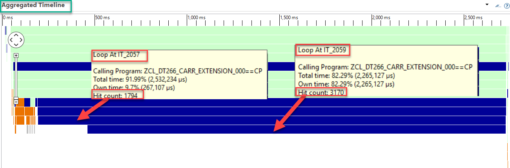</kbd>

    The reason for this performane issue with the `LOOP AT TABLE... WHERE...` statement   
    is the same as for the `READ TABLE... WHERE...` statement in exercise 4.3: 
    - In both cases, 
      - for the `LOOP AT TABLE ...  WHERE...` 
      - as before for the `READ TABLE ... WHERE...` 
      
      we search for rows of the table which fulfill the `WHERE` condition:  `WHERE supplement_id = ls_book_suppl-supplement_id AND id = 1.`
    - Again the tables `lt_booking, lt_book_suppl, lt_supplement` are only defined as **`STANDARD`** but not as **`SORTED`**. 
    - Like in exercise 4.3 we perform 3,170 times (number of entries in lt_book_suppl(_sort)) a **`Full Table Scan`** where all the 27074 entries in **`lt_supplement`** have to be scanned. 
    - So we have to scan in total 3,170 x 27,074 = 85,824,580 entries!
    
      <kbd>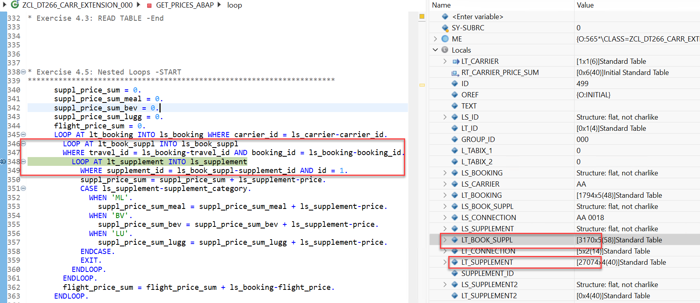</kbd>  
     
      
    

4. Go back to class `ZCL_DT266_CARR_EXTENSION_000`  and implement code change providing three alternative performance optimizations:

    This coding is in lines 365 to 452 and one just has to remove the comment and activate it.

      <table>
       <tr>
           <td>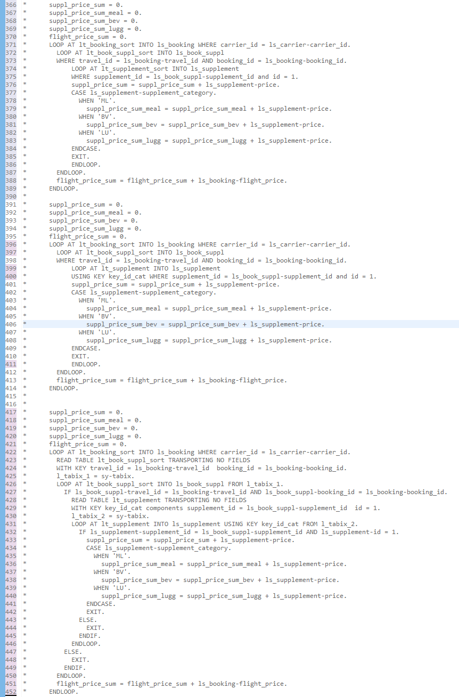</td>
           <td>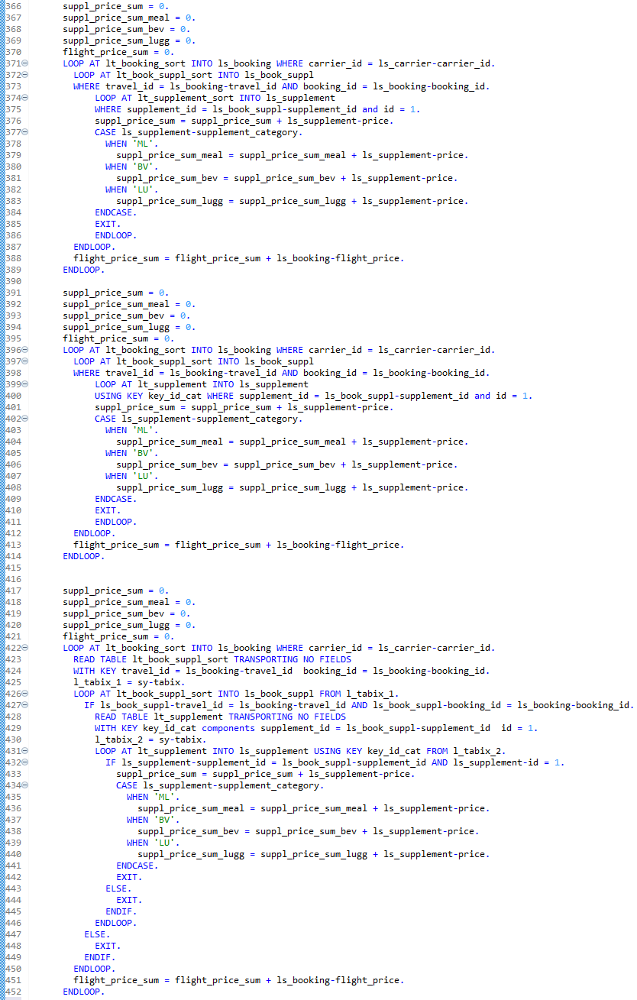</td>
       </tr>
      </table> 

5. So you can remove the previous nested loop:
    - Mark the code lines 340 to 363 and add again the commment by pressing **`Ctrl+<`**:

      <table>
       <tr>
           <td></td>
           <td></td>
       </tr>
      </table> 

6. Activate the code changes by pressing **`Ctrl+F3`** or by clicking on the match icon 

7. Go to the ABAP Trace Requests view and perform a new ABAP trace of the Fiori App for **Airline ID = 'AA'** with title `nested loop improved`:  

    - Before tracing: Run once the Fiori App for **Airline ID = 'AA'**.  
    - Create a new ABAP trace
      - Create a Trace Request with new Title: **`nested loop improved`** 
        - **you only need to change the Title of the trace file** to **`nested loop improved`** 
        - else you need no other changes for profiling (as still same as previously configured). 
      - Then run again the Fiori App for **Airline ID = 'AA'**  and wait until the result is back. 
      - Delete the  ABAP trace request.
    - A new trace **`nested loop improved`** is shown in the view **`ABAP Traces`** (after refresh):
      <table>
        <tr>
          <td></td>
          <td>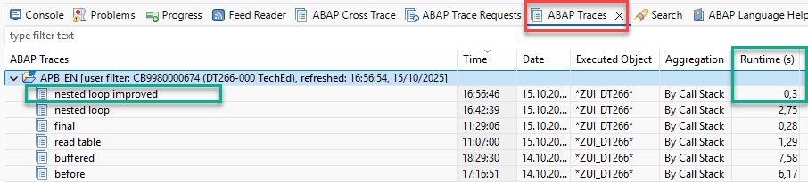</td>
        </tr>
      </table>

8.  **Analyze the new trace called `nested loop improved`:**

    Then the result should be again fast:

    <kbd>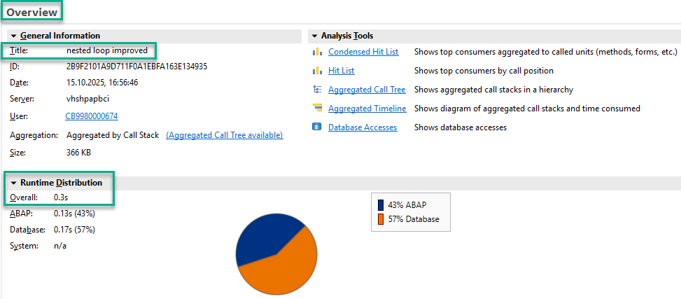</kbd>

    In the **`Aggregated Timeline`**  the 3 subsequent called options are performing very well:

    <kbd>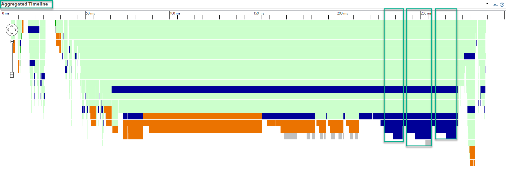</kbd>

    -----

9.  **Details on the alternative solutions:**
    
    
    We have implemented directly 3 options. They are for 3 different cases.

    We have the following 3 cases of the data definition:
      <kbd></kbd>  
      - **Case 1:** Table defined as **SORTED** table ordered by **same components** (_here:_ `supplement_id` and `id`)   as used in the `LOOP AT TABLE...WHERE supplement_id = ... and id = 1.`
      - **Case 2:** Table defined as **SORTED** table with **different components** (_here:_ `supplement_category`)   as used in the `LOOP AT TABLE...WHERE supplement_id = ... and id = 1.` 
      - **Case 3:** Table defined as **STANDARD** table (arbitrary order of the rows)

      And for those cases the following options to improve the runtime of the previous code: 
       
      <kbd></kbd>

      - **Option 1:** Define the table already as SORTED by required components in the `LOOP AT TABLE... WHERE...` statement. 

        - **Option only valid for Case 1:** 
          - The table is already or can be defined as **SORTED** table with **same components** (_here:_ `supplement_id` and `id`)   as used in the `LOOP AT TABLE...WHERE supplement_id = ... and id = 1.`
          - Then automatically fast search by the ABAP Kernel (_search like in a sorted telephone book, the so-called BINARY SEARCH_). 
        - **Prerequisites**: Table defined as **SORTED** by **same components** as in `LOOP AT TABLE...WHERE supplement_id = ... and id = 1.` (_here:_ `supplement_id` and `id`):   `lt_supplement_sort´    TYPE SORTED TABLE OF ty_supplement WITH NON-UNIQUE KEY primary_key COMPONENTS supplement_id id`  
        - **Code change for the `LOOP AT TABLE... WHERE...` statement:** No change, just use the table defined as **SORTED**:

          <kbd></kbd>

      - **Option 2:** Create a secondary sorted key and use this key in the `LOOP AT TABLE... WHERE...` statement:
        - **Option valid for Case 2 & 3:**
          - **For Case 2:** Table defined as **SORTED** table with **different components** (_here:_ `supplement_category`)   `lt_supplement_sort2   TYPE SORTED TABLE OF ty_supplement WITH NON-UNIQUE KEY primary_key COMPONENTS supplement_category`
              as used in the `LOOP AT TABLE ...WHERE supplement_id = ... and id = 1.` 
          - **For Case 3:** Table defined as **STANDARD** table (_it has an arbitrary order of the rows_).

        - **Prerequisite**: First a secondary SORTED Key must be declared in the data definition of the table:
            - Components in secondary SORTED KEY **must be** the same as used in the `LOOP AT TABLE... WHERE...` statement
            - This declaration is already implemented in lines 126 to 129:  
              <kbd></kbd>

        - **Code change for the `LOOP AT`:**   

            <kbd>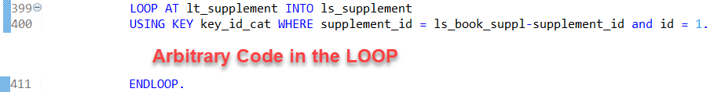</kbd>
            
            - **`USING KEY`** in front of the **`WHERE`**-condition, 
            - followed by the secondary key defined with same components as in the `LOOP AT TABLE... WHERE...` statement, here: **`key_id_cat`** with components `supplement_id` and `id`. 

      - **Option 3:** :Use `READ TABLE` to get first hit and loop over the subsequent suitable rows:
        - **Option valid for Case 2 & 3:**
          - **For Case 2:** Table defined as **SORTED** table with **different components** (_here:_ `supplement_category`)   `lt_supplement_sort2   TYPE SORTED TABLE OF ty_supplement WITH NON-UNIQUE KEY primary_key COMPONENTS supplement_category`
              as used in the `LOOP AT TABLE ...WHERE supplement_id = ... and id = 1.` 
          - **For Case 3:** Table defined as **STANDARD** table (_it has an arbitrary order of the rows_).

        - **Prerequisite**: First a secondary SORTED Key must be declared in the data definition of the table:
            - Components in secondary SORTED KEY **must be** the same as used in the `LOOP AT TABLE... WHERE...` statement
            - This declaration is already implemented in lines 126 to 129:  
              <kbd></kbd>

        - **Code change for the `LOOP AT TABLE... WHERE...` statement:**   
          <kbd>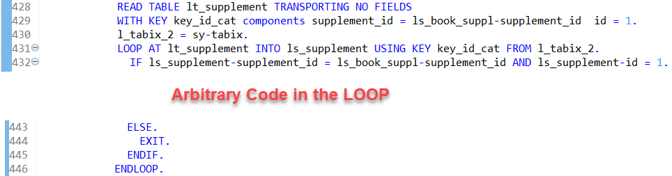</kbd>  
            Instead of directly starting with the loop:
            - Get the row number of first suitable row by a `READ TABLE...TRANSPORTING NO FIELDS.. WITH KEY ... COMPONENTS...`statement,
            - the row number is in `sy-tabix` (copied to `l_tabix_2`),
            - Then loop from this row: `LOOP AT ...INTO .. USING KEY ... FROM l_tabix_2 ...` (_here: `USING KEY` must be used as only the key has correct sort order),
            - Check with `IF`-condition if the orginal WHERE condition is still fulfilled (_as the key is sorted: the rows with same values are directly below the first corresponding entry_) 
            - In case the `IF`-condition is no longer fulfilled we either have already a higher value of `supplement_id` or of `id` and the due to sorting the values will stay higher. So, from now on the _if_  condition is not anymore fulfilled and we will always have the _else_. Therefore we can there directly call `EXIT` to exit the most inner loop.

      - _**Option 3 (alternative):**_ Use `READ TABLE` to get first hit and loop over the suitable rows:
        - **Option only valid for Case 3:** Table defined as **STANDARD** table (_it has an arbitrary order of the rows_).
          - **Prerequisite: ⚠Mandatory is to sort `lt_supplement` by the components in `LOOP ... WHERE...` (_else we get wrong results!_).**   The sorting of the table is already  in code line 282: <kbd></kbd>       
          - **Code change for the `LOOP AT TABLE... WHERE...` statement:**   
          <kbd>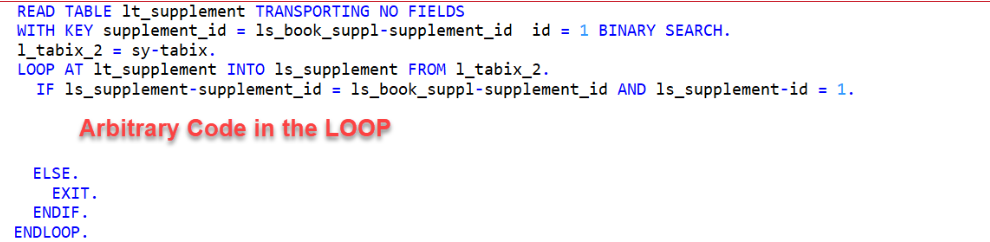</kbd>  
            Instead of directly starting with the loop:
            - Get the row number of first suitable row by a   `READ TABLE...TRANSPORTING NO FIELDS.. WITH KEY ... BINARY SEARCH`statement   (_the addition `BINARY SEARCH` can only be used if the table is sorted by the fields in the `WHERE`-clause_),
            - the row number is in `sy-tabix` (copied to `l_tabix_2`)
            - Then loop from this row: `LOOP AT ... FROM l_tabix_2 ...`
            - Check with `IF`-condition if the orginal WHERE condition is still fulfilled (_as table is sorted: the rows with same values are directly below the first corresponding row_) 
            - In case the `IF`-condition is no longer fulfilled we either have already a higher value of `supplement_id` or of `id` and the due to sorting the values will stay higher. So, from now on the _if_  condition is not anymore fulfilled and we will always have the _else_. Therefore we can there directly call `EXIT` to exit the most inner loop.

   

## Summary & Next Exercise
[^Top of page](#)

Now that you've...

- analyzed the performance issues with ABAP traces 
- improved the runtime significantly
- ensured correct output
- learned different methods to improve performnace of READ TABLE ... WHERE and LOOP AT... WHERE statements

you are done with this hands-on. Congratulations! 🎉

Thank you for stopping by!

You can now ...
- continue with the next exercise block (B) ► **[Exercise 5: Analyze Performance Issues with SQL Trace Tool and HANA SQL Analyzer in Visual Studio Code](../ex05/README.md)**   
- or return to ► **[Home - DT266](/README.md#exercises)**.

## License

Copyright (c) 2024 SAP SE or an SAP affiliate company. All rights reserved. This project is licensed under the Apache Software License, version 2.0 except as noted otherwise in the [LICENSE](LICENSES/Apache-2.0.txt) file.
