[Home - DT266](/README.md#exercises)

# Exercise 5: Analyze Performance Issues with SQL Trace Tool and HANA SQL Analyzer in Visual Studio Code

## Introduction

> [!NOTE] 
> **This exercise is optional.**

In the previous exercise 4, we have improved the runtime on the ABAP side (see [Exercise 4](../ex04/README.md)).

**In this exercise 5 we perform a code push down to the HANA Database using CDS views.** 

Here we learn to create an `SQL trace` and analyze the `execution plan` in the `HANA SQL Analyzer in  Visual Studio Code`.

> [!CAUTION]  
> **⚠ As the SQL trace can only be performed by one user at the same time:**
> - **Ensure that you do not deactivate the trace for other users**
> - **Ensure that when you activate the trace:** 
>   - to directly then run the Fiori app for all airlines 
>   - to deactivate youre trace as soon as the response is back in the Fiori App

> [!TIP]
> - **Alternatively you can also directly start with Exercise 5.3 and use there the already recorded traces (open the link and click on download raw file, then you find the file in your downloads):**  
> <kbd>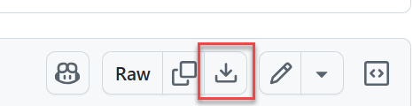</kbd>
>   - [teched_expensive.plv](../teched_expensive.plv)
>   - [teched_fast.plv](../teched_fast.plv)

In the first section we explain the usage of this Tool to discover the performance issues in our custom extension in the ABAP class _`ZCL_DT266_CARR_EXTENSION_###`_ in method _`GET_PRICES_CDS`_. 

### Optional Exercises

- [5.1 - Preparation Step](#exercise-51-preparation-step)
- [5.2 - Create an SQL Trace](#exercise-52-create-an-sql-trace)
- [5.3 - Analyze the Trace in HANA SQL Analyzer in Visual Studio Code](#exercise-53-analyze-the-trace-in-hana-sql-analyzer-in-visual-studio-code)
- [5.4 - Code Changes to Improve the Runtime](#exercise-54-code-changes-to-improve-the-runtime)
- [5.5 - Analyze the new Trace Result](#exercise-55-analyze-the-new-trace-result)

### Summary:  
- [Summary & Back](#summary-and-back)  

### Optional Exercises

## Exercise 5.1: Preparation Step

> [!NOTE] 
> **THIS EXERCISE IS OPTIONAL**

> In the previous exercise 4 we have improved the runtime on the ABAP side in method **`GET_PRICES_ABAP`**. 

> **Now we replace this method by **`GET_PRICES_CDS`** where the calculation of the totals is performed in CDS views directly on the HANA DB.**  

 

  
🔵 Click to expand!

 
 1. Ensure that in you implementation class **`ZCL_DT266_CARR_EXTENSION_###`**   the interface method **`IF_SADL_EXIT_CALC_ELEMENT_READ~CALCULATE`** calls the method **`get_prices_CDS`** instead of method **`get_prices_ABAP`**:

    | Change of Code| |
    |---|---|
    | In about line 574 of the code you find the call of method **`get_prices_ABAP`**: <ul><li> So we mark line 573 and press **`Ctrl+<`** to comment call of **`get_prices_ABAP`** </li><li> and mark line 574 and press **`Ctrl+>`** to remove the comment for **`get_prices_CDS`** </li></ul>| **Original Code:**   <kbd>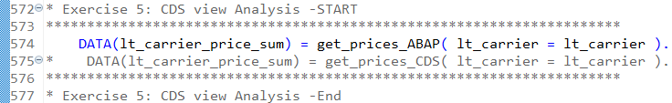</kbd>   **New Code:**   <kbd></kbd> |

 2. Activate the code by pressing **`Ctrl+F3`** or by clicking on the match icon 
   
    We are done with this exercise 5.1. Below is just some further information on the involved CDS views and ABAP coce.

 We are done with this exercise 5.1. Below is just some further information on the involved CDS views and ABAP code.

 

  
🟠 Additional background information. 

    
  In the method **`get_prices_CDS`** of **`ZCL_DT266_CARR_EXTENSION_###`**:  
  - after the data declarations:
    
    <kbd>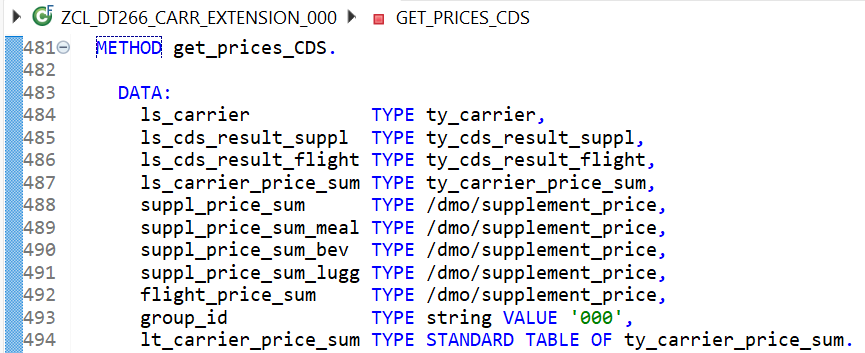</kbd>

  - we have the 2 Selects from the CDS views **`Z_I_PRICE_###`** and **`Z_I_PRICE_FLIGHT`** 
    - to get the supplements and flight priceses for specific carrier 
    - all the totals of the prices for each carrier we calculate in those CDS views

    
      <kbd>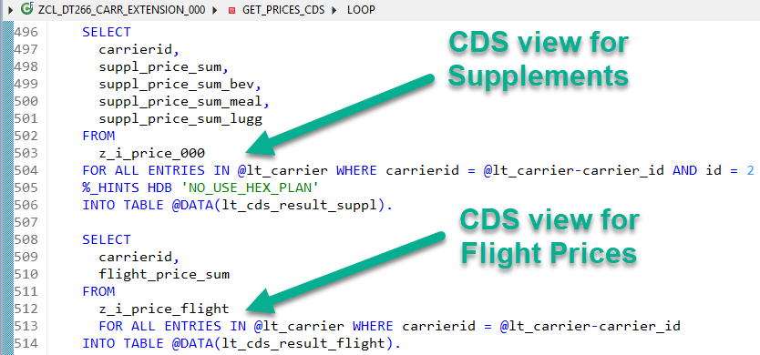</kbd>

  - Then  we just fill the output of our method **`rt_carrier_price_sum = lt_carrier_price_sum`**:
    - We perform the percentage calculation in ABAP as just simple calculations
    - we use **`BINARY SEARCH`**: accordingly, we first sort the results from the CDS views:

       
    
      <kbd>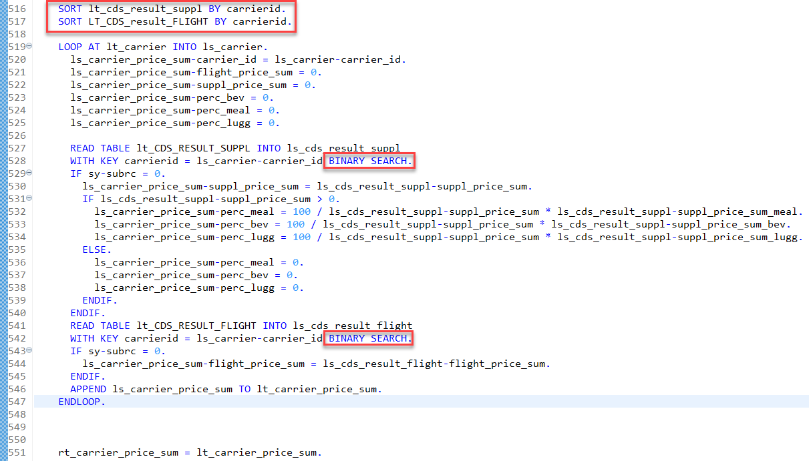</kbd>

  The JOIN of the tables and the calculation of the totals of the prices we have pushed into the CDS views: **`Z_I_PRICE_FLIGHT`** and **`Z_I_PRICE_###`**:
  <table>
      <tr>
          <td>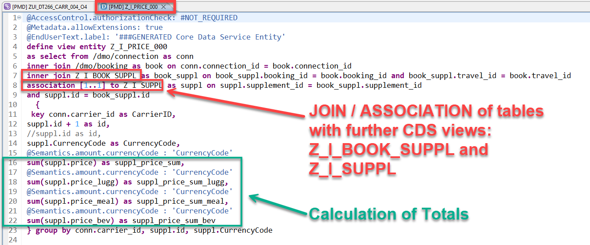</td>
          <td>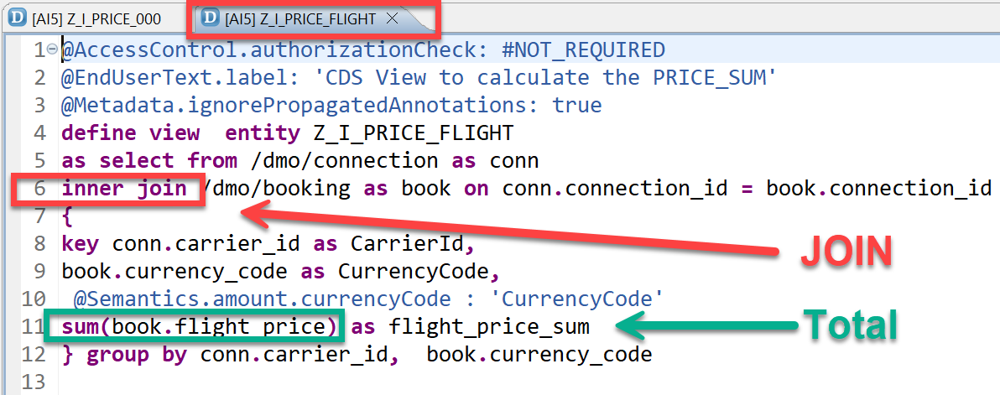</td>
      </tr>
  </table>

  where **`Z_I_PRICE_###`** calls 2 other CDS views **`Z_I_BOOK_SUPPL`** and **`Z_I_SUPPL`**:

  <table>
      <tr>
          <td>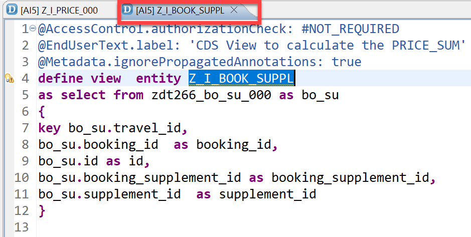</td>
          <td>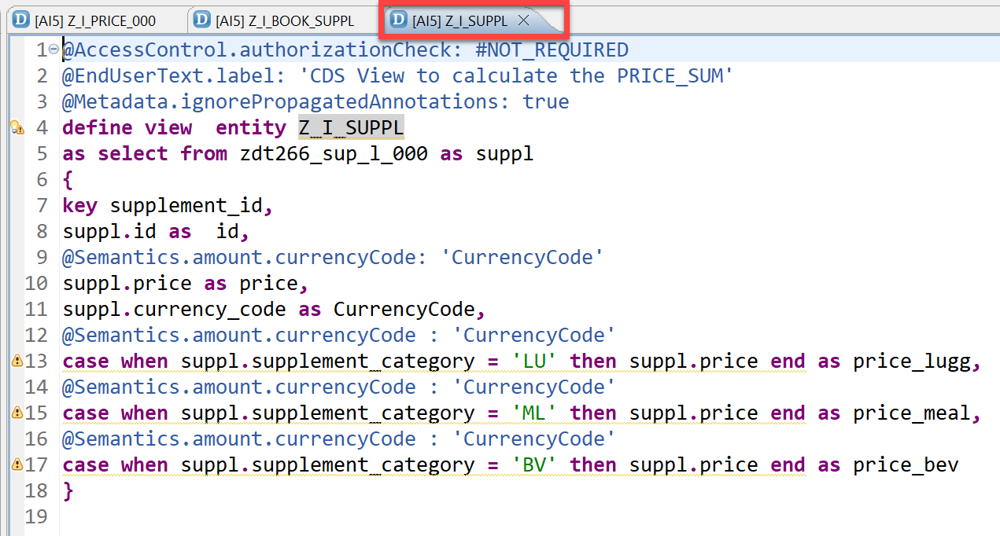</td>
      </tr>
  </table>      

## Exercise 5.2: Create an SQL Trace
[^Top of page](#)

> [!NOTE] 
> **This exercise is optional and only one active SQL trace on a system is possible.**  

> In an `ABAP Trace` you would just see a runtime of about 9 seconds and that most time is for a database statement: **`Open Z_I_PRICE_###`**. But no further details are shown...  
> **For performance investigation of the CDS views we need an `SQL trace` and analyze it in the `SQL Analyzer`.**

> [!CAUTION]   
> ⚠ As the SQL trace can only be performed by one user at the same time:
> - Ensure that you do not deactivate the trace for other users
> - Ensure to directly deactivate the trace after finished tracing

> [!TIP]
> - Alternatively you can also directly start with Exercise 5.3 and use there the already recorded traces:
>   - [teched_expensive.plv](../teched_expensive.plv)

 

  
🔵 Click to expand!

 
 1. Right-click with the mouse on the Project **`APB_EN`** and then click on **`SQL Trace ...`** and then on **Activate**: 

     ⚠ **If it is already active for other users (so trace state is not `Off`), please do not deactivate for them**:

       <table>
       <tr>
           <td>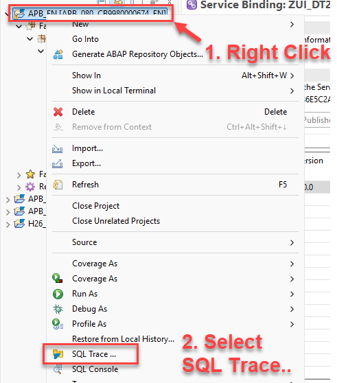</td>
           <td>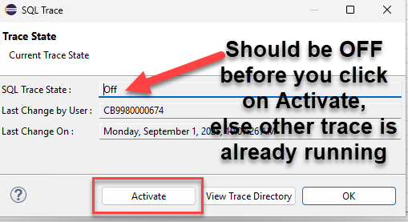</td>
       </tr>
      </table>
    
    
    
    ℹ️ **Immediately** run the Fiori App for all Airlines (just leave the field `Airline ID` blank) and wait until the processing has finished:

       <table>
       <tr>
           <td>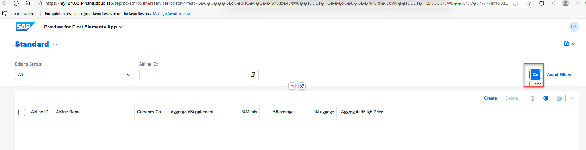</td>
           <td></td>
       </tr>
      </table>   

    
    ℹ️ **Immediately** deactivate the trace and then click on  **`View Trace Directory`**:

      <table>
       <tr>
           <td>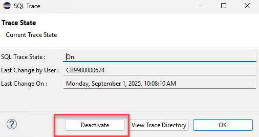</td>
           <td>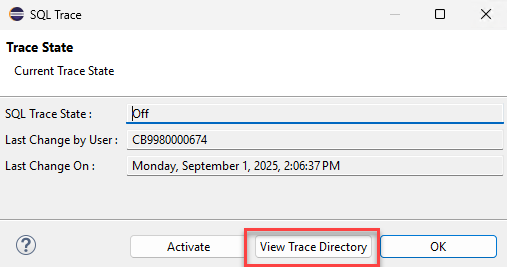</td>
       </tr>
      </table>     

    Mark in the **`Trace Directory`** the line with the latest trace for which you are **`Owner`** and click on tab **`Trace Records`** to see the list of trace records. 

    <table>
       <tr>
           <td>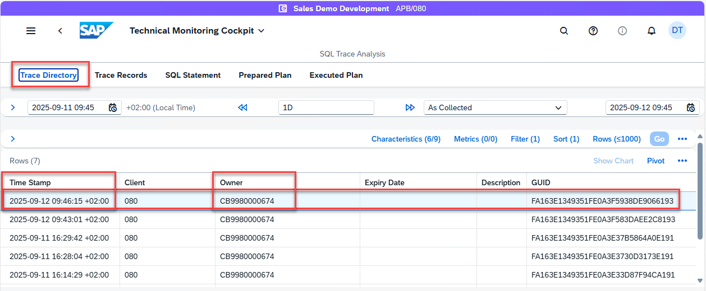</td>
           <td>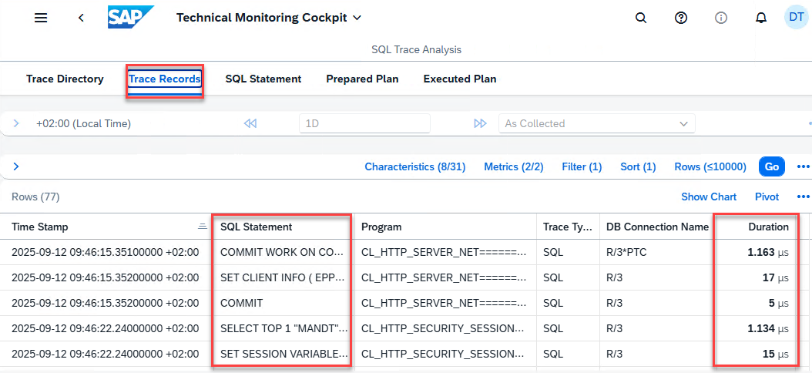</td>
       </tr>
    </table>  
    
    
    > 🟠 _**Remark:**_ 
    > If you get no trace records shown:
    > - navigate back to the tab: 'Trace Directory'  
    > - mark again the trace file and click again on 'Trace Records'.
    
    Then you can see the trace records and sort them descending by duration (just click on `Duration` for a pop-up to choose the sorting):

    <table>
       <tr>
           <td>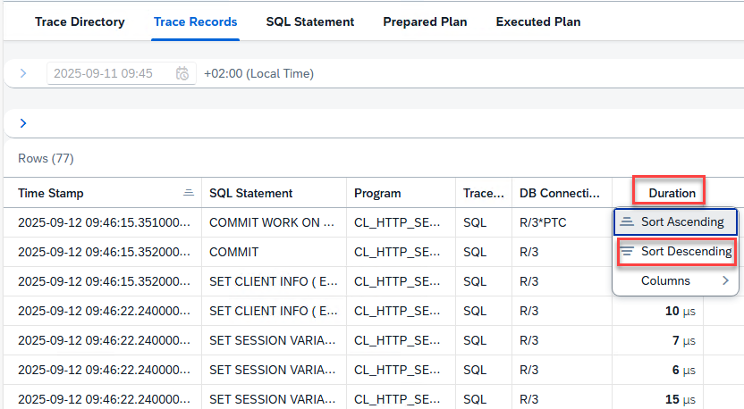</td>
           <td>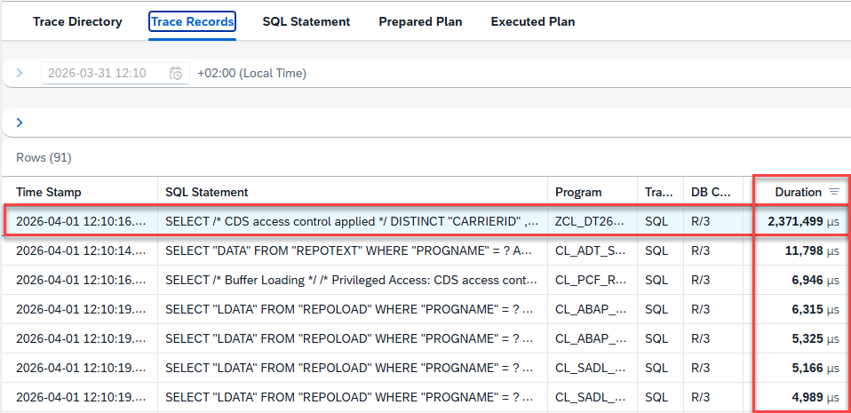</td>
       </tr>
    </table>  

    
    If you now mark the record with longest duration and click on tab **`SQL Statement`** the statement is shown with the `Query Parameters` values. Then click on **`Executed Plan`** and download the **`PLV File`** and save it:

    <table>
       <tr>
           <td>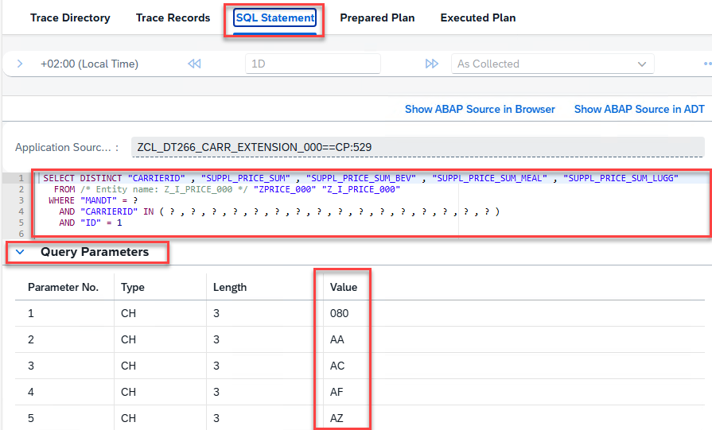</td>
           <td>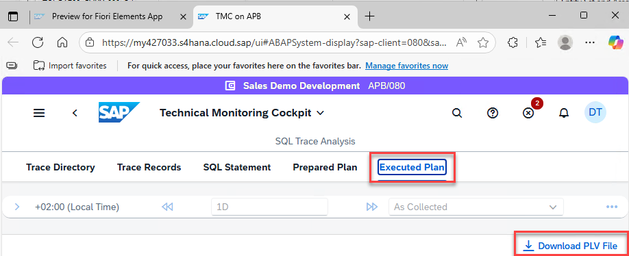 </td>
       </tr>
    </table>  

## Exercise 5.3: Analyze the Trace in HANA SQL Analyzer in Visual Studio Code
[^Top of page](#)

> [!NOTE] 
> **This exercise is optional.**

> To display this `PlanViz` we use the **`HANA SQL Analyzer in Visual Studio Code`**.

 

  
🔵 Click to expand!

 
 1. Open the app **`Visual Studio Code`** and there the **`HANA_SQL_Analyzer`**: 

      <table>
       <tr>
           <td>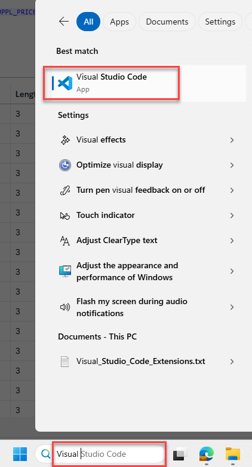</td>
           <td>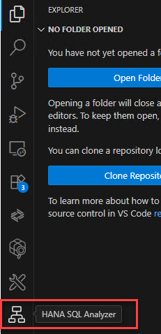</td>
       </tr>
      </table>
    
    - To upload a PlanViz file click on the Plus Sign  **`'+'`**.

    - Then either upload: 
      - the PlanViz you created in the previous exercise, 
      - _Or as an alternative:_  Use the already recorded trace [teched_expensive.plv](../teched_expensive.plv) (open the link and click on download raw file, then you find the file in your downloads): 
        <kbd></kbd>
      - Navigate to directory where you saved the PlanViz file: 

      <table>
       <tr>
           <td>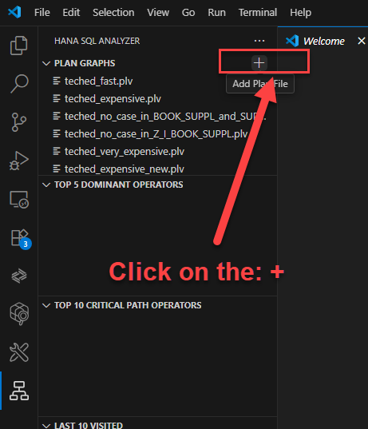</td>
           <td>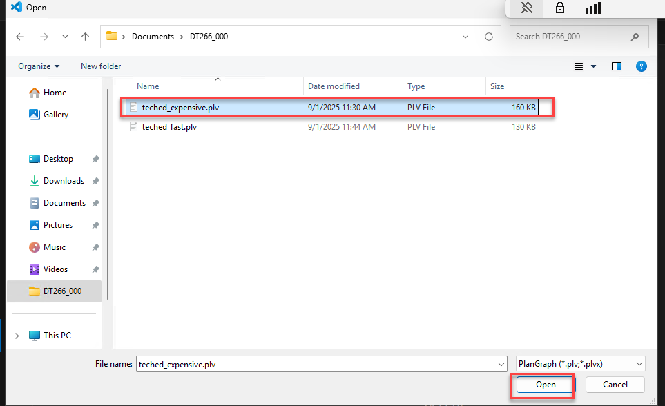</td>
       </tr>
      </table>

       
 2. Choose the plan mode logical.
    
    > 🟠 _**Remark:**_ The SQL query plan has two types of plan modes: **`logical`** and **`physical`**.
    > - _Logical operators:_ define the sequence of operations required to perform the query.
    >   - They are a good starting point to understand the logic of the execution plan
    > - _Physical operators:_ execute operations defined by logical operators on the physical storage of the database. 
    >   - For example, which join type (_NestedLoop_ or _HashJoin_),...

    We will only use the **`logical`** plan mode: 
    - Click on the Settings Button 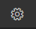 on the upper right corner and flag **`logical`**:
      
      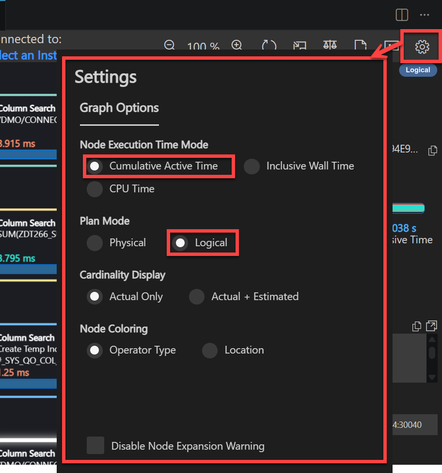 

 3. Overview of the HANA SQL Analyzer:

    In the screen in the upper part the **`PLAN GRAPH`** is shown and below the **`TIMELINE`** and other tabs like **`TABLE ACCESS`**. 

    All of them show that most time is for **Column Search**:

    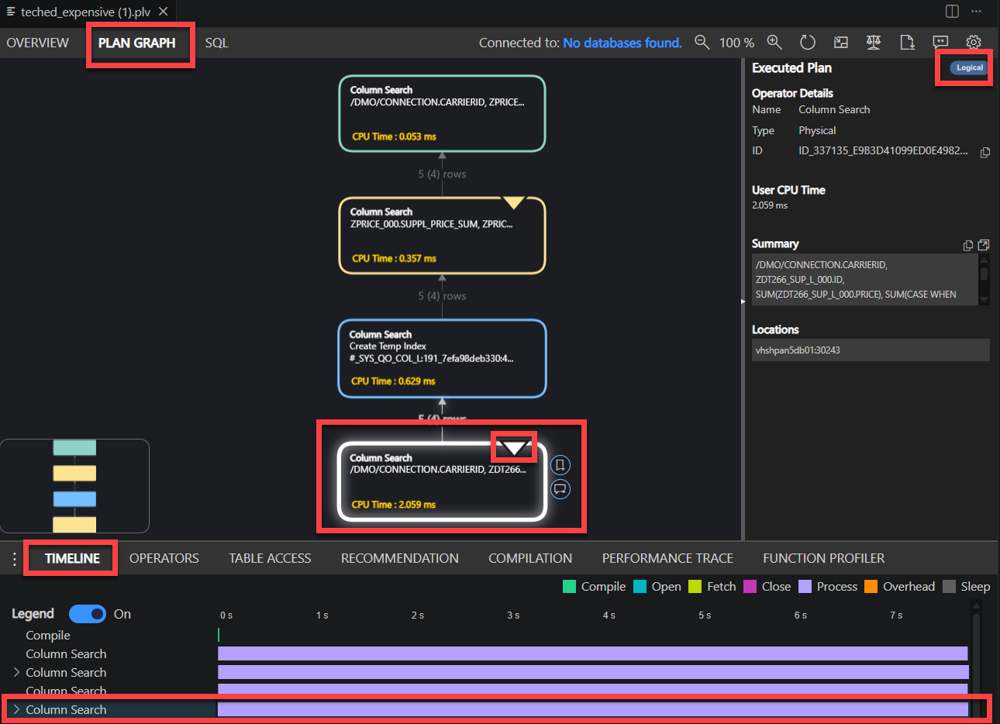 

    - Click first on the Overview to see the total runtime on HANA DB of 9,4 s and 99,9% for Column Search with 64% there for a JoinEngineStep:       
      <table>
       <tr>
           <td>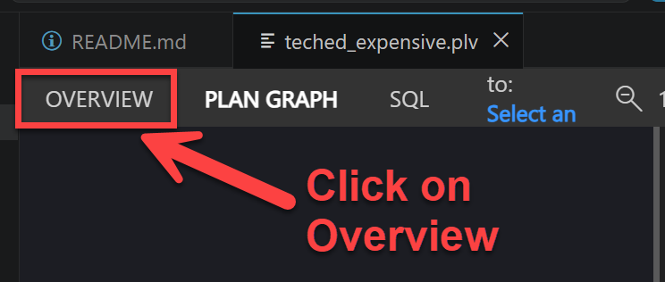</td>
           <td>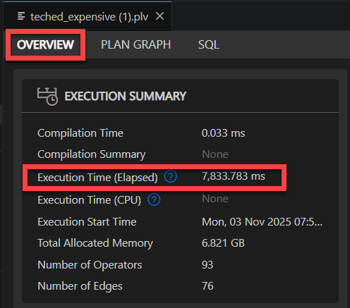</td></td>
       </tr>
      </table> 

    - Navigate then to  tab **`TABLE ACCESS`** (in the lower part of the screen shown right to **`TIMELINE`**) and sort the list descending by **`Processing Time (ms)`**. The most runtime is for column searches on 2 tables: **`ZDT266_SUP_L_000`** and **`ZDT266_BO_SU_000`**.

       

     

 4. Analyze the corresponding Plan Graph.

  - In the **`Plan Graph`** in the upper part of the screen most time is shown for **`Column Search`** (figure below) :

    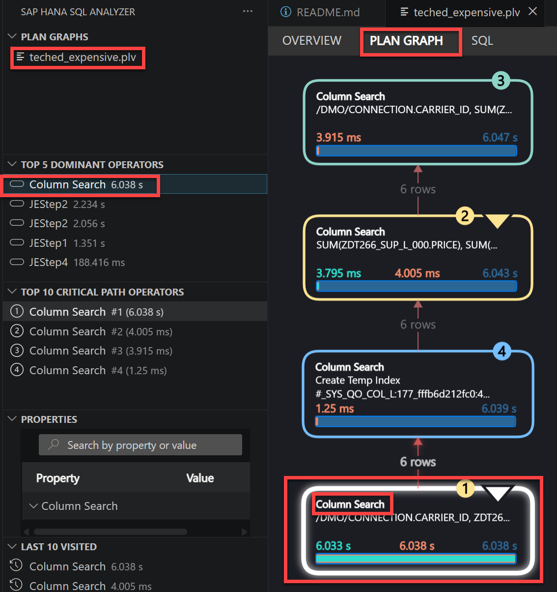 

  - Expand this **`Column Search`** by clicking on the triangle and scroll down. 

    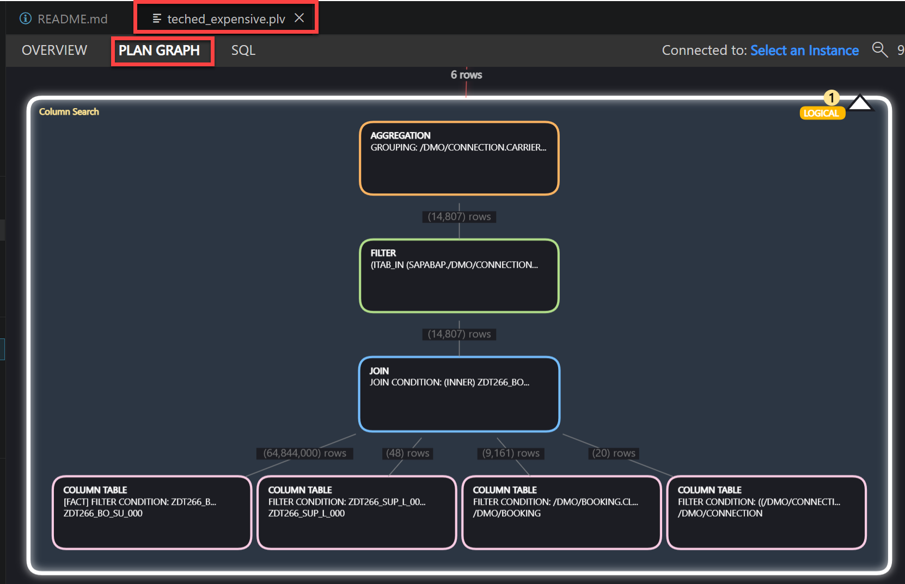 

    - There click on the **COLUMN TABLE** on the left. Then on the right side the filter used in the column search is shown (in the **`Summary`**). 

      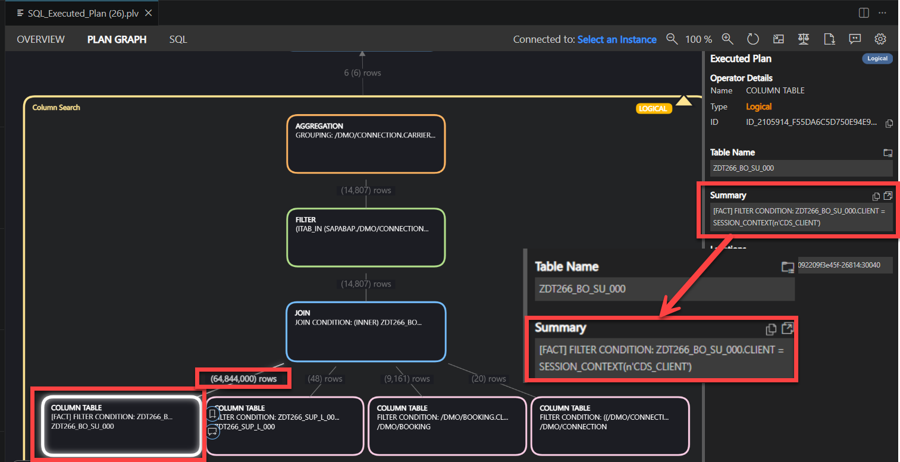 

      In the **`Summary`**  the  filter condition is shown: 
      - which is just:  **`MANDT = 1`**  
      - **we select accordingly the whole table (_FULL TABLE SCAN_) with 162,110,000 rows.**

     

    - The other time is in JEStep2 where those 162,110,000 rows are joined with the 48 results from table **`ZDT266_SUP_L_000`**:
      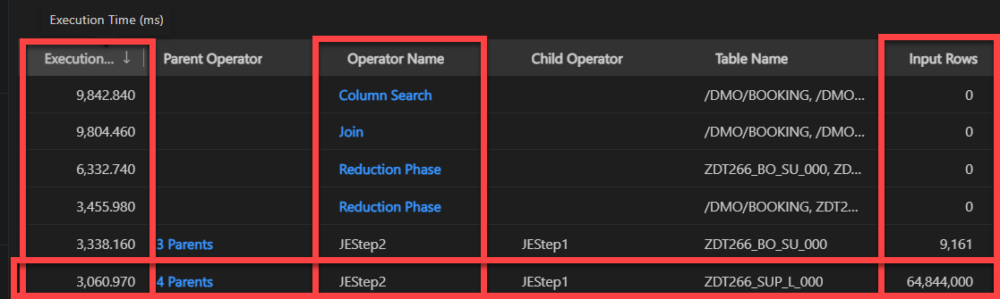 

  >🟠**To summarize:** The issue is as follwos:
  > - The value specified for the table field id of table **`ZDT266_BO_SU_000`** could not be pushed down
  >    - only the client is used for filtering and 
  >    - we perform accordingly a full table scan where we get 162,110,000 records.    
  > - Those results have then to be joined with the results from the other tables taking significant amount of time.

## Exercise 5.4: Code Changes to Improve the Runtime
[^Top of page](#)

> [!NOTE] 
> **This exercise is optional.**

> **Remove the calculated field.**

 

  
🔵 Click to expand!

 
 1. Open the CDS view **`Z_i_PRICE_###`** and define the ID without any calculation. So we have to change: 
    - Mark line 14  and comment it by pressing **`Ctrl+<`**
    - Mark line 15 and remove the comment by pressing **`Ctrl+>`**.

    <table>
      <tr>
          <td>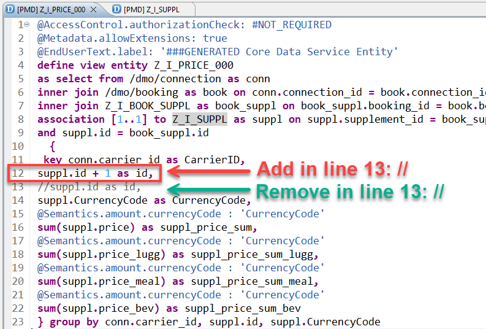</td>
          <td>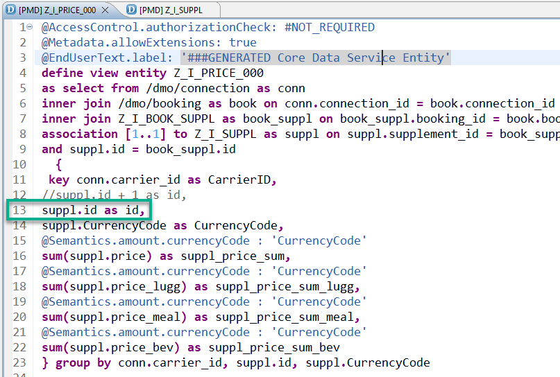</td>
      </tr>
    </table>
    
    
 2. Activate the changes by pressing **`Ctrl+F3`** or by clicking on the match icon .

 3. We put this calculation outside of the CDS view
    - _instead of:_ in the CDS view 
    - _directly before_:  in the ABAP code by changing in about line 504 in the select the **`id = 2`** to **`id = 1`**

    <table>
      <tr>
          <td>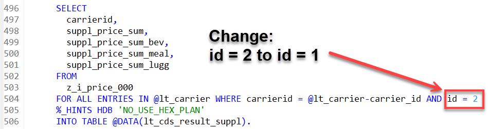</td>
          <td>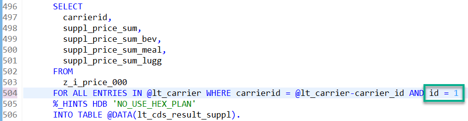</td>
      </tr>
    </table>

 4. Activate the changes by pressing **`Ctrl+F3`** or by clicking on the match icon .

## Exercise 5.5: Analyze the new Trace Result

[^Top of page](#)
 
> [!NOTE] 
> **This exercise is optional and only one active SQL trace on a system is possible.**  

> [!CAUTION]   
> ⚠ As the SQL trace can only be performed by one user at the same time:
> - Ensure that you do not deactivate the trace for other users
> - Ensure to directly deactivate the trace after finished tracing

> [!TIP]
> - Alternatively you can also directly start with Exercise 5.3 and use there the already recorded traces:
>   - **`teched_fast.plv`**

 

  
🔵 Click to expand!

 
 1. Right-click with the Mouse on the Project **`APB_EN`** and then click on **`SQL Trace ...`** and then on Activiate:

       <table>
       <tr>
           <td></td>
           <td></td>
       </tr>
      </table>
    
    
    
    Then run the step and wait until the processing has finished:

       <table>
       <tr>
           <td></td>
           <td></td>
       </tr>
      </table>   

    
    
    
    Now you can deactivate the trace and select then **`View Trace Directory`**:

      <table>
       <tr>
           <td></td>
           <td></td>
       </tr>
      </table>     

    There you take the latest trace for which you are **`Owner`** in the **`Trace Directory`** and mark this line:
    
    <kbd>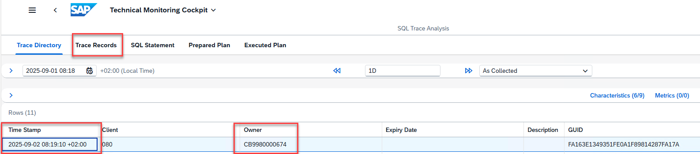</kbd>

    and there click on **`Trace Records`** to see the list of trace records (sometimes you have to go back to **`Trace Directory`** again and repeat marking the trace file and click again on **`Trace Records`**). Then you can see the trace records and you can sort them descending by duration:

    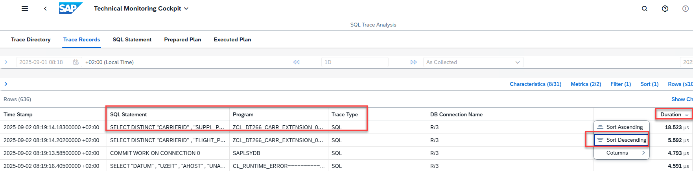
    
    
    If you now mark the record with longest duration you can display the **`SQL Statement`** with the **`Query Parameters`**:

    <kbd></kbd>

    And in **`Executed Plan`** you have the possibility to download the **`PLV File`**:

    <kbd></kbd> 
    
    and save it.

2. Open the App **`Visual Studio Code`** and there the **`HANA_SQL_Analyzer`**: 

      <table>
       <tr>
           <td></td>
           <td></td>
       </tr>
      </table>
    
    To upload a PlanViz file click on the Plus Sign  **`'+'`**.

    Then either 
    - upload the PlanViz just saved above in this exercise, 
    - _Or as an alternative:_  Use the already recorded trace [teched_fast.plv](../teched_fast.plv) (open the link and click on download raw file, then you find the file in your downloads): 
        <kbd></kbd>

      <table>
       <tr>
           <td></td>
           <td>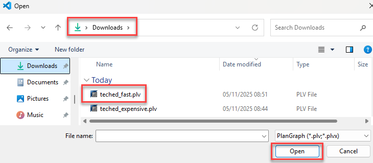</td>
       </tr>
      </table>

 3. Analyze the logical plan.   
    
    
    - In the upper part of the screen, the **PLAN GRAPH**, as well as below the **TIMELINE** and other tabs like **TABLE ACCESS** show now fast performance: 

      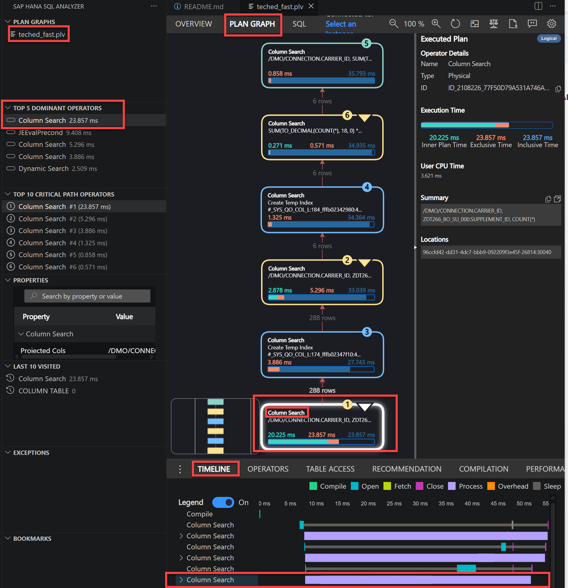 

    - We only need 27 ms now:
    
      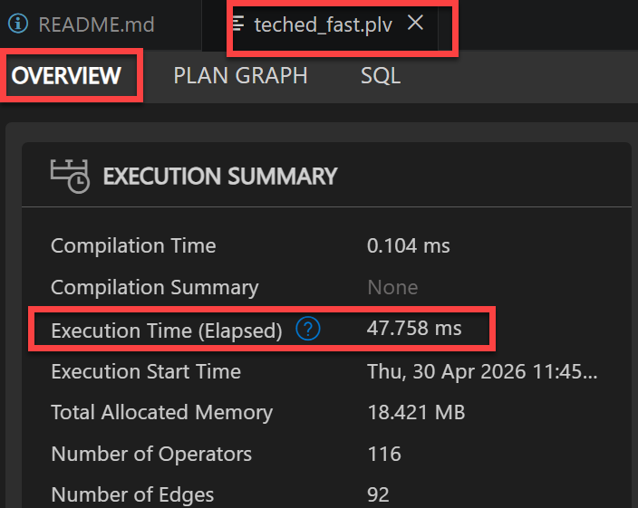

    - In the **`Plan Graph`** check again the **`Column Search`** below:

       

    - Expand it by click on the triangle:

      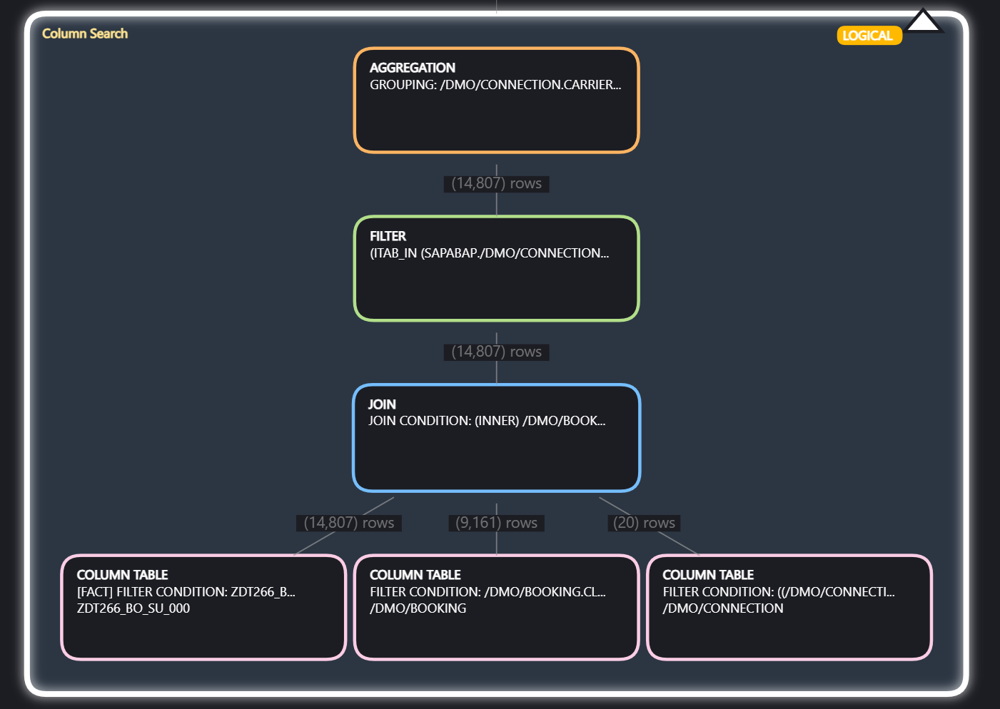 

    - By click on the **COLUMN TABLE ZDT266_BO_SU_000** on the left observe on the right side in the **`Summary`** that
      - besides the previous filter condition `MANDT = 1`, 
      - there is now a further filter condition `ID = 1`. 
    
    So we do not anymore select the whole table with 162,110,000 rows but only 16,211 records.

    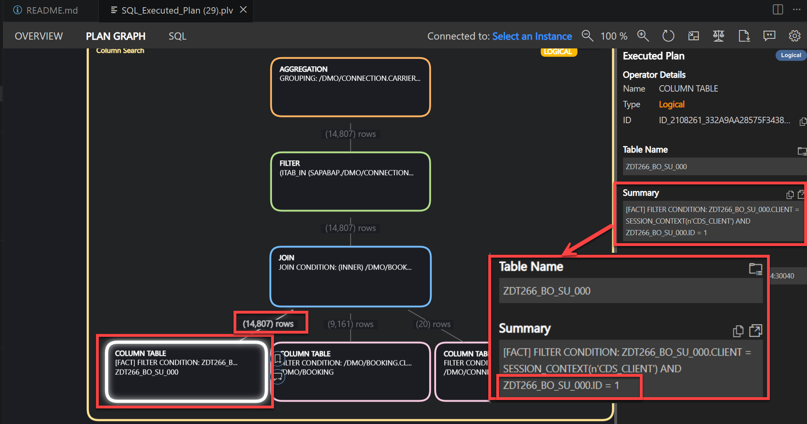 

     
    
    >**To summarize:** 
    > - The **`id`** is now used as direct filter on **`zdt266_BO_SU_000`**.
     
    
    > **Take away:**  
    > Calculated fields (especially used in join conditions and associations) can lead to 
    >- filter not pushed down
    >- calculation to be performed first for all rows of a table before filter can be applied
    
     
    
    > 🟠 _**Remark:**_ Such issues often appear when UI fields or the fields in the ABAP code have:
    > - different lengths, 
    > - additional characters, 
    > - different types, e.g. nvarchar (unicode) versus varchar (non-unicode)... 
    >
    > and so conversions are necessary. 
    > 
    > If possible those conversions should be already performed in ABAP when calling with single parameters or selection field values. 

  
  

## Summary and Back
[^Top of page](#)

Now that you've analyzed CDS view performance, you learned..
- how to work with the HANA SQL Analyzer,
- that calculated fields can cause performance issues
- that it is better to convert input variables in ABAP already e.g. UI input fields in order to avoid calculated fields in CDS views

you are done with this hands-on. Congratulations! 🎉

In this hands-on exercise, you got more insights in the capabilities of the HANA SQL Analyzer!

Thank you for stopping by!

You can now return to ► **[Home - DT266](/README.md#exercises)**.

## License

Copyright (c) 2024 SAP SE or an SAP affiliate company. All rights reserved. This project is licensed under the Apache Software License, version 2.0 except as noted otherwise in the [LICENSE](LICENSES/Apache-2.0.txt) file.

